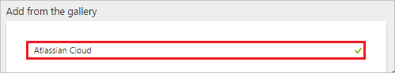
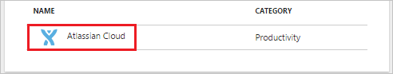
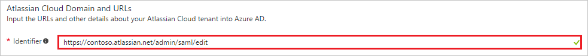
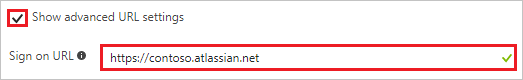
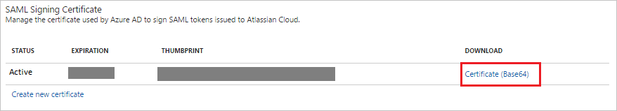
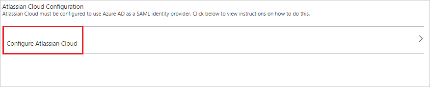
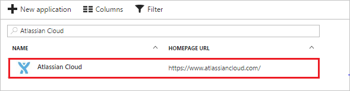

# Tutorial: Azure Active Directory integration with Atlassian Cloud

In this tutorial, you learn how to integrate Atlassian Cloud with Azure Active Directory (Azure AD).

Integrating Atlassian Cloud with Azure AD provides you with the following benefits:

- You can control in Azure AD who has access to Atlassian Cloud
- You can enable your users to automatically get signed-on to Atlassian Cloud (Single Sign-On) with their Azure AD accounts
- You can manage your accounts in one central location - the Azure portal

If you want to know more details about SaaS app integration with Azure AD, see [what is application access and single sign-on with Azure Active Directory](active-directory-appssoaccess-whatis.md).

## Prerequisites

To configure Azure AD integration with Atlassian Cloud, you need the following items:

- An Azure AD subscription
- An Atlassian Cloud single sign-on enabled subscription

> [!NOTE]
> To test the steps in this tutorial, we do not recommend using a production environment.

To test the steps in this tutorial, you should follow these recommendations:

- Do not use your production environment, unless it is necessary.
- If you don't have an Azure AD trial environment, you can get a one-month trial here: [Trial offer](https://azure.microsoft.com/pricing/free-trial/).

## Scenario description
In this tutorial, you test Azure AD single sign-on in a test environment. 
The scenario outlined in this tutorial consists of two main building blocks:

1. Adding Atlassian Cloud from the gallery
2. Configuring and testing Azure AD single sign-on

## Adding Atlassian Cloud from the gallery
To configure the integration of Atlassian Cloud into Azure AD, you need to add Atlassian Cloud from the gallery to your list of managed SaaS apps.

**To add Atlassian Cloud from the gallery, perform the following steps:**

1. In the **[Azure portal](https://portal.azure.com)**, on the left navigation panel, click **Azure Active Directory** icon. 

	![Active Directory][1]

2. Navigate to **Enterprise applications**. Then go to **All applications**.

	![Applications][2]
	
3. To add new application, click **New application** button on the top of dialog.

	![Applications][3]

4. In the search box, type **Atlassian Cloud**.

	

5. In the results panel, select **Atlassian Cloud**, and then click **Add** button to add the application.

	

##  Configuring and testing Azure AD single sign-on
In this section, you configure and test Azure AD single sign-on with Atlassian Cloud based on a test user called "Britta Simon."

For single sign-on to work, Azure AD needs to know what the counterpart user in Atlassian Cloud is to a user in Azure AD. In other words, a link relationship between an Azure AD user and the related user in Atlassian Cloud needs to be established.

This link relationship is established by assigning the value of the **user name** in Azure AD as the value of the **Username** in Atlassian Cloud.

To configure and test Azure AD single sign-on with Atlassian Cloud, you need to complete the following building blocks:

1. **[Configuring Azure AD Single Sign-On](#configuring-azure-ad-single-sign-on)** - to enable your users to use this feature.
2. **[Creating an Azure AD test user](#creating-an-azure-ad-test-user)** - to test Azure AD single sign-on with Britta Simon.
3. **[Creating an Atlassian Cloud test user](#creating-an-atlassian-cloud-test-user)** - to have a counterpart of Britta Simon in Atlassian Cloud that is linked to the Azure AD representation of user.
4. **[Assigning the Azure AD test user](#assigning-the-azure-ad-test-user)** - to enable Britta Simon to use Azure AD single sign-on.
5. **[Testing Single Sign-On](#testing-single-sign-on)** - to verify whether the configuration works.

### Configuring Azure AD single sign-on

In this section, you enable Azure AD single sign-on in the Azure portal and configure single sign-on in your Atlassian Cloud application.

**To configure Azure AD single sign-on with Atlassian Cloud, perform the following steps:**

1. In the Azure portal, on the **Atlassian Cloud** application integration page, click **Single sign-on**.

	![Configure Single Sign-On][4]

2. On the **Single sign-on** dialog, select **Mode** as	**SAML-based Sign-on** to enable single sign-on.
 
	

3. On the **Atlassian Cloud Domain and URLs** section, perform the following steps if you wish to configure the application in **IDP** initiated mode:

	

	a. In the **Identifier** textbox, type a URL using the following pattern: `https://<instancename>.atlassian.net/admin/saml/edit`

	b. In the **Reply URL** textbox, type a URL as: `https://id.atlassian.com/login/saml/acs`

4. Check **Show advanced URL settings** and perform the following step if you wish to configure the application in **SP** initiated mode:

	

    In the **Sign-on URL** textbox, type a URL using the following pattern: `https://<instancename>.atlassian.net`

	> [!NOTE] 
	> These values are not real. Update these values with the actual Identifier and Sign-On URL. You can get the exact values from Atlassian Cloud SAML Configuration screen.
 
5. On the **SAML Signing Certificate** section, click **Certificate(Base64)** and then save the certificate file on your computer.

	 

6. On the **Atlassian Cloud Configuration** section, click **Configure Atlassian Cloud** to open **Configure sign-on** window. Copy the **SAML Entity ID and SAML Single Sign-On Service URL** from the **Quick Reference section.**

	 

7. To get SSO configured for your application, login to the Atlassian Portal using the administrator rights.

8. In the Authentication section of the left navigation click **Domains**.

	

    a. In the textbox, type your domain name, and then click **Add domain**.
		
	

    b. To verify the domain, click **Verify**. 

	

    c. Download the domain verification html file, upload it to the root folder of your domain's website, and then click **Verify domain**.
	
	

    d. Once the domain is verified, the value of the **Status** field is **Verified**.

	

9. In the left navigation bar, click **SAML**.
 
	

10. Create a SAML Configuration and add the Identity provider configuration.

    

    a. In the **Identity provider Entity ID** text box, paste the value of  **SAML Entity ID** which you have copied from Azure portal.

    b. In the **Identity provider SSO URL** text box, paste the value of **SAML Single Sign-On Service URL** which you have copied from Azure portal.

    c. Open the downloaded certificate from Azure portal and copy the values without the Begin and End lines and paste it in the **Public X509 certificate** box.
    
    d. Click **Save Configuration**  to Save the settings.
     
11. Update the Azure AD settings to make sure that you have setup the correct Identifier URL.
  
    a. Copy the **SP Identity ID** from the SAML screen and paste it in Azure AD as the **Identifier** value.

    b. Sign On URL is the tenant URL of your Atlassian Cloud. 	

     
	
12. In the Azure portal, Click **Save** button.

	

> [!TIP]
> You can now read a concise version of these instructions inside the [Azure  portal](https://portal.azure.com), while you are setting up the app!  After adding this app from the **Active Directory > Enterprise Applications** section, simply click the **Single Sign-On** tab and access the embedded documentation through the **Configuration** section at the bottom. You can read more about the embedded documentation feature here: [Azure AD embedded documentation]( https://go.microsoft.com/fwlink/?linkid=845985)

### Creating an Azure AD test user
The objective of this section is to create a test user in the Azure portal called Britta Simon.

![Create Azure AD User][100]

**To create a test user in Azure AD, perform the following steps:**

1. In the **Azure portal**, on the left navigation pane, click **Azure Active Directory** icon.

	 

2. To display the list of users, go to **Users and groups** and click **All users**.
	
	 

3. To open the **User** dialog, click **Add** on the top of the dialog.
 
	 

4. On the **User** dialog page, perform the following steps:
 
	 

    a. In the **Name** textbox, type **BrittaSimon**.

    b. In the **User name** textbox, type the **email address** of BrittaSimon.

	c. Select **Show Password** and write down the value of the **Password**.

    d. Click **Create**.
 
### Creating an Atlassian Cloud test user

To enable Azure AD users to log in to Atlassian Cloud, they must be provisioned into Atlassian Cloud.  
In case of Atlassian Cloud, provisioning is a manual task.

**To provision a user account, perform the following steps:**

1. In the Site administration section, click the **Users** button

	 

2. Click the **Create User** button to create a user in the Atlassian Cloud

	 

3. Enter the user's **Email address**, **Username**, and **Full Name** and assign the application access. 

	
 
4. Click **Create user** button, it will send the email invitation to the user and after accepting the invitation the user will be active in the system. 

>[!NOTE] 
>You can also create the bulk users by clicking the **Bulk Create** button in the Users section.

### Assigning the Azure AD test user

In this section, you enable Britta Simon to use Azure single sign-on by granting access to Atlassian Cloud.

![Assign User][200] 

**To assign Britta Simon to Atlassian Cloud, perform the following steps:**

1. In the Azure portal, open the applications view, and then navigate to the directory view and go to **Enterprise applications** then click **All applications**.

	![Assign User][201] 

2. In the applications list, select **Atlassian Cloud**.

	 

3. In the menu on the left, click **Users and groups**.

	![Assign User][202] 

4. Click **Add** button. Then select **Users and groups** on **Add Assignment** dialog.

	![Assign User][203]

5. On **Users and groups** dialog, select **Britta Simon** in the Users list.

6. Click **Select** button on **Users and groups** dialog.

7. Click **Assign** button on **Add Assignment** dialog.
	
### Testing single sign-on

In this section, you test your Azure AD SSO configuration using the Access Panel.

When you click the Atlassian Cloud tile in the Access Panel, you should get automatically signed-on to your Atlassian Cloud application. 
For more information about the Access Panel, see [Introduction to the Access Panel](active-directory-saas-access-panel-introduction.md). 

## Additional resources

* [List of Tutorials on How to Integrate SaaS Apps with Azure Active Directory](active-directory-saas-tutorial-list.md)
* [What is application access and single sign-on with Azure Active Directory?](active-directory-appssoaccess-whatis.md)

<!--Image references-->

[1]: ./media/active-directory-saas-atlassian-cloud-tutorial/tutorial_general_01.png
[2]: ./media/active-directory-saas-atlassian-cloud-tutorial/tutorial_general_02.png
[3]: ./media/active-directory-saas-atlassian-cloud-tutorial/tutorial_general_03.png
[4]: ./media/active-directory-saas-atlassian-cloud-tutorial/tutorial_general_04.png

[100]: ./media/active-directory-saas-atlassian-cloud-tutorial/tutorial_general_100.png

[200]: ./media/active-directory-saas-atlassian-cloud-tutorial/tutorial_general_200.png
[201]: ./media/active-directory-saas-atlassian-cloud-tutorial/tutorial_general_201.png
[202]: ./media/active-directory-saas-atlassian-cloud-tutorial/tutorial_general_202.png
[203]: ./media/active-directory-saas-atlassian-cloud-tutorial/tutorial_general_203.png

