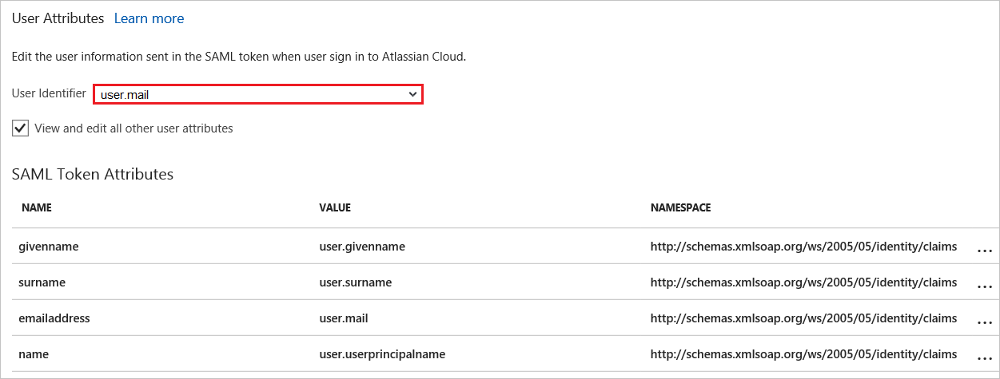

# Tutorial: Azure Active Directory integration with Atlassian Cloud

In this tutorial, you learn how to integrate Atlassian Cloud with Azure Active Directory (Azure AD).

Integrating Atlassian Cloud with Azure AD provides you with the following benefits:

- You can control in Azure AD who has access to Atlassian Cloud.
- You can enable your users to automatically get signed on to Atlassian Cloud (Single Sign-On) with their Azure AD accounts.
- You can manage your accounts in one central location, the Azure portal.

For more information about software as a service (SaaS) app integration with Azure AD, see [what is application access and single sign-on with Azure Active Directory](active-directory-appssoaccess-whatis.md).

## Prerequisites

To configure Azure AD integration with Atlassian Cloud, you need the following items:

- An Azure AD subscription.
- To enable Security Assertion Markup Language (SAML) single sign-on for Atlassian Cloud products, you need to set up Identity Manager. Learn more about [Identity Manager]( https://www.atlassian.com/enterprise/cloud/identity-manager).

> [!NOTE]
> When you test the steps in this tutorial, we recommend that you not use a production environment.

To test the steps in this tutorial, follow these recommendations:

- Do not use your production environment, unless it is necessary.
- If you don't have an Azure AD trial environment, you can [get a one-month trial](https://azure.microsoft.com/pricing/free-trial/).

## Scenario description
In this tutorial, you test Azure AD single sign-on in a test environment. 
The scenario outlined in the tutorial consists of two main building blocks:

* Adding Atlassian Cloud from the gallery
* Configuring and testing Azure AD single sign-on

## Add Atlassian Cloud from the gallery
To configure the integration of Atlassian Cloud with Azure AD, you need to add Atlassian Cloud from the gallery to your list of managed SaaS apps.

To add Atlassian Cloud from the gallery, do the following:

1. In the [Azure portal](https://portal.azure.com), in the left pane, select the **Azure Active Directory** button. 

	![The Azure Active Directory button][1]

2. Select **Enterprise applications** > **All applications**.

	![The Enterprise applications pane][2]
	
3. To add an application, select **New application**.

	![The "New application" button][3]

4. In the search box, type **Atlassian Cloud**, in the results list, select **Atlassian Cloud**, and then select **Add**.

	

## Configure and test Azure AD single sign-on

In this section, you configure and test Azure AD single sign-on with Atlassian Cloud, based on a test user named *Britta Simon*.

For single sign-on to work, Azure AD needs to identify the Atlassian Cloud user and its counterpart in Azure AD. In other words, you must establish a link relationship between an Azure AD user and the related user in Atlassian Cloud.

To establish the link relationship, assign as the Atlassian Cloud *Username* the same value that's assigned to the Azure AD *user name*.

To configure and test Azure AD single sign-on with Atlassian Cloud, you need to complete the building blocks in the following sections.

### Configure Azure AD single sign-on

In this section, you enable Azure AD single sign-on in the Azure portal and configure single sign-on in your Atlassian Cloud application.

To configure Azure AD single sign-on with Atlassian Cloud, do the following:

1. In the Azure portal, in the **Atlassian Cloud** application integration pane, select **Single sign-on**.

	![Configure single sign-on link][4]

2. In the **Single sign-on** window, select **Mode** as	**SAML-based Sign-on** to enable single sign-on.
 
	

3. On the **Atlassian Cloud Domain and URLs** section, perform the following steps if you wish to configure the application in **IDP** initiated mode:

	
	
	a. In the **Identifier** textbox, type the URL: `https://auth.atlassian.com/saml/<unique ID>`
	
	b. In the **Reply URL** textbox, type the URL: `https://auth.atlassian.com/login/callback?connection=saml-<unique ID>`

	c. In the **Relay State** textbox, type a URL using the following pattern: `https://<instancename>.atlassian.net`

4. Check **Show advanced URL settings** and perform the following step if you wish to configure the application in **SP** initiated mode:

	

	In the **Sign-on URL textbox**, type a URL using the following pattern: `https://<instancename>.atlassian.net`

	> [!NOTE] 
	> These values are not real. Update these values with the actual Identifier, Reply URL and Sign-On URL. You get these values from Atlassian Cloud SAML Configuration screen which is explained in later steps of the tutorial.

5. Under **SAML Signing Certificate**, select **Certificate(Base64)**, and then save the certificate file on your computer.

	 

6. Your Atlassian Cloud application expects to find the SAML assertions in a specific format, which requires you to add custom attribute mappings to your SAML Token Attributes configuration. 

	By default, the **User Identifier** value is mapped to user.userprincipalname. Change this value to map to **user.mail**. You can also choose any other appropriate value according to your organization's setup but, in most of the cases, email should work.

	 

7. Select **Save**.

	

8. To open the **Configure sign-on** window, in the **Atlassian Cloud Configuration** section, select **Configure Atlassian Cloud**. 

9. In the **Quick Reference** section, copy the **SAML Entity ID** and **SAML Single Sign-On Service URL**. 

	 

10. To get SSO configured for your application, sign in to the Atlassian portal with administrator credentials.

11. Go to **Atlassian Site Administration** > **Organizations & Security**. If you haven't already done so, create and name your organization. Then in the left navigation, select **Domains**.

	

11. Select the way that you want to verify your domain - **DNS** or **HTTPS**.

	

12. For DNS verification, in the **Domains** window, select the **DNS** tab, and then do the following:

	

	a. Select **Copy** to copy the value for your TXT record.

	b. From your DNS, go to the settings page for adding a new record.

	c. Select the option for adding a new record and paste the value you copied in the **Domains** window to the **Value** field. Your DNS may also refer to it as **Answer** or **Description**.

	d. Your DNS record may also include the following fields:
	
	* **Record type**: Enter **TXT**
	* **Name/Host/Alias**: Leave the default (@ or blank)
	* **Time to live (TTL)**: Enter **86400**
	
	e.	Save the record.

13. Return to the **Domains page** in organization administration, and select the **Verify domain** button. Enter your domain name in the pop-up and select the **Verify domain** button.

		

	> [!NOTE]
	> It can take up to 72 hours for the TXT record changes to take effect, you won't know right away whether your domain verification was successful. Check your **Domains** window soon after you perform these steps for your verification status. You see following screen with updated status as *Verified*.

	

14.	For HTTPS verification, select the **HTTPS** tab in the **Domains** window and do the following:

	

	a.	Select **Download file** to download the HTML file.

	b.	Upload the HTML file to the root directory of your domain.

15. Return to the **Domains** page in organization administration, and select the **Verify domain** button. Enter your **domain name** in the pop-up and select the **Verify domain** button.

	

16. If the verification process can locate the file you uploaded at the root directory, the status of the domain updates to **Verified**.

	

	> [!NOTE]
	> For more information on domain verification, refer [Atlassian's domain verification documentation](https://confluence.atlassian.com/cloud/domain-verification-873871234.html)

17. In the left navigation bar, select **SAML single sign-on**. If you haven't already, subscribe to Atlassian's Identity Manager.

	

18. In the **Add SAML configuration** window, add the Identity provider settings as follows:

	

	a. In the **Identity provider Entity ID** text box, paste the value of  **SAML Entity ID** which you have copied from Azure portal.

    b. In the **Identity provider SSO URL** text box, paste the value of **SAML Single Sign-On Service URL** which you have copied from Azure portal.

    c. Open the downloaded certificate from Azure portal in a notepad, copy the values without the Begin Certificate and End Certificate lines and paste it in the **Public X509 certificate** box.
    
    d. Select **Save Configuration**.
     
19. Update the Azure AD settings to make sure that you have setup the correct URLs.
  
    

	a. Copy the **SP Identity ID** from the SAML screen and paste the value in the **Identifier** box in the Azure portal, under Atlassian Cloud **Domain and URLs** section.
	
	b. Copy the **SP Assertion Consumer Service URL** from the SAML screen and paste the value in the **Reply URL** box in the Azure portal, under Atlassian Cloud **Domain and URLs** section.
	
	c. Sign On URL is the tenant URL of your Atlassian Cloud. 

	> [!NOTE]
	> Existing customers need to select on **Yes, update configuration** after updating the **SP Identity ID** and **SP Assertion Consumer Service URL** values in Azure Portal. New customers don't need to perform this step. 
	
20. In the Azure portal, select **Save**.

	

> [!TIP]
> You can now read a concise version of these instructions inside the [Azure portal](https://portal.azure.com), while you are setting up the app!  After adding this app from the **Active Directory > Enterprise Applications** section, simply select the **Single Sign-On** tab and access the embedded documentation through the **Configuration** section at the bottom. You can read more about the embedded documentation feature here: [Azure AD embedded documentation]( https://go.microsoft.com/fwlink/?linkid=845985)

### Create an Azure AD test user

The objective of this section is to create a test user in the Azure portal named Britta Simon.

   ![Create an Azure AD test user][100]

To create a test user in Azure AD, do the following:

1. In the Azure portal, in the left pane, select the **Azure Active Directory** button.

    

2. To display the list of users, go to **Users and groups**, and then select **All users**.

    

3. To open the **User** window, select **Add** at the top of the **All Users** window.

    

4. In the **User** window, do the following:

    

    a. In the **Name** box, type **BrittaSimon**.

    b. In the **User name** box, type the email address of user Britta Simon.

    c. Select the **Show Password** check box, and then write down the value that's displayed in the **Password** box.

    d. Select **Create**.
  
### Create an Atlassian Cloud test user

To enable Azure AD users to sign in to Atlassian Cloud, they must be provisioned into Atlassian Cloud. In case of Atlassian Cloud, provisioning is a manual task.

**To provision a user account, do the following:

1. In the Administration pane, select **Users**.

	 

2. To create a user in the Atlassian Cloud, select **Invite user**.

	 

3. Enter the user's **Email address** and assign the application access. 

	
 
4. To send the email invitation to the user, select **Invite users**.  
	An email invitation is sent to the user and, after accepting the invitation, the user is active in the system. 

>[!NOTE] 
>You can also bulk-create users by selecting the **Bulk Create** button in the **Users** section.

### Assign the Azure AD test user

In this section, you enable Britta Simon to use Azure single sign-on by granting access to Atlassian Cloud.

![Assign the user role][200] 

**To assign Britta Simon to Atlassian Cloud, do the following:

1. In the Azure portal, open the applications view, and then go to the directory view and go to **Enterprise applications** then select **All applications**.

	![Assign User][201] 

2. In the applications list, select **Atlassian Cloud**.

	  

3. In the menu on the left, select **Users and groups**.

	![The "Users and groups" link][202]

4. Select **Add** and then, in the **Add Assignment** pane, select **Users and groups**w.

	![The Add Assignment pane][203]

5. In the **Users and groups** window, select **Britta Simon** in the **Users** list.

6. In the **Users and groups** window, select **Select**.

7. In the **Add Assignment** window, select **Assign**.
	
### Test single sign-on

In this section, you test your Azure AD single sign-on configuration using the Access Panel.

When you select the Atlassian Cloud tile in the Access Panel, you should get automatically signed-on to your Atlassian Cloud application.
For more information about the Access Panel, see [Introduction to the Access Panel](active-directory-saas-access-panel-introduction.md). 

## Additional resources

* [List of Tutorials on How to Integrate SaaS Apps with Azure Active Directory](active-directory-saas-tutorial-list.md)
* [What is application access and single sign-on with Azure Active Directory?](active-directory-appssoaccess-whatis.md)

<!--Image references-->

[1]: ./media/active-directory-saas-atlassian-cloud-tutorial/tutorial_general_01.png
[2]: ./media/active-directory-saas-atlassian-cloud-tutorial/tutorial_general_02.png
[3]: ./media/active-directory-saas-atlassian-cloud-tutorial/tutorial_general_03.png
[4]: ./media/active-directory-saas-atlassian-cloud-tutorial/tutorial_general_04.png

[100]: ./media/active-directory-saas-atlassian-cloud-tutorial/tutorial_general_100.png

[200]: ./media/active-directory-saas-atlassian-cloud-tutorial/tutorial_general_200.png
[201]: ./media/active-directory-saas-atlassian-cloud-tutorial/tutorial_general_201.png
[202]: ./media/active-directory-saas-atlassian-cloud-tutorial/tutorial_general_202.png
[203]: ./media/active-directory-saas-atlassian-cloud-tutorial/tutorial_general_203.png

