# Tutorial: Azure Active Directory integration with Atlassian Cloud

In this tutorial, you learn how to integrate Atlassian Cloud with Azure Active Directory (Azure AD).

Integrating Atlassian Cloud with Azure AD provides you with the following benefits:

- You can control in Azure AD who has access to Atlassian Cloud
- You can enable your users to automatically get signed-on to Atlassian Cloud (Single Sign-On) with their Azure AD accounts
- You can manage your accounts in one central location - the Azure classic portal

If you want to know more details about SaaS app integration with Azure AD, see [What is application access and single sign-on with Azure Active Directory](active-directory-appssoaccess-whatis.md).

## Prerequisites

To configure Azure AD integration with Atlassian Cloud, you need the following items:

- An Azure AD subscription
- A Atlassian Cloud single-sign on enabled subscription

>[!NOTE] 
>To test the steps in this tutorial, we do not recommend using a production environment.

To test the steps in this tutorial, you should follow these recommendations:

- You should not use your production environment, unless this is necessary.
- If you don't have an Azure AD trial environment, you can get a [one-month trial](https://azure.microsoft.com/pricing/free-trial/).

## Scenario description
In this tutorial, you test Azure AD single sign-on in a test environment.

The scenario outlined in this tutorial consists of two main building blocks:

1. Adding Atlassian Cloud from the gallery
2. Configuring and testing Azure AD SSO

## Add Atlassian Cloud from the gallery
To configure the integration of Atlassian Cloud into Azure AD, you need to add Atlassian Cloud from the gallery to your list of managed SaaS apps.

**To add Atlassian Cloud from the gallery, perform the following steps:**

1. In the **Azure classic portal**, on the left navigation pane, click **Active Directory**.

	![Active Directory][1]
2. From the **Directory** list, select the directory for which you want to enable directory integration.

3. To open the applications view, in the directory view, click **Applications** in the top menu.

	![Applications][2]

4. Click **Add** at the bottom of the page.

	![Applications][3]

5. On the **What do you want to do** dialog, click **Add an application from the gallery**.

	![Applications][4]

6. In the search box, type **Atlassian Cloud**.

	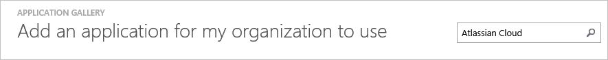

7. In the results pane, select **Atlassian Cloud**, and then click **Complete** to add the application.

	

##  Configure and test Azure AD SSO
In this section, you configure and test Azure AD single sign-on with Atlassian Cloud based on a test user called "Britta Simon".

For SSO to work, Azure AD needs to know what the counterpart user in Atlassian Cloud is to a user in Azure AD. In other words, a link relationship between an Azure AD user and the related user in Atlassian Cloud needs to be established.

This link relationship is established by assigning the value of the **user name** in Azure AD as the value of the **Username** in Atlassian Cloud.

To configure and test Azure AD single sign-on with Atlassian Cloud, you need to complete the following building blocks:

1. **[Configuring Azure AD single sign-on](#configuring-azure-ad-single-sign-on)** - to enable your users to use this feature.
2. **[Creating an Azure AD test user](#creating-an-azure-ad-test-user)** - to test Azure AD single sign-on with Britta Simon.
3. **[Creating an Atlassian Cloud test user](#creating-Atlassian-cloud-test-user)** - to have a counterpart of Britta Simon in Atlassian Cloud that is linked to the Azure AD representation of her.
4. **[Assigning the Azure AD test user](#assigning-the-azure-ad-test-user)** - to enable Britta Simon to use Azure AD single sign-on.
5. **[Testing single sign-on](#testing-single-sign-on)** - to verify whether the configuration works.

### Configure Azure AD SSO

In this section, you enable Azure AD single sign-on in the classic portal and configure SSO in your Atlassian Cloud application.

**To configure Azure AD single sign-on with Atlassian Cloud, perform the following steps:**

1. In the classic portal, on the **Atlassian Cloud** application integration page, click **Configure single sign-on** to open the **Configure Single Sign-On**  dialog.
	 
	![Configure Single Sign-On][6] 

2. On the **How would you like users to sign on to Atlassian Cloud** page, select **Azure AD Single Sign-On**, and then click **Next**.

	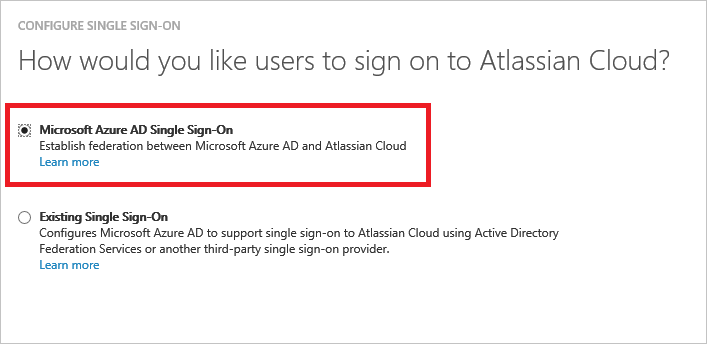 

3. On the **Configure App Settings** dialog page, perform the following steps:

	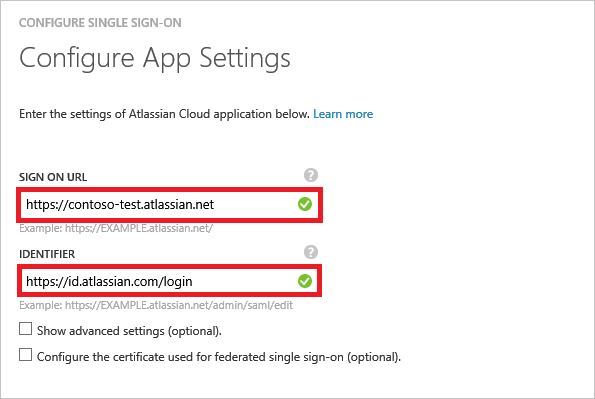 
 1. In the **Sign On URL** textbox, type the URL used by your users to sign-on to your Atlassian Cloud application using the following pattern: `https://<instancename>.atlassian.net`	
 2. In the **Identifier** textbox, type the URL with the following pattern: `https://id.atlassian.com/login`

	>[!NOTE] 
	>You can get the exact value of the **Identifier** from the Atlassian Cloud SAML Configuration screen.
	>

 3. click **Next**.
 
4. On the **Configure single sign-on at Atlassian Cloud** page, perform the following steps:

	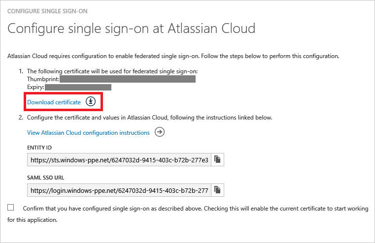
 1. Click **Download certificate**, and then save the file on your computer.
 2. Click **Next**.

5. To get SSO configured for your application, login to the Atlassian Portal using the administrator rights.

6. In the Authentication section of the left navigation click **Domains**.

	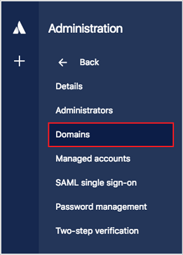
 1. In the textbox, type your domain name, and then click **Add domain**.
		
	
 2. To verify the domain, click **Verify**. 

	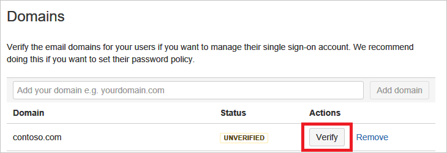 
  3. Download the domain verification html file, upload it to the root folder of your domain's website, and then click **Verify domain**.
	
	
  4. Once the domain is verified, the value of the **Stauts** field is **Verified**.

	

7. In the left navigation bar, click **SAML**.
 
	

8. Create a new SAML Configuration and add the Identity provider configuration.
  1. Copy the Entity ID value from Azure AD and paste it in the Identity Provider Entity ID field.
  2. Copy the SAML SSO URL and paste it in the Identity Provider SSO URL box.
  3. Open the downloaded certificate from Azure AD in Notepad and copy the values without the Begin and End lines and paste it in the Public X509 certificate box.
  4. Save the settings.

      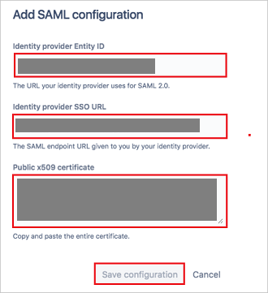
 
9. Update the Azure AD settings to make sure that you have setup the correct Identifier URL.
  1. Copy the SP Identity ID from the SAML screen and paste it in Azure AD as the **Identifier** value.
  2. Sign On URL is the tenant URL of your Atlassian Cloud. 	

     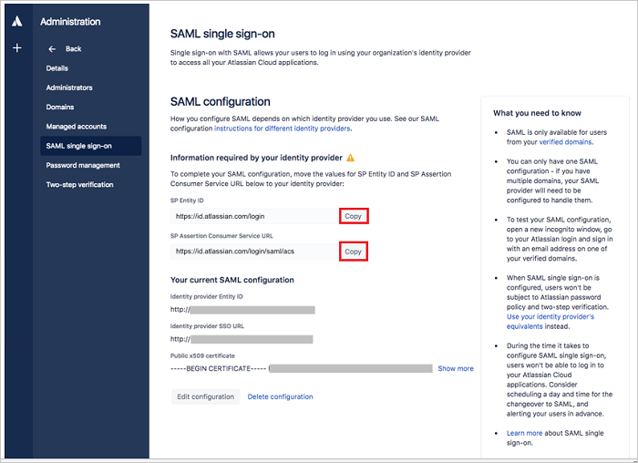
	
10. In the classic portal, select the single sign-on configuration confirmation, and then click **Next**.
	
	![Azure AD Single Sign-On][10]

7. On the **Single sign-on confirmation** page, click **Complete**.  
 
	![Azure AD Single Sign-On][11]

### Create an Azure AD test user
In this section, you create a test user in the classic portal called Britta Simon.

![Create Azure AD User][20]

**To create a test user in Azure AD, perform the following steps:**

1. In the **Azure classic portal**, on the left navigation pane, click **Active Directory**.

	 

2. From the **Directory** list, select the directory for which you want to enable directory integration.

3. To display the list of users, in the menu on the top, click **Users**.

	 

4. To open the **Add User** dialog, in the toolbar on the bottom, click **Add User**.

	 

5. On the **Tell us about this user** dialog page, perform the following steps:

	 
  1. As Type Of User, select New user in your organization.
  2. In the User Name **textbox**, type **BrittaSimon**.
  3. Click **Next**.

6.  On the **User Profile** dialog page, perform the following steps:

	 
   1. In the **First Name** textbox, type **Britta**.  
   2. In the **Last Name** textbox, type, **Simon**.
   3. In the **Display Name** textbox, type **Britta Simon**.
   4. In the **Role** list, select **User**.
   5. Click **Next**.

7. On the **Get temporary password** dialog page, click **create**.

	 

8. On the **Get temporary password** dialog page, perform the following steps:

	 
  1. Write down the value of the **New Password**.
  2. Click **Complete**.   

### Create an Atlassian Cloud test user

In this section, you create a user called Britta Simon in Atlassian Cloud. It is important that user should be present in the Atlassian Cloud before doing SSO. 

Please login to your Atlassian Cloud instance with administrator rights and perform the following steps.

>[!NOTE] 
>You can also create the luck users by clicking on the **Bulk Create** button in the Users section.

1. In the Site administration section click on the **Users** button

	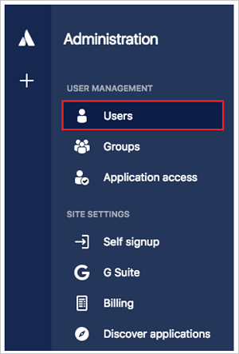 

2. Click on the **Create User** button to create a user in the Atlassian Cloud

	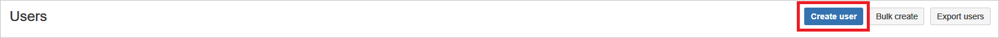 

3. Enter the user's Email address, Username and Full Name and assign the application access. 

	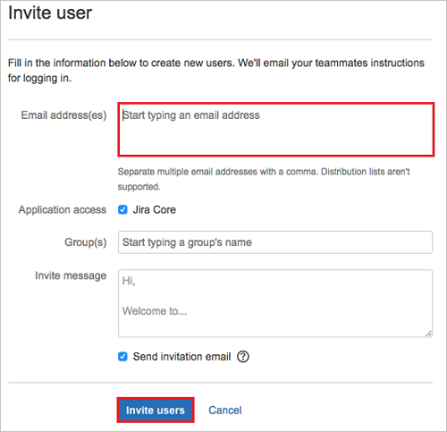
 
4. Click on **Create user** button, this will send the email invitation to the user and after accepting the invitation the user will be active in the system. 

### Assig the Azure AD test user

In this section, you enable Britta Simon to use Azure SSO by granting her access to Atlassian Cloud.

![Assign User][200] 

**To assign Britta Simon to Atlassian Cloud, perform the following steps:**

1. On the classic portal, to open the applications view, in the directory view, click **Applications** in the top menu.

	![Assign User][201] 

2. In the applications list, select **Atlassian Cloud**.

	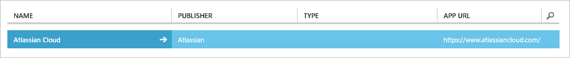 

3. In the menu on the top, click **Users**.

	![Assign User][203]

4. In the Users list, select **Britta Simon**.

5. In the toolbar on the bottom, click **Assign**.

	![Assign User][205]

### Test Single Sign-On

In this section, you test your Azure AD SSO configuration using the Access Panel.

When you click the Atlassian Cloud tile in the Access Panel, you should get automatically signed-on to your Atlassian Cloud application.

## Additional resources

* [List of Tutorials on How to Integrate SaaS Apps with Azure Active Directory](active-directory-saas-tutorial-list.md)
* [What is application access and single sign-on with Azure Active Directory?](active-directory-appssoaccess-whatis.md)

<!--Image references-->

[1]: ./media/active-directory-saas-atlassian-cloud-tutorial/tutorial_general_01.png
[2]: ./media/active-directory-saas-atlassian-cloud-tutorial/tutorial_general_02.png
[3]: ./media/active-directory-saas-atlassian-cloud-tutorial/tutorial_general_03.png
[4]: ./media/active-directory-saas-atlassian-cloud-tutorial/tutorial_general_04.png

[6]: ./media/active-directory-saas-atlassian-cloud-tutorial/tutorial_general_05.png
[10]: ./media/active-directory-saas-atlassian-cloud-tutorial/tutorial_general_06.png
[11]: ./media/active-directory-saas-atlassian-cloud-tutorial/tutorial_general_07.png
[20]: ./media/active-directory-saas-atlassian-cloud-tutorial/tutorial_general_100.png

[200]: ./media/active-directory-saas-atlassian-cloud-tutorial/tutorial_general_200.png
[201]: ./media/active-directory-saas-atlassian-cloud-tutorial/tutorial_general_201.png
[203]: ./media/active-directory-saas-atlassian-cloud-tutorial/tutorial_general_203.png
[204]: ./media/active-directory-saas-atlassian-cloud-tutorial/tutorial_general_204.png
[205]: ./media/active-directory-saas-atlassian-cloud-tutorial/tutorial_general_205.png
