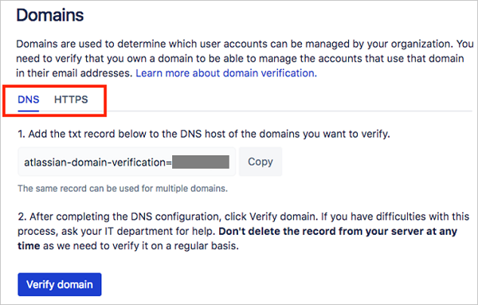
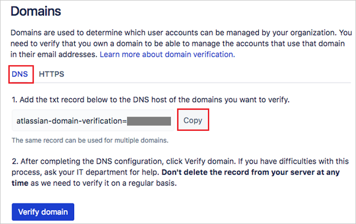
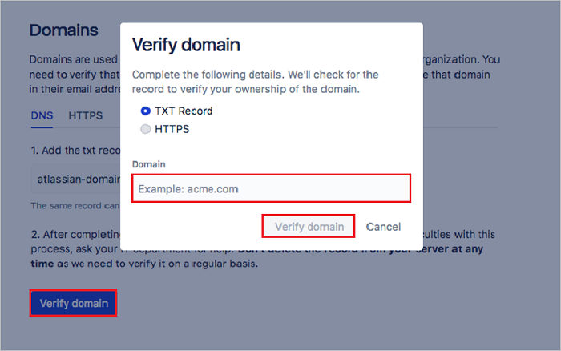
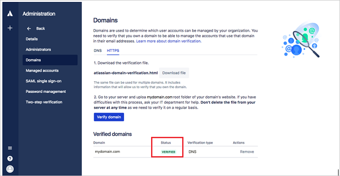
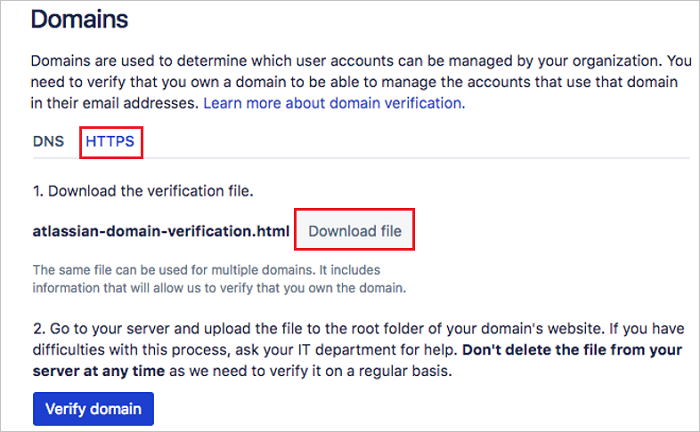
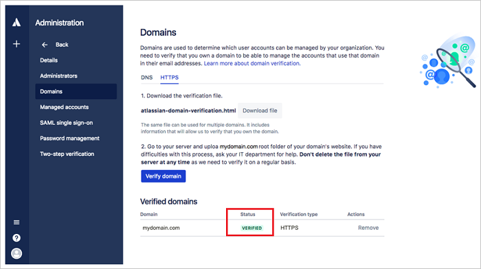

# Tutorial: Azure Active Directory integration with Atlassian Cloud

In this tutorial, you learn how to integrate Atlassian Cloud with Azure Active Directory (Azure AD).

Integrating Atlassian Cloud with Azure AD provides you with the following benefits:

- You can control in Azure AD who has access to Atlassian Cloud.
- You can enable your users to automatically get signed-on to Atlassian Cloud (Single Sign-On) with their Azure AD accounts.
- You can manage your accounts in one central location - the Azure portal.

If you want to know more details about SaaS app integration with Azure AD, see [what is application access and single sign-on with Azure Active Directory](active-directory-appssoaccess-whatis.md).

## Prerequisites

To configure Azure AD integration with Atlassian Cloud, you need the following items:

- An Azure AD subscription
- In order to enable SAML single sign-on for Atlassian Cloud products you'll need to set up Identity Manager. Learn more about [Identity Manager]( https://www.atlassian.com/enterprise/cloud/identity-manager)

> [!NOTE]
> To test the steps in this tutorial, we do not recommend using a production environment.

To test the steps in this tutorial, you should follow these recommendations:

- Do not use your production environment, unless it is necessary.
- If you don't have an Azure AD trial environment, you can [get a one-month trial](https://azure.microsoft.com/pricing/free-trial/).

## Scenario description
In this tutorial, you test Azure AD single sign-on in a test environment. 
The scenario outlined in this tutorial consists of two main building blocks:

1. Adding Atlassian Cloud from the gallery
2. Configuring and testing Azure AD single sign-on

## Adding Atlassian Cloud from the gallery
To configure the integration of Atlassian Cloud into Azure AD, you need to add Atlassian Cloud from the gallery to your list of managed SaaS apps.

**To add Atlassian Cloud from the gallery, perform the following steps:**

1. In the **[Azure portal](https://portal.azure.com)**, on the left navigation panel, click **Azure Active Directory** icon. 

	![The Azure Active Directory button][1]

2. Navigate to **Enterprise applications**. Then go to **All applications**.

	![The Enterprise applications blade][2]
	
3. To add new application, click **New application** button on the top of dialog.

	![The New application button][3]

4. In the search box, type **Atlassian Cloud**, select **Atlassian Cloud** from result panel then click **Add** button to add the application.

	

## Configure and test Azure AD single sign-on

In this section, you configure and test Azure AD single sign-on with Atlassian Cloud based on a test user called "Britta Simon".

For single sign-on to work, Azure AD needs to know what the counterpart user in Atlassian Cloud is to a user in Azure AD. In other words, a link relationship between an Azure AD user and the related user in Atlassian Cloud needs to be established.

In Atlassian Cloud, assign the value of the **user name** in Azure AD as the value of the **Username** to establish the link relationship.

To configure and test Azure AD single sign-on with Atlassian Cloud, you need to complete the following building blocks:

1. **[Configure Azure AD Single Sign-On](#configure-azure-ad-single-sign-on)** - to enable your users to use this feature.
2. **[Create an Azure AD test user](#create-an-azure-ad-test-user)** - to test Azure AD single sign-on with Britta Simon.
3. **[Create an Atlassian Cloud test user](#create-an-atlassian-cloud-test-user)** - to have a counterpart of Britta Simon in Atlassian Cloud that is linked to the Azure AD representation of user.
4. **[Assign the Azure AD test user](#assign-the-azure-ad-test-user)** - to enable Britta Simon to use Azure AD single sign-on.
5. **[Test single sign-on](#test-single-sign-on)** - to verify whether the configuration works.

### Configure Azure AD single sign-on

In this section, you enable Azure AD single sign-on in the Azure portal and configure single sign-on in your Atlassian Cloud application.

**To configure Azure AD single sign-on with Atlassian Cloud, perform the following steps:**

1. In the Azure portal, on the **Atlassian Cloud** application integration page, click **Single sign-on**.

	![Configure single sign-on link][4]

2. On the **Single sign-on** dialog, select **Mode** as	**SAML-based Sign-on** to enable single sign-on.
 
	

3. On the **Atlassian Cloud Domain and URLs** section, perform the following steps if you wish to configure the application in **IDP** initiated mode:

	
	
	a. In the **Identifier** textbox, type the URL: `https://id.atlassian.com/login`
	
	b. In the **Reply URL** textbox, type the URL: `https://id.atlassian.com/login/saml/acs`

	c. In the **Relay State** textbox, type a URL using the following pattern: `https://<instancename>.atlassian.net`

4. Check **Show advanced URL settings** and perform the following step if you wish to configure the application in **SP** initiated mode:

	

	In the **Sign-on URL textbox**, type a URL using the following pattern: `https://<instancename>.atlassian.net`

	> [!NOTE] 
	> These values are not real. You can get these values from Atlassian Cloud SAML Configuration screen, which is explained later in the tutorial.

5. On the **SAML Signing Certificate** section, click **Certificate(Base64)** and then save the certificate file on your computer.

	 

6. Click **Save** button.

	

7. On the **Atlassian Cloud Configuration** section, click **Configure Atlassian Cloud** to open **Configure sign-on** window. Copy the **SAML Entity ID and SAML Single Sign-On Service URL** from the **Quick Reference section.**

	 

8. To get SSO configured for your application, login to the Atlassian Portal using the administrator rights.

9. Navigate to **Atlassian Site Administration** > **Organizations & Security**. If you haven't already, create and name your organization. Then in the left navigation, click **Domains**.

	

10. Select the way that you want to verify your domain - **DNS** or **HTTPS**.

	

11. For DNS verification, select the **DNS** tab on the **Domains** page and perform follwing steps:

	

	a. Click **Copy** to copy the value for your TXT record.

	b. From your DNS, find the settings page for adding a new record

	c. Select the option for adding a new record and paste the value you copied from the **Domains** page to the **Value** field. Your DNS may also refer to it as **Answer** or **Description**.

	d. Your DNS record may also include the following fields:
	
	* **Record type**: Enter **TXT**
	* **Name/Host/Alias**: Leave the default (@ or blank)
	* **Time to live (TTL)**: Enter **86400**
	
	e.	Save the record.

12. Return to the **Domains page** in organization administration, and click the **Verify domain** button. Enter your domain name in the pop-up and click the **Verify domain** button.

	
	
	> [!NOTE]
	> It can take up to 72 hours for the TXT record changes to take effect, you won't know right away whether your domain verification was successful. Check your **Domains** page soon after you perform these steps for your verification status. You see following screen with updated status as **VERIFIED**.

	

13.	For HTTPS verification, select the **HTTPS** tab on the **Domains** page and perform following steps:

	

	a.	Click **Download file** to download the HTML file.

	b.	Upload the HTML file to the root directory of your domain.

14. Return to the **Domains** page in organization administration, and click the **Verify domain** button. Enter your **domain name** in the pop-up and click the **Verify domain** button.

	

15. If the verification process can locate the file you uploaded at the root directory, the status of the domain updates to **Verified**.

	

	> [!NOTE]
	> For more information refer [Atlassian's domain verification documentation](https://confluence.atlassian.com/cloud/domain-verification-873871234.html)

16. In the left navigation bar, click **SAML single sign-on**. If you haven't already, subscribe to Atlassian's Identity Manager.

	

17. In **Add SAML configuration** dialogue box add the Identity provider settings as follows:

	

	a. In the **Identity provider Entity ID** text box, paste the value of  **SAML Entity ID** which you have copied from Azure portal.

    b. In the **Identity provider SSO URL** text box, paste the value of **SAML Single Sign-On Service URL** which you have copied from Azure portal.

    c. Open the downloaded certificate in a notepad and copy the values without the Begin and End lines and paste it in the **Public X509 certificate** box.
    
    d. Click **Save Configuration**  to save the settings.
     
18. Update the Azure AD settings to make sure that you have setup the correct URLs.
  
    

	a. Copy the **SP Identity ID** from the SAML screen and paste the value in the **Identifier** box in the Azure portal, under Atlassian Cloud **Domain and URLs** section.
	
	b. Copy the **SP Assertion Consumer Service URL** from the SAML screen and paste the value in the **Reply URL** box in the Azure portal, under Atlassian Cloud **Domain and URLs** section.
	
	c. Sign On URL is the tenant URL of your Atlassian Cloud. 
	
19. In the Azure portal, click **Save** button.

	

> [!TIP]
> You can now read a concise version of these instructions inside the [Azure portal](https://portal.azure.com), while you are setting up the app!  After adding this app from the **Active Directory > Enterprise Applications** section, simply click the **Single Sign-On** tab and access the embedded documentation through the **Configuration** section at the bottom. You can read more about the embedded documentation feature here: [Azure AD embedded documentation]( https://go.microsoft.com/fwlink/?linkid=845985)

### Create an Azure AD test user

The objective of this section is to create a test user in the Azure portal called Britta Simon.

   ![Create an Azure AD test user][100]

**To create a test user in Azure AD, perform the following steps:**

1. In the Azure portal, in the left pane, click the **Azure Active Directory** button.

    

2. To display the list of users, go to **Users and groups**, and then click **All users**.

    

3. To open the **User** dialog box, click **Add** at the top of the **All Users** dialog box.

    

4. In the **User** dialog box, perform the following steps:

    

    a. In the **Name** box, type **BrittaSimon**.

    b. In the **User name** box, type the email address of user Britta Simon.

    c. Select the **Show Password** check box, and then write down the value that's displayed in the **Password** box.

    d. Click **Create**.
  
### Create an Atlassian Cloud test user

To enable Azure AD users to log in to Atlassian Cloud, they must be provisioned into Atlassian Cloud. In case of Atlassian Cloud, provisioning is a manual task.

**To provision a user account, perform the following steps:**

1. In the Site administration section of Atlassian Portal, click the **Users** button

	 

2. Click the **Invite user** button to create a user in the Atlassian Cloud.

	 

3. Enter the user's **Email address** and assign the application access. 

	
 
4. Click **Invite users** button, it will send the email invitation to the user and after accepting the invitation the user will be active in the system. 

>[!NOTE] 
>You can also create the bulk users by clicking the **Bulk Create** button in the Users section.

### Assign the Azure AD test user

In this section, you enable Britta Simon to use Azure single sign-on by granting access to Atlassian Cloud.

![Assign the user role][200] 

**To assign Britta Simon to Atlassian Cloud, perform the following steps:**

1. In the Azure portal, open the applications view, and then navigate to the directory view and go to **Enterprise applications** then click **All applications**.

	![Assign User][201] 

2. In the applications list, select **Atlassian Cloud**.

	  

3. In the menu on the left, click **Users and groups**.

	![The "Users and groups" link][202]

4. Click **Add** button. Then select **Users and groups** on **Add Assignment** dialog.

	![The Add Assignment pane][203]

5. On **Users and groups** dialog, select **Britta Simon** in the Users list.

6. Click **Select** button on **Users and groups** dialog.

7. Click **Assign** button on **Add Assignment** dialog.
	
### Test single sign-on

In this section, you test your Azure AD single sign-on configuration using the Access Panel.

When you click the Atlassian Cloud tile in the Access Panel, you should get automatically signed-on to your Atlassian Cloud application.
For more information about the Access Panel, see [Introduction to the Access Panel](active-directory-saas-access-panel-introduction.md). 

## Additional resources

* [List of Tutorials on How to Integrate SaaS Apps with Azure Active Directory](active-directory-saas-tutorial-list.md)
* [What is application access and single sign-on with Azure Active Directory?](active-directory-appssoaccess-whatis.md)

<!--Image references-->

[1]: ./media/active-directory-saas-atlassian-cloud-tutorial/tutorial_general_01.png
[2]: ./media/active-directory-saas-atlassian-cloud-tutorial/tutorial_general_02.png
[3]: ./media/active-directory-saas-atlassian-cloud-tutorial/tutorial_general_03.png
[4]: ./media/active-directory-saas-atlassian-cloud-tutorial/tutorial_general_04.png

[100]: ./media/active-directory-saas-atlassian-cloud-tutorial/tutorial_general_100.png

[200]: ./media/active-directory-saas-atlassian-cloud-tutorial/tutorial_general_200.png
[201]: ./media/active-directory-saas-atlassian-cloud-tutorial/tutorial_general_201.png
[202]: ./media/active-directory-saas-atlassian-cloud-tutorial/tutorial_general_202.png
[203]: ./media/active-directory-saas-atlassian-cloud-tutorial/tutorial_general_203.png

