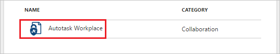
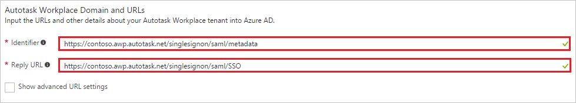
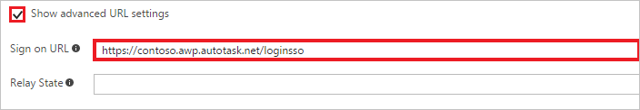
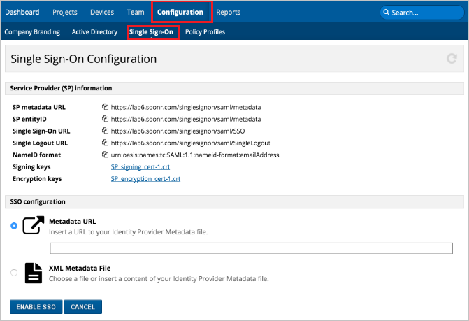
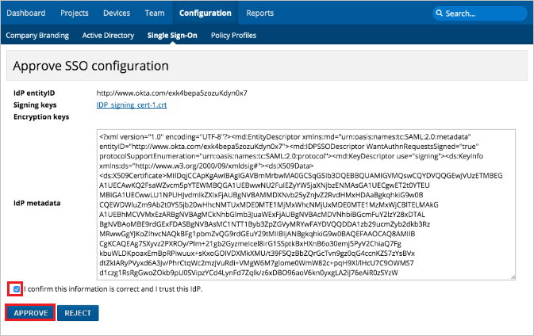
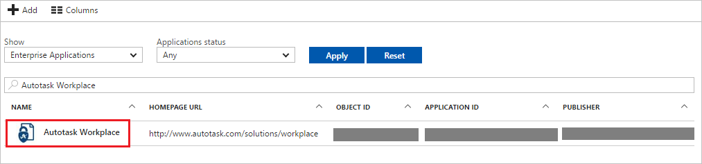

# Tutorial: Azure Active Directory integration with Autotask Workplace

In this tutorial, you learn how to integrate Autotask Workplace with Azure Active Directory (Azure AD).

Integrating Autotask Workplace with Azure AD provides you with the following benefits:

- You can control in Azure AD who has access to Autotask Workplace
- You can enable your users to automatically get signed-on to Autotask Workplace (Single Sign-On) with their Azure AD accounts
- You can manage your accounts in one central location - the Azure portal

If you want to know more details about SaaS app integration with Azure AD, see [what is application access and single sign-on with Azure Active Directory](active-directory-appssoaccess-whatis.md).

## Prerequisites

To configure Azure AD integration with Autotask Workplace, you need the following items:

- An Azure AD subscription
- An Autotask Workplace single-sign on enabled subscription
- You must be an administrator or super administrator in Workplace.
- You must have an administrator account in the Azure AD.
- The users that will utilize this feature must have accounts within Workplace and the Azure AD, and their email addresses for both must match.

> [!NOTE]
> To test the steps in this tutorial, we do not recommend using a production environment.

To test the steps in this tutorial, you should follow these recommendations:

- Do not use your production environment, unless it is necessary.
- If you don't have an Azure AD trial environment, you can [get a one-month trial](https://azure.microsoft.com/pricing/free-trial/).

## Scenario description
In this tutorial, you test Azure AD single sign-on in a test environment. 
The scenario outlined in this tutorial consists of two main building blocks:

1. Adding Autotask Workplace from the gallery
2. Configuring and testing Azure AD single sign-on

## Adding Autotask Workplace from the gallery
To configure the integration of Autotask Workplace into Azure AD, you need to add Autotask Workplace from the gallery to your list of managed SaaS apps.

**To add Autotask Workplace from the gallery, perform the following steps:**

1. In the **[Azure portal](https://portal.azure.com)**, on the left navigation panel, click **Azure Active Directory** icon. 

	![The Azure Active Directory button][1]

2. Navigate to **Enterprise applications**. Then go to **All applications**.

	![The Enterprise applications blade][2]
	
3. To add new application, click **New application** button on the top of dialog.

	![The New application button][3]

4. In the search box, type **Autotask Workplace**, select  **Autotask Workplace**  from result panel then click **Add** button to add the application.

	

## Configure and test Azure AD single sign-on

In this section, you configure and test Azure AD single sign-on with Autotask Workplace based on a test user called "Britta Simon."

For single sign-on to work, Azure AD needs to know what the counterpart user in Autotask Workplace is to a user in Azure AD. In other words, a link relationship between an Azure AD user and the related user in Autotask Workplace needs to be established.

In Autotask Workplace, assign the value of the **user name** in Azure AD as the value of the **Username** to establish the link relationship.

To configure and test Azure AD single sign-on with Autotask Workplace, you need to complete the following building blocks:

1. **[Configure Azure AD Single Sign-On](#configure-azure-ad-single-sign-on)** - to enable your users to use this feature.
2. **[Create an Azure AD test user](#create-an-azure-ad-test-user)** - to test Azure AD single sign-on with Britta Simon.
3. **[Create an Autotask Workplace test user](#create-an-autotask-workplace-test-user)** - to have a counterpart of Britta Simon in Autotask Workplace that is linked to the Azure AD representation of user.
4. **[Assign the Azure AD test user](#assign-the-azure-ad-test-user)** - to enable Britta Simon to use Azure AD single sign-on.
5. **[Test Single Sign-On](#test-single-sign-on)** - to verify whether the configuration works.

### Configure Azure AD single sign-on

In this section, you enable Azure AD single sign-on in the Azure portal and configure single sign-on in your Autotask Workplace application.

**To configure Azure AD single sign-on with Autotask Workplace, perform the following steps:**

1. In the Azure portal, on the **Autotask Workplace** application integration page, click **Single sign-on**.

	![Configure single sign-on link][4]

2. On the **Single sign-on** dialog, select **Mode** as	**SAML-based Sign-on** to enable single sign-on.
 
	

3. If you wish to configure the application in **IDP** initiated mode, perform the following steps on the **Autotask Workplace Domain and URLs** section:

	

    a. In the **Identifier** textbox, type a URL using the following pattern: `https://<subdomain>.awp.autotask.net/singlesignon/saml/metadata`

	b. In the **Reply URL** textbox, type a URL using the following pattern: `https://<subdomain>.awp.autotask.net/singlesignon/saml/SSO`

4. If you wish to configure the application in **SP** initiated mode, check **Show advanced URL settings** and perform the following steps:

	

    In the **Sign-on URL** textbox, type a URL using the following pattern: `https://<subdomain>.awp.autotask.net/loginsso`
	 
	> [!NOTE] 
	> These values are not real. Update these values with the actual Identifier, Reply URL, and Sign-On URL. Contact [Autotask Workplace Client support team](https://awp.autotask.net/help/Content/0_HOME/Support_for_End_Clients.htm) to get these values. 

5. On the **SAML Signing Certificate** section, click **Metadata XML** and then save the metadata file on your computer.

	 

6. Click **Save** button.

	

7. In a different web browser window, Log in to Workplace Online using the administrator credentials.

    >[!Note]
    >When configuring the IdP, a subdomain will need to be specified. To confirm the correct subdomain, login to Workplace Online. Once logged in, make note to the subdomain in the URL.
    >The subdomain is the part between the “https://“ and “.awp.autotask.net/“ and should be us, eu, ca, or au.

8. Go to **Configuration** > **Single Sign-On** and perform the following steps:

    
 
    a. Select the **XML Metadata File** option, and then upload the **Metadata XML** downloaded from Azure portal.

    b. Click **Enable SSO**.
    
    

    c. Select the **I confirm this information is correct and I trust this IdP** check box.

    d. Click **Approve**.
     
>[!Note]
>If you require assistance with configuring Autotask Workplace, please see [this page](https://awp.autotask.net/help/Content/0_HOME/Support_for_End_Clients.htm) to get assistance with your Workplace account.

> [!TIP]
> You can now read a concise version of these instructions inside the [Azure portal](https://portal.azure.com), while you are setting up the app!  After adding this app from the **Active Directory > Enterprise Applications** section, simply click the **Single Sign-On** tab and access the embedded documentation through the **Configuration** section at the bottom. You can read more about the embedded documentation feature here: [Azure AD embedded documentation]( https://go.microsoft.com/fwlink/?linkid=845985)

### Create an Azure AD test user

The objective of this section is to create a test user in the Azure portal called Britta Simon.

   ![Create an Azure AD test user][100]

**To create a test user in Azure AD, perform the following steps:**

1. In the Azure portal, in the left pane, click the **Azure Active Directory** button.

    

2. To display the list of users, go to **Users and groups**, and then click **All users**.

    

3. To open the **User** dialog box, click **Add** at the top of the **All Users** dialog box.

    

4. In the **User** dialog box, perform the following steps:

    

    a. In the **Name** box, type **BrittaSimon**.

    b. In the **User name** box, type the email address of user Britta Simon.

    c. Select the **Show Password** check box, and then write down the value that's displayed in the **Password** box.

    d. Click **Create**.

### Create an Autotask Workplace test user

In this section, you create a user called Britta Simon in Autotask. Please work with [Autotask Workplace support team](https://awp.autotask.net/help/Content/0_HOME/Support_for_End_Clients.htm) to add the users in the Autotask Workplace platform.

### Assign the Azure AD test user

In this section, you enable Britta Simon to use Azure single sign-on by granting access to Autotask Workplace.

![Assign the user role][200] 

**To assign Britta Simon to Autotask Workplace, perform the following steps:**

1. In the Azure portal, open the applications view, and then navigate to the directory view and go to **Enterprise applications** then click **All applications**.

	![Assign User][201] 

2. In the applications list, select **Autotask Workplace**.

	 

3. In the menu on the left, click **Users and groups**.

	![The "Users and groups" link][202]

4. Click **Add** button. Then select **Users and groups** on **Add Assignment** dialog.

	![The Add Assignment pane][203]

5. On **Users and groups** dialog, select **Britta Simon** in the Users list.

6. Click **Select** button on **Users and groups** dialog.

7. Click **Assign** button on **Add Assignment** dialog.
	
### Test single sign-on

In this section, you test your Azure AD single sign-on configuration using the Access Panel.

When you click the Autotask Workplace tile in the Access Panel, you should get automatically signed-on to your Autotask Workplace application.
For more information about the Access Panel, see [Introduction to the Access Panel](active-directory-saas-access-panel-introduction.md).

## Additional resources

* [List of Tutorials on How to Integrate SaaS Apps with Azure Active Directory](active-directory-saas-tutorial-list.md)
* [What is application access and single sign-on with Azure Active Directory?](active-directory-appssoaccess-whatis.md)

<!--Image references-->

[1]: ./media/active-directory-saas-autotaskworkplace-tutorial/tutorial_general_01.png
[2]: ./media/active-directory-saas-autotaskworkplace-tutorial/tutorial_general_02.png
[3]: ./media/active-directory-saas-autotaskworkplace-tutorial/tutorial_general_03.png
[4]: ./media/active-directory-saas-autotaskworkplace-tutorial/tutorial_general_04.png

[100]: ./media/active-directory-saas-autotaskworkplace-tutorial/tutorial_general_100.png

[200]: ./media/active-directory-saas-autotaskworkplace-tutorial/tutorial_general_200.png
[201]: ./media/active-directory-saas-autotaskworkplace-tutorial/tutorial_general_201.png
[202]: ./media/active-directory-saas-autotaskworkplace-tutorial/tutorial_general_202.png
[203]: ./media/active-directory-saas-autotaskworkplace-tutorial/tutorial_general_203.png

