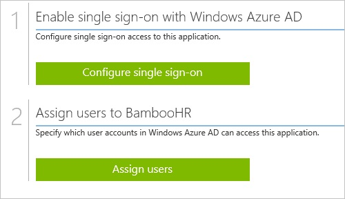
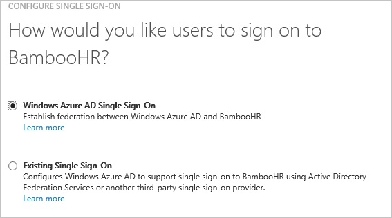
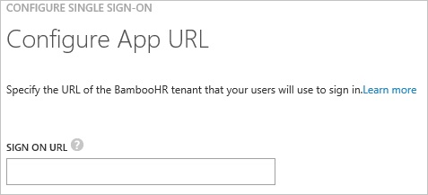
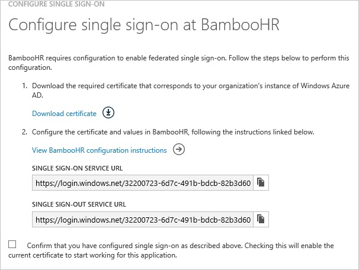
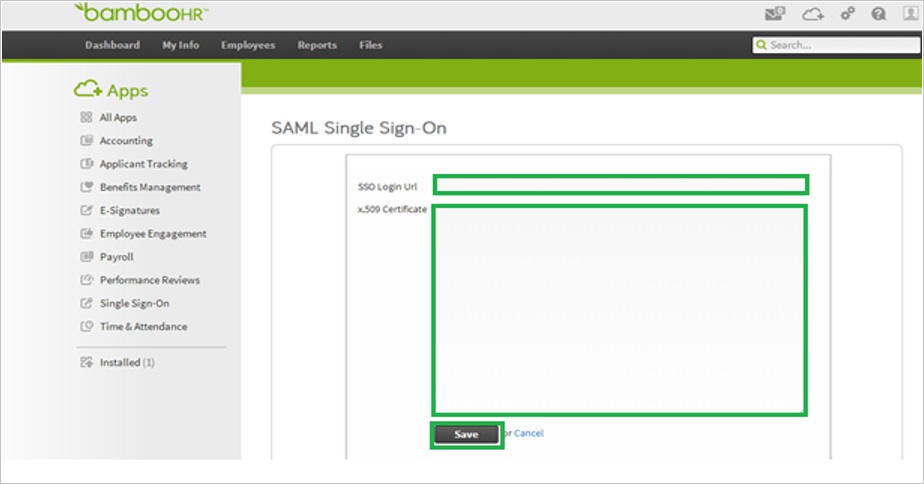
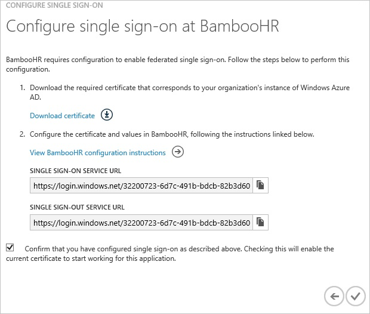
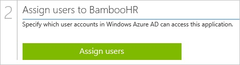

<properties 
    pageTitle="Tutorial: Azure Active Directory Integration with Bamboo HR | Microsoft Azure" 
    description="Learn how to use Bamboo HR with Azure Active Directory to enable single sign-on, automated provisioning, and more!" 
    services="active-directory" 
    authors="jeevansd"  
    documentationCenter="na" 
    manager="femila"/>
<tags 
    ms.service="active-directory" 
    ms.devlang="na" 
    ms.topic="article" 
    ms.tgt_pltfrm="na" 
    ms.workload="identity" 
    ms.date="07/11/2016" 
    ms.author="jeedes" />

#Tutorial: Azure Active Directory Integration with Bamboo HR

The objective of this tutorial is to show the integration of Azure and BambooHR.  
The scenario outlined in this tutorial assumes that you already have the following items:

-   A valid Azure subscription
-   A BambooHR single sign-on enabled subscription

After completing this tutorial, the Azure AD users you have assigned to BambooHR will be able to single sign into the application at your BambooHR company site (service provider initiated sign on), or using the [Introduction to the Access Panel](active-directory-saas-access-panel-introduction.md).

The scenario outlined in this tutorial consists of the following building blocks:

1.  Enabling the application integration for BambooHR
2.  Configuring single sign-on
3.  Configuring user provisioning
4.  Assigning users

##Enabling the application integration for BambooHR

The objective of this section is to outline how to enable the application integration for BambooHR.

###To enable the application integration for BambooHR, perform the following steps:

1.  In the Azure classic portal, on the left navigation pane, click **Active Directory**.

    

2.  From the **Directory** list, select the directory for which you want to enable directory integration.

3.  To open the applications view, in the directory view, click **Applications** in the top menu.

    

4.  Click **Add** at the bottom of the page.

    

5.  On the **What do you want to do** dialog, click **Add an application from the gallery**.

    

6.  In the **search box**, type **BambooHR**.

    

7.  In the results pane, select **BambooHR**, and then click **Complete** to add the application.

    
##Configuring single sign-on

The objective of this section is to outline how to enable users to authenticate to BambooHR with their account in Azure AD using federation based on the SAML protocol.  
As part of this procedure, you are required to create a base-64 encoded certificate file.  
If you are not familiar with this procedure, see [How to convert a binary certificate into a text file](http://youtu.be/PlgrzUZ-Y1o).

###To configure single sign-on, perform the following steps:

1.  In the Azure classic portal, on the **BambooHR** application integration page, click **Configure single sign-on** to open the **Configure Single Sign On ** dialog.

    

2.  On the **How would you like users to sign on to BambooHR** page, select **Microsoft Azure AD Single Sign-On**, and then click **Next**.

    

3.  On the **Configure App URL** page, in the **BambooHR Sign On URL** textbox, type your URL used by your users to sign on to your BambooHR application (e.g.: https://company.bamboohr.com), and then click **Next**.

    

4.  On the **Configure single sign-on at BambooHR** page, click **Download certificate**, and then save the certificate file on your computer.

    

5.  In a different web browser window, log into your BambooHR company site as an administrator.

6.  On the homepage, perform the following steps:

    

    1.  Click **Apps**.
    2.  In the apps menu on the left, click **Single Sign-On**.
    3.  Click **SAML Single Sign-On**.

7.  In the **SAML Single Sign-On** section, perform the following steps:

    

    1.  In the Azure classic portal, on the **Configure single sign-on at BambooHR** dialog page, copy the **Single Sign-On Service URL** value, and then paste it into the **SSO Login URL ** textbox.
    2.  Create a **base-64 encoded** file from your downloaded certificate.  

        >[AZURE.TIP] For more details, see [How to convert a binary certificate into a text file](http://youtu.be/PlgrzUZ-Y1o)

    3.  Open your base-64 encoded certificate in notepad, copy the content of it into your clipboard, and then paste it to the **X.509 Certificate** textbox
    4.  Click **Save**.

8.  On the Azure classic portal, select the single sign-on configuration confirmation, and then click **Complete** to close the **Configure Single Sign On** dialog.

    
##Configuring user provisioning

In order to enable Azure AD users to log into BambooHR, they must be provisioned into BambooHR.  
In the case of BambooHR, provisioning is a manual task.

###To provision a user accounts, perform the following steps:

1.  Log in to your **BambooHR** site as administrator.

2.  In the toolbar on the top, click **Settings**.

    

3.  Click **Overview**.

4.  In the left navigation pane, go to **Security \> Users**.

5.  Type the user name, password and email address of a valid AAD account you want to provision into the related textboxes.

6.  Click **Save**.

>[AZURE.NOTE] You can use any other BambooHR user account creation tools or APIs provided by BambooHR to provision AAD user accounts.

##Assigning users

To test your configuration, you need to grant the Azure AD users you want to allow using your application access to it by assigning them.

###To assign users to BambooHR, perform the following steps:

1.  In the Azure classic portal, create a test account.

2.  On the **BambooHR **application integration page, click **Assign users**.

    

3.  Select your test user, click **Assign**, and then click **Yes** to confirm your assignment.

    

If you want to test your single sign-on settings, open the Access Panel. For more details about the Access Panel, see [Introduction to the Access Panel](active-directory-saas-access-panel-introduction.md).
