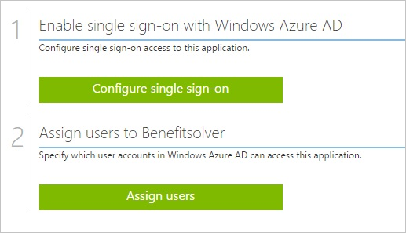
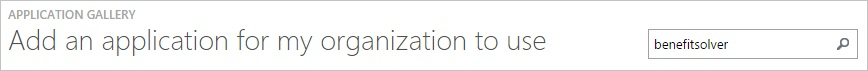
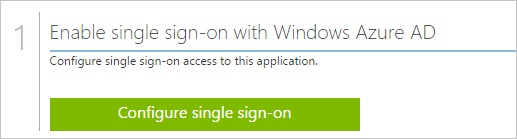
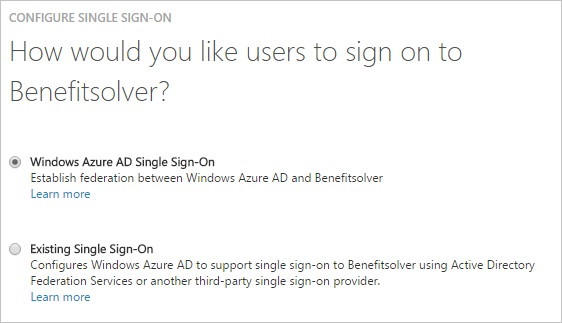
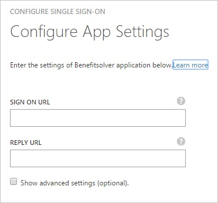
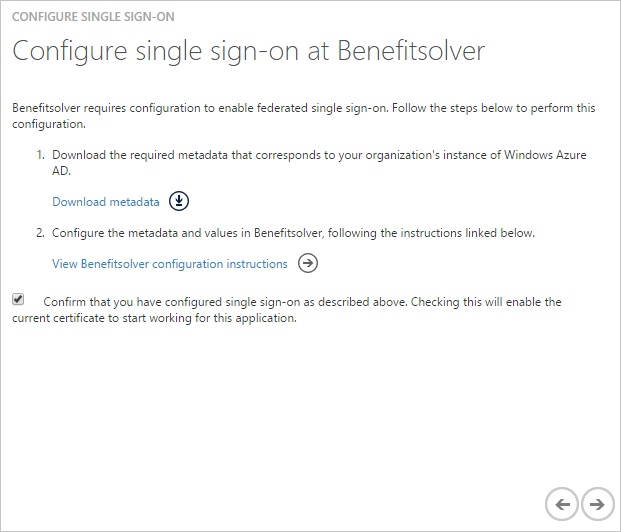
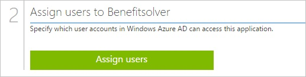

<properties 
    pageTitle="Tutorial: Azure Active Directory integration with Benefitsolver | Microsoft Azure"
    description="Learn how to use Benefitsolver with Azure Active Directory to enable single sign-on, automated provisioning, and more!" 
    services="active-directory" 
    authors="jeevansd"  
    documentationCenter="na" 
    manager="femila"/>
<tags 
    ms.service="active-directory" 
    ms.devlang="na" 
    ms.topic="article" 
    ms.tgt_pltfrm="na" 
    ms.workload="identity" 
    ms.date="07/19/2016" 
    ms.author="jeedes" />

#Tutorial: Azure Active Directory integration with Benefitsolver

The objective of this tutorial is to show the integration of Azure and Benefitsolver.  
The scenario outlined in this tutorial assumes that you already have the following items:

-   A valid Azure subscription
-   A Benefitsolver single sign-on enabled subscription

After completing this tutorial, the Azure AD users you have assigned to Benefitsolver will be able to single sign into the application using the [Introduction to the Access Panel](active-directory-saas-access-panel-introduction.md).

The scenario outlined in this tutorial consists of the following building blocks:

1.  Enabling the application integration for Benefitsolver
2.  Configuring single sign-on
3.  Configuring user provisioning
4.  Assigning users

##Enabling the application integration for Benefitsolver

The objective of this section is to outline how to enable the application integration for Benefitsolver.

###To enable the application integration for Benefitsolver, perform the following steps:

1.  In the Azure classic portal, on the left navigation pane, click **Active Directory**.

    

2.  From the **Directory** list, select the directory for which you want to enable directory integration.

3.  To open the applications view, in the directory view, click **Applications** in the top menu.

    

4.  Click **Add** at the bottom of the page.

    

5.  On the **What do you want to do** dialog, click **Add an application from the gallery**.

    

6.  In the **search box**, type **Benefitsolver**.

    

7.  In the results pane, select **Benefitsolver**, and then click **Complete** to add the application.

    
##Configuring single sign-on

The objective of this section is to outline how to enable users to authenticate to Benefitsolver with their account in Azure AD using federation based on the SAML protocol.  
Your Benefitsolver application expects the SAML assertions in a specific format, which requires you to add custom attribute mappings to your **saml token attributes** configuration.  
The following screenshot shows an example for this.

###To configure single sign-on, perform the following steps:

1.  In the Azure classic portal, on the **Benefitsolver** application integration page, click **Configure single sign-on** to open the **Configure Single Sign On ** dialog.

    

2.  On the **How would you like users to sign on to Benefitsolver** page, select **Microsoft Azure AD Single Sign-On**, and then click **Next**.

    

3.  On the **Configure App Settings** page, perform the following steps:

    

    1.  In the **Sign On URL** textbox, type **http://azure.benefitsolver.com**.
    2.  In the **Reply URL** textbox, type **https://www.benefitsolver.com/benefits/BenefitSolverView?page_name=single_signon_saml**.  

    3.  Click **Next**.

4.  On the **Configure single sign-on at Benefitsolver** page, to download your metadata, click **Download metadata**, and then save the metadata file locally on your computer.

    

5.  Send the downloaded metadata file to your Benefitsolver support team.

    >[AZURE.NOTE] Your Benefitsolver support team has to do the actual SSO configuration.
     You will get a notification when SSO has been enabled for your subscription.

6.  On the Azure classic portal, select the single sign-on configuration confirmation, and then click **Complete** to close the **Configure Single Sign On** dialog.

    

7.  In the menu on the top, click **Attributes** to open the **SAML Token Attributes** dialog.

    

8.  To add the required attribute mappings, perform the following steps:

    

	|Attribute Name|Attribute Value|
    |---|---|
    |ClientID|You need to get this value from your Benefitsolver support team.|
    |ClientKey|You need to get this value from your Benefitsolver support team.|
    |LogoutURL|You need to get this value from your Benefitsolver support team.|
    |EmployeeID|You need to get this value from your Benefitsolver support team.|

    1.  For each data row in the table above, click **add user attribute**.
    2.  In the **Attribute Name** textbox, type the attribute name shown for that row.
    3.  In the **Attribute Value** textbox, select the attribute value shown for that row.
    4.  Click **Complete**.

9.  Click **Apply Changes**.

##Configuring user provisioning

In order to enable Azure AD users to log into Benefitsolver, they must be provisioned into Benefitsolver.  
In the case of Benefitsolver, employee data is in your application populated through a Census file from your HRIS system (typically nightly).  

>[AZURE.NOTE] You can use any other Benefitsolver user account creation tools or APIs provided by Benefitsolver to provision AAD user accounts.

##Assigning users

To test your configuration, you need to grant the Azure AD users you want to allow using your application access to it by assigning them.

###To assign users to Benefitsolver, perform the following steps:

1.  In the Azure classic portal, create a test account.

2.  On the **Benefitsolver **application integration page, click **Assign users**.

    

3.  Select your test user, click **Assign**, and then click **Yes** to confirm your assignment.

    

If you want to test your single sign-on settings, open the Access Panel. For more details about the Access Panel, see [Introduction to the Access Panel](active-directory-saas-access-panel-introduction.md).
