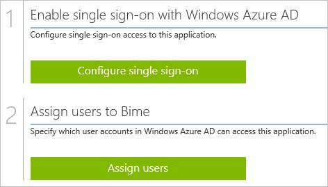
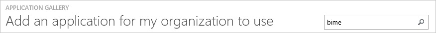
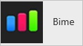
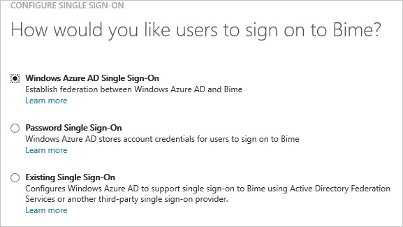
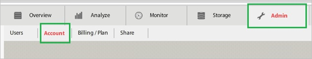
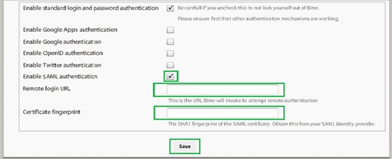
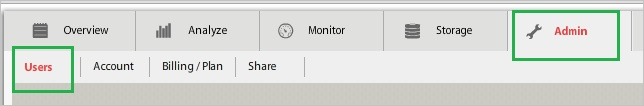
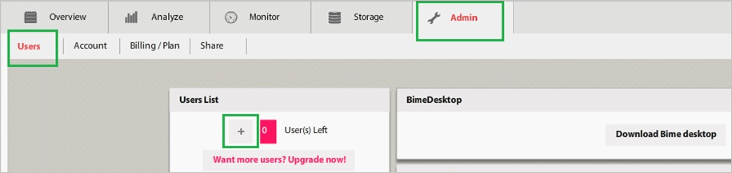
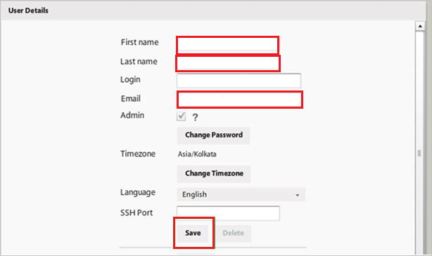
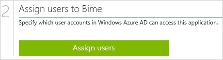

<properties 
    pageTitle="Tutorial: Azure Active Directory Integration with Bime | Microsoft Azure" 
    description="Learn how to use Bime with Azure Active Directory to enable single sign-on, automated provisioning, and more!" 
    services="active-directory" 
    authors="jeevansd"  
    documentationCenter="na" 
    manager="femila"/>
<tags 
    ms.service="active-directory" 
    ms.devlang="na" 
    ms.topic="article" 
    ms.tgt_pltfrm="na" 
    ms.workload="identity" 
    ms.date="07/11/2016" 
    ms.author="jeedes" />

#Tutorial: Azure Active Directory Integration with Bime

The objective of this tutorial is to show the integration of Azure and Bime.  
The scenario outlined in this tutorial assumes that you already have the following items:

-   A valid Azure subscription
-   A Bime tenant

After completing this tutorial, the Azure AD users you have assigned to Bime will be able to single sign into the application at your Bime company site (service provider initiated sign on), or using the [Introduction to the Access Panel](active-directory-saas-access-panel-introduction.md).

The scenario outlined in this tutorial consists of the following building blocks:

1.  Enabling the application integration for Bime
2.  Configuring single sign-on
3.  Configuring user provisioning
4.  Assigning users

##Enabling the application integration for Bime

The objective of this section is to outline how to enable the application integration for Bime.

###To enable the application integration for Bime, perform the following steps:

1.  In the Azure classic portal, on the left navigation pane, click **Active Directory**.

    

2.  From the **Directory** list, select the directory for which you want to enable directory integration.

3.  To open the applications view, in the directory view, click **Applications** in the top menu.

    

4.  Click **Add** at the bottom of the page.

    

5.  On the **What do you want to do** dialog, click **Add an application from the gallery**.

    

6.  In the **search box**, type **Bime**.

    

7.  In the results pane, select **Bime**, and then click **Complete** to add the application.

    
##Configuring single sign-on

The objective of this section is to outline how to enable users to authenticate to Bime with their account in Azure AD using federation based on the SAML protocol.  
Configuring single sign-on for Bime requires you to retrieve a thumbprint value from a certificate.  
If you are not familiar with this procedure, see [How to retrieve a certificate's thumbprint value](http://youtu.be/YKQF266SAxI).

###To configure single sign-on, perform the following steps:

1.  In the Azure classic portal, on the **Bime** application integration page, click **Configure single sign-on** to open the **Configure Single Sign On ** dialog.

    

2.  On the **How would you like users to sign on to Bime** page, select **Microsoft Azure AD Single Sign-On**, and then click **Next**.

    

3.  On the **Configure App URL** page, in the **Bime Sign In URL** textbox, type your URL using the following pattern "*https://\<tenant-name\>.Bimeapp.com*", and then click **Next**.

    

4.  On the **Configure single sign-on at Bime** page, to download your certificate, click **Download certificate**, and then save the certificate file locally as **c:\\Bime.cer**.

    

5.  In a different web browser window, log into your Bime company site as an administrator.

6.  In the toolbar, click **Admin**, and then **Account**.

    

7.  On the account configuration page, perform the following steps:

    

    1.  Select **Enable SAML authentication**.
    2.  In the Azure classic portal, on the **Configure single sign-on at Bime** dialog page, copy the **Remote Login URL** value, and then paste it into the **Remote Login URL** textbox.
    3.  Copy the **Thumbprint** value from the exported certificate, and then paste it into the **Certificate Fingerprint** textbox.  

        >[AZURE.TIP] For more details, see [How to retrieve a certificate's thumbprint value](http://youtu.be/YKQF266SAxI)

    4.  Click **Save**.

8.  On the Azure classic portal, select the single sign-on configuration confirmation, and then click **Complete** to close the **Configure Single Sign On** dialog.

    
##Configuring user provisioning

In order to enable Azure AD users to log into Bime, they must be provisioned into Bime.  
In the case of Bime, provisioning is a manual task.

###To configure user provisioning, perform the following steps:

1.  Log in to your **Bime** tenant.

2.  In the toolbar, click **Admin**, and then **Users**.

    

3.  In the **Users List**, click **Add New User** (“+”).

    

4.  On the **User Details** dialog page, perform the following steps:

    

    1.  Enter the First Name, Last Name, Login, Email of a valid AAD account you want to provision.
    2.  Click Save.

>[AZURE.NOTE] You can use any other Bime user account creation tools or APIs provided by Bime to provision AAD user accounts.

##Assigning users

To test your configuration, you need to grant the Azure AD users you want to allow using your application access to it by assigning them.

###To assign users to Bime, perform the following steps:

1.  In the Azure classic portal, create a test account.

2.  On the **Bime **application integration page, click **Assign users**.

    

3.  Select your test user, click **Assign**, and then click **Yes** to confirm your assignment.

    

If you want to test your single sign-on settings, open the Access Panel. For more details about the Access Panel, see [Introduction to the Access Panel](active-directory-saas-access-panel-introduction.md).
