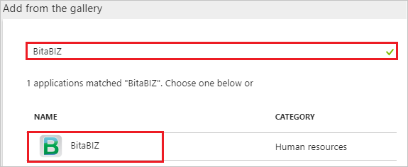
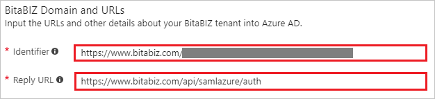
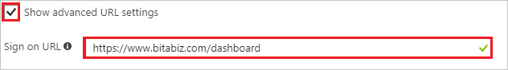
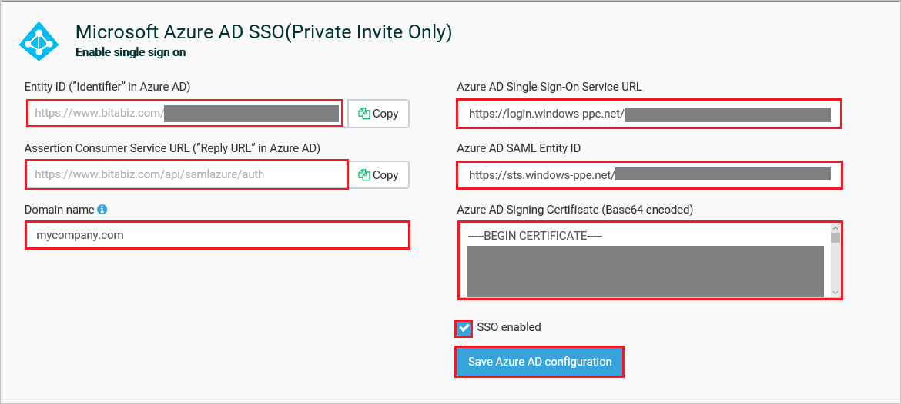

# Tutorial: Azure Active Directory integration with BitaBIZ

In this tutorial, you learn how to integrate BitaBIZ with Azure Active Directory (Azure AD).

Integrating BitaBIZ with Azure AD provides you with the following benefits:

- You can control in Azure AD who has access to BitaBIZ.
- You can enable your users to automatically get signed-on to BitaBIZ (Single Sign-On) with their Azure AD accounts.
- You can manage your accounts in one central location - the Azure portal.

If you want to know more details about SaaS app integration with Azure AD, see [what is application access and single sign-on with Azure Active Directory](active-directory-appssoaccess-whatis.md).

## Prerequisites

To configure Azure AD integration with BitaBIZ, you need the following items:

- An Azure AD subscription
- A BitaBIZ single-sign on enabled subscription

> [!NOTE]
> To test the steps in this tutorial, we do not recommend using a production environment.

To test the steps in this tutorial, you should follow these recommendations:

- Do not use your production environment, unless it is necessary.
- If you don't have an Azure AD trial environment, you can [get a one-month trial](https://azure.microsoft.com/pricing/free-trial/).

## Scenario description
In this tutorial, you test Azure AD single sign-on in a test environment. 
The scenario outlined in this tutorial consists of two main building blocks:

1. Adding BitaBIZ from the gallery
2. Configuring and testing Azure AD single sign-on

## Adding BitaBIZ from the gallery
To configure the integration of BitaBIZ into Azure AD, you need to add BitaBIZ from the gallery to your list of managed SaaS apps.

**To add BitaBIZ from the gallery, perform the following steps:**

1. In the **[Azure portal](https://portal.azure.com)**, on the left navigation panel, click **Azure Active Directory** icon. 

	![The Azure Active Directory button][1]

2. Navigate to **Enterprise applications**. Then go to **All applications**.

	![The Enterprise applications blade][2]
	
3. To add new application, click **New application** button on the top of dialog.

	![The New application button][3]

4. In the search box, type **BitaBIZ**, select **BitaBIZ** from result panel then click **Add** button to add the application.

	

## Configure and test Azure AD single sign-on

In this section, you configure and test Azure AD single sign-on with BitaBIZ based on a test user called "Britta Simon".

For single sign-on to work, Azure AD needs to know what the counterpart user in BitaBIZ is to a user in Azure AD. In other words, a link relationship between an Azure AD user and the related user in BitaBIZ needs to be established.

In BitaBIZ, assign the value of the **user name** in Azure AD as the value of the **Username** to establish the link relationship.

To configure and test Azure AD single sign-on with BitaBIZ, you need to complete the following building blocks:

1. **[Configure Azure AD Single Sign-On](#configure-azure-ad-single-sign-on)** - to enable your users to use this feature.
2. **[Create an Azure AD test user](#create-an-azure-ad-test-user)** - to test Azure AD single sign-on with Britta Simon.
3. **[Create a BitaBIZ test user](#create-a-bitabiz-test-user)** - to have a counterpart of Britta Simon in BitaBIZ that is linked to the Azure AD representation of user.
4. **[Assign the Azure AD test user](#assign-the-azure-ad-test-user)** - to enable Britta Simon to use Azure AD single sign-on.
5. **[Test single sign-on](#test-single-sign-on)** - to verify whether the configuration works.

### Configure Azure AD single sign-on

In this section, you enable Azure AD single sign-on in the Azure portal and configure single sign-on in your BitaBIZ application.

**To configure Azure AD single sign-on with BitaBIZ, perform the following steps:**

1. In the Azure portal, on the **BitaBIZ** application integration page, click **Single sign-on**.

	![Configure single sign-on link][4]

2. On the **Single sign-on** dialog, select **Mode** as	**SAML-based Sign-on** to enable single sign-on.
 
	

3. On the **BitaBIZ Domain and URLs** section, perform the following steps if you wish to configure the application in IDP initiated mode:

	

    In the **Identifier** textbox, type a URL using the following pattern: `https://www.bitabiz.com/<instanceId>`

	> [!NOTE] 
	> The value in the above URL is for demonstration only. Update the value with the actual identifier, which is explained later in the tutorial.

4. Check **Show advanced URL settings** and perform the following step if you wish to configure the application in **SP** initiated mode:

	

    In the **Sign-on URL** textbox, type the URL: `https://www.bitabiz.com/dashboard`

5. On the **SAML Signing Certificate** section, click **Certificate(Base64)** and then save the certificate file on your computer.

	 

6. Click **Save** button.

	
	
7. On the **BitaBIZ Configuration** section, click **Configure BitaBIZ** to open **Configure sign-on** window. Copy the **SAML Entity ID, and SAML Single Sign-On Service URL** from the **Quick Reference section.**

	 

8. In a different web browser window, sign-on to your BitaBIZ tenant as an administrator.

9. Click on **SETUP ADMIN**.

	

10. Click on **Microsoft integrations** under **Add value** section.

	

11. Scroll down to the section **Microsoft Azure AD (Enable single sign on)** and perform following steps:

	

	a. Copy the value from the **Entity ID (”Identifier” in Azure AD)** textbox and paste it into the **Identifier** textbox on the **BitaBIZ Domain and URLs** section in Azure portal. 
	
	b. In the **Azure AD Single Sign-On Service URL** textbox, paste **SAML Single Sign-On Service URL**, which you have copied from Azure portal.
	
	c. In the **Azure AD SAML Entity ID** textbox, paste **SAML Entity ID**, which you have copied from Azure portal.

	d. Open your downloaded **Certificate(Base64)** file in notepad, copy the content of it into your clipboard, and then paste it to the **Azure AD Signing Certificate (Base64 encoded)** textbox.

	e. Add your business e-mail domain name that is, mycompany.com in **Domain name** textbox to assign SSO to the users in your company with this email domain (NOT MANDATORY).
	
	f. Mark **SSO enabled** the BitaBIZ account.
	
	g. Click **Save Azure AD configuration** to save and activate the SSO configuration.

> [!TIP]
> You can now read a concise version of these instructions inside the [Azure portal](https://portal.azure.com), while you are setting up the app!  After adding this app from the **Active Directory > Enterprise Applications** section, simply click the **Single Sign-On** tab and access the embedded documentation through the **Configuration** section at the bottom. You can read more about the embedded documentation feature here: [Azure AD embedded documentation]( https://go.microsoft.com/fwlink/?linkid=845985)

### Create an Azure AD test user

The objective of this section is to create a test user in the Azure portal called Britta Simon.

   ![Create an Azure AD test user][100]

**To create a test user in Azure AD, perform the following steps:**

1. In the Azure portal, in the left pane, click the **Azure Active Directory** button.

    

2. To display the list of users, go to **Users and groups**, and then click **All users**.

    

3. To open the **User** dialog box, click **Add** at the top of the **All Users** dialog box.

    

4. In the **User** dialog box, perform the following steps:

    

    a. In the **Name** box, type **BrittaSimon**.

    b. In the **User name** box, type the email address of user Britta Simon.

    c. Select the **Show Password** check box, and then write down the value that's displayed in the **Password** box.

    d. Click **Create**.
 
### Create a BitaBIZ test user

To enable Azure AD users to log in to BitaBIZ, they must be provisioned into BitaBIZ.  
In the case of BitaBIZ, provisioning is a manual task.

**To provision a user account, perform the following steps:**

1. Log in to your BitaBIZ company site as an administrator.

2. Click on **SETUP ADMIN**.

	

3. Click on **Add users** under **Organization** section.

	

4. Click **Add new employee**.

	

5. On the **“Add new employee”** dialog page, perform the following steps:

	

	a. In the **First Name** textbox, type the first name of user like Britta.

	b. In the **Last Name** textbox, type the last name of user like Simon.

	c. In the **Email** textbox, type the email address of user like Brittasimon@contoso.com.

	d. Select a date in **Date of employment**.

	e. There are other non-mandatory user attributes which can be set up for the user. Please refer the [BitaBIZ docs](https://help.bitabiz.dk/manage-or-set-up-your-account/on-boarding-employees/new-employee).	
	
	f. Click **Save employee**.
	
	> [!NOTE]
    > The Azure Active Directory account holder receives an email and follows a link to confirm their account before it becomes active.
	
### Assign the Azure AD test user

In this section, you enable Britta Simon to use Azure single sign-on by granting access to BitaBIZ.

![Assign the user role][200] 

**To assign Britta Simon to BitaBIZ, perform the following steps:**

1. In the Azure portal, open the applications view, and then navigate to the directory view and go to **Enterprise applications** then click **All applications**.

	![Assign User][201] 

2. In the applications list, select **BitaBIZ**.

	  

3. In the menu on the left, click **Users and groups**.

	![The "Users and groups" link][202]

4. Click **Add** button. Then select **Users and groups** on **Add Assignment** dialog.

	![The Add Assignment pane][203]

5. On **Users and groups** dialog, select **Britta Simon** in the Users list.

6. Click **Select** button on **Users and groups** dialog.

7. Click **Assign** button on **Add Assignment** dialog.
	
### Test single sign-on

In this section, you test your Azure AD single sign-on configuration using the Access Panel.

When you click the BitaBIZ tile in the Access Panel, you should get automatically signed-on to your BitaBIZ application.
For more information about the Access Panel, see [Introduction to the Access Panel](active-directory-saas-access-panel-introduction.md). 

## Additional resources

* [List of Tutorials on How to Integrate SaaS Apps with Azure Active Directory](active-directory-saas-tutorial-list.md)
* [What is application access and single sign-on with Azure Active Directory?](active-directory-appssoaccess-whatis.md)

<!--Image references-->

[1]: ./media/active-directory-saas-bitabiz-tutorial/tutorial_general_01.png
[2]: ./media/active-directory-saas-bitabiz-tutorial/tutorial_general_02.png
[3]: ./media/active-directory-saas-bitabiz-tutorial/tutorial_general_03.png
[4]: ./media/active-directory-saas-bitabiz-tutorial/tutorial_general_04.png

[100]: ./media/active-directory-saas-bitabiz-tutorial/tutorial_general_100.png

[200]: ./media/active-directory-saas-bitabiz-tutorial/tutorial_general_200.png
[201]: ./media/active-directory-saas-bitabiz-tutorial/tutorial_general_201.png
[202]: ./media/active-directory-saas-bitabiz-tutorial/tutorial_general_202.png
[203]: ./media/active-directory-saas-bitabiz-tutorial/tutorial_general_203.png

