<properties 
    pageTitle="Tutorial: Azure Active Directory integration with BlueJeans | Microsoft Azure" 
    description="Learn how to use BlueJeans with Azure Active Directory to enable single sign-on, automated provisioning, and more!" 
    services="active-directory" 
    authors="jeevansd"  
    documentationCenter="na" 
    manager="femila"/>
<tags 
    ms.service="active-directory" 
    ms.devlang="na" 
    ms.topic="article" 
    ms.tgt_pltfrm="na" 
    ms.workload="identity" 
    ms.date="07/11/2016" 
    ms.author="jeedes" />

#Tutorial: Azure AD Integration with BlueJeans

The objective of this tutorial is to show the integration of Azure and BlueJeans.  
The scenario outlined in this tutorial assumes that you already have the following items:

-   A valid Azure subscription
-   A BlueJeans single sign-on enabled subscription

After completing this tutorial, the Azure AD users you have assigned to BlueJeans will be able to single sign into the application at your BlueJeans company site (service provider initiated sign on), or using the [Introduction to the Access Panel](active-directory-saas-access-panel-introduction.md).

The scenario outlined in this tutorial consists of the following building blocks:

1.  Enabling the application integration for BlueJeans
2.  Configuring single sign-on
3.  Configuring user provisioning
4.  Assigning users

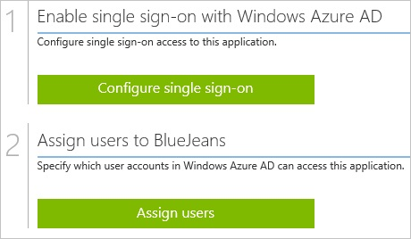
##Enabling the application integration for BlueJeans

The objective of this section is to outline how to enable the application integration for BlueJeans.

###To enable the application integration for BlueJeans, perform the following steps:

1.  In the Azure classic portal, on the left navigation pane, click **Active Directory**.

    

2.  From the **Directory** list, select the directory for which you want to enable directory integration.

3.  To open the applications view, in the directory view, click **Applications** in the top menu.

    

4.  Click **Add** at the bottom of the page.

    

5.  On the **What do you want to do** dialog, click **Add an application from the gallery**.

    

6.  In the **search box**, type **BlueJeans**.

    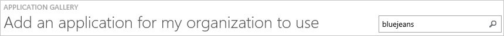

7.  In the results pane, select **BlueJeans**, and then click **Complete** to add the application.

    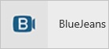
##Configuring single sign-on

The objective of this section is to outline how to enable users to authenticate to BlueJeans with their account in Azure AD using federation based on the SAML protocol.

###To configure single sign-on, perform the following steps:

1.  In the Azure classic portal, on the **BlueJeans** application integration page, click **Configure single sign-on** to open the **Configure Single Sign On ** dialog.

    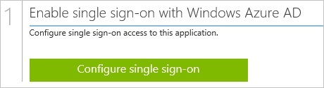

2.  On the **How would you like users to sign on to BlueJeans** page, select **Microsoft Azure AD Single Sign-On**, and then click **Next**.

    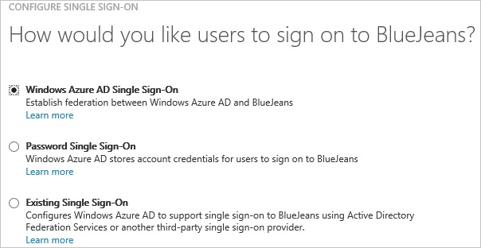

3.  On the **Configure App URL** page, in the **BlueJeans Sign On URL** textbox, type your URL using the following pattern "*https://company.BlueJeans.com*", and then click **Next**.

    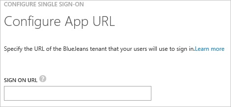

4.  On the **Configure single sign-on at BlueJeans** page, to download your certificate, click **Download certificate**, and then save the certificate file on your computer.

    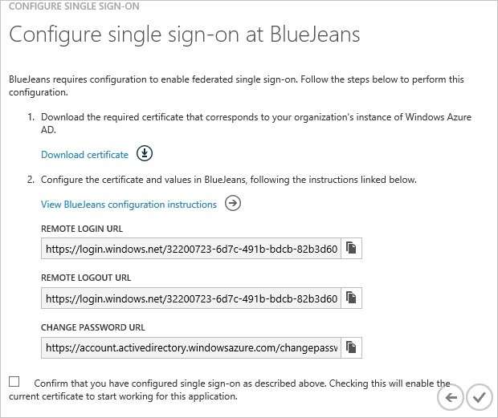

5.  In a different web browser window, log into your **BlueJeans** company site as an administrator.

6.  Go to **ADMIN \> Group Settings \> Security**.

    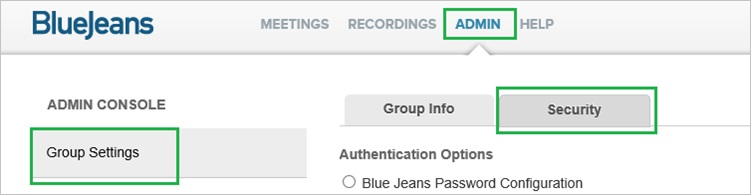

7.  In the **Security** section, perform the following steps:

    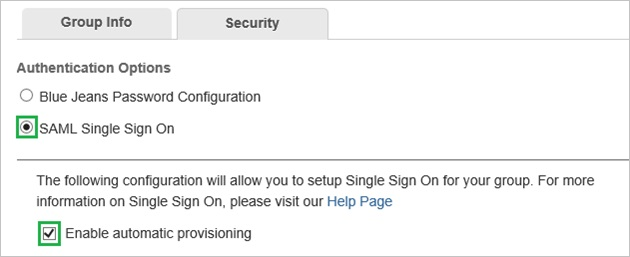

    1.  Select **SAML Single Sign On**.
    2.  Select **Enable automatic provisioning**.

8.  Move on with the following steps:

    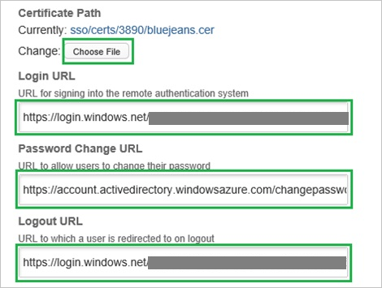

    1.  Click **Choose File**, and then upload the downloaded certificate.
    2.  In the Azure classic portal, on the **Configure single sign-on at BlueJeans** dialog page, copy the **Remote Login URL** value, and then paste it into the **Login URL** textbox.
    3.  In the Azure classic portal, on the **Configure single sign-on at BlueJeans** dialog page, copy the **Change Password URL** value, and then paste it into the **Password Change URL** textbox.
    4.  In the Azure classic portal, on the **Configure single sign-on at BlueJeans** dialog page, copy the **Remote Logout URL** value, and then paste it into the **Logout URL** textbox.

9.  Move on with the following steps:

    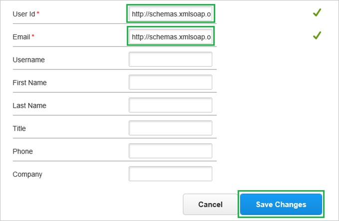

    1.  In the **User id** textbox, type **http://schemas.xmlsoap.org/ws/2005/05/identity/claims/name**.
    2.  In the **Email** textbox, type **http://schemas.xmlsoap.org/ws/2005/05/identity/claims/name**.
    3.  Click **Save Changes**.

10. On the Azure classic portal, select the single sign-on configuration confirmation, and then click **Complete** to close the **Configure Single Sign On** dialog.

    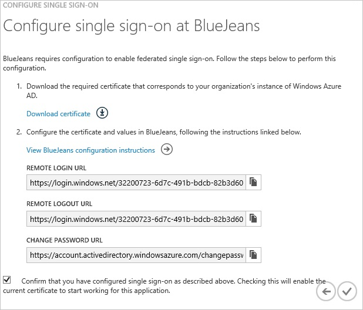
##Configuring user provisioning

In order to enable Azure AD users to log into BlueJeans, they must be provisioned into BlueJeans.  
In the case of BlueJeans, provisioning is a manual task.

###To provision a user accounts, perform the following steps:

1.  Log in to your **BlueJeans** company site as an administrator.

2.  Go to **ADMIN \> Manage Users \> Add User**.

    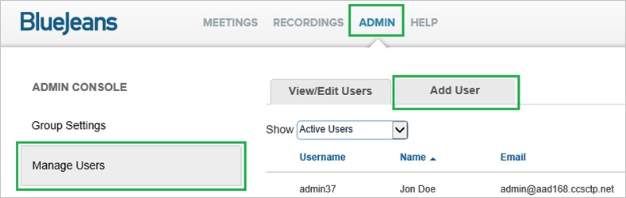

    >[AZURE.IMPORTANT] The **Add User** tab is only available if, in the **Security tab**, **Enable automatic provisioning** is unchecked.

3.  In the **Add User** section, perform the following steps:

    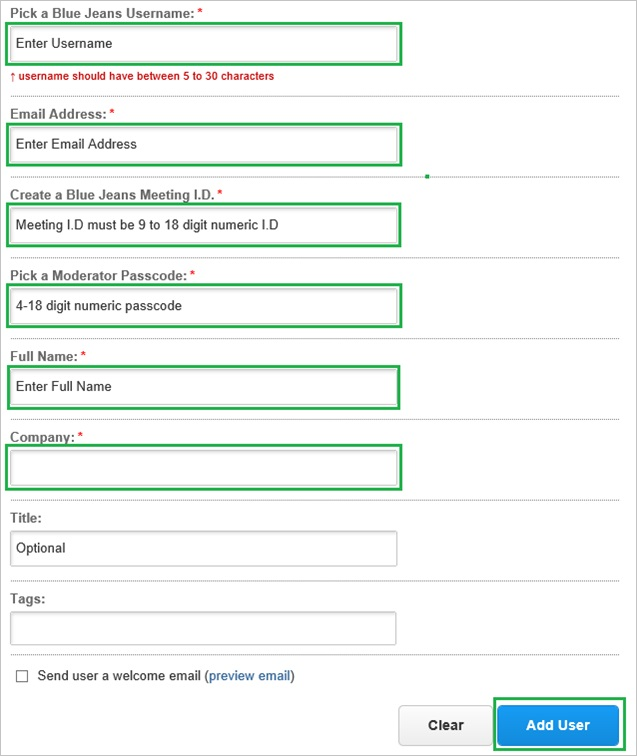

    1.  Type a **BlueJeans Username**, an **Email address**, a **BlueJeans Meeting ID**, a **Moderator Passcode**, a **Full Name**, the **Company** of a valid AAD account you want to provision into the related textboxes.
    2.  Click **Add User**.

>[AZURE.NOTE] You can use any other BlueJeans user account creation tools or APIs provided by BlueJeans to provision AAD user accounts.

##Assigning users

To test your configuration, you need to grant the Azure AD users you want to allow using your application access to it by assigning them.

###To assign users to BlueJeans, perform the following steps:

1.  In the Azure classic portal, create a test account.

2.  On the **BlueJeans **application integration page, click **Assign users**.

    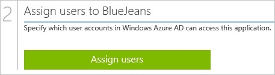

3.  Select your test user, click **Assign**, and then click **Yes** to confirm your assignment.

    

If you want to test your single sign-on settings, open the Access Panel. For more details about the Access Panel, see [Introduction to the Access Panel](active-directory-saas-access-panel-introduction.md).
