<properties pageTitle="Tutorial: Azure Active Directory Integration with Bonus.ly | Microsoft Azure" description="Learn how to use Bonus.ly with Azure Active Directory to enable single sign-on, automated provisioning, and more!." services="active-directory" authors="MarkusVi" documentCenter="na" manager="stevenpo"/>
<tags ms.service="active-directory" ms.devlang="na" ms.topic="article" ms.tgt_pltfrm="na" ms.workload="identity" ms.date="08/01/2015" ms.author="markvi" />
#Tutorial: Azure Active Directory Integration with Bonus.ly
>[AZURE.TIP]For feedback, click [here](http://go.microsoft.com/fwlink/?LinkId=523806).

The objective of this tutorial is to show the integration of Azure and Bonus.ly. The scenario outlined in this tutorial assumes that you already have the following items:

-   A valid Azure subscription
-   A test tenant in Bonus.ly

The scenario outlined in this tutorial consists of the following building blocks:

1.  Enabling the application integration for Bonus.ly
2.  Configuring single sign-on
3.  Configuring user provisioning
4.  Assigning users

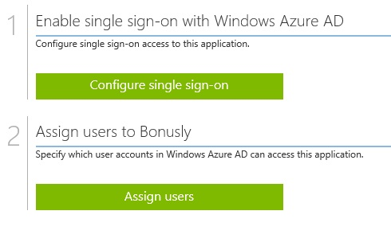
##Enabling the application integration for Bonus.ly

The objective of this section is to outline how to enable the application integration for Bonus.ly.

###To enable the application integration for Bonus.ly, perform the following steps:

1.  In the Azure Management Portal, on the left navigation pane, click **Active Directory**.

    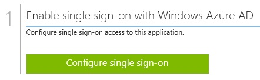

2.  From the **Directory** list, select the directory for which you want to enable directory integration.

3.  To open the applications view, in the directory view, click **Applications** in the top menu.

    

4.  Click **Add** at the bottom of the page.

    

5.  On the **What do you want to do** dialog, click **Add an application from the gallery**.

    

6.  In the **search box**, type **Bonus.ly**.

    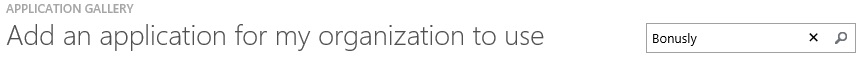

7.  In the results pane, select **Bonus.ly**, and then click **Complete** to add the application.

    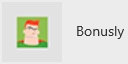
##Configuring single sign-on

The objective of this section is to outline how to enable users to authenticate to Bonus.ly with their account in Azure AD using federation based on the SAML protocol.  
Configuring single sign-on for Bonus.ly requires you to retrieve a thumbprint value from a certificate.  
If you are not familiar with this procedure, see [How to retrieve a certificate's thumbprint value](http://youtu.be/YKQF266SAxI).

###To configure single sign-on, perform the following steps:

1.  In the Azure AD portal, on the **Bonus.ly** application integration page, click **Configure single sign-on** to open the **Configure Single Sign On ** dialog.

    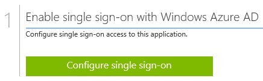

2.  On the **How would you like users to sign on to Bonus.ly** page, select **Windows Azure AD Single Sign-On**, and then click **Next**.

    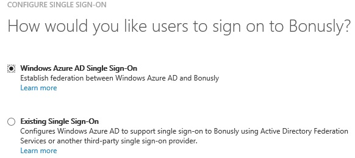

3.  On the **Configure App URL** page, in the **Bonus.ly Tenant URL** textbox, type your URL using the following pattern "*https://\<tenant-name\>.Bonus.ly*", and then click **Next**: 

    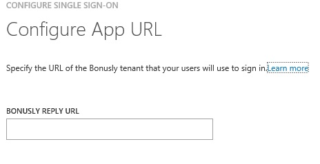

4.  On the **Configure single sign-on at Bonus.ly** page, click **download Certificate**, and then save the certificate file locally as **c:\\Bonusly.cer**.

    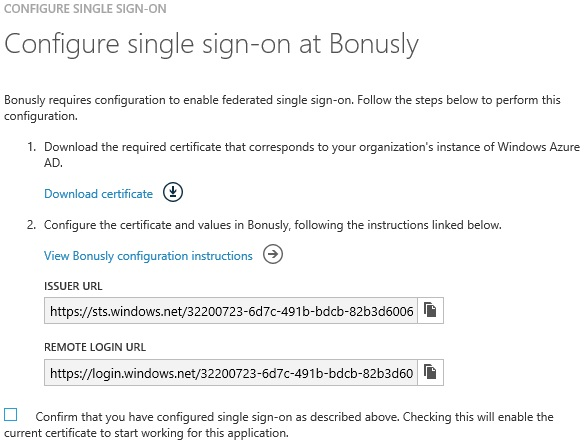

5.  In a different browser window, log in to your **Bonus.ly** tenant.

6.  In the toolbar on the top, click **Settings**, and then select **Integrations and apps**.

    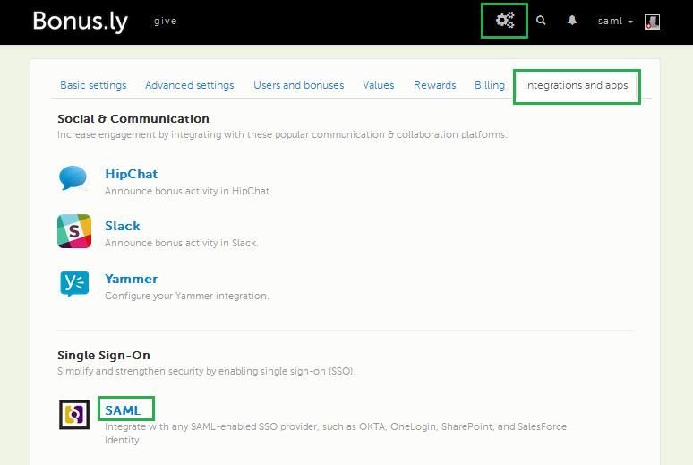

7.  Under **Single Sign-On**, select **SAML**.

8.  On the **SAML** dialog page, perform the following steps:

    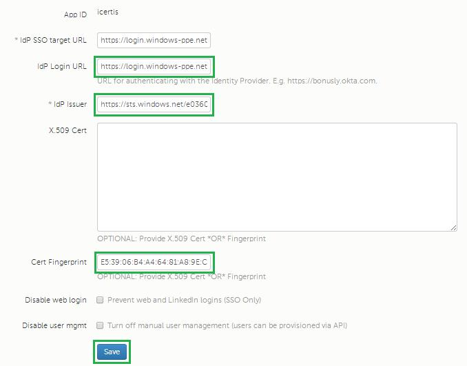

    1.  In the Azure portal, on the **Configure single sign-on at Bonus.ly** dialog page, copy the **Remote Login URL** value, and then paste it into the **IdP SSO target URL** textbox.
    2.  In the Azure portal, on the **Configure single sign-on at Bonus.ly** dialog page, copy the **Issuer ID** value, and then paste it into the **IdP Issuer** textbox.
    3.  In the Azure portal, on the **Configure single sign-on at Bonus.ly** dialog page, copy the **Remote Login URL** value, and then paste it into the **IdP Login URL** textbox.
    4.  Copy the **Thumbprint** value from the exported certificate, and then paste it into the **Cert Fingerprint** textbox.

        >[AZURE.TIP] For more details, see [How to retrieve a certificate's thumbprint value](http://youtu.be/YKQF266SAxI)

9.  Click **save**.

10. On the Windows Azure AD portal, select the configuration confirmation, and then click **Complete** to close the **Configure Single Sign On** dialog.

    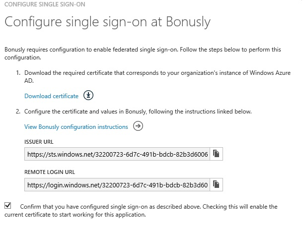
##Configuring user provisioning

In order to enable Azure AD users to log into Bonus.ly, they must be provisioned into Bonus.ly.  
In the case of Bonus.ly, provisioning is a manual task.

###To configure user provisioning, perform the following steps:

1.  In a web browser window, log into your Bonus.ly tenant.

2.  Click **Settings**

    

3.  Click the **Users and bonuses** tab.

    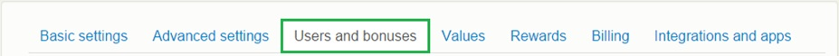

4.  Click **Manage Users**.

    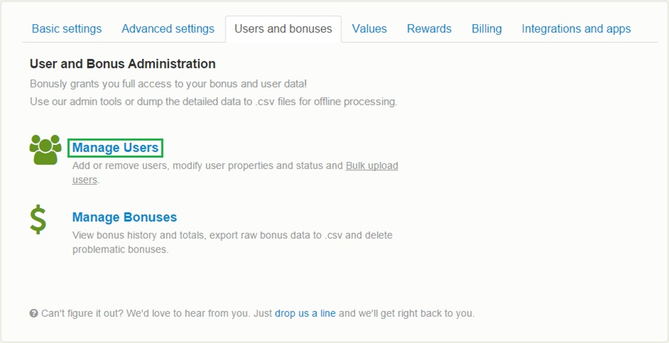

5.  Click **Add User**.

    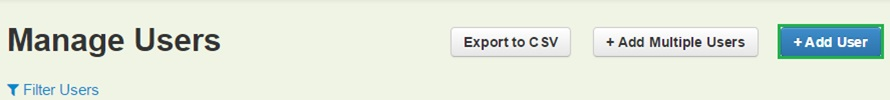

6.  On the **Add User** dialog, perform the following steps:

    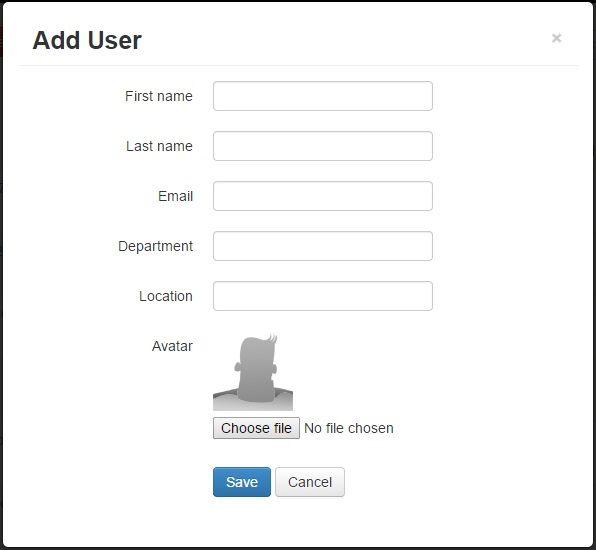

    1.  Type the “**Email**, **First name**, **Last name**” of a valid AAD account you want to provision into the related textboxes.
    2.  Click **Save**.

    >[AZURE.NOTE] The AAD account holder will receive an email that includes a link to confirm the account before it becomes active.

>[AZURE.NOTE] You can use any other Bonus.ly user account creation tools or APIs provided by Bonus.ly to provision AAD user accounts.

##Assigning users

To test your configuration, you need to grant the Azure AD users you want to allow using your application access to it by assigning them.

###To assign users to Bonus.ly, perform the following steps:

1.  In the Azure AD portal, create a test account.

2.  On the Bonus.ly application integration page, click **Assign users**.

    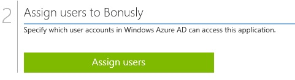

3.  Select your test user, click **Assign**, and then click **Yes** to confirm your assignment.

    

If you want to test your single sign-on settings, open the Access Panel. For more details about the Access Panel, see [Introduction to the Access Panel](https://msdn.microsoft.com/library/dn308586).
