<properties 
    pageTitle="Tutorial: Azure Active Directory integration with Boomi | Microsoft Azure" 
    description="Learn how to use Boomi with Azure Active Directory to enable single sign-on, automated provisioning, and more!" 
    services="active-directory" 
    authors="jeevansd"  
    documentationCenter="na" 
    manager="femila"/>
<tags 
    ms.service="active-directory" 
    ms.devlang="na" 
    ms.topic="article" 
    ms.tgt_pltfrm="na" 
    ms.workload="identity" 
    ms.date="07/11/2016" 
    ms.author="jeedes" />

#Tutorial: Azure Active Directory integration with Boomi

The objective of this tutorial is to show the integration of Azure and Boomi.  
The scenario outlined in this tutorial assumes that you already have the following items:

-   A valid Azure subscription
-   A Boomi single sign-on enabled subscription

After completing this tutorial, the Azure AD users you have assigned to Boomi will be able to single sign into the application at your Boomi company site (service provider initiated sign on), or using the [Introduction to the Access Panel](active-directory-saas-access-panel-introduction.md).

The scenario outlined in this tutorial consists of the following building blocks:

1.  Enabling the application integration for Boomi
2.  Configuring single sign-on
3.  Configuring user provisioning
4.  Assigning users

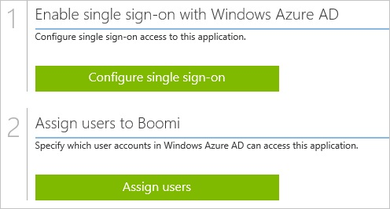
##Enabling the application integration for Boomi

The objective of this section is to outline how to enable the application integration for Boomi.

###To enable the application integration for Boomi, perform the following steps:

1.  In the Azure classic portal, on the left navigation pane, click **Active Directory**.

    

2.  From the **Directory** list, select the directory for which you want to enable directory integration.

3.  To open the applications view, in the directory view, click **Applications** in the top menu.

    

4.  Click **Add** at the bottom of the page.

    

5.  On the **What do you want to do** dialog, click **Add an application from the gallery**.

    

6.  In the **search box**, type **Boomi**.

    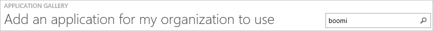

7.  In the results pane, select **Boomi**, and then click **Complete** to add the application.

    
##Configuring single sign-on

The objective of this section is to outline how to enable users to authenticate to Boomi with their account in Azure AD using federation based on the SAML protocol.

###To configure single sign-on, perform the following steps:

1.  In the Azure classic portal, on the **Boomi** application integration page, click **Configure single sign-on** to open the **Configure Single Sign On ** dialog.

    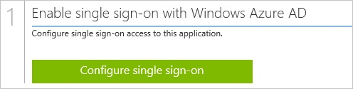

2.  On the **How would you like users to sign on to Boomi** page, select **Microsoft Azure AD Single Sign-On**, and then click **Next**.

    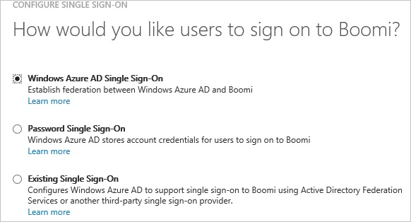

3.  On the **Configure App URL** page, in the **Boomi Reply URL** textbox, type your **Boomi AtomSphere Login URL** (e.g.: “*https://platform.boomi.com/sso/AccountName/saml*”), and then click **Next**.

    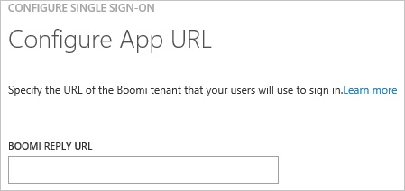

4.  On the **Configure single sign-on at Boomi** page, to download your certificate, click **Download certificate**, and then save the certificate file locally on your computer.

    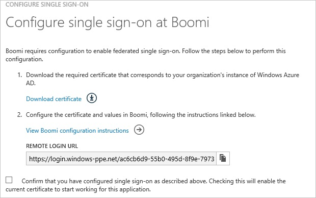

5.  In a different web browser window, log into your Boomi company site as an administrator.

6.  In the toolbar on the top, click your company name, and then **Setup**.

    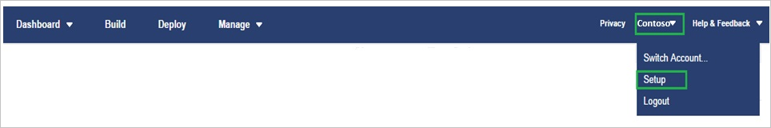

7.  Click **SSO Options**.

    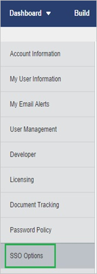

8.  In the **Single Sign-On Options** section, perform the following steps:

    

    1.  Select **Enable SAML Single Sign-On**.
    2.  Click **Import**, to upload the downloaded certificate.
    3.  In the Azure classic portal, on the **Configure single sign-on at Boomi** dialog page, copy the **Remote Login URL** value, and then paste it into the **Identity Provider Login URL** textbox.
    4.  As **Federation Id Location**, select **Federation Id is in NameID element of the Subject**.
    5.  Click **Save**.

9.  On the Azure classic portal, select the single sign-on configuration confirmation, and then click **Complete** to close the **Configure Single Sign On** dialog.

    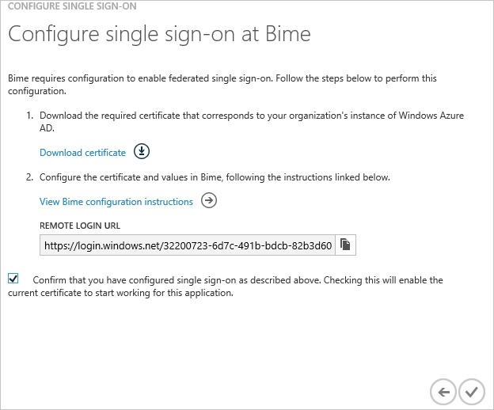
##Configuring user provisioning

In order to enable Azure AD users to log into Boomi, they must be provisioned into Boomi.  
In the case of Boomi, provisioning is a manual task.

###To configure user provisioning, perform the following steps:

1.  Log in to your **Boomi** company site as administrator.

2.  Go to **User Management \> Users**.

    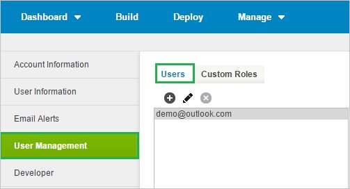

3.  Click **Add User**.

    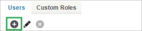

4.  On the **Add User Roles** dialog page, perform the following steps:

    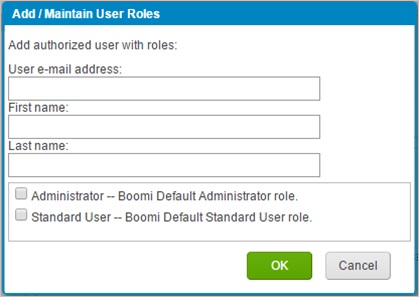

    1.  Type the **First Name**, **Last Name** and **Email** of a valid AAD account you want to provision into the related textboxes.
    2.  Click OK.

>[AZURE.NOTE] You can use any other Boomi user account creation tools or APIs provided by Boomi to provision AAD user accounts.

##Assigning users

To test your configuration, you need to grant the Azure AD users you want to allow using your application access to it by assigning them.

###To assign users to Boomi, perform the following steps:

1.  In the Azure classic portal, create a test account.

2.  On the **Boomi **application integration page, click **Assign users**.

    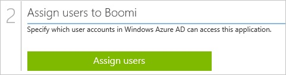

3.  Select your test user, click **Assign**, and then click **Yes** to confirm your assignment.

    

If you want to test your single sign-on settings, open the Access Panel. For more details about the Access Panel, see [Introduction to the Access Panel](active-directory-saas-access-panel-introduction.md).
