<properties 
    pageTitle="Tutorial: Azure Active Directory integration with Box | Microsoft Azure" 
    description="Learn how to use Box with Azure Active Directory to enable single sign-on, automated provisioning, and more!" 
    services="active-directory" 
    authors="jeevansd"  
    documentationCenter="na" 
    manager="femila"/>
<tags 
    ms.service="active-directory" 
    ms.devlang="na" 
    ms.topic="article" 
    ms.tgt_pltfrm="na" 
    ms.workload="identity" 
    ms.date="07/13/2016" 
    ms.author="jeedes" />

#Tutorial: Azure Active Directory integration with Box

  
The objective of this tutorial is to show the integration of Azure and Box.  
The scenario outlined in this tutorial assumes that you already have the following items:

-   A valid Azure subscription
-   A test tenant in Box
  
After completing this tutorial, the Azure AD users you have assigned to Box will be able to single sign into the application at your Box company site (service provider initiated sign on), or using the [Introduction to the Access Panel](active-directory-saas-access-panel-introduction.md).
  
The scenario outlined in this tutorial consists of the following building blocks:

1.  Enabling the application integration for Box
2.  Configuring single sign-on
3.  Configuring user and group provisioning
4.  Assigning users

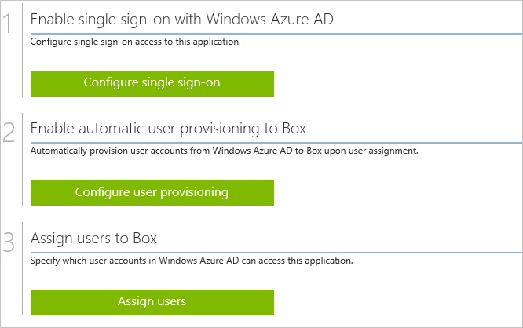

##Enabling the application integration for Box
  
The objective of this section is to outline how to enable the application integration for Box.

###To enable the application integration for Box, perform the following steps:

1.  In the Azure classic portal, on the left navigation pane, click **Active Directory**.

    

2.  From the **Directory** list, select the directory for which you want to enable directory integration.

3.  To open the applications view, in the directory view, click **Applications** in the top menu.

    

4.  Click **Add** at the bottom of the page.

    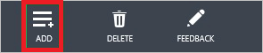

5.  On the **What do you want to do** dialog, click **Add an application from the gallery**.

    

6.  In the **search box**, type **Box**.

    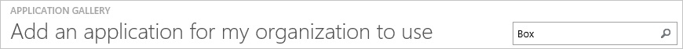

7.  In the results pane, select **box**, and then click **Complete** to add the application.

    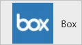

##Configuring single sign-on
  
The objective of this section is to outline how to enable users to authenticate to Box with their account in Azure AD using federation based on the SAML protocol. 
As part of this procedure, you are required to upload metadata to Box.com.

###To configure single sign-on, perform the following steps:

1.  In the Azure classic portal, on the **Box** application integration page, click **Configure single sign-on** to open the **Configure Single Sign On ** dialog.

    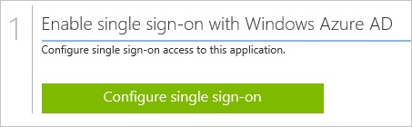

2.  On the **How would you like users to sign on to Box** page, select **Microsoft Azure AD Single Sign-On**, and then click **Next**.

    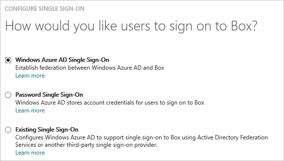

3.  On the **Configure App URL** page, in the **Box Tenant URL** textbox, type your Box tenant URL (e.g.: https://<mydomainname>.box.com), and then click **Next**.

    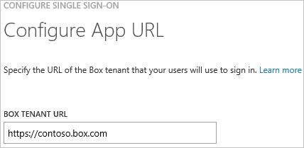

4.  On the **Configure single sign-on at Box** page, to download your metadata, click **Download metadata**, and then the data file locally on your computer.

    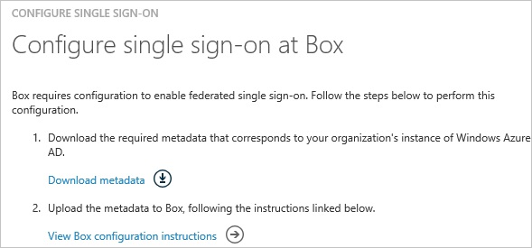

5.  Forward that metadata file to Box support team. The support team needs configures single sign-on for you.

6.  Select the single sign-on configuration confirmation, and then click **Complete** to close the **Configure Single Sign On** dialog.

    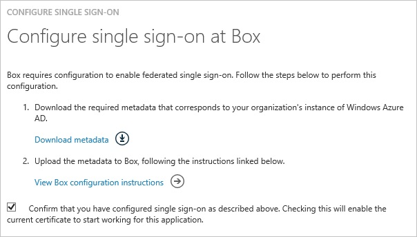
##Configuring user provisioning
  
The objective of this section is to outline how to enable provisioning of Active Directory user accounts to Box.

###To configure single sign-on, perform the following steps:

1. In the Azure classic portal, on the **Box** application integration page, click **Configure user provisioning** to open the **Configure User Provisioning** dialog. 

	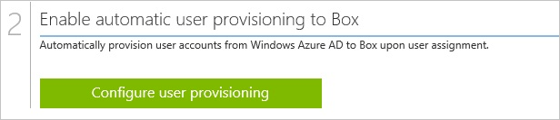

2. On the **Enable user provisioning to Box** dialog page, click **Enable user provisioning**. 

	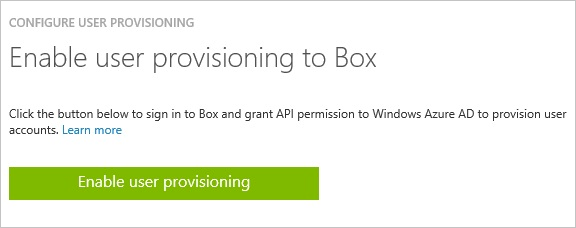

3. On the **Log in to grant access to Box** page, provide the required credentials, and then click **Authorize**. 

	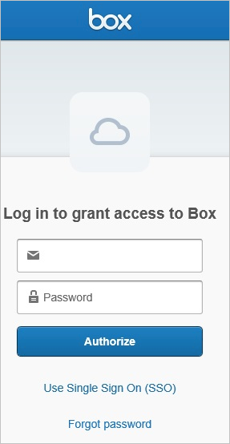

4. Click **Grant access to Box** to authorize this operation and to return to the Azure classic portal. 

	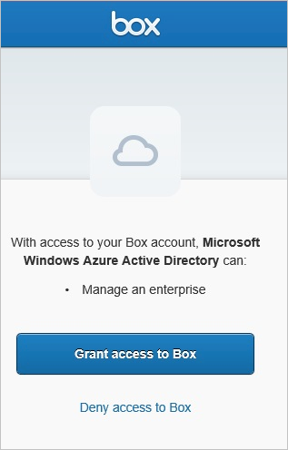

5. On the **Provisioning Options** page, the **Object types to provision** checkboxes allow you to select whether or not group objects are provisioned to Box in addition to user objects.  See "Assigning users and groups section" below for more information.

6. To finish the configuration, click the Complete button. 

	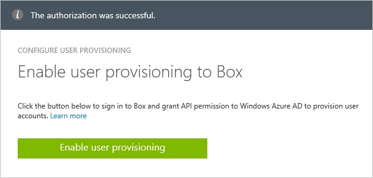

##Assigning a test user
  
To test your configuration, you need to grant the Azure AD users you want to allow using your application access to it by assigning them.

###To assign users to Box, perform the following steps:

1. In the Azure classic portal, create a test account.

2. On the **Box **application integration page, click **Assign users**. 

	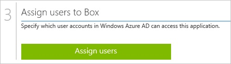

3.  Select your test user, click **Assign**, and then click **Yes** to confirm your assignment. 

	
  
You should now wait for 10 minutes and verify that the account has been synchronized to Box.

As a first verification step, you can check the provisioning status, by clicking Dashboard in the D on the Box application integration page on the Azure classic portal.

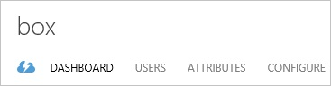

A successfully completed user provisioning cycle is indicated by a related status:

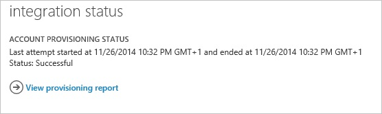

In your Box tenant, synchronized users are listed under **Managed Users** in the **Admin Console**.

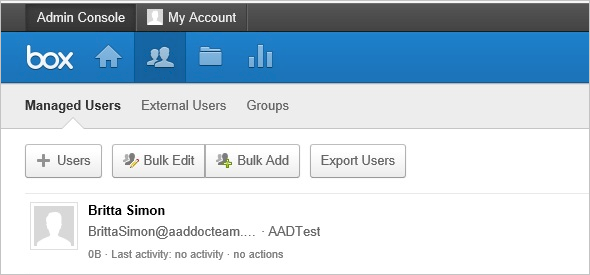

##Assigning users and groups

The **Box > Users and Groups** tab in the Azure classic portal allows you to specify which users and groups should be granted access to Box. Assignment of a user or group causes the following things to occur:

* Azure AD permits the assigned user (either by direct assignment or group membership) to authenticate to Box. If a user is not assigned, then Azure AD will not permit them to sign in to Box and will return an error on the Azure AD sign-in page.

* An app tile for Box is added to the user's [application launcher](active-directory-appssoaccess-whatis.md#deploying-azure-ad-integrated-applications-to-users).

* If automatic provisioning is enabled, then the assigned users and/or groups are added to the provisioning queue to be automatically provisioned.

    * If only user objects were configured to be provisioned, then all directly-assigned users are placed in the provisioning queue, and all users that are members of any assigned groups will be placed in the provisioning queue. 
    
    * If group objects were configured to be provisioned, then all assigned group objects are provisioned to Box, as well as all users that are members of those groups. The group and user memberships are preserved upon being written to Box.
    
You can use the **Attributes > Single Sign-On** tab to configure which user attributes (or claims) are presented to Box during SAML-based authentication, and the **Attributes > Provisioning** tab to configure how user and group attributes flow from Azure AD to Box during provisioning operations. See the resources below for more information.

## Additional Resources

* [Customizing claims issued in the SAML token](active-directory-saml-claims-customization.md)
* [Provisioning: Customize Attribute Mappings](active-directory-saas-customizing-attribute-mappings.md)
* [List of Tutorials on How to Integrate SaaS Apps with Azure Active Directory](active-directory-saas-tutorial-list.md)
* [What is application access and single sign-on with Azure Active Directory?](active-directory-appssoaccess-whatis.md)
