<properties
    pageTitle="Tutorial: Azure Active Directory Integration with Canvas LMS | Microsoft Azure" 
    description="Learn how to use Canvas LMS with Azure Active Directory to enable single sign-on, automated provisioning, and more!" 
    services="active-directory" 
    authors="jeevansd"  
    documentationCenter="na" 
    manager="femila"/>
<tags 
    ms.service="active-directory" 
    ms.devlang="na" 
    ms.topic="article" 
    ms.tgt_pltfrm="na" 
    ms.workload="identity" 
    ms.date="07/11/2016" 
    ms.author="jeedes" />

#Tutorial: Azure Active Directory Integration with Canvas LMS

The objective of this tutorial is to show the integration of Azure and Canvas.  
The scenario outlined in this tutorial assumes that you already have the following items:

-   A valid Azure subscription
-   A Canvas tenant

After completing this tutorial, the Azure AD users you have assigned to Canvas will be able to single sign into the application at your Canvas company site (service provider initiated sign on), or using the [Introduction to the Access Panel](active-directory-saas-access-panel-introduction.md).

The scenario outlined in this tutorial consists of the following building blocks:

1.  Enabling the application integration for Canvas
2.  Configuring single sign-on
3.  Configuring user provisioning
4.  Assigning users

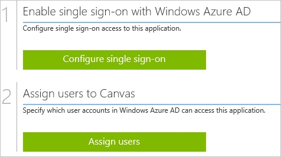
##Enabling the application integration for Canvas

The objective of this section is to outline how to enable the application integration for Canvas.

###To enable the application integration for Canvas, perform the following steps:

1.  In the Azure classic portal, on the left navigation pane, click **Active Directory**.

    

2.  From the **Directory** list, select the directory for which you want to enable directory integration.

3.  To open the applications view, in the directory view, click **Applications** in the top menu.

    

4.  Click **Add** at the bottom of the page.

    

5.  On the **What do you want to do** dialog, click **Add an application from the gallery**.

    

6.  In the **search box**, type **Canvas**.

    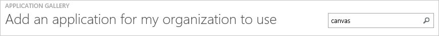

7.  In the results pane, select **Canvas**, and then click **Complete** to add the application.

    
##Configuring single sign-on

The objective of this section is to outline how to enable users to authenticate to Canvas with their account in Azure AD using federation based on the SAML protocol.  
Configuring single sign-on for Canvas requires you to retrieve a thumbprint value from a certificate.  
If you are not familiar with this procedure, see [How to retrieve a certificate's thumbprint value](http://youtu.be/YKQF266SAxI)

###To configure single sign-on, perform the following steps:

1.  In the Azure classic portal, on the **Canvas** application integration page, click **Configure single sign-on** to open the **Configure Single Sign On ** dialog.

    

2.  On the **How would you like users to sign on to Canvas** page, select **Microsoft Azure AD Single Sign-On**, and then click **Next**.

    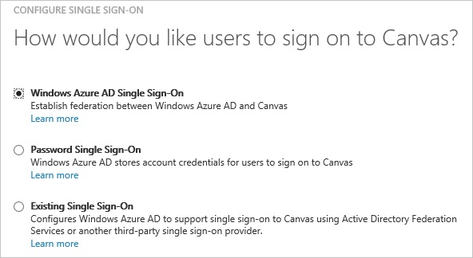

3.  On the **Configure App URL** page, in the **Canvas Sign In URL** textbox, type your URL using the following pattern `https://<tenant-name>.instructure.com`, and then click **Next**.

    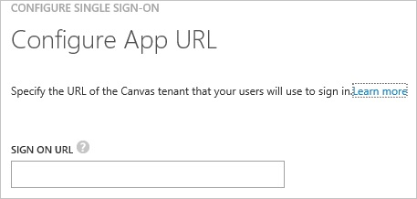

4.  On the **Configure single sign-on at Canvas** page, to download your certificate, click **Download certificate**, and then save the certificate file locally on your computer.

    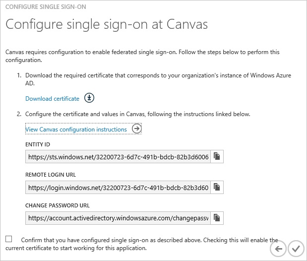

5.  In a different web browser window, log into your Canvas company site as an administrator.

6.  Go to **Courses \> Managed Accounts \> Microsoft**.

    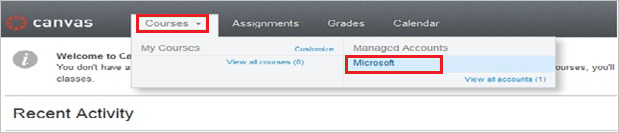

7.  In the navigation pane on the left, select **Authentication**, and then click **Add New SAML Config**.

    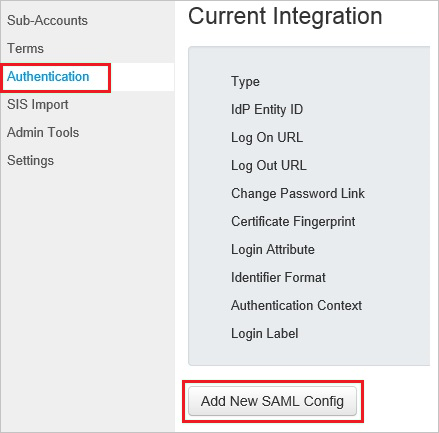

8.  On the Current Integration page, perform the following steps:

    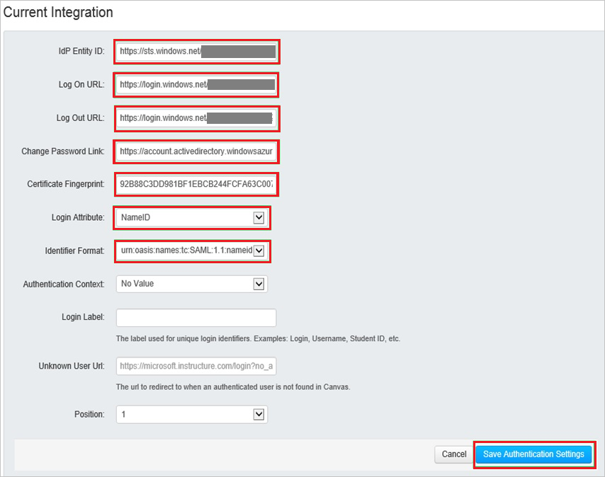

    1.  In the Azure classic portal, on the **Configure single sign-on at Canvas** dialog page, copy the **Entity ID** value, and then paste it into the **IdP Entity ID** textbox.
    2.  In the Azure classic portal, on the **Configure single sign-on at Canvas** dialog page, copy the **Remote Login URL** value, and then paste it into the **Log On URL** textbox.
    3.  In the Azure classic portal, on the **Configure single sign-on at Canvas** dialog page, copy the **Remote Login URL** value, and then paste it into the **Log Out URL** textbox.
    4.  In the Azure classic portal, on the **Configure single sign-on at Canvas** dialog page, copy the **Change Password URL** value, and then paste it into the **Change Password Link** textbox.
    5.  Copy the **Thumbprint** value from the exported certificate, and then paste it into the **Certificate Fingerprint** textbox.  

        >[AZURE.TIP] For more details, see [How to retrieve a certificate's thumbprint value](http://youtu.be/YKQF266SAxI)

    6.  From the **Login Attribute** list, select **NameID**.
    7.  From the **Identifier Format** list, select **emailAddress**.
    8.  Click **Save Authentication Settings**.

9.  On the Azure classic portal, select the single sign-on configuration confirmation, and then click **Complete** to close the **Configure Single Sign On** dialog.

    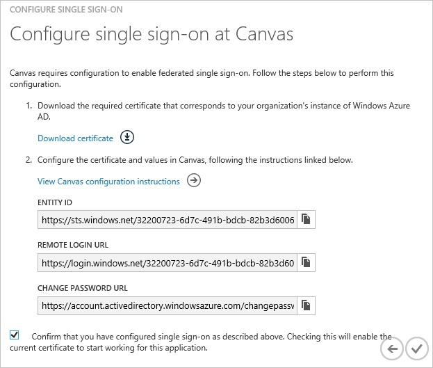
##Configuring user provisioning

In order to enable Azure AD users to log into Canvas, they must be provisioned into Canvas.  
In the case of Canvas, provisioning is a manual task.

###To provision a user accounts, perform the following steps:

1.  Log in to your **Canvas** tenant.

2.  Go to **Courses \> Managed Accounts \> Microsoft**.

    

3.  Click **Users**.

    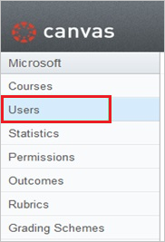

4.  Click **Add New User**.

    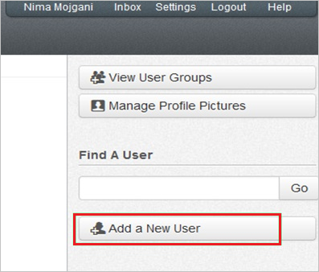

5.  On the Add a New User dialog page, perform the following steps:

    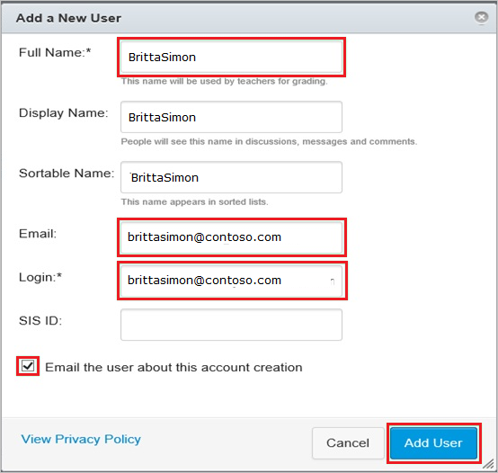

    1.  In the **Full Name** textbox, type the user’s name.
    2.  In the **Email** textbox, type the user’s email address.
    3.  In the **Login** textbox, type the user’s Azure AD email address.
    4.  Select **Email the user about this account creation**.
    5.  Click **Add User**.

>[AZURE.NOTE] You can use any other Canvas user account creation tools or APIs provided by Canvas to provision AAD user accounts.

##Assigning users

To test your configuration, you need to grant the Azure AD users you want to allow using your application access to it by assigning them.

###To assign users to Canvas, perform the following steps:

1.  In the Azure classic portal, create a test account.

2.  On the **Canvas **application integration page, click **Assign users**.

    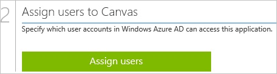

3.  Select your test user, click **Assign**, and then click **Yes** to confirm your assignment.

    

If you want to test your single sign-on settings, open the Access Panel. For more details about the Access Panel, see [Introduction to the Access Panel](active-directory-saas-access-panel-introduction.md).
