<properties 
    pageTitle="Tutorial: Azure Active Directory integration with Central Desktop | Microsoft Azure" 
    description="Learn how to use Central Desktop with Azure Active Directory to enable single sign-on, automated provisioning, and more!" 
    services="active-directory" 
    authors="jeevansd"  
    documentationCenter="na" 
    manager="femila"/>
<tags 
    ms.service="active-directory" 
    ms.devlang="na" 
    ms.topic="article" 
    ms.tgt_pltfrm="na" 
    ms.workload="identity" 
    ms.date="07/11/2016" 
    ms.author="jeedes" />

#Tutorial: Azure Active Directory integration with Central Desktop

The objective of this tutorial is to show the integration of Azure and Central Desktop. The scenario outlined in this tutorial assumes that you already have the following items:

-   A valid Azure subscription
-   A Central desktop single sign on enabled subscription / Central desktop tenant

The scenario outlined in this tutorial consists of the following building blocks:

1.  Enabling the application integration for Central Desktop
2.  Configuring single sign-on
3.  Configuring user provisioning
4.  Assigning users

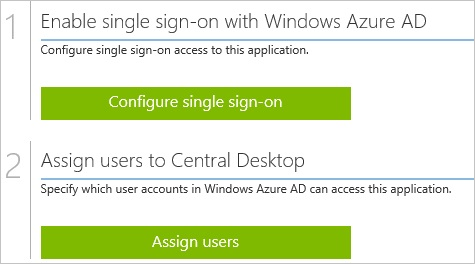
##Enabling the application integration for Central Desktop

The objective of this section is to outline how to enable the application integration for Central Desktop.

###To enable the application integration for Central Desktop, perform the following steps:

1.  In the Azure classic portal, on the left navigation pane, click **Active Directory**.

    

2.  From the **Directory** list, select the directory for which you want to enable directory integration.

3.  To open the applications view, in the directory view, click **Applications** in the top menu.

    

4.  Click **Add** at the bottom of the page.

    

5.  On the **What do you want to do** dialog, click **Add an application from the gallery**.

    

6.  In the **search box**, type **Central Desktop**.

    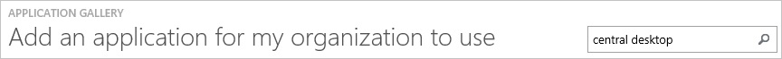

7.  In the results pane, select **Central Desktop**, and then click **Complete** to add the application.

    
##Configuring single sign-on

The objective of this section is to outline how to enable users to authenticate to Central Desktop with their account in Azure AD using federation based on the SAML protocol.  
As part of this procedure, you are required to upload a base-64 encoded certificate to your Central Desktop tenant.  
If you are not familiar with this procedure, see [How to convert a binary certificate into a text file](http://youtu.be/PlgrzUZ-Y1o).

###To configure single sign-on, perform the following steps:

1.  In the Azure classic portal, on the **Central Desktop** application integration page, click **Configure single sign-on** to open the **Configure Single Sign On ** dialog.

    

2.  On the **How would you like users to sign on to Central Desktop** page, select **Microsoft Azure AD Single Sign-On**, and then click **Next**.

    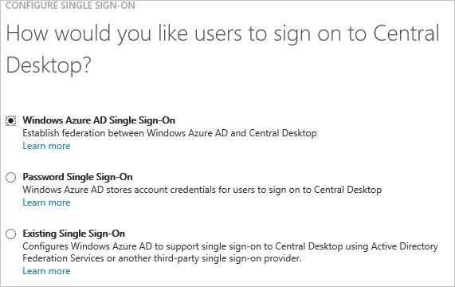

3.  On the **Configure App URL** page, perform the following steps, and then click **Next**: 

    -   In the **Central Desktop Sign In URL** textbox, type the URL of your Central Desktop tenant (e.g.: *http://contoso.centraldesktop.com*).
    -   In the Central  Desktop Reply URL textbox, type your Central Desktop AssertionConsumerService URL (e.g.:  https://contoso.centraldesktop.com/saml2-assertion.php).

    >[AZURE.NOTE] You can get the value from the central desktop metadata (e.g.: *http://contoso.centraldesktop.com*).

    

4.  On the **Configure single sign-on at Central Desktop** page, to download your certificate, click **Download certificate**, and then save the certificate file on your computer.

    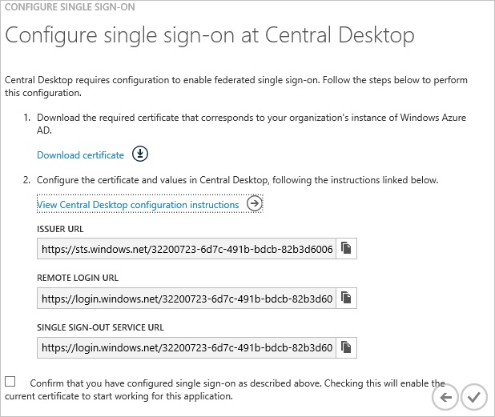

5.  Log in to your **Central Desktop** tenant.

6.  Go to **Settings**, click **Advanced**, and then click **Single Sign On**.

    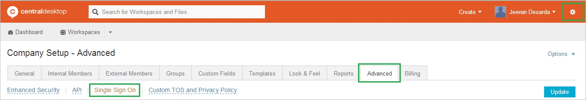

7.  On the **Single Sign On Settings** page, perform the following steps:

    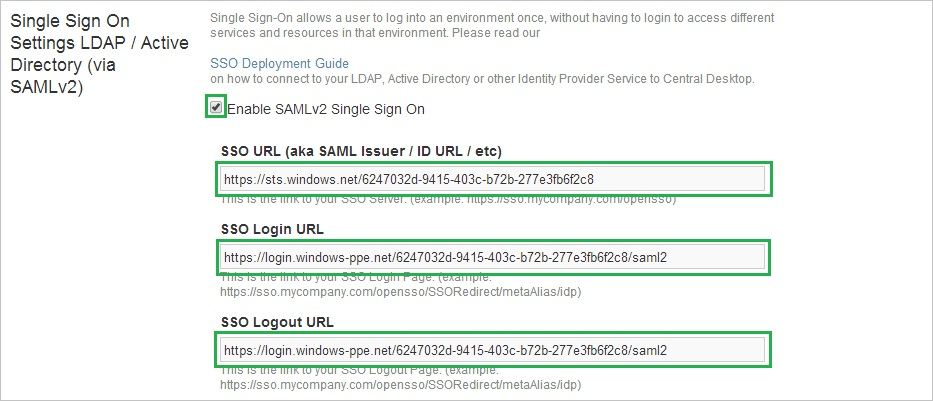

    1.  Select **Enable SAML v2 Single Sign On**.
    2.  In the Azure classic portal, on the **Configure single sign-on at Central Desktop** page, copy the **Issuer URL** value, and then paste it into the **SSO URL** textbox.
    3.  In the Azure classic portal, on the **Configure single sign-on at Central Desktop** page, copy the **Remote Login URL** value, and then paste it into the **SSO Login URL** textbox.
    4.  In the Azure classic portal, on the **Configure single sign-on at Central Desktop** page, copy the **Single Sign-Out Service URL** value, and then paste it into the **SSO Logout URL** textbox.

8.  In the **Message Signature Verification Method** section, perform the following steps:

    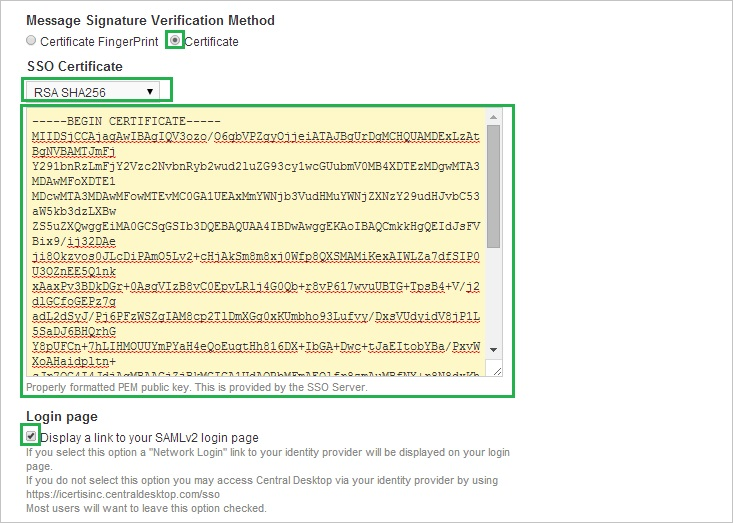

    1.  Select **Certificate**.
    2.  From the **SSO Certificate** list, select **RSH SHA256**.
    3.  Create a text file from the downloaded certificate, copy the content of the text file, and then paste it into the **SSO Certificate** field.  

        >[AZURE.TIP] For more details, see [How to convert a binary certificate into a text file](http://youtu.be/PlgrzUZ-Y1o)

    4.  Select **Display a link to your SAMLv2 login page**.

9.  Click **Update**.

10. On the Azure classic portal, select the single sign-on configuration confirmation, and then click **Complete** to close the **Configure Single Sign On** dialog.

    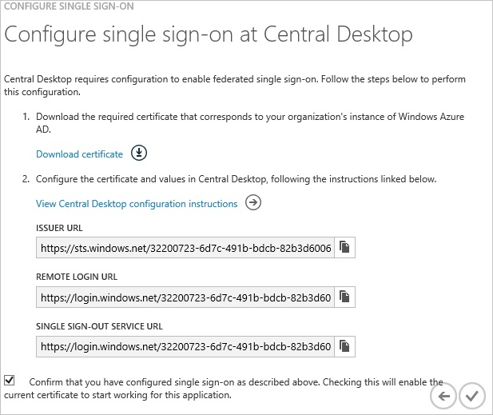
##Configuring user provisioning

For AAD users to be able to sign in, they must be provisioned to the Central Desktop application. This section describes how to create AAD user accounts in Central Desktop.

###To provision user accounts to Central Desktop:

1.  Log in to your Central Desktop tenant.

2.  Go to **People \> Internal Members**.

3.  Click **Add Internal Members**.

    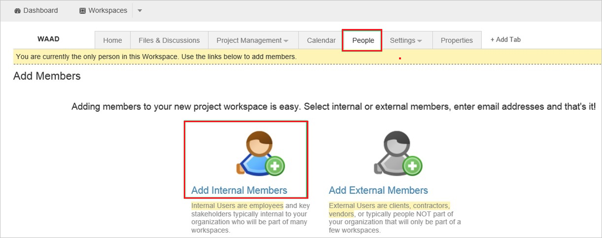

4.  In the **Email Address of New Members** textbox, type an AAD account you want to provision, and then click **Next**.

    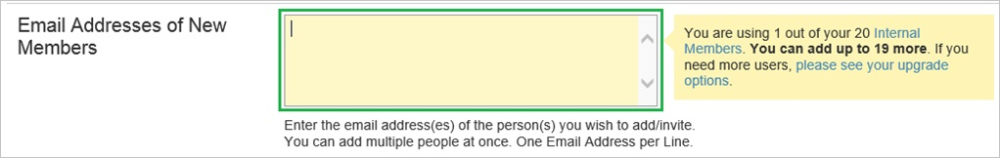

5.  Click **Add Internal member(s)**.

    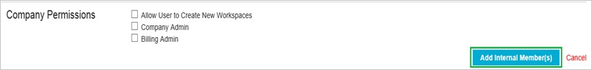

    >[AZURE.NOTE] The users you have added will receive an email that includes a confirmation link they need to click to activate the account.

>[AZURE.NOTE] You can use any other Central Desktop user account creation tools or APIs provided by Central Desktop to provision AAD user accounts

##Assigning users

To test your configuration, you need to grant the Azure AD users you want to allow using your application access to it by assigning them.

###To assign users to Central Desktop, perform the following steps:

1.  In the Azure classic portal, create a test account.

2.  On the **Central Desktop** application integration page, click **Assign users**.

    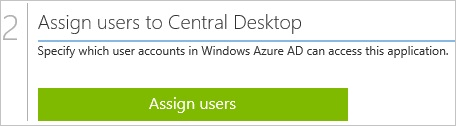

3.  Select your test user, click **Assign**, and then click **Yes** to confirm your assignment.

    

If you want to test your single sign-on settings, open the Access Panel. For more details about the Access Panel, see [Introduction to the Access Panel](active-directory-saas-access-panel-introduction.md).
