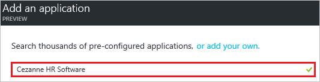
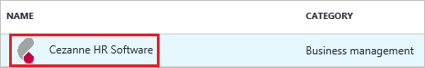
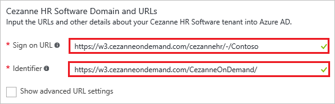
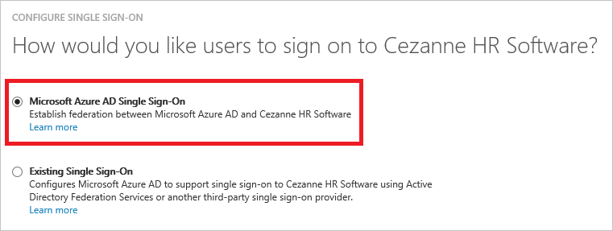
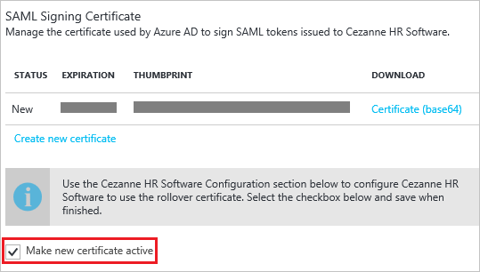
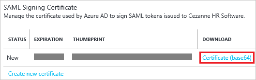
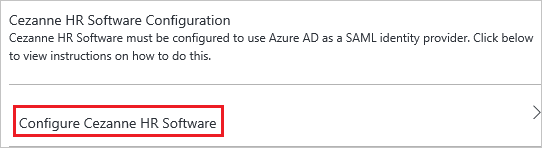
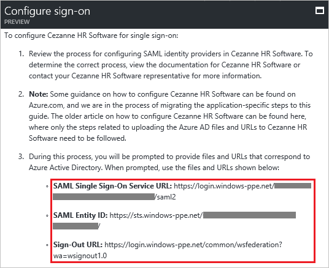
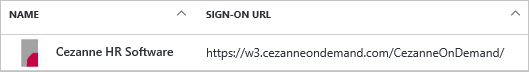

# Tutorial: Azure Active Directory integration with Cezanne HR Software

In this tutorial, you learn how to integrate Cezanne HR Software with Azure Active Directory (Azure AD).

Integrating Cezanne HR Software with Azure AD provides you with the following benefits:

- You can control in Azure AD who has access to Cezanne HR Software
- You can enable your users to automatically get signed-on to Cezanne HR Software single sign-on (SSO) with their Azure AD accounts
- You can manage your accounts in one central location - the Azure Management portal

If you want to know more details about SaaS app integration with Azure AD, see [What is application access and single sign-on with Azure Active Directory](active-directory-appssoaccess-whatis.md).

## Prerequisites

To configure Azure AD integration with Cezanne HR Software, you need the following items:

- An Azure AD subscription
- A Cezanne HR Software SSO enabled subscription

>[!NOTE]
>To test the steps in this tutorial, we do not recommend using a production environment.
>
>

To test the steps in this tutorial, you should follow these recommendations:

- You should not use your production environment, unless this is necessary.
- If you don't have an Azure AD trial environment, you can get a [one-month trial](https://azure.microsoft.com/pricing/free-trial/).

## Scenario description
In this tutorial, you test Azure AD single sign-on in a test environment. 
The scenario outlined in this tutorial consists of two main building blocks:

1. Adding Cezanne HR Software from the gallery
2. Configuring and testing Azure AD SSO

## Add Cezanne HR Software from the gallery
To configure the integration of Cezanne HR Software into Azure AD, you need to add Cezanne HR Software from the gallery to your list of managed SaaS apps.

**To add Cezanne HR Software from the gallery, perform the following steps:**

1. In the **[Azure Management Portal](https://portal.azure.com)**, on the left navigation panel, click **Azure Active Directory** icon. 

	![Active Directory][1]

2. Navigate to **Enterprise applications**. Then go to **All applications**.

	![Applications][2]
	
3. Click **Add** button on the top of the dialog.

	![Applications][3]

4. In the search box, type **Cezanne HR Software**.

	

5. In the results panel, select **Cezanne HR Software**, and then click **Add** button to add the application.

	

##  Configure and test Azure AD single sign-on
In this section, you configure and test Azure AD SSO with Cezanne HR Software based on a test user called "Britta Simon".

For SSO to work, Azure AD needs to know what the counterpart user in Cezanne HR Software is to a user in Azure AD. In other words, a link relationship between an Azure AD user and the related user in Cezanne HR Software needs to be established.

This link relationship is established by assigning the value of the **user name** in Azure AD as the value of the **Username** in Cezanne HR Software.

To configure and test Azure AD SSO with Cezanne HR Software, you need to complete the following building blocks:

1. **[Configuring Azure AD single sign-on](#configuring-azure-ad-single-sign-on)** - to enable your users to use this feature.
2. **[Creating an Azure AD test user](#creating-an-azure-ad-test-user)** - to test Azure AD single sign-on with Britta Simon.
3. **[Creating a Cezanne HR Software test user](#creating-a-cezanne-hr-software-test-user)** - to have a counterpart of Britta Simon in Cezanne HR Software that is linked to the Azure AD representation of her.
4. **[Assigning the Azure AD test user](#assigning-the-azure-ad-test-user)** - to enable Britta Simon to use Azure AD single sign-on.
5. **[Testing single sign-on](#testing-single-sign-on)** - to verify whether the configuration works.

### Configure Azure AD single sign-on

In this section, you enable Azure AD SSO in the Azure Management portal and configure single sign-on in your Cezanne HR Software application.

**To configure Azure AD SSO with Cezanne HR Software, perform the following steps:**

1. In the Azure Management portal, on the **Cezanne HR Software** application integration page, click **Single sign-on**.

	![Configure Single Sign-On][4]

2. On the **Single sign-on** dialog page, as **Mode** select **SAML-based Sign-on** to enable single sign on.
 
	

3. On the **Cezanne HR Software Domain and URLs** section perform the following steps:

	
  1. In the **Sign On URL** textbox, type a URL using the following pattern: `https://w3.cezanneondemand.com/cezannehr/-/<tenant id>`
  2. In the **Identifer** textbox, type: `https://w3.cezanneondemand.com/CezanneOnDemand/`

	 >[!NOTE] 
	 > These are not the real values. You have to update these values with the actual Sign On URL and Identifier. Here we suggest you to use the unique value of URL in the Identifier. Contact [Cezanne HR Software support team](mailto:info@cezannehr.com) to get these values.

4. On the **SAML Signing Certificate** section, click **Create new certificate**.

	 	

5. On the **Create New Certificate** dialog, click the calendar icon and select an **expiry date**. Then click **Save** button.

	

6. On the **SAML Signing Certificate** section, select **Make new certificate active** and click **Save** button.

	

7. On the pop-up **Rollover certificate** window, click **OK**.

	

8. On the **SAML Signing Certificate** section, click **Certificate (base64)** and then save the certificate file on your computer.

	 

9. On the **Cezanne HR Software Configuration** section, click **Configure Cezanne HR Software** to open **Configure sign-on** window.

	 

	

10. In a different web browser window, sign-on to your Cezanne HR Software tenant as an administrator.

11. On the left navigation pane, click **System Setup**. Go to **Security Settings**. Then navigate to **Single Sign-On Configuration**.

	

12. In the **Allow users to log in using the following Single Sign-On (SSO) Service** panel, check the **SAML 2.0** box and select the **Advanced Configuration** option.

	

13. Click **Add New** button.

	

14. Perform the following steps on **SAML 2.0 IDENTITY PROVIDERS** section.

	
 1. Enter the name of your Identity Provider as the **Display Name**.
 2. In the **Entity Identifier** textbox put the value of **SAML Entity ID** from Azure AD application configuration window.
 3. Change the **SAML Binding** to 'POST'.
 4. In the **Security Token Service Endpoint** textbox put the value of **SAML Single Sign-on Service URL** from Azure AD application configuration window.
 5. In the **User ID Attribute Name** textbox enter 'http://schemas.xmlsoap.org/ws/2005/05/identity/claims/name'.
 6. Click **Upload** icon to upload the downloaded certificate from Azure AD.
 7. Click the **Ok** button. 

15. Click **Save** button.

	

### Create an Azure AD test user
The objective of this section is to create a test user in the Azure Management portal called Britta Simon.

![Create Azure AD User][100]

**To create a test user in Azure AD, perform the following steps:**

1. In the **Azure Management portal**, on the left navigation pane, click **Azure Active Directory** icon.

	 

2. Go to **Users and groups** and click **All users** to display the list of users.
	
	 

3. At the top of the dialog click **Add** to open the **User** dialog.
 
	 

4. On the **User** dialog page, perform the following steps:
 
	 
 1. In the **Name** textbox, type **BrittaSimon**.
 2. In the **User name** textbox, type the **email address** of BrittaSimon.
 3. Select **Show Password** and write down the value of the **Password**.
 4. Click **Create**. 

### Create a Cezanne HR Software test user

In order to enable Azure AD users to log into Cezanne HR Software, they must be provisioned into Cezanne HR Software. In the case of Cezanne HR Software, provisioning is a manual task.

**To provision a user account, perform the following steps:**

1.  Log into your Cezanne HR Software company site as an administrator.

2.  On the left navigation pane, click **System Setup**. Go to **Manage Users**. Then navigate to **Add New User**.

    

3.  On **Person Details** section, perform below steps:

    
 1. Set **Internal User** as OFF.
 2. In the **First Name** textbox, type **Britta**.  
 3. In the **Last Name** textbox, type **Simon**.
 4. In the **E-mail** textbox, type the email address of Britta Simon account.

4.  On **Account Information** section, perform below steps:

    
 1. In the **Username** textbox, type the email address of Britta Simon.
 2. In the **Password** textbox, type the password of Britta Simon account.
 3. Select **HR Professional** as **Security Role**.
 4. click **OK**.

5. Navigate to **Single Sign-On** tab and select **Add New** in the **SAML 2.0 Identifiers** area.

	

6. Choose your Identity Provider for the **Identity Provider** and in the text box of **User Identifier**, enter the email address of Britta Simon account.

	
	
7. Click **Save** button.

	

### Assign the Azure AD test user

In this section, you enable Britta Simon to use Azure SSO by granting her access to Cezanne HR Software.

![Assign User][200] 

**To assign Britta Simon to Cezanne HR Software, perform the following steps:**

1. In the Azure Management portal, open the applications view, and then navigate to the directory view and go to **Enterprise applications** then click **All applications**.

	![Assign User][201] 

2. In the applications list, select **Cezanne HR Software**.

	 

3. In the menu on the left, click **Users and groups**.

	![Assign User][202] 

4. Click **Add** button. Then select **Users and groups** on **Add Assignment** dialog.

	![Assign User][203]

5. On **Users and groups** dialog, select **Britta Simon** in the Users list.

6. Click **Select** button on **Users and groups** dialog.

7. Click **Assign** button on **Add Assignment** dialog.
	

### Test single sign-on

In this section, you test your Azure AD SSO configuration using the Access Panel.

When you click the Cezanne HR Software tile in the Access Panel, you should get automatically signed-on to your Cezanne HR Software application.

## Additional resources

* [List of Tutorials on How to Integrate SaaS Apps with Azure Active Directory](active-directory-saas-tutorial-list.md)
* [What is application access and single sign-on with Azure Active Directory?](active-directory-appssoaccess-whatis.md)

<!--Image references-->

[1]: ./media/active-directory-saas-cezannehrsoftware-tutorial/tutorial_general_01.png
[2]: ./media/active-directory-saas-cezannehrsoftware-tutorial/tutorial_general_02.png
[3]: ./media/active-directory-saas-cezannehrsoftware-tutorial/tutorial_general_03.png
[4]: ./media/active-directory-saas-cezannehrsoftware-tutorial/tutorial_general_04.png

[100]: ./media/active-directory-saas-cezannehrsoftware-tutorial/tutorial_general_100.png

[200]: ./media/active-directory-saas-cezannehrsoftware-tutorial/tutorial_general_200.png
[201]: ./media/active-directory-saas-cezannehrsoftware-tutorial/tutorial_general_201.png
[202]: ./media/active-directory-saas-cezannehrsoftware-tutorial/tutorial_general_202.png
[203]: ./media/active-directory-saas-cezannehrsoftware-tutorial/tutorial_general_203.png