# Tutorial: Azure Active Directory integration with Cezanne HR Software

In this tutorial, you learn how to integrate Cezanne HR Software with Azure Active Directory (Azure AD).

Integrating Cezanne HR Software with Azure AD provides you with the following benefits:

- You can control in Azure AD who has access to Cezanne HR Software
- You can enable your users to automatically get signed-on to Cezanne HR Software (Single Sign-On) with their Azure AD accounts
- You can manage your accounts in one central location - the Azure portal

If you want to know more details about SaaS app integration with Azure AD, see [what is application access and single sign-on with Azure Active Directory](active-directory-appssoaccess-whatis.md).

## Prerequisites

To configure Azure AD integration with Cezanne HR Software, you need the following items:

- An Azure AD subscription
- A Cezanne HR Software single sign-on enabled subscription

> [!NOTE]
> To test the steps in this tutorial, we do not recommend using a production environment.

To test the steps in this tutorial, you should follow these recommendations:

- Do not use your production environment, unless it is necessary.
- If you don't have an Azure AD trial environment, you can get a one-month trial [here](https://azure.microsoft.com/pricing/free-trial/).

## Scenario description
In this tutorial, you test Azure AD single sign-on in a test environment. 
The scenario outlined in this tutorial consists of two main building blocks:

1. Adding Cezanne HR Software from the gallery
2. Configuring and testing Azure AD single sign-on

## Adding Cezanne HR Software from the gallery
To configure the integration of Cezanne HR Software into Azure AD, you need to add Cezanne HR Software from the gallery to your list of managed SaaS apps.

**To add Cezanne HR Software from the gallery, perform the following steps:**

1. In the **[Azure portal](https://portal.azure.com)**, on the left navigation panel, click **Azure Active Directory** icon. 

	![Active Directory][1]

2. Navigate to **Enterprise applications**. Then go to **All applications**.

	![Applications][2]
	
3. To add new application, click **New application** button on the top of dialog.

	![Applications][3]

4. In the search box, type **Cezanne HR Software**.

	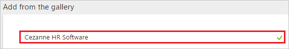

5. In the results panel, select **Cezanne HR Software**, and then click **Add** button to add the application.

	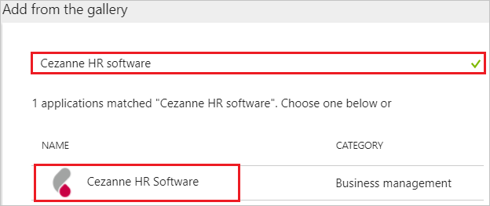

##  Configuring and testing Azure AD single sign-on
In this section, you configure and test Azure AD single sign-on with Cezanne HR Software based on a test user called "Britta Simon".

For single sign-on to work, Azure AD needs to know what the counterpart user in Cezanne HR Software is to a user in Azure AD. In other words, a link relationship between an Azure AD user and the related user in Cezanne HR Software needs to be established.

In Cezanne HR Software, assign the value of the **user name** in Azure AD as the value of the **Username** to establish the link relationship.

To configure and test Azure AD single sign-on with Cezanne HR Software, you need to complete the following building blocks:

1. **[Configuring Azure AD Single Sign-On](#configuring-azure-ad-single-sign-on)** - to enable your users to use this feature.
2. **[Creating an Azure AD test user](#creating-an-azure-ad-test-user)** - to test Azure AD single sign-on with Britta Simon.
3. **[Creating a Cezanne HR Software test user](#creating-a-cezanne-hr-software-test-user)** - to have a counterpart of Britta Simon in Cezanne HR Software that is linked to the Azure AD representation of user.
4. **[Assigning the Azure AD test user](#assigning-the-azure-ad-test-user)** - to enable Britta Simon to use Azure AD single sign-on.
5. **[Testing Single Sign-On](#testing-single-sign-on)** - to verify whether the configuration works.

### Configuring Azure AD single sign-on

In this section, you enable Azure AD single sign-on in the Azure portal and configure single sign-on in your Cezanne HR Software application.

**To configure Azure AD single sign-on with Cezanne HR Software, perform the following steps:**

1. In the Azure portal, on the **Cezanne HR Software** application integration page, click **Single sign-on**.

	![Configure Single Sign-On][4]

2. On the **Single sign-on** dialog, select **Mode** as	**SAML-based Sign-on** to enable single sign-on.
 
	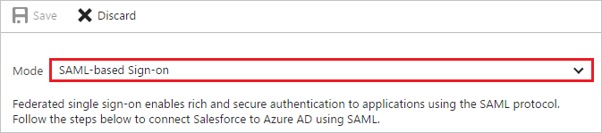

3. On the **Cezanne HR Software Domain and URLs** section, perform the following steps:

	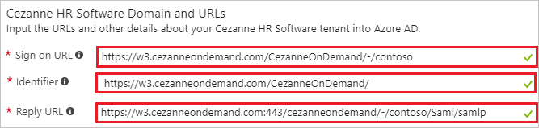

    a. In the **Sign-on URL** textbox, type a URL using the following pattern: `https://w3.cezanneondemand.com/cezannehr/-/<tenant id>`

	b. In the **Reply URL** textbox, type a URL using the following pattern: `https://w3.cezanneondemand.com:443/<tenantid>`    
	 
	> [!NOTE] 
	> These values are not real. Update these values with the actual Reply URL, and Sign-On URL. Contact [Cezanne HR Software Client support team](mailto:info@cezannehr.com) to get these values.

4. On the **SAML Signing Certificate** section, click **Certificate(Base64)** and then save the certificate file on your computer.

	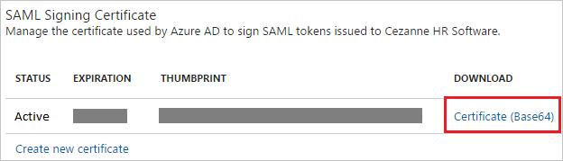 

5. Click **Save** button.

	
	
6. On the **Cezanne HR Software Configuration** section, click **Configure Cezanne HR Software** to open **Configure sign-on** window. Copy the **SAML Entity ID and SAML Single Sign-On Service URL** from the **Quick Reference section.**

	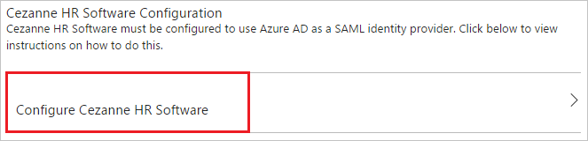 

7. In a different web browser window, sign-on to your Cezanne HR Software tenant as an administrator.

8. On the left navigation pane, click **System Setup**. Go to **Security Settings**. Then navigate to **Single Sign-On Configuration**.

	

9. In the **Allow users to log in using the following Single Sign-On (SSO) Service** panel, check the **SAML 2.0** box and select the **Advanced Configuration** option.

	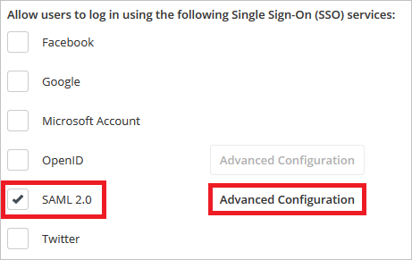

10. Click **Add New** button.

	

11. Perform the following steps on **SAML 2.0 IDENTITY PROVIDERS** section.

	
	
	a. Enter the name of your Identity Provider as the **Display Name**.

	b. Paste **SAML Entity ID**, which you have copied from the Azure portal into the **Entity Identifier** textbox. 

	c. Change the **SAML Binding** to 'POST'.

	d.Paste **SAML Single Sign-on Service URL**, which you have copied from the Azure portal into the **Security Token Service Endpoint** textbox. 
	
	e. In the User ID Attribute Name textbox, enter `http://schemas.xmlsoap.org/ws/2005/05/identity/claims/name`.
	
	f. Click **Upload** icon to upload the downloaded certificate from Azure AD.
	
	g. Click the **Ok** button. 

12. Click **Save** button.

	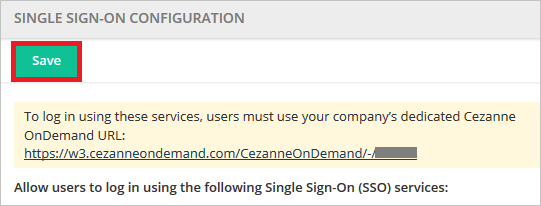

> [!TIP]
> You can now read a concise version of these instructions inside the [Azure portal](https://portal.azure.com), while you are setting up the app!  After adding this app from the **Active Directory > Enterprise Applications** section, simply click the **Single Sign-On** tab and access the embedded documentation through the **Configuration** section at the bottom. You can read more about the embedded documentation feature here: [Azure AD embedded documentation]( https://go.microsoft.com/fwlink/?linkid=845985)
> 

### Creating an Azure AD test user
The objective of this section is to create a test user in the Azure portal called Britta Simon.

![Create Azure AD User][100]

**To create a test user in Azure AD, perform the following steps:**

1. In the **Azure portal**, on the left navigation pane, click **Azure Active Directory** icon.

	 

2. To display the list of users, go to **Users and groups** and click **All users**.
	
	 

3. To open the **User** dialog, click **Add** on the top of the dialog.
 
	 

4. On the **User** dialog page, perform the following steps:
 
	 

    a. In the **Name** textbox, type **BrittaSimon**.

    b. In the **User name** textbox, type the **email address** of BrittaSimon.

	c. Select **Show Password** and write down the value of the **Password**.

    d. Click **Create**.
 
### Creating a Cezanne HR Software test user

In order to enable Azure AD users to log into Cezanne HR Software, they must be provisioned into Cezanne HR Software. In the case of Cezanne HR Software, provisioning is a manual task.

**To provision a user account, perform the following steps:**

1.  Log into your Cezanne HR Software company site as an administrator.

2.  On the left navigation pane, click **System Setup**. Go to **Manage Users**. Then navigate to **Add New User**.

    

3.  On **Person Details** section, perform below steps:

    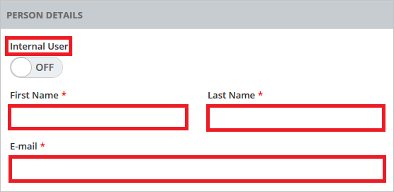
	
	a. Set **Internal User** as OFF.
 	
	b. In the **First Name** textbox, type the First Name of user like **Britta**.  
 
	c. In the **Last Name** textbox, type the last Name of user like **Simon**.
	
	d. In the **E-mail** textbox, type the email address of user like Brittasimon@contoso.com.

4.  On **Account Information** section, perform below steps:

    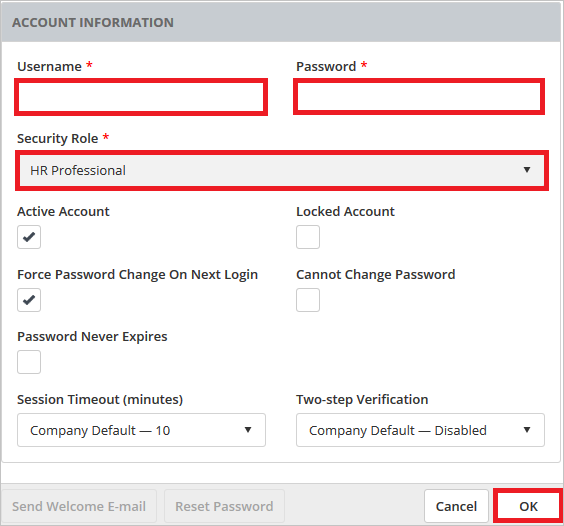
	
	a. In the **Username** textbox, type the email of user like Brittasimon@contoso.com.
	
	b. In the **Password** textbox, type the password of user.
 	
	c. Select **HR Professional** as **Security Role**.
	
	d. Click **OK**.

5. Navigate to **Single Sign-On** tab and select **Add New** in the **SAML 2.0 Identifiers** area.

	

6. Choose your Identity Provider for the **Identity Provider** and in the text box of **User Identifier**, enter the email address of Britta Simon account.

	
	
7. Click **Save** button.

	

### Assigning the Azure AD test user

In this section, you enable Britta Simon to use Azure single sign-on by granting access to Cezanne HR Software.

![Assign User][200] 

**To assign Britta Simon to Cezanne HR Software, perform the following steps:**

1. In the Azure portal, open the applications view, and then navigate to the directory view and go to **Enterprise applications** then click **All applications**.

	![Assign User][201] 

2. In the applications list, select **Cezanne HR Software**.

	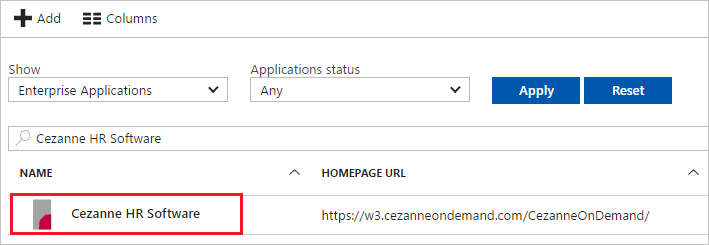 

3. In the menu on the left, click **Users and groups**.

	![Assign User][202] 

4. Click **Add** button. Then select **Users and groups** on **Add Assignment** dialog.

	![Assign User][203]

5. On **Users and groups** dialog, select **Britta Simon** in the Users list.

6. Click **Select** button on **Users and groups** dialog.

7. Click **Assign** button on **Add Assignment** dialog.
	
### Testing single sign-on

In this section, you test your Azure AD SSO configuration using the Access Panel.

When you click the Cezanne HR Software tile in the Access Panel, you should get automatically signed-on to your Cezanne HR Software application.

## Additional resources

* [List of Tutorials on How to Integrate SaaS Apps with Azure Active Directory](active-directory-saas-tutorial-list.md)
* [What is application access and single sign-on with Azure Active Directory?](active-directory-appssoaccess-whatis.md)

<!--Image references-->

[1]: ./media/active-directory-saas-cezannehrsoftware-tutorial/tutorial_general_01.png
[2]: ./media/active-directory-saas-cezannehrsoftware-tutorial/tutorial_general_02.png
[3]: ./media/active-directory-saas-cezannehrsoftware-tutorial/tutorial_general_03.png
[4]: ./media/active-directory-saas-cezannehrsoftware-tutorial/tutorial_general_04.png

[100]: ./media/active-directory-saas-cezannehrsoftware-tutorial/tutorial_general_100.png

[200]: ./media/active-directory-saas-cezannehrsoftware-tutorial/tutorial_general_200.png
[201]: ./media/active-directory-saas-cezannehrsoftware-tutorial/tutorial_general_201.png
[202]: ./media/active-directory-saas-cezannehrsoftware-tutorial/tutorial_general_202.png
[203]: ./media/active-directory-saas-cezannehrsoftware-tutorial/tutorial_general_203.png

