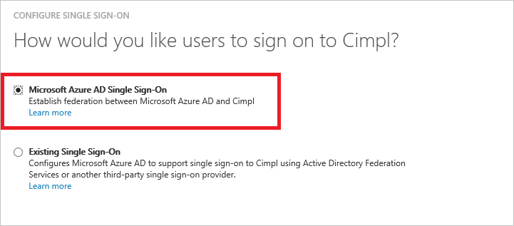
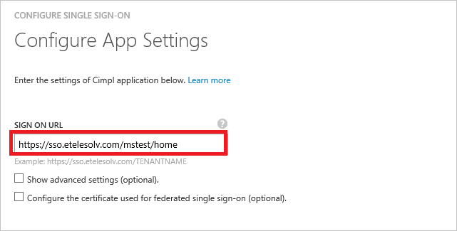
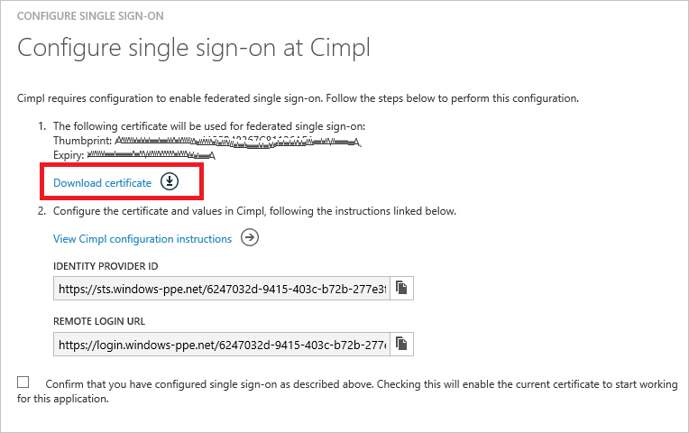
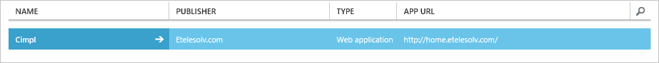

<properties
	pageTitle="Tutorial: Azure Active Directory integration with Cimpl | Microsoft Azure"
	description="Learn how to configure single sign-on between Azure Active Directory and Cimpl."
	services="active-directory"
	documentationCenter=""
	authors="jeevansd"
	manager="stevenpo"
	editor=""/>

<tags
	ms.service="active-directory"
	ms.workload="identity"
	ms.tgt_pltfrm="na"
	ms.devlang="na"
	ms.topic="article"
	ms.date="05/16/2016"
	ms.author="jeedes"/>

# Tutorial: Azure Active Directory integration with Cimpl

The objective of this tutorial is to show you how to integrate Cimpl with Azure Active Directory (Azure AD). Integrating Cimpl with Azure AD provides you with the following benefits:

- You can control in Azure AD who has access to Cimpl
- You can enable your users to automatically get signed-on to Cimpl (Single Sign-On) with their Azure AD accounts
- You can manage your accounts in one central location - the Azure classic portal

If you want to know more details about SaaS app integration with Azure AD, see [What is application access and single sign-on with Azure Active Directory](active-directory-appssoaccess-whatis.md).

## Prerequisites

To configure Azure AD integration with Cimpl, you need the following items:

- An Azure AD subscription
- A Cimpl single-sign on enabled subscription

> [AZURE.NOTE] To test the steps in this tutorial, we do not recommend using a production environment.

To test the steps in this tutorial, you should follow these recommendations:

- You should not use your production environment, unless this is necessary.
- If you don't have an Azure AD trial environment, you can get a one-month trial [here](https://azure.microsoft.com/pricing/free-trial/).

## Scenario Description
The objective of this tutorial is to enable you to test Azure AD single sign-on in a test environment.  
The scenario outlined in this tutorial consists of two main building blocks:

1. Adding Cimpl from the gallery
2. Configuring and testing Azure AD single sign-on

## Adding Cimpl from the gallery
To configure the integration of Cimpl into Azure AD, you need to add Cimpl from the gallery to your list of managed SaaS apps.

**To add Cimpl from the gallery, perform the following steps:**

1. In the **Azure classic portal**, on the left navigation pane, click **Active Directory**.   
![Active Directory][1] 

2. From the **Directory** list, select the directory for which you want to enable directory integration.

3. To open the applications view, in the directory view, click **Applications** in the top menu.  
![Applications][2] 
4. Click **Add** at the bottom of the page.  
![Applications][3] 
5. On the **What do you want to do** dialog, click **Add an application from the gallery**.  
![Applications][4] 
6. In the search box, type **Cimpl**.  
 
7. In the results pane, select **Cimpl**, and then click **Complete** to add the application.
  

##  Configuring and testing Azure AD single sign-on
The objective of this section is to show you how to configure and test Azure AD single sign-on with Cimpl based on a test user called "Britta Simon".

For single sign-on to work, Azure AD needs to know what the counterpart user in Cimpl to an user in Azure AD is. In other words, a link relationship between an Azure AD user and the related user in Cimpl needs to be established. 
This link relationship is established by assigning the value of the **user name** in Azure AD as the value of the **Username** in Cimpl.

To configure and test Azure AD single sign-on with Cimpl, you need to complete the following building blocks:

1. **[Configuring Azure AD Single Sign-On](#configuring-azure-ad-single-single-sign-on)** - to enable your users to use this feature.
2. **[Creating an Azure AD test user](#creating-an-azure-ad-test-user)** - to test Azure AD single sign-on with Britta Simon.
4. **[Creating a Cimpl test user](#creating-a-cimpl-test-user)** - to have a counterpart of Britta Simon in Cimpl that is linked to the Azure AD representation of her.
5. **[Assigning the Azure AD test user](#assigning-the-azure-ad-test-user)** - to enable Britta Simon to use Azure AD single sign-on.
5. **[Testing Single Sign-On](#testing-single-sign-on)** - to verify whether the configuration works.

### Configuring Azure AD Single Sign-On

The objective of this section is to enable Azure AD single sign-on in the Azure classic portal and to configure single sign-on in your Cimpl application.

**To configure Azure AD single sign-on with Cimpl, perform the following steps:**

1. In the Azure classic portal, on the **Cimpl** application integration page, click **Configure single sign-on** to open the **Configure Single Sign-On**  dialog.
   ![Configure Single Sign-On][6]  

2. On the **How would you like users to sign on to Cimpl** page, select **Azure AD Single Sign-On**, and then click **Next**.
     

3. On the **Configure App Settings** dialog page, perform the following steps:.
    

    a. In the Sign On URL textbox, type the URL used by your users to sign-on to your Cimpl application using the following pattern: **“https://login.bws.cimpl.com/SAMLSSO/Service.aspx?cimpl.idpid=\<TENANT ID PID\>”**.

4. On the **Configure single sign-on at Cimpl** page, perform the following steps:
    

    a. Click **Download certificate**, and then save the file on your computer.

    b. Click **Next**.

5. To get SSO configured for your application, contact your Cimpl support team on +1 866-982-8250 and email the attach downloaded certificate file. Also please do provide the Identity Provider ID and Remote Login URL so that they can be configured for SSO integration.

6. In the Azure classic portal, select the single sign-on configuration confirmation, and then click **Next**.
  ![Azure AD Single Sign-On][10] 

7. On the **Single sign-on confirmation** page, click **Complete**.  
    ![Azure AD Single Sign-On][11]

### Creating an Azure AD test user
The objective of this section is to create a test user in the Azure classic portal called Britta Simon. 
In the Users list, select **Britta Simon**.  ![Create Azure AD User][20] 

**To create a test user in Azure AD, perform the following steps:**

1. In the **Azure classic portal**, on the left navigation pane, click **Active Directory**.
    

2. From the **Directory** list, select the directory for which you want to enable directory integration.

3. To display the list of users, in the menu on the top, click **Users**.
     

4. To open the **Add User** dialog, in the toolbar on the bottom, click **Add User**.
     

5. On the **Tell us about this user** dialog page, perform the following steps:
     

    a. As Type Of User, select New user in your organization.

    b. In the User Name **textbox**, type **BrittaSimon**.

    c. Click **Next**.

6.  On the **User Profile** dialog page, perform the following steps:
    

    a. In the **First Name** textbox, type **Britta**.  

    b. In the **Last Name** textbox, type, **Simon**.

    c. In the **Display Name** textbox, type **Britta Simon**.

    d. In the **Role** list, select **User**.

    e. Click **Next**.

7. On the **Get temporary password** dialog page, click **create**.
     

8. On the **Get temporary password** dialog page, perform the following steps:
    

    a. Write down the value of the **New Password**.

    b. Click **Complete**.   

### Creating a Cimpl test user

The objective of this section is to create a user called Britta Simon in Cimpl. Please work with Cimpl support team to add the users in the Cimpl account. 

> [AZURE.NOTE] If you need to create an user manually, you need to 
> contact the Cimpl support team.

### Assigning the Azure AD test user

The objective of this section is to enabling Britta Simon to use Azure single sign-on by granting her access to Cimpl.
  ![Assign User][200]  

**To assign Britta Simon to Cimpl, perform the following steps:**

1. On the Azure classic portal, to open the applications view, in the directory view, click **Applications** in the top menu.
  ![Assign User][201]  

2. In the applications list, select **Cimpl**.
    

1. In the menu on the top, click **Users**.
  ![Assign User][203]  

1. In the Users list, select **Britta Simon**.

2. In the toolbar on the bottom, click **Assign**.
  ![Assign User][205]

### Testing Single Sign-On

The objective of this section is to test your Azure AD single sign-on configuration using the Access Panel. 
When you click the Cimpl tile in the Access Panel, you should get automatically signed-on to your Cimpl application.

## Additional Resources

* [List of Tutorials on How to Integrate SaaS Apps with Azure Active Directory](active-directory-saas-tutorial-list.md)
* [What is application access and single sign-on with Azure Active Directory?](active-directory-appssoaccess-whatis.md)

<!--Image references-->

[1]: ./media/active-directory-saas-cimpl-tutorial/tutorial_general_01.png
[2]: ./media/active-directory-saas-cimpl-tutorial/tutorial_general_02.png
[3]: ./media/active-directory-saas-cimpl-tutorial/tutorial_general_03.png
[4]: ./media/active-directory-saas-cimpl-tutorial/tutorial_general_04.png

[6]: ./media/active-directory-saas-cimpl-tutorial/tutorial_general_05.png
[10]: ./media/active-directory-saas-cimpl-tutorial/tutorial_general_06.png
[11]: ./media/active-directory-saas-cimpl-tutorial/tutorial_general_07.png
[20]: ./media/active-directory-saas-cimpl-tutorial/tutorial_general_100.png

[200]: ./media/active-directory-saas-cimpl-tutorial/tutorial_general_200.png
[201]: ./media/active-directory-saas-cimpl-tutorial/tutorial_general_201.png
[203]: ./media/active-directory-saas-cimpl-tutorial/tutorial_general_203.png
[204]: ./media/active-directory-saas-cimpl-tutorial/tutorial_general_204.png
[205]: ./media/active-directory-saas-cimpl-tutorial/tutorial_general_205.png
