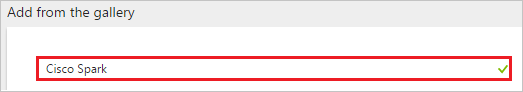
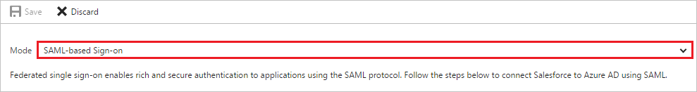
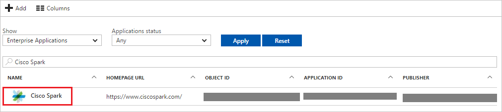

# Tutorial: Azure Active Directory integration with Cisco Spark

In this tutorial, you learn how to integrate Cisco Spark with Azure Active Directory (Azure AD).

Integrating Cisco Spark with Azure AD provides you with the following benefits:

- You can control in Azure AD who has access to Cisco Spark
- You can enable your users to automatically get signed-on to Cisco Spark (Single Sign-On) with their Azure AD accounts
- You can manage your accounts in one central location - the Azure portal

If you want to know more details about SaaS app integration with Azure AD, see [what is application access and single sign-on with Azure Active Directory](active-directory-appssoaccess-whatis.md).

## Prerequisites

To configure Azure AD integration with Cisco Spark, you need the following items:

- An Azure AD subscription
- A Cisco Spark single sign-on enabled subscription

> [!NOTE]
> To test the steps in this tutorial, we do not recommend using a production environment.

To test the steps in this tutorial, you should follow these recommendations:

- Do not use your production environment, unless it is necessary.
- If you don't have an Azure AD trial environment, you can get a one-month trial [here](https://azure.microsoft.com/pricing/free-trial/).

## Scenario description
In this tutorial, you test Azure AD single sign-on in a test environment. 
The scenario outlined in this tutorial consists of two main building blocks:

1. Adding Cisco Spark from the gallery
2. Configuring and testing Azure AD single sign-on

## Adding Cisco Spark from the gallery
To configure the integration of Cisco Spark into Azure AD, you need to add Cisco Spark from the gallery to your list of managed SaaS apps.

**To add Cisco Spark from the gallery, perform the following steps:**

1. In the **[Azure portal](https://portal.azure.com)**, on the left navigation panel, click **Azure Active Directory** icon. 

	![Active Directory][1]

2. Navigate to **Enterprise applications**. Then go to **All applications**.

	![Applications][2]
	
3. To add new application, click **New application** button on the top of dialog.

	![Applications][3]

4. In the search box, type **Cisco Spark**.

	

5. In the results panel, select **Cisco Spark**, and then click **Add** button to add the application.

	

##  Configuring and testing Azure AD single sign-on
In this section, you configure and test Azure AD single sign-on with Cisco Spark based on a test user called "Britta Simon."

For single sign-on to work, Azure AD needs to know what the counterpart user in Cisco Spark is to a user in Azure AD. In other words, a link relationship between an Azure AD user and the related user in Cisco Spark needs to be established.

In Cisco Spark, assign the value of the **user name** in Azure AD as the value of the **Username** to establish the link relationship.

To configure and test Azure AD single sign-on with Cisco Spark, you need to complete the following building blocks:

1. **[Configuring Azure AD Single Sign-On](#configuring-azure-ad-single-sign-on)** - to enable your users to use this feature.
2. **[Creating an Azure AD test user](#creating-an-azure-ad-test-user)** - to test Azure AD single sign-on with Britta Simon.
3. **[Creating a Cisco Spark test user](#creating-a-cisco-spark-test-user)** - to have a counterpart of Britta Simon in Cisco Spark that is linked to the Azure AD representation of user.
4. **[Assigning the Azure AD test user](#assigning-the-azure-ad-test-user)** - to enable Britta Simon to use Azure AD single sign-on.
5. **[Testing Single Sign-On](#testing-single-sign-on)** - to verify whether the configuration works.

### Configuring Azure AD single sign-on

In this section, you enable Azure AD single sign-on in the Azure portal and configure single sign-on in your Cisco Spark application.

**To configure Azure AD single sign-on with Cisco Spark, perform the following steps:**

1. In the Azure portal, on the **Cisco Spark** application integration page, click **Single sign-on**.

	![Configure Single Sign-On][4]

2. On the **Single sign-on** dialog, select **Mode** as	**SAML-based Sign-on** to enable single sign-on.
 
	

3. On the **Cisco Spark Domain and URLs** section, perform the following steps:

	

    a. In the **Sign-on URL** textbox, type a URL as: `https://web.ciscospark.com/#/signin`

	b. In the **Identifier** textbox, type a URL using the following pattern: `https://idbroker.webex.com/<companyname>`

	> [!NOTE] 
	> This value is not real. Update this value with the actual Identifier. Contact [Cisco Spark Client support team](https://support.ciscospark.com/) to get this value. 
 
4. On the **SAML Signing Certificate** section, click **Metadata XML** and then save the metadata file on your computer.

	 

5. Cisco Spark application expects the SAML assertions to contain specific attributes. Configure the following attributes  for this application. You can manage the values of these attributes from the **User Attributes** section on application integration page. The following screenshot shows an example for this.
	
	 

6. In the **User Attributes** section on the **Single sign-on** dialog, configure SAML token attribute as shown in the image above and perform the following steps:
	
	| Attribute Name  | Attribute Value |
	| --------------- | -------------------- |    
	|   uid    | user.userprincipalname |	

	a. Click **Add attribute** to open the **Add Attribute** dialog.

	

	
	
	b. In the **Name** textbox, type the attribute name shown for that row.
	
	c. From the **Value** list, type the attribute value shown for that row.
	
	d. Click **Ok**.

7. Click **Save** button.

	

8. Sign in to [Cisco Cloud Collaboration Management](https://admin.ciscospark.com/) with your full administrator credentials.

9. Select **Settings** and under the **Authentication** section, click **Modify**.
   
    
    
10. Select **Integrate a 3rd-party identity provider. (Advanced)** and go to the next screen.

11. On the **Import Idp Metadata** page, either drag and drop the Azure AD metadata file onto the page or use the file browser option to locate and upload the Azure AD metadata file. Then, select **Require certificate signed by a certificate authority in Metadata (more secure)** and click **Next**. 
	
	

12. Select **Test SSO Connection**, and when a new browser tab opens, authenticate with Azure AD by signing in.

13. Return to the **Cisco Cloud Collaboration Management** browser tab. If the test was successful, select **This test was successful. Enable Single Sign-On option** and click **Next**.

> [!TIP]
> You can now read a concise version of these instructions inside the [Azure portal](https://portal.azure.com), while you are setting up the app!  After adding this app from the **Active Directory > Enterprise Applications** section, simply click the **Single Sign-On** tab and access the embedded documentation through the **Configuration** section at the bottom. You can read more about the embedded documentation feature here: [Azure AD embedded documentation]( https://go.microsoft.com/fwlink/?linkid=845985)
> 

### Creating an Azure AD test user
The objective of this section is to create a test user in the Azure portal called Britta Simon.

![Create Azure AD User][100]

**To create a test user in Azure AD, perform the following steps:**

1. In the **Azure portal**, on the left navigation pane, click **Azure Active Directory** icon.

	 

2. To display the list of users, go to **Users and groups** and click **All users**.
	
	 

3. To open the **User** dialog, click **Add** on the top of the dialog.
 
	 

4. On the **User** dialog page, perform the following steps:
 
	 

    a. In the **Name** textbox, type **BrittaSimon**.

    b. In the **User name** textbox, type the **email address** of BrittaSimon.

	c. Select **Show Password** and write down the value of the **Password**.

    d. Click **Create**.
 
### Creating a Cisco Spark test user

In this section, you create a user called Britta Simon in Cisco Spark. In this section, you create a user called Britta Simon in Cisco Spark.

1. Go to the [Cisco Cloud Collaboration Management](https://admin.ciscospark.com/) with your full administrator credentials.

2. Click **Users** and then **Manage Users**.
   
     

3. In the **Manage User** window, select **Manually add or modify users** and click **Next**.

4. Select **Names and Email address**. Then, fill out the textbox as follows:
   
     
	
	a. In the **First Name** textbox, type **Britta**. 
	
	b. In the **Last Name** textbox, type **Simon**.
	
	c. In the **Email address** textbox, type **britta.simon@contoso.com**.

5. Click the plus sign to add Britta Simon. Then, click **Next**.

6. In the **Add Services for Users** window, click **Save** and then **Finish**.

### Assigning the Azure AD test user

In this section, you enable Britta Simon to use Azure single sign-on by granting access to Cisco Spark.

![Assign User][200] 

**To assign Britta Simon to Cisco Spark, perform the following steps:**

1. In the Azure portal, open the applications view, and then navigate to the directory view and go to **Enterprise applications** then click **All applications**.

	![Assign User][201] 

2. In the applications list, select **Cisco Spark**.

	 

3. In the menu on the left, click **Users and groups**.

	![Assign User][202] 

4. Click **Add** button. Then select **Users and groups** on **Add Assignment** dialog.

	![Assign User][203]

5. On **Users and groups** dialog, select **Britta Simon** in the Users list.

6. Click **Select** button on **Users and groups** dialog.

7. Click **Assign** button on **Add Assignment** dialog.
	
### Testing single sign-on

The objective of this section is to test your Azure AD SSO configuration using the Access Panel.

When you click the Cisco Spark tile in the Access Panel, you should get automatically signed-on to your Cisco Spark application.

## Additional resources

* [List of Tutorials on How to Integrate SaaS Apps with Azure Active Directory](active-directory-saas-tutorial-list.md)
* [What is application access and single sign-on with Azure Active Directory?](active-directory-appssoaccess-whatis.md)

<!--Image references-->

[1]: ./media/active-directory-saas-cisco-spark-tutorial/tutorial_general_01.png
[2]: ./media/active-directory-saas-cisco-spark-tutorial/tutorial_general_02.png
[3]: ./media/active-directory-saas-cisco-spark-tutorial/tutorial_general_03.png
[4]: ./media/active-directory-saas-cisco-spark-tutorial/tutorial_general_04.png
[10]: ./media/active-directory-saas-cisco-spark-tutorial/tutorial_general_060.png
[100]: ./media/active-directory-saas-cisco-spark-tutorial/tutorial_general_100.png

[200]: ./media/active-directory-saas-cisco-spark-tutorial/tutorial_general_200.png
[201]: ./media/active-directory-saas-cisco-spark-tutorial/tutorial_general_201.png
[202]: ./media/active-directory-saas-cisco-spark-tutorial/tutorial_general_202.png
[203]: ./media/active-directory-saas-cisco-spark-tutorial/tutorial_general_203.png

