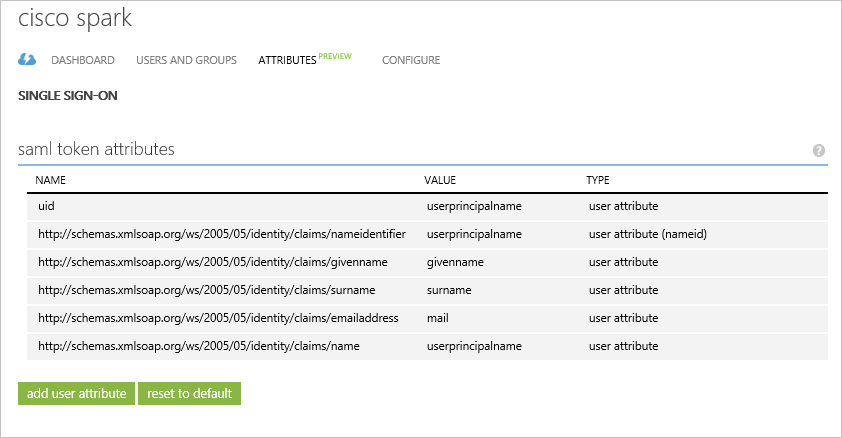
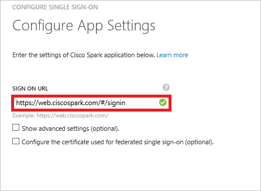
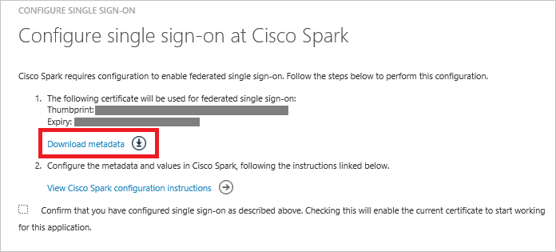
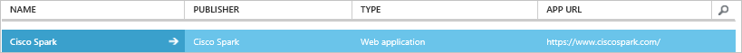

# Tutorial: Azure Active Directory integration with Cisco Spark
In this tutorial, you learn how to integrate Cisco Spark with Azure Active Directory (Azure AD).

Integrating Cisco Spark with Azure AD provides you with the following benefits:

* You can control in Azure AD who has access to Cisco Spark
* You can enable your users to automatically get signed-on to Cisco Spark single sign-on (SSO) with their Azure AD accounts
* You can manage your accounts in one central location - the Azure classic portal

If you want to know more details about SaaS app integration with Azure AD, see [What is application access and single sign-on with Azure Active Directory](active-directory-appssoaccess-whatis.md).

## Prerequisites
To configure Azure AD integration with Cisco Spark, you need the following items:

* An Azure AD subscription
* A **Cisco Spark** single-sign on (SSO) enabled subscription

>[!NOTE]
>To test the steps in this tutorial, we do not recommend using a production environment. 
> 

To test the steps in this tutorial, you should follow these recommendations:

* You should not use your production environment, unless this is necessary.
* If you don't have an Azure AD trial environment, you can get a [one-month trial](https://azure.microsoft.com/pricing/free-trial/).

## Scenario description
In this tutorial, you test Azure AD single sign-on in a test environment. 
The scenario outlined in this tutorial consists of two main building blocks:

1. Adding Cisco Spark from the gallery
2. Configuring and testing Azure AD SSO

## Add Cisco Spark from the gallery
To configure the integration of Cisco Spark into Azure AD, you need to add Cisco Spark from the gallery to your list of managed SaaS apps.

**To add Cisco Spark from the gallery, perform the following steps:**

1. In the **Azure classic portal**, on the left navigation pane, click **Active Directory**. 
   
    ![Active Directory][1]
2. From the **Directory** list, select the directory for which you want to enable directory integration.
3. To open the applications view, in the directory view, click **Applications** in the top menu.
   
    ![Applications][2]
4. Click **Add** at the bottom of the page.
   
    ![Applications][3]
5. On the **What do you want to do** dialog, click **Add an application from the gallery**.
   
    ![Applications][4]
6. In the search box, type **Cisco Spark**.
   
    
7. In the results pane, select **Cisco Spark**, and then click **Complete** to add the application.
   
    

## Configure and test Azure AD SSO
In this section, you configure and test Azure AD SSO with Cisco Spark based on a test user called "Britta Simon".

For SSO to work, Azure AD needs to know what the counterpart user in Cisco Spark is to a user in Azure AD. In other words, a link relationship between an Azure AD user and the related user in Cisco Spark needs to be established.

This link relationship is established by assigning the value of the **user name** in Azure AD as the value of the **Username** in Cisco Spark. To configure and test Azure AD single sign-on with Cisco Spark, you need to complete the following building blocks:

1. **[Configuring Azure AD single sign-on](#configuring-azure-ad-single-single-sign-on)** - to enable your users to use this feature.
2. **[Creating an Azure AD test user](#creating-an-azure-ad-test-user)** - to test Azure AD single sign-on with Britta Simon.
3. **[Creating a Cisco Spark test user](#creating-a-cisco-spark-test-user)** - to have a counterpart of Britta Simon in Cisco Spark that is linked to the Azure AD representation of her.
4. **[Assigning the Azure AD test user](#assigning-the-azure-ad-test-user)** - to enable Britta Simon to use Azure AD single sign-on.
5. **[Testing single sign-on](#testing-single-sign-on)** - to verify whether the configuration works.

### Configure Azure AD SSO
The objective of this section is to enable Azure AD SSO in the Azure classic portal and to configure single sign-on in your Cisco Spark application.

Cisco Spark application expects the SAML assertions to contain specific attributes. Configure the following attributes  for this application. You can manage the values of these attributes from the **"Atrributes"** tab of the application. The following screenshot shows an example for this.

 

**To configure Azure AD SSO with Cisco Spark, perform the following steps:**

1. In the Azure classic portal, on the **Cisco Spark** application integration page, in the menu on the top, click **Attributes**.
   
    ![Configure Single Sign-On][5]
2. On the **SAML token attributes** dialog, perform the following steps:
  1. Click **add user attribute** to open the **Add User Attribure** dialog.
   
    
  2. In the **Attribute Name** textbox, type **uid**.
  3. From the **Attribute Value** list, select **user.userprincipal**.
  4. Click **Complete**. Then, **Apply Changes** at the bottom of the page.
3. In the menu on the top, click **Quick Start**.
   
    ![Configure Single Sign-On][6]
4. In the classic portal, on the **Cisco Spark** application integration page, click **Configure single sign-on** to open the **Configure Single Sign-On**  dialog.
   
    ![Configure Single Sign-On][7] 
5. On the **How would you like users to sign on to Cisco Spark** page, select **Azure AD Single Sign-On**, and then click **Next**.
   
    
6. On the **Configure App Settings** dialog page, perform the following steps:
   
    
  1. In the Sign On URL textbox, type a URL using the following pattern: `https://web.ciscospark.com/#/signin`.
  2. Click **Next**.
7. On the **Configure single sign-on at Cisco Spark** page, Click **Download metadata**, and then save the file on your computer.
   
    
8. Sign in to [Cisco Cloud Collaboration Management](https://admin.ciscospark.com/) with your full administrator credentials.
9. Select **Settings** and under the **Authentication** section, click **Modify**.
   
    
9. Select **Integrate a 3rd-party identity provider. (Advanced)** and go to the next screen.
10. Click on **Download Metadata File** and save the file on your computer.
11. On the **Import Idp Metadata** page, either drag and drop the Azure AD metadata file onto the page or use the file browser option to locate and upload the Azure AD metadata file. Then, select **Require certificate signed by a certificate authority in Metadata (more secure)** and click **Next**. 
   
   
12. Select **Test SSO Connection**, and when a new browser tab opens, authenticate with Azure AD by signing in.
13. Return to the **Cisco Cloud Collaboration Management** browser tab. If the test was successful, select **This test was successful. Enable Single Sign-On option** and click **Next**.
14. On the Azure AD classic portal, select the single sign-on configuration confirmation, and then click **Next**.
   
    ![Azure AD Single Sign-On][10]
15. On the **Single sign-on confirmation** page, click **Complete**.  
    
     ![Azure AD Single Sign-On][11]

### Create an Azure AD test user
In this section, you create a test user in the classic portal called Britta Simon.

![Create Azure AD User][20]

**To create a test user in Azure AD, perform the following steps:**

1. In the **Azure classic portal**, on the left navigation pane, click **Active Directory**.
   
     
2. From the **Directory** list, select the directory for which you want to enable directory integration.
3. To display the list of users, in the menu on the top, click **Users**.
   
     
4. To open the **Add User** dialog, in the toolbar on the bottom, click **Add User**.
   
     
5. On the **Tell us about this user** dialog page, perform the following steps:
   
     
  1. As Type Of User, select New user in your organization.
  2. In the User Name **textbox**, type **BrittaSimon**.
  3. Click **Next**.
6. On the **User Profile** dialog page, perform the following steps:
   
    
  1. In the **First Name** textbox, type **Britta**.  
  2. In the **Last Name** textbox, type, **Simon**.
  3. In the **Display Name** textbox, type **Britta Simon**.
  4. In the **Role** list, select **User**.
  5. Click **Next**.
7. On the **Get temporary password** dialog page, click **create**.
   
     
8. On the **Get temporary password** dialog page, perform the following steps:
   
     
  1. Write down the value of the **New Password**.
  2. Click **Complete**.   

### Create a Cisco Spark test user
In this section, you create a user called Britta Simon in Cisco Spark. In this section, you create a user called Britta Simon in Cisco Spark.

1. Go to the [Cisco Cloud Collaboration Management](https://admin.ciscospark.com/) with your full administrator credentials.
2. Click on **Users** and then **Manage Users**.
   
     
3. In the **Manage User** window, select **Manually add or modify users** and click **Next**.
4. Select **Names and Email address**. Then, fill out the textbox as follow:
   
     
  1. In the **First Name** textbox, type **Britta**. 
  2. In the **Last Name** textbox, type **Simon**.
  3. In the **Email address** textbox, type **britta.simon@contoso.com**.
5. Click on the plus sign to add Britta Simon. Then, click **Next**.
6. In the **Add Services for Users** window, click **Save** and then **Finish**.

### Assign the Azure AD test user
In this section, you enable Britta Simon to use Azure SSO by granting her access to Cisco Spark.

![Assign User][200] 

**To assign Britta Simon to Cisco Spark, perform the following steps:**

1. On the classic portal, to open the applications view, in the directory view, click **Applications** in the top menu.
   
    ![Assign User][201] 
2. In the applications list, select **Cisco Spark**.
   
     
3. In the menu on the top, click **Users**.
   
    ![Assign User][203] 
4. In the All Users list, select **Britta Simon**.
5. In the toolbar on the bottom, click **Assign**.
   
    ![Assign User][205]

### Test single sign-on
The objective of this section is to test your Azure AD SSO configuration using the Access Panel.

When you click the Cisco Spark tile in the Access Panel, you should get automatically signed-on to your Cisco Spark application.

## Additional resources
* [List of Tutorials on How to Integrate SaaS Apps with Azure Active Directory](active-directory-saas-tutorial-list.md)
* [What is application access and single sign-on with Azure Active Directory?](active-directory-appssoaccess-whatis.md)

<!--Image references-->

[1]: ./media/active-directory-saas-cisco-spark-tutorial/tutorial_general_01.png
[2]: ./media/active-directory-saas-cisco-spark-tutorial/tutorial_general_02.png
[3]: ./media/active-directory-saas-cisco-spark-tutorial/tutorial_general_03.png
[4]: ./media/active-directory-saas-cisco-spark-tutorial/tutorial_general_04.png

[5]: ./media/active-directory-saas-cisco-spark-tutorial/tutorial_general_05.png
[6]: ./media/active-directory-saas-cisco-spark-tutorial/tutorial_general_06.png
[7]:  ./media/active-directory-saas-cisco-spark-tutorial/tutorial_general_050.png
[10]: ./media/active-directory-saas-cisco-spark-tutorial/tutorial_general_060.png
[11]: ./media/active-directory-saas-cisco-spark-tutorial/tutorial_general_070.png
[20]: ./media/active-directory-saas-cisco-spark-tutorial/tutorial_general_100.png

[200]: ./media/active-directory-saas-cisco-spark-tutorial/tutorial_general_200.png
[201]: ./media/active-directory-saas-cisco-spark-tutorial/tutorial_general_201.png
[203]: ./media/active-directory-saas-cisco-spark-tutorial/tutorial_general_203.png
[204]: ./media/active-directory-saas-cisco-spark-tutorial/tutorial_general_204.png
[205]: ./media/active-directory-saas-cisco-spark-tutorial/tutorial_general_205.png
