<properties 
    pageTitle="Tutorial: Azure Active Directory Integration with Cisco Webex | Microsoft Azure" 
    description="Learn how to use Cisco Webex with Azure Active Directory to enable single sign-on, automated provisioning, and more!" 
    services="active-directory" 
    authors="jeevansd"  
    documentationCenter="na" 
    manager="femila"/>
<tags 
    ms.service="active-directory" 
    ms.devlang="na" 
    ms.topic="article" 
    ms.tgt_pltfrm="na" 
    ms.workload="identity" 
    ms.date="07/11/2016" 
    ms.author="jeedes" />

#Tutorial: Azure Active Directory Integration with Cisco Webex

The objective of this tutorial is to show the integration of Azure and Cisco Webex.  
The scenario outlined in this tutorial assumes that you already have the following items:

-   A valid Azure subscription
-   A Cisco Webex tenant

After completing this tutorial, the Azure AD users you have assigned to Cisco Webex will be able to single sign into the application at your Cisco Webex company site (service provider initiated sign on), or using the [Introduction to the Access Panel](active-directory-saas-access-panel-introduction.md).

The scenario outlined in this tutorial consists of the following building blocks:

1.  Enabling the application integration for Cisco Webex
2.  Configuring single sign-on
3.  Configuring user provisioning
4.  Assigning users

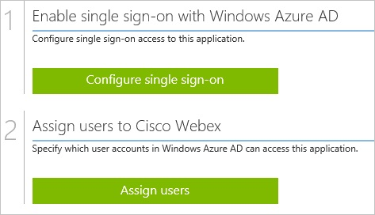
##Enabling the application integration for Cisco Webex

The objective of this section is to outline how to enable the application integration for Cisco Webex.

###To enable the application integration for Cisco Webex, perform the following steps:

1.  In the Azure classic portal, on the left navigation pane, click **Active Directory**.

    

2.  From the **Directory** list, select the directory for which you want to enable directory integration.

3.  To open the applications view, in the directory view, click **Applications** in the top menu.

    

4.  Click **Add** at the bottom of the page.

    

5.  On the **What do you want to do** dialog, click **Add an application from the gallery**.

    

6.  In the **search box**, type **Cisco Webex**.

    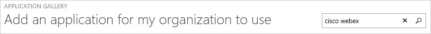

7.  In the results pane, select **Cisco Webex**, and then click **Complete** to add the application.

    
##Configuring single sign-on

The objective of this section is to outline how to enable users to authenticate to Cisco Webex with their account in Azure AD using federation based on the SAML protocol.  
As part of this procedure, you are required to create a base-64 encoded certificate.  
If you are not familiar with this procedure, see [How to convert a binary certificate into a text file](http://youtu.be/PlgrzUZ-Y1o)

###To configure single sign-on, perform the following steps:

1.  In the Azure classic portal, on the **Cisco Webex** application integration page, click **Configure single sign-on** to open the **Configure Single Sign On ** dialog.

    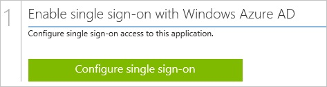

2.  On the **How would you like users to sign on to Cisco Webex** page, select **Microsoft Azure AD Single Sign-On**, and then click **Next**.

    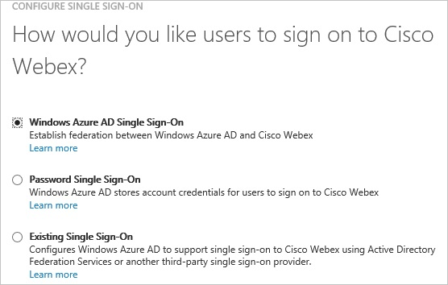

3.  On the **Configure App URL** page, perform the following steps, and then click **Next**.

    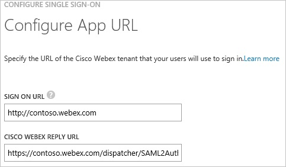

    1.  In the **Sing On URL** textbox, type your Cisco Webex tenant URL (e.g.: *http://contoso.webex.com*).
    2.  In the **Cisco Webex Reply URL** textbox, type your **Cisco Webex AssertionConsumerService URL** (e.g.: *https://company.webex.com/dispatcher/SAML2AuthService?siteurl=company*).

4.  On the **Configure single sign-on at Cisco Webex** page, to download your certificate, click **Download certificate**, and then save the certificate file on your computer.

    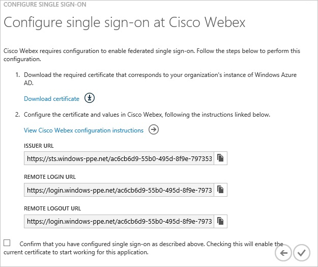

5.  In a different web browser window, log into your Cisco Webex company site as an administrator.

6.  In the menu on the top, click **Site Administration**.

    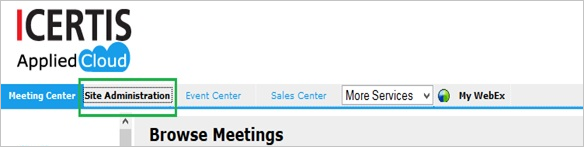

7.  In the **Manage Site** section, click **SSO Configuration**.

    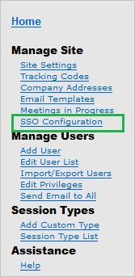

8.  In the Federated Web SSO Configuration section, perform the following steps:

    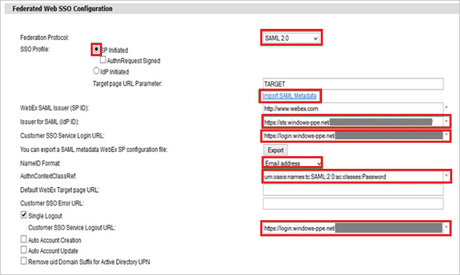

    1.  From the **Federation Protocol** list, select **SAML 2.0**.
    2.  Create a **Base-64 encoded** file from your downloaded certificate.  

        >[AZURE.TIP] For more details, see [How to convert a binary certificate into a text file](http://youtu.be/PlgrzUZ-Y1o)

    3.  Open your base-64 encoded certificate in notepad, and then copy the content of it.
    4.  Click **Import SAML Metadata**, and then paste your base-64 encoded certificate.
    5.  In the Azure classic portal, on the **Configure single sign-on at Cisco Webex** dialog page, copy the **Issuer URL** value, and then paste it into the **Issuer for SAML (IdP ID)** textbox.
    6.  In the Azure classic portal, on the **Configure single sign-on at Cisco Webex** dialog page, copy the **Remote Login URL** value, and then paste it into the **Customer SSO Service Login URL** textbox.
    7.  From the **NameID Format** list, select **Email address**.
    8.  In the **AuthnContextClassRef** textbox, type **urn:oasis:names:tc:SAML:2.0:ac:classes:Password**.
    9.  In the Azure classic portal, on the **Configure single sign-on at Cisco Webex** dialog page, copy the **Remote Logout URL** value, and then paste it into the **Customer SSO Service Logout URL** textbox.
    10. Click **Update**.

9.  In the Azure classic portal, on the **Configure single sign-on at Cisco Webex** dialog page, select the single sign-on configuration confirmation, and then click **Complete**.

    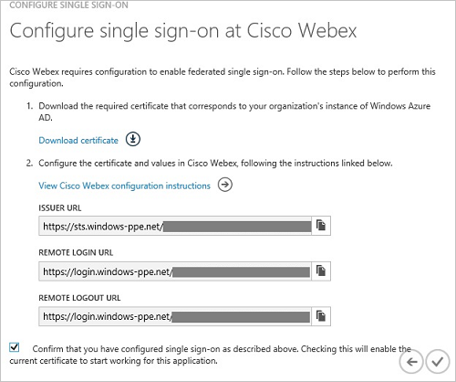
##Configuring user provisioning

In order to enable Azure AD users to log into Cisco Webex, they must be provisioned into Cisco Webex.  
In the case of Cisco Webex, provisioning is a manual task.

###To provision a user accounts, perform the following steps:

1.  Log in to your **Cisco Webex** tenant.

2.  Go to **Manage Users \> Add User**.

    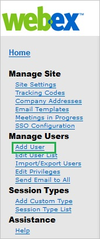

3.  On the Add User section, perform the following steps:

    

    1.  As **Account Type**, select **Host**.
    2.  Type the information of an existing Azure AD user into the following textboxes: **First name, Last name**, **User name**, **Email**, **Password**, **Confirm Password**.
    3.  Click **Add**.

>[AZURE.NOTE] You can use any other Cisco Webex user account creation tools or APIs provided by Cisco Webex to provision AAD user accounts.

##Assigning users

To test your configuration, you need to grant the Azure AD users you want to allow using your application access to it by assigning them.

###To assign users to Cisco Webex, perform the following steps:

1.  In the Azure classic portal, create a test account.

2.  On the **Cisco Webex **application integration page, click **Assign users**.

    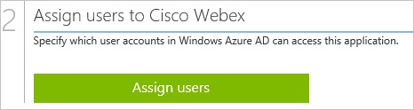

3.  Select your test user, click **Assign**, and then click **Yes** to confirm your assignment.

    

If you want to test your single sign-on settings, open the Access Panel. For more details about the Access Panel, see [Introduction to the Access Panel](active-directory-saas-access-panel-introduction.md).
