<properties 
    pageTitle="Tutorial: Azure Active Directory integration with Citrix GoToMeeting | Microsoft Azure" 
    description="Learn how to use Citrix GoToMeeting with Azure Active Directory to enable single sign-on, automated provisioning, and more!." 
    services="active-directory" 
    authors="jeevansd"  
    documentationCenter="na" 
    manager="femila"/>

<tags 
    ms.service="active-directory" 
    ms.devlang="na" 
    ms.topic="article" 
    ms.tgt_pltfrm="na" 
    ms.workload="identity" 
    ms.date="05/26/2016" 
    ms.author="jeedes" />

#Tutorial: Azure Active Directory integration with Citrix GoToMeeting  
Applies To: Azure

>[AZURE.TIP]For feedback, click [here](http://go.microsoft.com/fwlink/?LinkId=522412).

The objective of this tutorial is to show the integration of Azure and Citrix GoToMeeting. The scenario outlined in this tutorial assumes that you already have the following items:

-   A valid Azure subscription
-   A tenant in Citrix GoToMeeting

The scenario outlined in this tutorial consists of the following building blocks:

1.  Enabling the application integration for Citrix GoToMeeting
2.  Configuring single sign-on
3.  Configuring user provisioning
4.  Assigning users

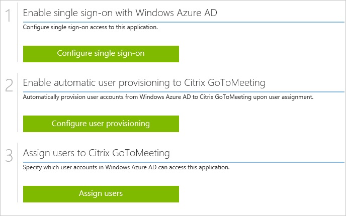

##Enabling the application integration for Citrix GoToMeeting

The objective of this section is to outline how to enable the application integration for Citrix GoToMeeting.

###To enable the application integration for Citrix GoToMeeting, perform the following steps:

1.  In the Azure classic portal, on the left navigation pane, click **Active Directory**.

    

2.  From the **Directory** list, select the directory for which you want to enable directory integration.

3.  To open the applications view, in the directory view, click **Applications** in the top menu.

    

4.  Click **Add** at the bottom of the page.

    

5.  On the **What do you want to do** dialog, click **Add an application from the gallery**.

    

6.  In the **search box**, type **Citrix GoToMeeting**.

    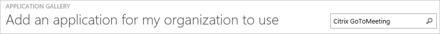

7.  In the results pane, select **Citrix GoToMeeting**, and then click **Complete** to add the application.

    
##Configuring single sign-on

The objective of this section is to outline how to enable users to authenticate to Citrix GoToMeeting with their account in Azure AD using federation based on the SAML protocol.  
As part of this procedure, you are required to upload a base-64 encoded certificate to your Citrix GoToMeeting tenant.  
If you are not familiar with this procedure, see [How to convert a binary certificate into a text file](http://youtu.be/PlgrzUZ-Y1o).

###To configure single sign-on, perform the following steps:

1.  On the **Citrix GoToMeeting** application integration page, click **Configure single sign-on** to open the **CONFIGURE SINGLE SIGN ON** dialog.

    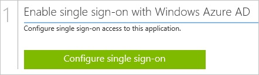

2.  On the **How would you like users to sign on to Citrix GoToMeeting** page, select **Microsoft Azure AD Single Sign-On**.

    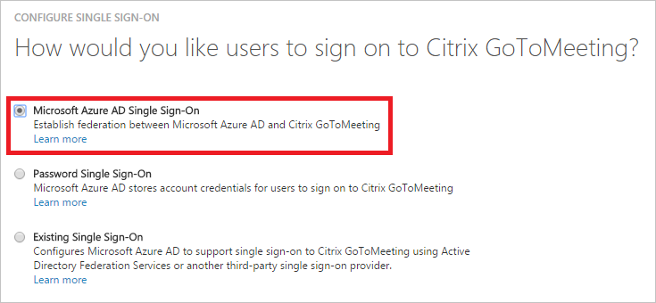

3. On the **Configure App Settings** page, click **Next**. 

	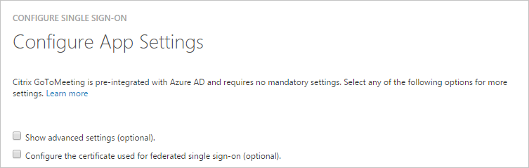

4.  On the **Configure single sign-on at Citrix GoToMeeting** page, click **Download certificate**, and then save the certificate file on your computer.

    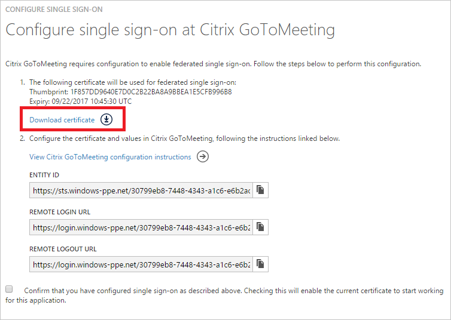

5.  In a different browser window, log into your Citrix Organization Center ([https://account.citrixonline.com/organization/administration/](https://account.citrixonline.com/organization/administration/)).

6. Click the **Identity Provider** tab, and then perform the following steps:  

	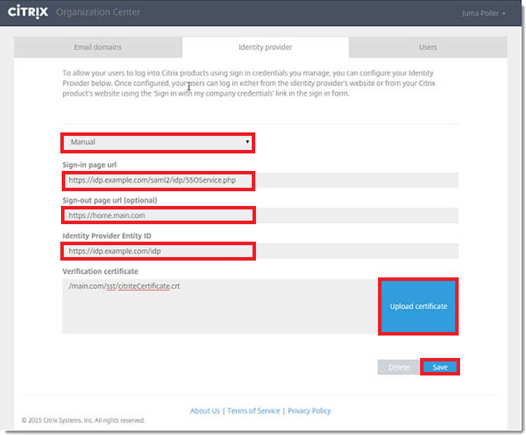

	a. Select **Manual**

    
	b. In the Azure classic portal, on the **Configure single sign-on at Citrix GoToMeeting** dialog page, copy the **Sign-In Page URL** value, and then paste it into the **Sign-in page URL** textbox. 

    
	c. In the Azure classic portal, on the **Configure single sign-on at Citrix GoToMeeting** dialog page, copy the **Sign-Out Page URL** value, and then paste it into the **Sign-out page URL** textbox.

    
	d. In the Azure classic portal, on the **Configure single sign-on at Citrix GoToMeeting** dialog page, copy the **Entity ID** value, and then paste it into the **Identity Provider Entity ID** textbox.

   
	e. To upload your downloaded certificate, click **Upload Certificate**.

    
	f. Click **Save**.

6.  On the Azure classic portal, select the single sign-on configuration confirmation, and then click **Next**.

    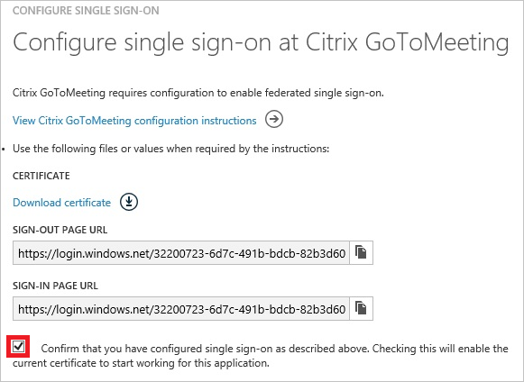

7. On the **Single sign-on confirmation** page, click **Complete**.

	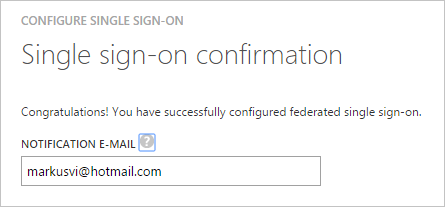

##Configuring user provisioning

The objective of this section is to outline how to enable provisioning of Active Directory user accounts to Citrix GoToMeeting.

###To configure user provisioning, perform the following steps:

1.  In the Azure classic portal, on the **Citrix GoToMeeting** application integration page, click **Configure user provisioning** to open the **Configure User Provisioning** dialog.

    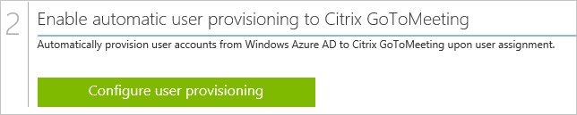

2.  On the **Settings and admin credentials** page, perform the following steps:

    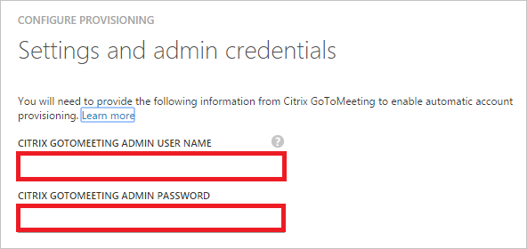

	a. In the **Citrix GoToMeeting Admin User Name** textbox, type the user name of an administrator.

    
	b. In the **Citrix GoToMeeting Admin Password** textbox, the administrator's password.

    
	c. Click **Next**.

3.  On the **Confirmation** page, click the checkmark to save your configuration.

4.  Click the **validate** button, to verify your configuration.

##Assigning users

To test your configuration, you need to grant the Azure AD users you want to allow using your application access to it by assigning them.

###To assign users to Citrix GoToMeeting, perform the following steps:

1.  In the Azure classic portal, create a test account.

2.  On the **Citrix GoToMeeting** application integration page, click **Assign users**.

    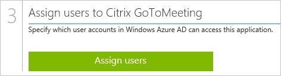

3.  Select your test user, click **Assign**, and then click **Yes** to confirm your assignment.

    

You should now wait for 10 minutes and verify that the account has been synchronized to Dropbox for Business.

As a first verification step, you can check the provisioning status, by clicking Dashboard in the D on the **Citrix GoToMeeting** application integration page on the Azure classic portal.

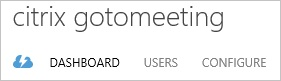

A successfully completed user provisioning cycle is indicated by a related status:

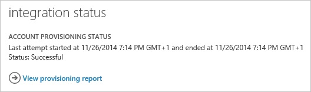

If you want to test your single sign-on settings, open the Access Panel.

For more details about the Access Panel, see [Introduction to the Access Panel](https://msdn.microsoft.com/library/dn308586).
