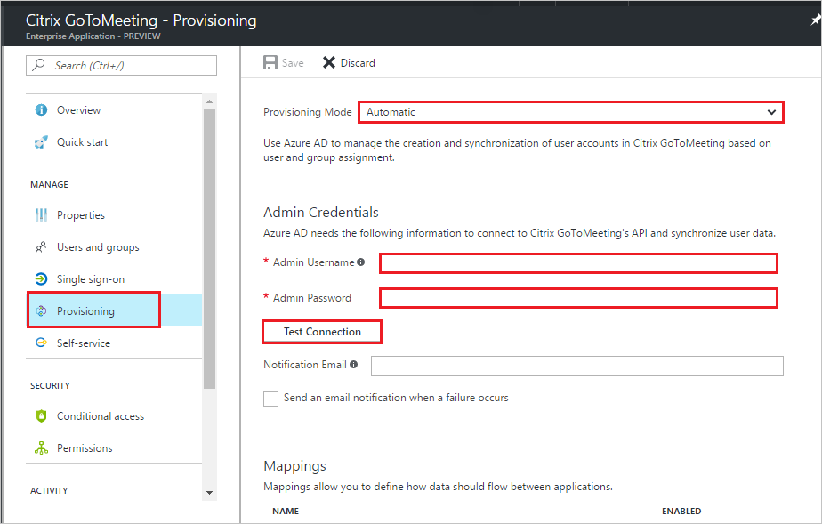

# Tutorial: Configuring GoToMeeting for Automatic User Provisioning

The objective of this tutorial is to show you the steps you need to perform in GoToMeeting and Azure AD to automatically provision and de-provision user accounts from Azure AD to GoToMeeting.

## Prerequisites

The scenario outlined in this tutorial assumes that you already have the following items:

*   An Azure Active directory tenant.
*   A GoToMeeting single  sign-on enabled subscription.
*   A user account in GoToMeeting with Team Admin permissions.

## Assigning users to GoToMeeting

Azure Active Directory uses a concept called "assignments" to determine which users should receive access to selected apps. In the context of automatic user account provisioning, only the users and groups that have been "assigned" to an application in Azure AD is synchronized.

Before configuring and enabling the provisioning service, you need to decide what users and/or groups in Azure AD represent the users who need access to your GoToMeeting app. Once decided, you can assign these users to your GoToMeeting app by following the instructions here:

[Assign a user or group to an enterprise app](https://docs.microsoft.com/azure/active-directory/active-directory-coreapps-assign-user-azure-portal)

### Important tips for assigning users to GoToMeeting

*   It is recommended that a single Azure AD user is assigned to GoToMeeting to test the provisioning configuration. Additional users and/or groups may be assigned later.

*   When assigning a user to GoToMeeting, you must select a valid user role. The "Default Access" role does not work for provisioning.

## Enable Automated User Provisioning

This section guides you through connecting your Azure AD to GoToMeeting's user account provisioning API, and configuring the provisioning service to create, update, and disable assigned user accounts in GoToMeeting based on user and group assignment in Azure AD.

> [!TIP]
> You may also choose to enabled SAML-based Single Sign-On for GoToMeeting, following the instructions provided in [Azure portal](https://portal.azure.com). Single sign-on can be configured independently of automatic provisioning, though these two features compliment each other.

### To configure automatic user account provisioning:

1. In the [Azure portal](https://portal.azure.com), browse to the **Azure Active Directory > Enterprise Apps > All applications** section.

2. If you have already configured GoToMeeting for single sign-on, search for your instance of GoToMeeting using the search field. Otherwise, select **Add** and search for **GoToMeeting** in the application gallery. Select GoToMeeting from the search results, and add it to your list of applications.

3. Select your instance of GoToMeeting, then select the **Provisioning** tab.

4. Set the **Provisioning** Mode to **Automatic**. 

    

5. Under the Admin Credentials section, perform the following steps:
   
    a. In the **GoToMeeting Admin User Name** textbox, type the user name of an administrator.

    b. In the **GoToMeeting Admin Password** textbox, the administrator's password.

6. In the Azure portal, click **Test Connection** to ensure Azure AD can connect to your GoToMeeting app. If the connection fails, ensure your GoToMeeting account has Team Admin permissions and try the **"Admin Credentials"** step again.

7. Enter the email address of a person or group who should receive provisioning error notifications in the **Notification Email** field, and check the checkbox.

8. Click **Save.**

9. Under the Mappings section, select **Synchronize Azure Active Directory Users to GoToMeeting.**

10. In the **Attribute Mappings** section, review the user attributes that are synchronized from Azure AD to GoToMeeting. The attributes selected as **Matching** properties are used to match the user accounts in GoToMeeting for update operations. Select the Save button to commit any changes.

11. To enable the Azure AD provisioning service for GoToMeeting, change the **Provisioning Status** to **On** in the Settings section

12. Click **Save.**

It starts the initial synchronization of any users and/or groups assigned to GoToMeeting in the Users and Groups section. The initial sync takes longer to perform than subsequent syncs, which occur approximately every 20 minutes as long as the service is running. You can use the **Synchronization Details** section to monitor progress and follow links to provisioning activity reports, which describe all actions performed by the provisioning service on your GoToMeeting app.

## Additional resources

* [Managing user account provisioning for Enterprise Apps](active-directory-saas-tutorial-list.md)
* [What is application access and single sign-on with Azure Active Directory?](active-directory-appssoaccess-whatis.md)
* [Configure Single Sign-on](https://docs.microsoft.com/en-us/azure/active-directory/active-directory-saas-citrix-gotomeeting-tutorial)

