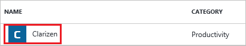
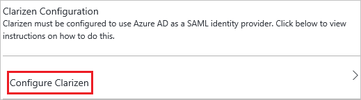
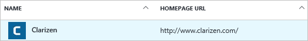

# Tutorial: Azure Active Directory integration with Clarizen

In this tutorial, you learn how to integrate Clarizen with Azure Active Directory (Azure AD).

Integrating Clarizen with Azure AD provides you with the following benefits:

- You can control, in Azure AD, who has access to Clarizen.
- You can enable your users to automatically get signed on to Clarizen (single sign-on) with their Azure AD accounts.
- You can manage your accounts in one central location, the Azure portal.

The scenario outlined in this tutorial consists of two main tasks:

1. Add Clarizen from the gallery.
2. Configure and test Azure AD single sign-on.

If you want more details about software as a service (SaaS) app integration with Azure AD, see [What is application access and single sign-on with Azure Active Directory?](active-directory-appssoaccess-whatis.md).

## Prerequisites

To configure Azure AD integration with Clarizen, you need the following items:

- An Azure AD subscription
- A Clarizen subscription that's enabled for single sign-on

To test the steps in this tutorial, follow these recommendations:

- Test Azure AD single sign-on in a test environment. Don't use your production environment, unless this is necessary.
- If you don't have an Azure AD test environment, you can [get a one-month trial](https://azure.microsoft.com/pricing/free-trial/).

## Add Clarizen from the gallery
To configure the integration of Clarizen into Azure AD, add Clarizen from the gallery to your list of managed SaaS apps.

1. In the [Azure portal](https://portal.azure.com), in the left pane, click the **Azure Active Directory** icon.

	![Active Directory icon][1]

2. Click **Enterprise applications**. Then click **All applications**.

	![Applications][2]

3. Click the **Add** button at the top of the dialog box.

	![Add button][3]

4. In the search box, type **Clarizen**.

	

5. In the results pane, select **Clarizen**, and then click **Add** to add the application.

	

##  Configure and test Azure AD single sign-on
In the following sections, you configure and test Azure AD single sign-on with Clarizen based on the test user Britta Simon.

For single sign-on to work, Azure AD needs to know what the counterpart user in Clarizen is to a user in Azure AD. In other words, a link relationship between an Azure AD user and the related user in Clarizen needs to be established.

You establish this link relationship by assigning the value of **user name** in Azure AD as the value of **Username** in Clarizen.

To configure and test Azure AD single sign-on with Clarizen, complete the following building blocks:

1. **[Configure Azure AD single sign-on](#configuring-azure-ad-single-sign-on)** to enable your users to use this feature.
2. **[Create an Azure AD test user](#creating-an-azure-ad-test-user)** to test Azure AD single sign-on with Britta Simon.
3. **[Create a Clarizen test user](#creating-a-clarizen-test-user)** to have a counterpart of Britta Simon in Clarizen that is linked to the Azure AD representation of her.
4. **[Assign the Azure AD test user](#assigning-the-azure-ad-test-user)** to enable Britta Simon to use Azure AD single sign-on.
5. **[Test single sign-on](#testing-single-sign-on)** to verify whether the configuration works.

### Configure Azure AD single sign-on

Enable Azure AD single sign-on in the Azure portal and configure single sign-on in your Clarizen application.

1. In the Azure portal, on the **Clarizen** application integration page, click **Single sign-on**.

	![Selecting single sign-on][4]

2. In the **Single sign-on** dialog box, for **Mode**, select **SAML-based Sign-on** to enable single sign on.

	

3. In the **Clarizen Domain and URLs** section, perform the following steps:

	

    a. In the **Identifier** box, type the value as: **Clarizen**

	b. In the **Reply URL** box, type a URL by using the following pattern: **https://<company name>.clarizen.com/Clarizen/Pages/Integrations/SAML/SamlResponse.aspx**

	> [!NOTE]
	> These are not the real values. You have to use the actual identifier and reply URL. Here we suggest that you use the unique value of string as the identifier. Contact [Clarizen support team](https://success.clarizen.com/hc/en-us/requests/new) to get the actual values.

4. On the **SAML Signing Certificate** section, click **Create new certificate**.

	 	

5. In the **Create New Certificate** dialog box, click the calendar icon and select an expiry date. Then click **Save**.

	

6. In the **SAML Signing Certificate** section, select **Make new certificate active** and click **Save**.

	

7. In the **Rollover certificate** dialog box, click **OK**.

	

8. In the **SAML Signing Certificate** section, click **Certificate (Base64)** and then save the certificate file on your computer.

	

9. In the **Clarizen Configuration** section, click **Configure Clarizen** to open **Configure sign-on** window.

	

	

10. In a different web browser window, sign in to your Clarizen company site as an administrator.

11. Click your username, and then click **Settings**.

	

12. Click the **Global Settings** tab, and then, next to **Federated Authentication**, click **edit**.

	

13. On the **Federated Authentication** dialog, perform the following steps:

	

	a. Select **Enable Federated Authentication**.

	b. Click **Upload** to upload your downloaded certificate.

	c. In the **Sign-in URL** textbox, put the value of **SAML Single Sign-On Service URL** from Azure AD application configuration window.

	d. In the **Sign-out URL** textbox, put the value of **Sign-Out URL** from Azure AD application configuration window.

	e. Select **Use POST**.

	f. Click **Save**.

### Create an Azure AD test user
In the Azure portal, create a test user called Britta Simon.

![Create Azure AD User][100]

1. In the Azure portal, in the left pane, click the **Azure Active Directory** icon.

	

2. Go to **Users and groups** and click **All users** to display the list of users.

	

3. At the top of the dialog click **Add** to open the **User** dialog.

	

4. On the **User** dialog page, perform the following steps:

	

    a. In the **Name** textbox, type **BrittaSimon**.

    b. In the **User name** textbox, type the **email address** of BrittaSimon.

	c. Select **Show Password** and write down the value of the **Password**.

    d. Click **Create**.

### Create a Clarizen test user

To enable Azure AD users to log into Clarizen, you must provision user accounts. In the case of Clarizen, provisioning is a manual task.

1. Log in to your Clarizen company site as an administrator.

2. Click **People**.

    

3. Click **Invite User**.

	

4. On the **Invite People** dialog page, perform the following steps:

	

	a. In the **Email** textbox, type the email address of Britta Simon account.

    b. Click **Invite**.

	> [!NOTE]
    > The Azure Active Directory account holder will receive an email and follow a link to confirm their account before it becomes active.

### Assign the Azure AD test user

Enable Britta Simon to use Azure single sign-on by granting her access to Clarizen.

![Assign User][200]

1. In the Azure portal, open the applications view, and then navigate to the directory view and go to **Enterprise applications** then click **All applications**.

	![Assign User][201]

2. In the applications list, select **Clarizen**.

	

3. In the menu on the left, click **Users and groups**.

	![Assign User][202]

4. Click **Add** button. Then select **Users and groups** on **Add Assignment** dialog.

	![Assign User][203]

5. On **Users and groups** dialog, select **Britta Simon** in the Users list.

6. Click **Select** button on **Users and groups** dialog.

7. Click **Assign** button on **Add Assignment** dialog.

### Test single sign-on

Test your Azure AD single sign-on configuration by using the Access Panel.

When you click the Clarizen tile in the Access Panel, you should be automatically signed on to your Clarizen application.

## Additional resources

* [List of Tutorials on How to Integrate SaaS Apps with Azure Active Directory](active-directory-saas-tutorial-list.md)
* [What is application access and single sign-on with Azure Active Directory?](active-directory-appssoaccess-whatis.md)

<!--Image references-->

[1]: ./media/active-directory-saas-clarizen-tutorial/tutorial_general_01.png
[2]: ./media/active-directory-saas-clarizen-tutorial/tutorial_general_02.png
[3]: ./media/active-directory-saas-clarizen-tutorial/tutorial_general_03.png
[4]: ./media/active-directory-saas-clarizen-tutorial/tutorial_general_04.png

[100]: ./media/active-directory-saas-clarizen-tutorial/tutorial_general_100.png

[200]: ./media/active-directory-saas-clarizen-tutorial/tutorial_general_200.png
[201]: ./media/active-directory-saas-clarizen-tutorial/tutorial_general_201.png
[202]: ./media/active-directory-saas-clarizen-tutorial/tutorial_general_202.png
[203]: ./media/active-directory-saas-clarizen-tutorial/tutorial_general_203.png
