<properties 
    pageTitle="Tutorial: Azure Active Directory integration with Clarizen | Microsoft Azure" 
    description="Learn how to use Clarizen with Azure Active Directory to enable single sign-on, automated provisioning, and more!" 
    services="active-directory" 
    authors="jeevansd"  
    documentationCenter="na" 
    manager="femila"/>
<tags 
    ms.service="active-directory" 
    ms.devlang="na" 
    ms.topic="article" 
    ms.tgt_pltfrm="na" 
    ms.workload="identity" 
    ms.date="07/11/2016" 
    ms.author="jeedes" />

#Tutorial: Azure Active Directory integration with Clarizen

The objective of this tutorial is to show the integration of Azure and Clarizen.  
The scenario outlined in this tutorial assumes that you already have the following items:

-   A valid Azure subscription
-   A Clarizen single sign-on enabled subscription

After completing this tutorial, the Azure AD users you have assigned to Clarizen will be able to single sign into the application at your Clarizen company site (service provider initiated sign on), or using the [Introduction to the Access Panel](active-directory-saas-access-panel-introduction.md).

The scenario outlined in this tutorial consists of the following building blocks:

1.  Enabling the application integration for Clarizen
2.  Configuring single sign-on
3.  Configuring user provisioning
4.  Assigning users

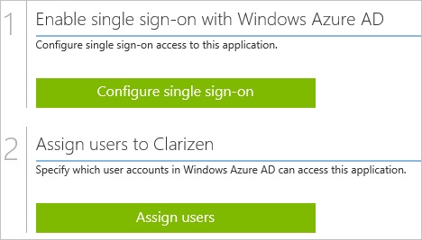
##Enabling the application integration for Clarizen

The objective of this section is to outline how to enable the application integration for Clarizen.

###To enable the application integration for Clarizen, perform the following steps:

1.  In the Azure classic portal, on the left navigation pane, click **Active Directory**.

    

2.  From the **Directory** list, select the directory for which you want to enable directory integration.

3.  To open the applications view, in the directory view, click **Applications** in the top menu.

    

4.  Click **Add** at the bottom of the page.

    

5.  On the **What do you want to do** dialog, click **Add an application from the gallery**.

    

6.  In the **search box**, type **Clarizen**.

    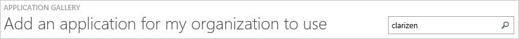

7.  In the results pane, select **Clarizen**, and then click **Complete** to add the application.

    
##Configuring single sign-on

The objective of this section is to outline how to enable users to authenticate to Clarizen with their account in Azure AD using federation based on the SAML protocol.

###To configure single sign-on, perform the following steps:

1.  In the Azure classic portal, on the **Clarizen** application integration page, click **Configure single sign-on** to open the **Configure Single Sign On ** dialog.

    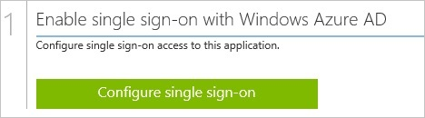

2.  On the **How would you like users to sign on to Clarizen** page, select **Microsoft Azure AD Single Sign-On**, and then click **Next**.

    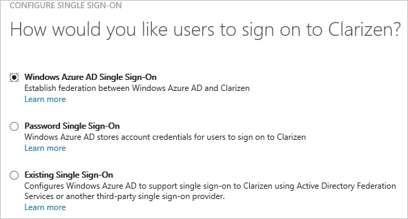

3.  On the **Configure single sign-on at Clarizen** page, to download your certificate, click **Download certificate**, and then save the certificate file on your computer.

    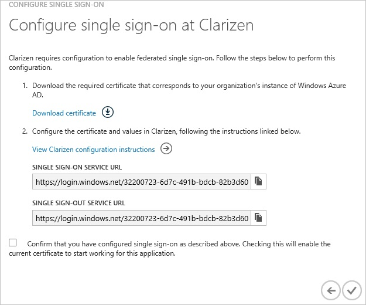

4.  In a different web browser window, log into your **Clarizen** company site as an administrator (e.g.: *https://app2.clarizen.com/Clarizen/Pages/Service/Login.aspx*).

5.  Click your user name, and then click **Settings**.

    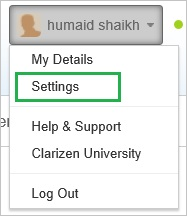

6.  Click the **Global Settings** tab, and then, next to **Federated Authentication**, click **edit**.

    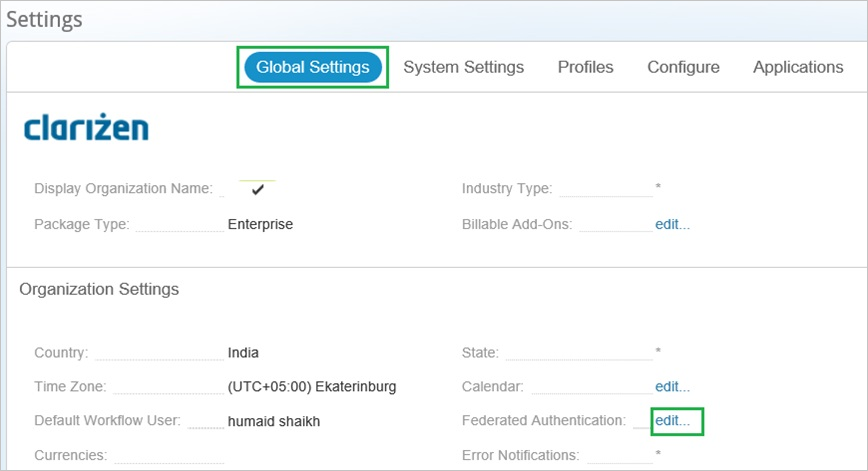

7.  On the **Federated Authentication** dialog, perform the following steps:

    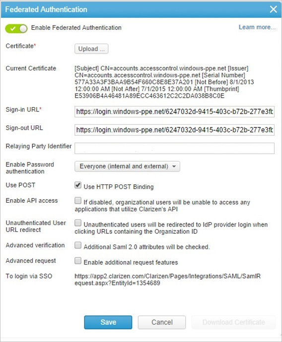

    1.  Click **Upload** to upload your downloaded certificate.
    2.  In the Azure classic portal, on the **Configure single sign-on at Clarizen** dialog page, copy the **Single Sign-On Service URL** value, and then paste it into the **Sign-in URL** textbox.
    3.  In the Azure classic portal, on the **Configure single sign-out at Clarizen** dialog page, copy the **Single Sign-Out Service URL** value, and then paste it into the **Sign-out URL** textbox.
    4.  Select **Use POST**.
    5.  Click **Save**.

8.  On the Azure classic portal, select the single sign-on configuration confirmation, and then click **Complete** to close the **Configure Single Sign On** dialog.

    
##Configuring user provisioning

In order to enable Azure AD users to log into Clarizen, they must be provisioned into Clarizen.  
In the case of Clarizen, provisioning is a manual task.

###To provision a user accounts, perform the following steps:

1.  Log in to your **Clarizen** company site as an administrator.

2.  Click **People**.

    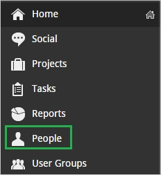

3.  Click **Invite User**.

    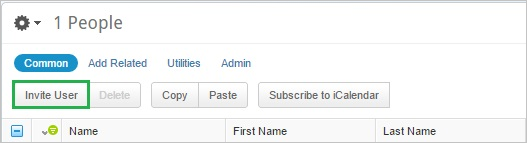

4.  On the Invite People dialog page, perform the following steps:

    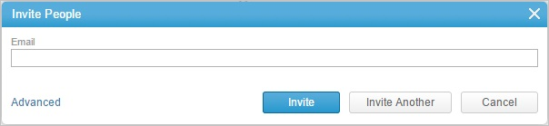

    1.  In the **Email** textbox, type the email address of a valid Azure Active Directory account you want to provision.
    2.  Click **Invite**.

    >[AZURE.NOTE] The Azure Active Directory account holder will receive an email and follow a link to confirm their account before it becomes active.

##Assigning users

To test your configuration, you need to grant the Azure AD users you want to allow using your application access to it by assigning them.

###To assign users to Clarizen, perform the following steps:

1.  In the Azure classic portal, create a test account.

2.  On the **Clarizen **application integration page, click **Assign users**.

    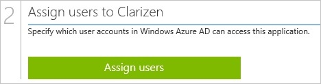

3.  Select your test user, click **Assign**, and then click **Yes** to confirm your assignment.

    

If you want to test your single sign-on settings, open the Access Panel. For more details about the Access Panel, see [Introduction to the Access Panel](active-directory-saas-access-panel-introduction.md).
