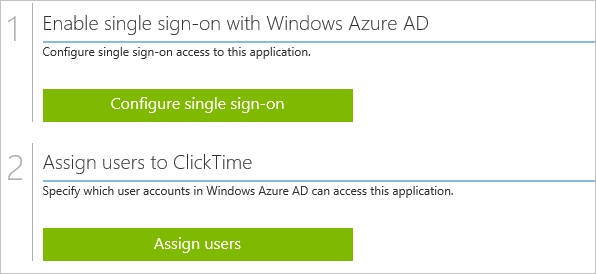
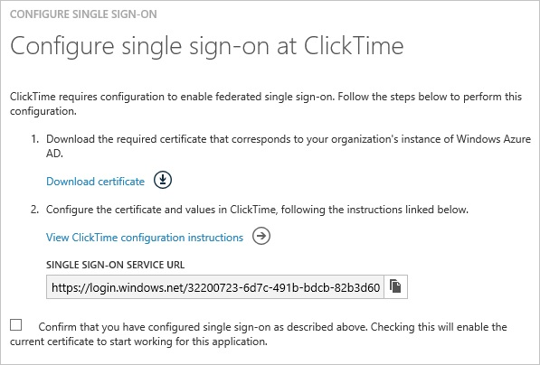
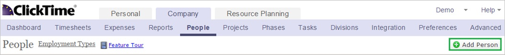
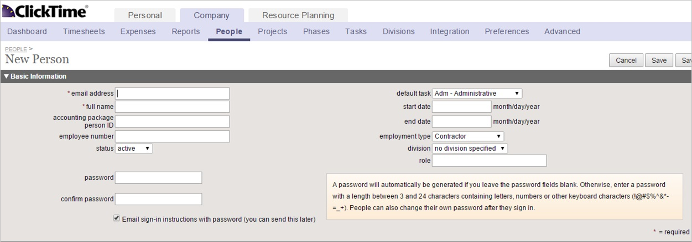
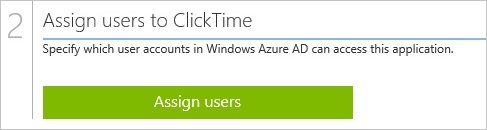

<properties 
    pageTitle="Tutorial: Azure Active Directory integration with ClickTime | Microsoft Azure" 
    description="Learn how to use ClickTime with Azure Active Directory to enable single sign-on, automated provisioning, and more!" 
    services="active-directory" 
    authors="jeevansd"  
    documentationCenter="na" 
    manager="femila"/>
<tags 
    ms.service="active-directory" 
    ms.devlang="na" 
    ms.topic="article" 
    ms.tgt_pltfrm="na" 
    ms.workload="identity" 
    ms.date="07/11/2016" 
    ms.author="jeedes" />

#Tutorial: Azure Active Directory integration with ClickTime

The objective of this tutorial is to show the integration of Azure and ClickTime.  
The scenario outlined in this tutorial assumes that you already have the following items:

-   A valid Azure subscription
-   A ClickTime tenant

After completing this tutorial, the Azure AD users you have assigned to ClickTime will be able to single sign into the application at your ClickTime company site (service provider initiated sign on), or using the [Introduction to the Access Panel](active-directory-saas-access-panel-introduction.md).

The scenario outlined in this tutorial consists of the following building blocks:

1.  Enabling the application integration for ClickTime
2.  Configuring single sign-on
3.  Configuring user provisioning
4.  Assigning users

##Enabling the application integration for ClickTime

The objective of this section is to outline how to enable the application integration for ClickTime.

###To enable the application integration for ClickTime, perform the following steps:

1.  In the Azure classic portal, on the left navigation pane, click **Active Directory**.

    

2.  From the **Directory** list, select the directory for which you want to enable directory integration.

3.  To open the applications view, in the directory view, click **Applications** in the top menu.

    

4.  Click **Add** at the bottom of the page.

    

5.  On the **What do you want to do** dialog, click **Add an application from the gallery**.

    

6.  In the **search box**, type **ClickTime**.

    

7.  In the results pane, select **ClickTime**, and then click **Complete** to add the application.

    
##Configuring single sign-on

The objective of this section is to outline how to enable users to authenticate to ClickTime with their account in Azure AD using federation based on the SAML protocol.  
As part of this procedure, you are required to upload a base-64 encoded certificate to your ClickTime tenant.  
If you are not familiar with this procedure, see [How to convert a binary certificate into a text file](http://youtu.be/PlgrzUZ-Y1o).

>[AZURE.IMPORTANT] In order to be able to configure single sign-on on your ClickTime tenant, you need to contact first the ClickTime technical support to get this feature enabled.

###To configure single sign-on, perform the following steps:

1.  In the Azure classic portal, on the **ClickTime** application integration page, click **Configure single sign-on** to open the **Configure Single Sign On ** dialog.

    

2.  On the **How would you like users to sign on to ClickTime** page, select **Microsoft Azure AD Single Sign-On**, and then click **Next**.

    

3.  On the **Configure single sign-on at ClickTime** page, to download your certificate, click **Download certificate**, and then save the certificate file on your computer.

    

4.  In a different web browser window, log into your ClickTime company site as an administrator.

5.  In the toolbar on the top, click **Preferences**, and then click **Security Settings**.

6.  In the **Single Sign-On Preferences** configuration section, perform the following steps:

    

    1.  Select **Allow** sign-in using Single Sign-On (SSO) with **OneLogin**.
    2.  In the Azure classic portal, on the **Configure single sign-on at ClickTime** dialog page, copy the **Single Sign-On Service URL** value, and then paste it into the **Identity Provider Endpoint** textbox.
    3.  Create a **base-64 encoded** file from your downloaded certificate.  

        >[AZURE.TIP] For more details, see [How to convert a binary certificate into a text file](http://youtu.be/PlgrzUZ-Y1o)

    4.  Open the base-64 encoded certificate in **Notepad**, copy the content, and then paste it into the **X.509 Certificate** textbox.
    5.  Click **Save**.

7.  On the Azure classic portal, select the single sign-on configuration confirmation, and then click **Complete** to close the **Configure Single Sign On** dialog.

    
##Configuring user provisioning

In order to enable Azure AD users to log into ClickTime, they must be provisioned into ClickTime.  
In the case of ClickTime, provisioning is a manual task.

###To provision a user accounts, perform the following steps:

1.  Log in to your **ClickTime** tenant.

2.  In the toolbar on the top, click **Company**, and then click **People**.

    

3.  Click **Add Person**.

    

4.  In the New Person section, perform the following steps:

    

    1.  In the **email address** textbox, type the email address of your Azure AD account.
    2.  In the **full name** textbox, type the name of your Azure AD account.  

        >[AZURE.NOTE] If you want to, you can set additional properties of the new person object.

    3.  Click **Save**.

>[AZURE.NOTE] You can use any other ClickTime user account creation tools or APIs provided by ClickTime to provision AAD user accounts.

##Assigning users

To test your configuration, you need to grant the Azure AD users you want to allow using your application access to it by assigning them.

###To assign users to ClickTime, perform the following steps:

1.  In the Azure classic portal, create a test account.

2.  On the **ClickTime **application integration page, click **Assign users**.

    

3.  Select your test user, click **Assign**, and then click **Yes** to confirm your assignment.

    

If you want to test your single sign-on settings, open the Access Panel. For more details about the Access Panel, see [Introduction to the Access Panel](active-directory-saas-access-panel-introduction.md).
