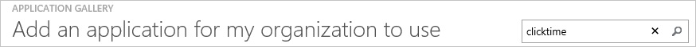
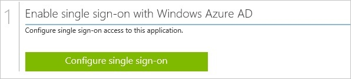
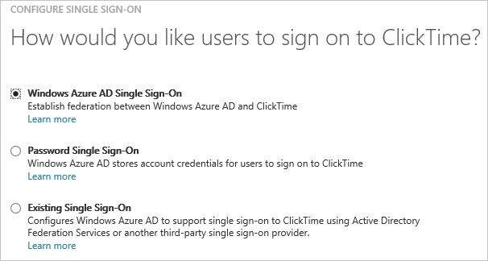
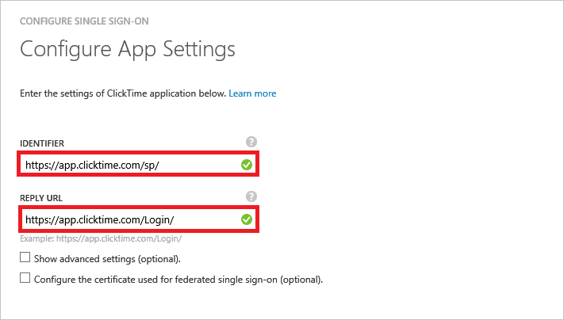
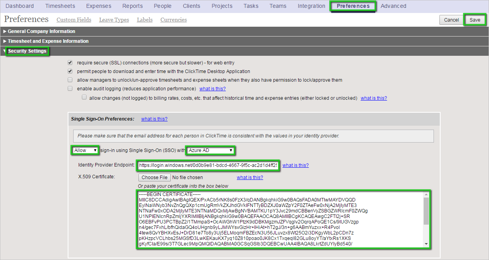
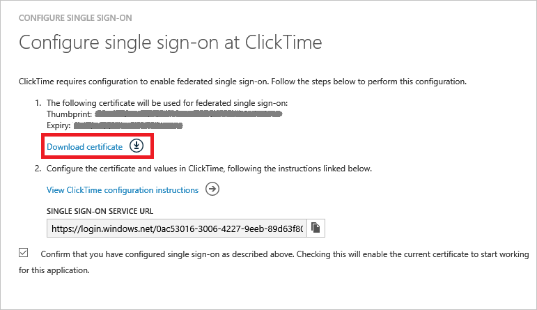
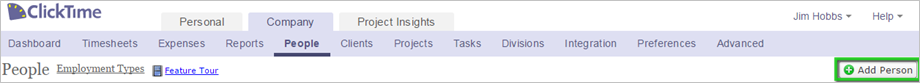
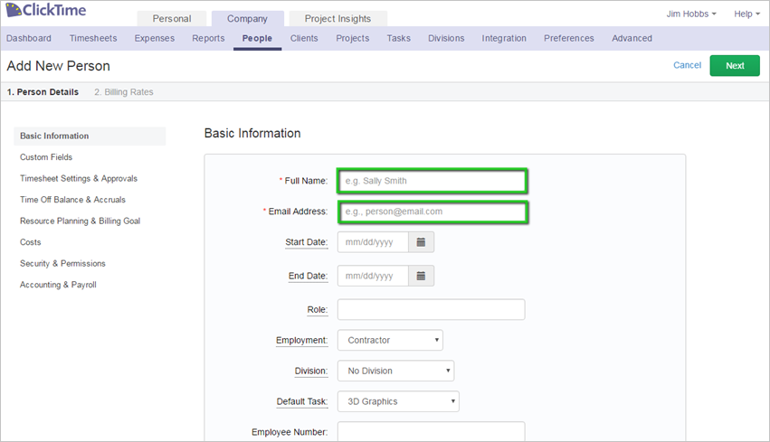
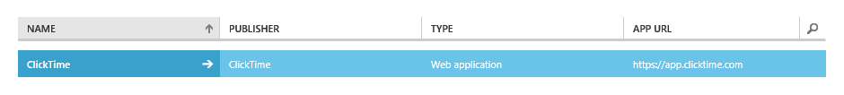

# Tutorial: Azure Active Directory integration with ClickTime
In this tutorial, you learn how to integrate ClickTime with Azure Active Directory (Azure AD).

Integrating ClickTime with Azure AD provides you with the following benefits:

* You can control in Azure AD who has access to ClickTime
* You can enable your users to automatically get signed-on to ClickTime (Single Sign-On) with their Azure AD accounts
* You can manage your accounts in one central location - the Azure classic portal

If you want to know more details about SaaS app integration with Azure AD, see [What is application access and single sign-on with Azure Active Directory](active-directory-appssoaccess-whatis.md).

## Prerequisites
To configure Azure AD integration with ClickTime, you need the following items:

* An Azure AD subscription
* A ClickTime single-sign on enabled subscription

> [!NOTE]
> To test the steps in this tutorial, we do not recommend using a production environment.
> 
> 

To test the steps in this tutorial, you should follow these recommendations:

* You should not use your production environment, unless this is necessary.
* If you don't have an Azure AD trial environment, you can get a one-month trial [here](https://azure.microsoft.com/pricing/free-trial/).

## Scenario description
In this tutorial, you test Azure AD single sign-on in a test environment.

The scenario outlined in this tutorial consists of two main building blocks:

1. Adding ClickTime from the gallery
2. Configuring and testing Azure AD single sign-on

## Adding ClickTime from the gallery
The objective of this section is to outline how to enable the application integration for ClickTime.

### To enable the application integration for ClickTime, perform the following steps:
1. In the Azure classic portal, on the left navigation pane, click **Active Directory**.
   
   
2. From the **Directory** list, select the directory for which you want to enable directory integration.
3. To open the applications view, in the directory view, click **Applications** in the top menu.
   
   
4. Click **Add** at the bottom of the page.
   
   
5. On the **What do you want to do** dialog, click **Add an application from the gallery**.
   
   
6. In the **search box**, type **ClickTime**.
   
   
7. In the results pane, select **ClickTime**, and then click **Complete** to add the application.
   
   

## Configuring and testing Azure AD single sign-on
In this section, you configure and test Azure AD single sign-on with ClickTime based on a test user called "Britta Simon".

For single sign-on to work, Azure AD needs to know what the counterpart user in ClickTime is to a user in Azure AD. In other words, a link relationship between an Azure AD user and the related user in ClickTime needs to be established.

This link relationship is established by assigning the value of the **user name** in Azure AD as the value of the **Username** in ClickTime.

To configure and test Azure AD single sign-on with ClickTime, you need to complete the following building blocks:

1. **[Configuring Azure AD Single Sign-On](#configuring-azure-ad-single-sign-on)** - to enable your users to use this feature.
2. **[Creating an Azure AD test user](#creating-an-azure-ad-test-user)** - to test Azure AD single sign-on with Britta Simon.
3. **[Creating a ClickTime test user](#creating-a-clicktime-test-user)** - to have a counterpart of Britta Simon in ClickTime that is linked to the Azure AD representation of her.
4. **[Assigning the Azure AD test user](#assigning-the-azure-ad-test-user)** - to enable Britta Simon to use Azure AD single sign-on.
5. **[Testing Single Sign-On](#testing-single-sign-on)** - to verify whether the configuration works.

### Configuring Azure AD single sign-on
The objective of this section is to outline how to enable users to authenticate to ClickTime with their account in Azure AD using federation based on the SAML protocol.  

> [!IMPORTANT]
> In order to be able to configure single sign-on on your ClickTime tenant, you need to contact first the ClickTime technical support to get this feature enabled.
> 
> 

**To configure Azure AD single sign-on with ClickTime, perform the following steps:**

1. In the Azure classic portal, on the **ClickTime** application integration page, click **Configure single sign-on** to open the **Configure Single Sign On** dialog.
   
   
2. On the **How would you like users to sign on to ClickTime** page, select **Microsoft Azure AD Single Sign-On**, and then click **Next**.
   
   
3. On the **Configure App Settings** dialog page, perform the following steps:
   
     
   
    a. In the **IdentifierL** textbox, type the URL using the following pattern: **https://app.clicktime.com/sp/**
   
    b. In the **Reply URL** textbox, type the URL using the following pattern: **https://app.clicktime.com/Login/**
   
    c. click **Next**
4. On the **Configure single sign-on at ClickTime** page, to download your certificate, click **Download certificate**, and then save the certificate file on your computer.
   
   
5. In a different web browser window, log into your ClickTime company site as an administrator.
6. In the toolbar on the top, click **Preferences**, and then click **Security Settings**.
7. In the **Single Sign-On Preferences** configuration section, perform the following steps:
   
   
   
   a.  Select **Allow** sign-in using Single Sign-On (SSO) with **Azure AD**.
   
   b.  In the Azure classic portal, on the **Configure single sign-on at ClickTime** dialog page, copy the **Single Sign-On Service URL** value, and then paste it into the **Identity Provider Endpoint** textbox.
   
   c.  Open the base-64 encoded certificate in **Notepad**, copy the content, and then paste it into the **X.509 Certificate** textbox.
   
   d.  Click **Save**.
8. On the Azure classic portal, select the single sign-on configuration confirmation, and then click **Complete** to close the **Configure Single Sign On** dialog.
   
   

## Configuring user provisioning
In order to enable Azure AD users to log into ClickTime, they must be provisioned into ClickTime.  
In the case of ClickTime, provisioning is a manual task.

### To provision a user accounts, perform the following steps:
1. Log in to your **ClickTime** tenant.
2. In the toolbar on the top, click **Company**, and then click **People**.
   
   
3. Click **Add Person**.
   
   
4. In the New Person section, perform the following steps:
   
   
   
   a.  In the **email address** textbox, type the email address of your Azure AD account.
   
   b.  In the **full name** textbox, type the name of your Azure AD account.  
   
   > [!NOTE]
   > If you want to, you can set additional properties of the new person object.
   > 
   > 
   
   c.  Click **Save**.

> [!NOTE]
> You can use any other ClickTime user account creation tools or APIs provided by ClickTime to provision Azure AD user accounts.
> 
> 

### Assigning the Azure AD test user
In this section, you enable Britta Simon to use Azure single sign-on by granting her access to ClickTime.

![Assign User][200]

To test your configuration, you need to grant the Azure AD users you want to allow using your application access to it by assigning them.

**To assign Britta Simon to ClickTime, perform the following steps**

1. On the classic portal, to open the applications view, in the directory view, click **Applications** in the top menu.
   
    ![Assign User][201] 
2. In the applications list, select **ClickTime**.
   
     
3. In the menu on the top, click **Users**.
   
    ![Assign User][203]
4. In the Users list, select **Britta Simon**.
5. In the toolbar on the bottom, click **Assign**.
   
    ![Assign User][205]

## Testing single sign-on
In this section, you test your Azure AD single sign-on configuration using the Access Panel.

When you click the ClickTime tile in the Access Panel, you should get automatically signed-on to your ClickTime application.

## Additional resources
* [List of Tutorials on How to Integrate SaaS Apps with Azure Active Directory](active-directory-saas-tutorial-list.md)
* [What is application access and single sign-on with Azure Active Directory?](active-directory-appssoaccess-whatis.md)

<!--Image references-->

[200]: ./media/active-directory-saas-clicktime-tutorial/tutorial_general_200.png
[201]: ./media/active-directory-saas-clicktime-tutorial/tutorial_general_201.png
[203]: ./media/active-directory-saas-clicktime-tutorial/tutorial_general_203.png
[205]: ./media/active-directory-saas-clicktime-tutorial/tutorial_general_205.png
