<properties pageTitle="Tutorial: Azure Active Directory integration with CloudBees | Microsoft Azure" description="Learn how to use CloudBees with Azure Active Directory to enable single sign-on, automated provisioning, and more!." services="active-directory" authors="MarkusVi"  documentationCenter="na" manager="stevenpo"/>
<tags ms.service="active-directory" ms.devlang="na" ms.topic="article" ms.tgt_pltfrm="na" ms.workload="identity" ms.date="07/31/2015" ms.author="markvi" />
#Tutorial: Azure Active Directory integration with CloudBees
>[AZURE.TIP]For feedback, click [here](http://go.microsoft.com/fwlink/?LinkId=528737).

The objective of this tutorial is to show the integration of Azure and CloudBees.
 The scenario outlined in this tutorial assumes that you already have the following items:

-   A valid Azure subscription
-   A CloudBees tenant

After completing this tutorial, the Azure AD users you have assigned to CloudBees will be able to single sign into the application at your CloudBees company site (service provider initiated sign on), or using the [Introduction to the Access Panel](https://msdn.microsoft.com/library/azure/dn308586.aspx)

The scenario outlined in this tutorial consists of the following building blocks:

1.  Enabling the application integration for CloudBees
2.  Configuring single sign-on
3.  Configuring user provisioning
4.  Assigning users

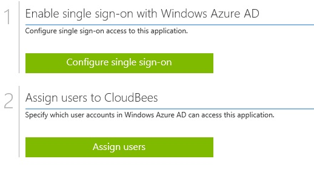

##Enabling the application integration for CloudBees

The objective of this section is to outline how to enable the application integration for CloudBees.

###To enable the application integration for CloudBees, perform the following steps:

1.  In the Azure Management Portal, on the left navigation pane, click **Active Directory**.

    

2.  From the **Directory** list, select the directory for which you want to enable directory integration.

3.  To open the applications view, in the directory view, click **Applications** in the top menu.

    

4.  Click **Add** at the bottom of the page.

    

5.  On the **What do you want to do** dialog, click **Add an application from the gallery**.

    

6.  In the **search box**, type **CloudBees**.

    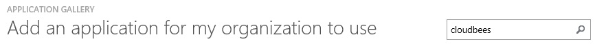

7.  In the results pane, select **CloudBees**, and then click **Complete** to add the application.

    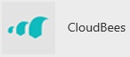

##Configuring single sign-on

The objective of this section is to outline how to enable users to authenticate to CloudBees with their account in Azure AD using federation based on the SAML protocol.
Configuring single sign-on for CloudBees requires you to retrieve a thumbprint value from a certificate.
 If you are not familiar with this procedure, see [How to retrieve a certificate's thumbprint value](http://youtu.be/YKQF266SAxI).

###To configure single sign-on, perform the following steps:

1.  In the Azure AD portal, on the **CloudBees** application integration page, click **Configure single sign-on** to open the **Configure Single Sign On ** dialog.

    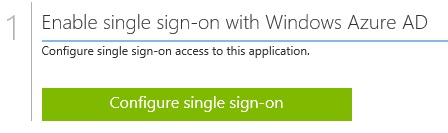

2.  On the **How would you like users to sign on to CloudBees** page, select **Windows Azure AD Single Sign-On**, and then click **Next**.

    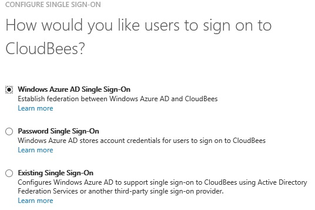

3.  On the **Configure App URL** page, in the **CloudBees Sign On URL** textbox, type your URL used by your user to sign in to CoudBees (e.g.: *https://grandcentral.cloudbees.com/login*", and then click **Next**.

    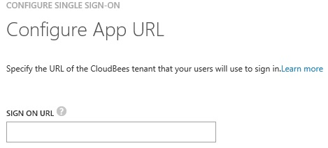

4.  On the **Configure single sign-on at CloudBees** page, to download your certificate, click **Download certificate**, and then save the certificate locally on your computer.

    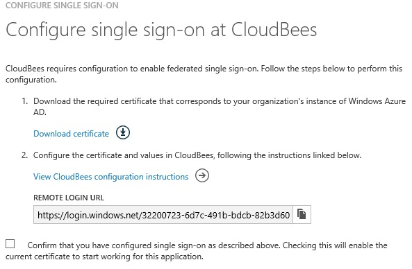

5.  In a different web browser window, log into your CloudBees company site as an administrator.

6.  In the menu on the top, click **Settings**.

    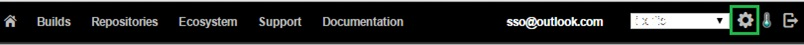

7.  Click the **SSO integration** tab.

8.  In the **Set Up SAML 2.0 Single Sign On** section, perform the following steps:

    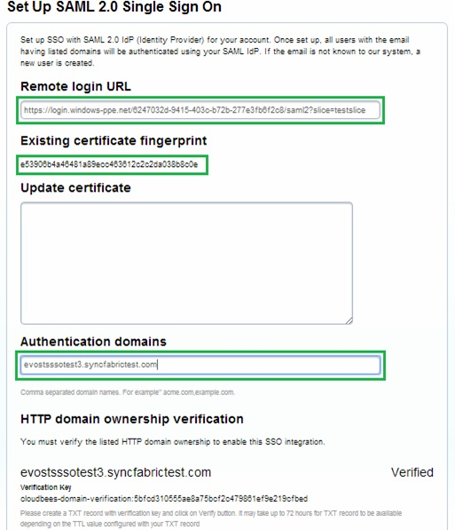

    1.  In the Azure AD portal, on the **Configure single sign-on at CloudBees** page, copy the **Remote Login URL** value, and then paste it into the **Remote login URL** textbox.
    2.  Copy the **Thumbprint** value from the exported certificate, and then paste it into the **Existing certificate fingerprint** textbox.
    
        >[AZURE.NOTE]For more details, see [How to retrieve a certificate's thumbprint value](http://youtu.be/YKQF266SAxI)

    3.  In the **Authentication domains** textbox, type your company’s domain.
    4.  Click **Save**.

9.  On the Azure AD portal, select the single sign-on configuration confirmation, and then click **Complete** to close the **Configure Single Sign On** dialog.

    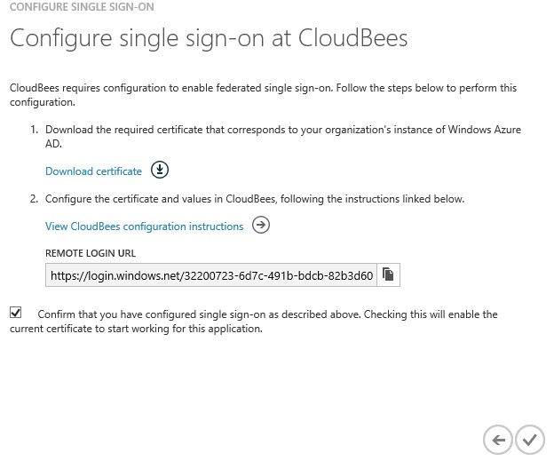

##Configuring user provisioning

In order to enable Azure AD users to log into **CloudBees**, they must be provisioned into **CloudBees**.
 In the case of **CloudBees**, provisioning is a manual task.

###To provision a user account to CloudBees, perform the following steps:

1.  Log in to your **CloudBees** company site as an administrator.

2.  Go to **Edit Users**.

    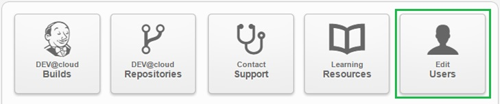

3.  Click **Add**.

    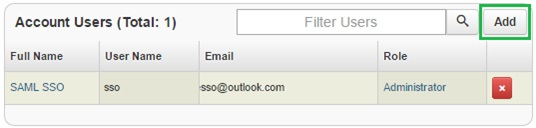

4.  In the **Add User** section, perform the following steps:

    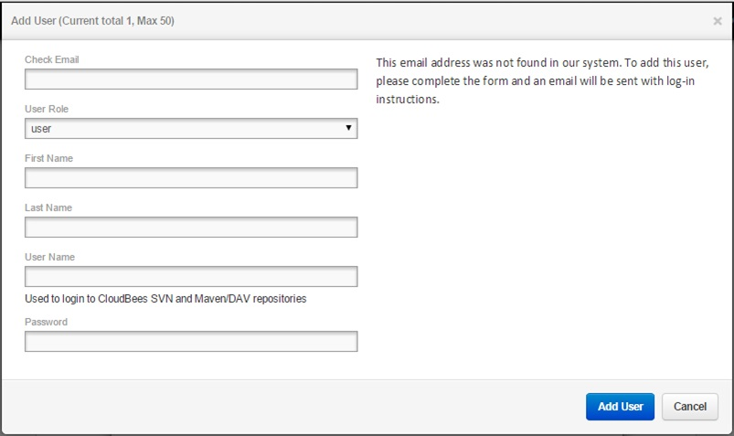

    1.  Type the **Email**, **First Name**, **Last Name** and other attributes of a valid Azure Active Directory account you want to provision into the related textboxes.
    2.  Click **Add User**.

        >[AZURE.NOTE]An email with login instructions will be send to the owner of the account.

>[AZURE.NOTE]You can use any other CloudBees user account creation tools or APIs provided by CloudBees to provision AAD user accounts.

##Assigning users

To test your configuration, you need to grant the Azure AD users you want to allow using your application access to it by assigning them.

###To assign users to CloudBees, perform the following steps:

1.  In the Azure AD portal, create a test account.

2.  On the **CloudBees** application integration page, click **Assign users**.

    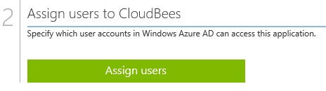

3.  Select your test user, click **Assign**, and then click **Yes** to confirm your assignment.

    

If you want to test your single sign-on settings, open the Access Panel. For more details about the Access Panel, see [Introduction to the Access Panel](https://msdn.microsoft.com/library/azure/dn308586.aspx).