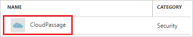
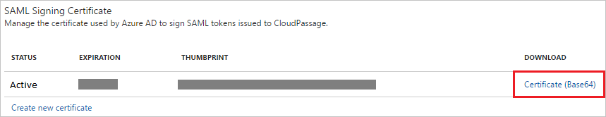
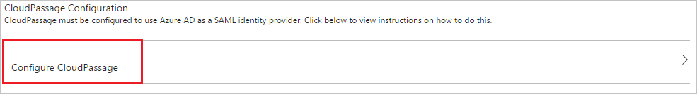

# Tutorial: Azure Active Directory integration with CloudPassage

In this tutorial, you learn how to integrate CloudPassage with Azure Active Directory (Azure AD).

Integrating CloudPassage with Azure AD provides you with the following benefits:

- You can control in Azure AD who has access to CloudPassage
- You can enable your users to automatically get signed-on to CloudPassage (Single Sign-On) with their Azure AD accounts
- You can manage your accounts in one central location - the Azure portal

If you want to know more details about SaaS app integration with Azure AD, see [what is application access and single sign-on with Azure Active Directory](active-directory-appssoaccess-whatis.md).

## Prerequisites

To configure Azure AD integration with CloudPassage, you need the following items:

- An Azure AD subscription
- A CloudPassage single sign-on enabled subscription

> [!NOTE]
> To test the steps in this tutorial, we do not recommend using a production environment.

To test the steps in this tutorial, you should follow these recommendations:

- Do not use your production environment, unless it is necessary.
- If you don't have an Azure AD trial environment, you can get a one-month trial [here](https://azure.microsoft.com/pricing/free-trial/).

## Scenario description
In this tutorial, you test Azure AD single sign-on in a test environment. 
The scenario outlined in this tutorial consists of two main building blocks:

1. Adding CloudPassage from the gallery
2. Configuring and testing Azure AD single sign-on

## Adding CloudPassage from the gallery
To configure the integration of CloudPassage into Azure AD, you need to add CloudPassage from the gallery to your list of managed SaaS apps.

**To add CloudPassage from the gallery, perform the following steps:**

1. In the **[Azure portal](https://portal.azure.com)**, on the left navigation panel, click **Azure Active Directory** icon. 

	![Active Directory][1]

2. Navigate to **Enterprise applications**. Then go to **All applications**.

	![Applications][2]
	
3. To add new application, click **New application** button on the top of dialog.

	![Applications][3]

4. In the search box, type **CloudPassage**.

	

5. In the results panel, select **CloudPassage**, and then click **Add** button to add the application.

	

##  Configuring and testing Azure AD single sign-on
In this section, you configure and test Azure AD single sign-on with CloudPassage based on a test user called "Britta Simon."

For single sign-on to work, Azure AD needs to know what the counterpart user in CloudPassage is to a user in Azure AD. In other words, a link relationship between an Azure AD user and the related user in CloudPassage needs to be established.

In CloudPassage, assign the value of the **user name** in Azure AD as the value of the **Username** to establish the link relationship.

To configure and test Azure AD single sign-on with CloudPassage, you need to complete the following building blocks:

1. **[Configuring Azure AD Single Sign-On](#configuring-azure-ad-single-sign-on)** - to enable your users to use this feature.
2. **[Creating an Azure AD test user](#creating-an-azure-ad-test-user)** - to test Azure AD single sign-on with Britta Simon.
3. **[Creating a CloudPassage test user](#creating-a-cloudpassage-test-user)** - to have a counterpart of Britta Simon in CloudPassage that is linked to the Azure AD representation of user.
4. **[Assigning the Azure AD test user](#assigning-the-azure-ad-test-user)** - to enable Britta Simon to use Azure AD single sign-on.
5. **[Testing Single Sign-On](#testing-single-sign-on)** - to verify whether the configuration works.

### Configuring Azure AD single sign-on

In this section, you enable Azure AD single sign-on in the Azure portal and configure single sign-on in your CloudPassage application.

**To configure Azure AD single sign-on with CloudPassage, perform the following steps:**

1. In the Azure portal, on the **CloudPassage** application integration page, click **Single sign-on**.

	![Configure Single Sign-On][4]

2. On the **Single sign-on** dialog, select **Mode** as	**SAML-based Sign-on** to enable single sign-on.
 
	

3. On the **CloudPassage Domain and URLs** section, perform the following steps:

	

    a. In the **Sign-on URL** textbox, type a URL using the following pattern: `https://portal.cloudpassage.com/saml/init/accountid`

	b. In the **Reply URL** textbox, type a URL using the following pattern: `https://portal.cloudpassage.com/saml/consume/accountid`. You can get your value for this attribute by clicking **SSO Setup documentation** in the **Single Sign-on Settings** section of your CloudPassage portal.

	
	 
	> [!NOTE] 
	> These values are not real. Update these values with the actual Reply URL, and Sign-On URL. Contact [CloudPassage Client support team](https://www.cloudpassage.com/company/contact/) to get these values. 

4. On the **SAML Signing Certificate** section, click **Certificate(Base64)** and then save the certificate file on your computer.

	 

5. Your CloudPassage application expects the SAML assertions in a specific format, which requires you to add custom attribute mappings to your SAML token attributes configuration.	
The following screenshot shows an example for this.
   
    

6. In the **User Attributes** section on the **Single sign-on** dialog, configure SAML token attribute as shown in the image above and perform the following steps:

	| Attribute Name | Attribute Value |
	| --- | --- |
	| firstname |user.givenname |
	| lastname |user.surname |
	| email |user.mail |
	
	a. Click **Add attribute** to open the **Add Attribute** dialog.

	
	
	
	
	b. In the **Name** textbox, type the attribute name shown for that row.

	c. From the **Value** list, type the attribute value shown for that row.
	
	d. Click **Ok**.

7. Click **Save** button.

	
	
8. On the **CloudPassage Configuration** section, click **Configure CloudPassage** to open **Configure sign-on** window. Copy the **Sign-Out URL, SAML Entity ID, and SAML Single Sign-On Service URL** from the **Quick Reference section.**

	 

9. In a different browser window, sign-on to your CloudPassage company site as administrator.

10. In the menu on the top, click **Settings**, and then click **Site Administration**. 
   
    ![Configure Single Sign-On][12]

11. Click the **Authentication Settings** tab. 
   
    ![Configure Single Sign-On][13]

12. In the **Single Sign-on Settings** section, perform the following steps: 
   
    ![Configure Single Sign-On][14]
	
	a. Paste **SAML Entity ID** into the **SAML issuer URL** textbox.
  
    b. Paste **SAML Single Sign-On Service URL** into the **SAML endpoint URL** textbox.
  
    c. Paste **Sign-Out URL** into the **Logout landing page** textbox.
  
    d. Open your downloaded certificate in notepad, copy the content of downloaded certificate into your clipboard, and then paste it into the **x 509 certificate** textbox.
  
    e. Click **Save**.

> [!TIP]
> You can now read a concise version of these instructions inside the [Azure portal](https://portal.azure.com), while you are setting up the app!  After adding this app from the **Active Directory > Enterprise Applications** section, simply click the **Single Sign-On** tab and access the embedded documentation through the **Configuration** section at the bottom. You can read more about the embedded documentation feature here: [Azure AD embedded documentation]( https://go.microsoft.com/fwlink/?linkid=845985)

### Creating an Azure AD test user
The objective of this section is to create a test user in the Azure portal called Britta Simon.

![Create Azure AD User][100]

**To create a test user in Azure AD, perform the following steps:**

1. In the **Azure portal**, on the left navigation pane, click **Azure Active Directory** icon.

	 

2. To display the list of users, go to **Users and groups** and click **All users**.
	
	 

3. To open the **User** dialog, click **Add** on the top of the dialog.
 
	 

4. On the **User** dialog page, perform the following steps:
 
	 

    a. In the **Name** textbox, type **BrittaSimon**.

    b. In the **User name** textbox, type the **email address** of BrittaSimon.

	c. Select **Show Password** and write down the value of the **Password**.

    d. Click **Create**.
 
### Creating a CloudPassage test user

The objective of this section is to create a user called Britta Simon in CloudPassage.

**To create a user called Britta Simon in CloudPassage, perform the following steps:**

1. Sign-on to your **CloudPassage** company site as an administrator. 

2. In the toolbar on the top, click **Settings**, and then click **Site Administration**. 
   
   ![Creating a CloudPassage test user][22] 

3. Click the **Users** tab, and then click **Add New User**. 
   
   ![Creating a CloudPassage test user][23]

4. In the **Add New User** section, perform the following steps: 
   
   ![Creating a CloudPassage test user][24]
	
	a. In the **First Name** textbox, type Britta. 
  
    b. In the **Last Name** textbox, type Simon.
  
    c. In the **Username** textbox, the **Email** textbox and the **Retype Email** textbox, type Britta's user name in Azure AD.
  
    d. As **Access Type**, select **Enable Halo Portal Access**.
  
    e. Click **Add**.

### Assigning the Azure AD test user

In this section, you enable Britta Simon to use Azure single sign-on by granting access to CloudPassage.

![Assign User][200] 

**To assign Britta Simon to CloudPassage, perform the following steps:**

1. In the Azure portal, open the applications view, and then navigate to the directory view and go to **Enterprise applications** then click **All applications**.

	![Assign User][201] 

2. In the applications list, select **CloudPassage**.

	 

3. In the menu on the left, click **Users and groups**.

	![Assign User][202] 

4. Click **Add** button. Then select **Users and groups** on **Add Assignment** dialog.

	![Assign User][203]

5. On **Users and groups** dialog, select **Britta Simon** in the Users list.

6. Click **Select** button on **Users and groups** dialog.

7. Click **Assign** button on **Add Assignment** dialog.
	
### Testing single sign-on

The objective of this section is to test your Azure AD SSO configuration using the Access Panel.

When you click the CloudPassage tile in the Access Panel, you should get automatically signed-on to your CloudPassage application.

## Additional resources

* [List of Tutorials on How to Integrate SaaS Apps with Azure Active Directory](active-directory-saas-tutorial-list.md)
* [What is application access and single sign-on with Azure Active Directory?](active-directory-appssoaccess-whatis.md)

<!--Image references-->

[1]: ./media/active-directory-saas-cloudpassage-tutorial/tutorial_general_01.png
[2]: ./media/active-directory-saas-cloudpassage-tutorial/tutorial_general_02.png
[3]: ./media/active-directory-saas-cloudpassage-tutorial/tutorial_general_03.png
[4]: ./media/active-directory-saas-cloudpassage-tutorial/tutorial_general_04.png
[12]: ./media/active-directory-saas-cloudpassage-tutorial/tutorial_cloudpassage_07.png
[13]: ./media/active-directory-saas-cloudpassage-tutorial/tutorial_cloudpassage_08.png
[14]: ./media/active-directory-saas-cloudpassage-tutorial/tutorial_cloudpassage_09.png
[15]: ./media/active-directory-saas-cloudpassage-tutorial/tutorial_cloudpassage_10.png
[22]: ./media/active-directory-saas-cloudpassage-tutorial/tutorial_cloudpassage_15.png
[23]: ./media/active-directory-saas-cloudpassage-tutorial/tutorial_cloudpassage_16.png
[24]: ./media/active-directory-saas-cloudpassage-tutorial/tutorial_cloudpassage_17.png

[100]: ./media/active-directory-saas-cloudpassage-tutorial/tutorial_general_100.png

[200]: ./media/active-directory-saas-cloudpassage-tutorial/tutorial_general_200.png
[201]: ./media/active-directory-saas-cloudpassage-tutorial/tutorial_general_201.png
[202]: ./media/active-directory-saas-cloudpassage-tutorial/tutorial_general_202.png
[203]: ./media/active-directory-saas-cloudpassage-tutorial/tutorial_general_203.png

