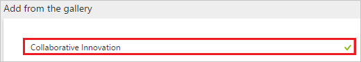
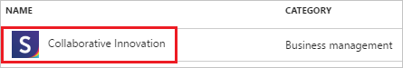
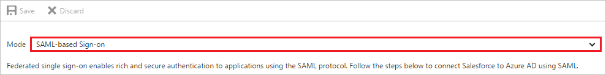
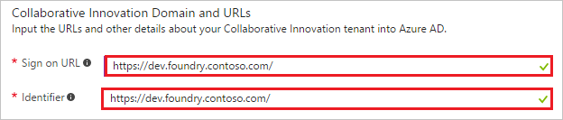
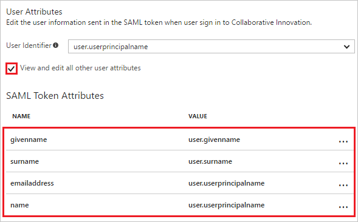
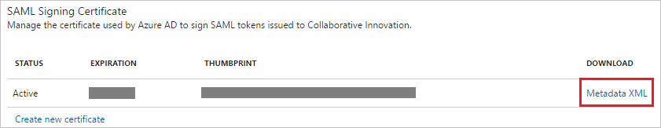
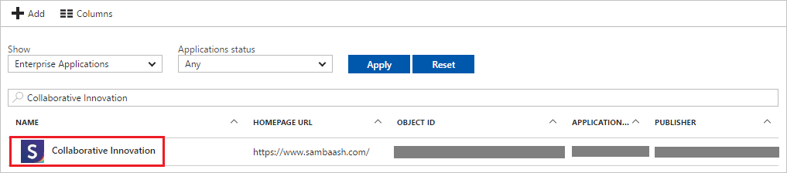

# Tutorial: Azure Active Directory integration with Collaborative Innovation

In this tutorial, you learn how to integrate Collaborative Innovation with Azure Active Directory (Azure AD).

Integrating Collaborative Innovation with Azure AD provides you with the following benefits:

- You can control in Azure AD who has access to Collaborative Innovation
- You can enable your users to automatically get signed-on to Collaborative Innovation (Single Sign-On) with their Azure AD accounts
- You can manage your accounts in one central location - the Azure portal

If you want to know more details about SaaS app integration with Azure AD, see [what is application access and single sign-on with Azure Active Directory](active-directory-appssoaccess-whatis.md).

## Prerequisites

To configure Azure AD integration with Collaborative Innovation, you need the following items:

- An Azure AD subscription
- A Collaborative Innovation single-sign on enabled subscription

> [!NOTE]
> To test the steps in this tutorial, we do not recommend using a production environment.

To test the steps in this tutorial, you should follow these recommendations:

- Do not use your production environment, unless it is necessary.
- If you don't have an Azure AD trial environment, you can get a one-month trial [here](https://azure.microsoft.com/pricing/free-trial/).

## Scenario description
In this tutorial, you test Azure AD single sign-on in a test environment. 
The scenario outlined in this tutorial consists of two main building blocks:

1. Adding Collaborative Innovation from the gallery
2. Configuring and testing Azure AD single sign-on

## Adding Collaborative Innovation from the gallery
To configure the integration of Collaborative Innovation into Azure AD, you need to add Collaborative Innovation from the gallery to your list of managed SaaS apps.

**To add Collaborative Innovation from the gallery, perform the following steps:**

1. In the **[Azure portal](https://portal.azure.com)**, on the left navigation panel, click **Azure Active Directory** icon. 

	![Active Directory][1]

2. Navigate to **Enterprise applications**. Then go to **All applications**.

	![Applications][2]
	
3. To add new application, click **New application** button on the top of dialog.

	![Applications][3]

4. In the search box, type **Collaborative Innovation**.

	

5. In the results panel, select **Collaborative Innovation**, and then click **Add** button to add the application.

	

##  Configuring and testing Azure AD single sign-on
In this section, you configure and test Azure AD single sign-on with Collaborative Innovation based on a test user called "Britta Simon."

For single sign-on to work, Azure AD needs to know what the counterpart user in Collaborative Innovation is to a user in Azure AD. In other words, a link relationship between an Azure AD user and the related user in Collaborative Innovation needs to be established.

In Collaborative Innovation, assign the value of the **user name** in Azure AD as the value of the **Username** to establish the link relationship.

To configure and test Azure AD single sign-on with Collaborative Innovation, you need to complete the following building blocks:

1. **[Configuring Azure AD Single Sign-On](#configuring-azure-ad-single-sign-on)** - to enable your users to use this feature.
2. **[Creating an Azure AD test user](#creating-an-azure-ad-test-user)** - to test Azure AD single sign-on with Britta Simon.
3. **[Creating a Collaborative Innovation test user](#creating-a-collaborative-innovation-test-user)** - to have a counterpart of Britta Simon in Collaborative Innovation that is linked to the Azure AD representation of user.
4. **[Assigning the Azure AD test user](#assigning-the-azure-ad-test-user)** - to enable Britta Simon to use Azure AD single sign-on.
5. **[Testing Single Sign-On](#testing-single-sign-on)** - to verify whether the configuration works.

### Configuring Azure AD single sign-on

In this section, you enable Azure AD single sign-on in the Azure portal and configure single sign-on in your Collaborative Innovation application.

**To configure Azure AD single sign-on with Collaborative Innovation, perform the following steps:**

1. In the Azure portal, on the **Collaborative Innovation** application integration page, click **Single sign-on**.

	![Configure Single Sign-On][4]

2. On the **Single sign-on** dialog, select **Mode** as	**SAML-based Sign-on** to enable single sign-on.
 
	

3. On the **Collaborative Innovation Domain and URLs** section, perform the following steps:

	

    a. In the **Sign-on URL** textbox, type a URL using the following pattern: `https://<instancename>.foundry.<companyname>.com/`

	b. In the **Identifier** textbox, type a URL using the following pattern: `https://<instancename>.foundry.<companyname>.com`
	
	> [!NOTE] 
	> These values are not real. Update these values with the actual Sign-On URL and Identifier. Contact [Collaborative Innovation Client support team](https://www.unilever.com/contact/) to get these values.  

4. Collaborative Innovation application expects the SAML assertions in a specific format. Please configure the following claims for this application. You can manage the values of these attributes from the "**User Attributes**" section on application integration page. The following screenshot shows an example for this.
	
	
	
5. Click **View and edit all other user attributes** checkbox in the **User Attributes** section to expand the attributes. Perform the following steps on each of the displayed attributes-

	| Attribute Name | Attribute Value |
	| ---------------| --------------- |    
	| givenname | user.givenname |
	| surname | user.surname |
	| emailaddress | user.userprincipalname |
	| name | user.userprincipalname |

	a. Click the attribute to open the **Edit Attribute** window.

	

	b. Delete the URL value from the **Namespace**.
	
	c. Click **Ok** to save the setting.

6. On the **SAML Signing Certificate** section, click **Metadata XML** and then save the metadata file on your computer.

	 

7. Click **Save** button.

	

8. To configure single sign-on on **Collaborative Innovation** side, you need to send the downloaded **Metadata XML** to [Collaborative Innovation support team](https://www.unilever.com/contact/). They set this setting to have the SAML SSO connection set properly on both sides.

> [!TIP]
> You can now read a concise version of these instructions inside the [Azure portal](https://portal.azure.com), while you are setting up the app!  After adding this app from the **Active Directory > Enterprise Applications** section, simply click the **Single Sign-On** tab and access the embedded documentation through the **Configuration** section at the bottom. You can read more about the embedded documentation feature here: [Azure AD embedded documentation]( https://go.microsoft.com/fwlink/?linkid=845985)
> 

### Creating an Azure AD test user
The objective of this section is to create a test user in the Azure portal called Britta Simon.

![Create Azure AD User][100]

**To create a test user in Azure AD, perform the following steps:**

1. In the **Azure portal**, on the left navigation pane, click **Azure Active Directory** icon.

	 

2. To display the list of users, go to **Users and groups** and click **All users**.
	
	 

3. To open the **User** dialog, click **Add** on the top of the dialog.
 
	 

4. On the **User** dialog page, perform the following steps:
 
	 

    a. In the **Name** textbox, type **BrittaSimon**.

    b. In the **User name** textbox, type the **email address** of BrittaSimon.

	c. Select **Show Password** and write down the value of the **Password**.

    d. Click **Create**.
 
### Creating a Collaborative Innovation test user

To enable Azure AD users to log in to Collaborative Innovation, they must be provisioned into Collaborative Innovation.  

In case of this application provisioning is automatic as the application supports just in time user provisioning. So there is no need to perform any steps here.

### Assigning the Azure AD test user

In this section, you enable Britta Simon to use Azure single sign-on by granting access to Collaborative Innovation.

![Assign User][200] 

**To assign Britta Simon to Collaborative Innovation, perform the following steps:**

1. In the Azure portal, open the applications view, and then navigate to the directory view and go to **Enterprise applications** then click **All applications**.

	![Assign User][201] 

2. In the applications list, select **Collaborative Innovation**.

	 

3. In the menu on the left, click **Users and groups**.

	![Assign User][202] 

4. Click **Add** button. Then select **Users and groups** on **Add Assignment** dialog.

	![Assign User][203]

5. On **Users and groups** dialog, select **Britta Simon** in the Users list.

6. Click **Select** button on **Users and groups** dialog.

7. Click **Assign** button on **Add Assignment** dialog.
	
### Testing single sign-on

In this section, you test your Azure AD single sign-on configuration using the Access Panel.

When you click the Collaborative Innovation tile in the Access Panel, you should get login page of Collaborative Innovation application.
For more information about the Access Panel, see [Introduction to the Access Panel](active-directory-saas-access-panel-introduction.md). 

## Additional resources

* [List of Tutorials on How to Integrate SaaS Apps with Azure Active Directory](active-directory-saas-tutorial-list.md)
* [What is application access and single sign-on with Azure Active Directory?](active-directory-appssoaccess-whatis.md)

<!--Image references-->

[1]: ./media/active-directory-saas-collaborativeinnovation-tutorial/tutorial_general_01.png
[2]: ./media/active-directory-saas-collaborativeinnovation-tutorial/tutorial_general_02.png
[3]: ./media/active-directory-saas-collaborativeinnovation-tutorial/tutorial_general_03.png
[4]: ./media/active-directory-saas-collaborativeinnovation-tutorial/tutorial_general_04.png

[100]: ./media/active-directory-saas-collaborativeinnovation-tutorial/tutorial_general_100.png

[200]: ./media/active-directory-saas-collaborativeinnovation-tutorial/tutorial_general_200.png
[201]: ./media/active-directory-saas-collaborativeinnovation-tutorial/tutorial_general_201.png
[202]: ./media/active-directory-saas-collaborativeinnovation-tutorial/tutorial_general_202.png
[203]: ./media/active-directory-saas-collaborativeinnovation-tutorial/tutorial_general_203.png

