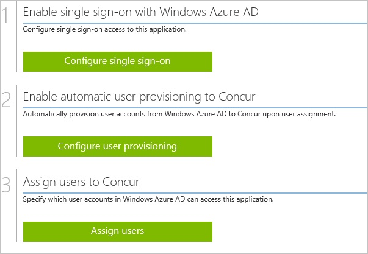
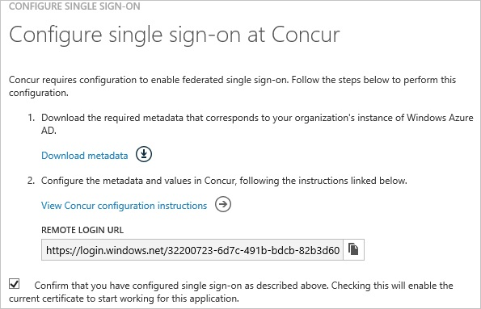
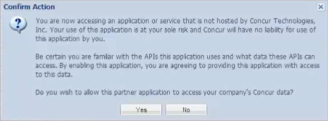

<properties 
    pageTitle="Tutorial: Azure Active Directory integration with Concur | Microsoft Azure" 
    description="Learn how to use Concur with Azure Active Directory to enable single sign-on, automated provisioning, and more!" 
    services="active-directory" 
    authors="jeevansd"  
    documentationCenter="na" 
    manager="femila"/>
<tags 
    ms.service="active-directory" 
    ms.devlang="na" 
    ms.topic="article" 
    ms.tgt_pltfrm="na" 
    ms.workload="identity" 
    ms.date="07/11/2016" 
    ms.author="jeedes" />

#Tutorial: Azure Active Directory integration with Concur  

The objective of this tutorial is to show the integration of Azure and Concur.  
The scenario outlined in this tutorial assumes that you already have the following items:

-   A valid Azure subscription
-   A tenant in Concur

The scenario outlined in this tutorial consists of the following building blocks:

1.  Enabling the application integration for Concur
2.  Configuring single sign-on
3.  Configuring user provisioning
4.  Assigning users

>[AZURE.NOTE] The configuration of your Concur subscription for federated SSO via SAML is a separate task, which you must contact Concur to perform.

##Enabling the application integration for Concur

The objective of this section is to outline how to enable the application integration for Concur.

###To enable the application integration for Concur, perform the following steps:

1.  In the Azure classic portal, on the left navigation pane, click **Active Directory**.

    

2.  From the **Directory** list, select the directory for which want to enable directory integration.

3.  To open the applications view, in the directory view, click **Applications** in the top menu.

    

4.  To open the **Application Gallery**, click **Add An App**, and then click **Add an application for my organization to use**.

    

5.  In the **search box**, type **Concur**.

    

6.  In the results pane, select **Concur**, and then click **Complete** to add the application.

    
##Configuring single sign-on

The objective of this section is to outline how to enable users to authenticate to Concur with their account in Azure AD using federation based on the SAML protocol.

>[AZURE.NOTE] The configuration of your Concur subscription for federated SSO via SAML is a separate task, which you must contact Concur to perform.

###To configure single sign-on, perform the following steps:

1.  In the Azure classic portal, on the **Concur **application integration page, click **Configure single sign-on** to open the **Configure Single Sign On ** dialog.

    

2.  On the **How would you like users to sign on to Concur** page, select **Microsoft Azure AD Single Sign-On**, and then click **Next**.

    

3.  On the **Configure App URL** page, in the **Concur Sign In URL** textbox, type your concur tenant sign-in URL, and then click **Next**: 

    

4.  On the **Configure single sign-on at Concur** page, perform the following steps.

    

    1.  Click Download the metadata, and then safe the data file to your computer.
    2.  Contact the Concur support team to configure SSO for your tenant.
    3.  Select the single sign-on configuration confirmation, and then click **Complete** to close the **Configure Single Sign On** dialog.  

	>[AZURE.NOTE] The configuration of your Concur subscription for federated SSO via SAML is a separate task, which you must contact Concur to perform.

##Configuring user provisioning

The objective of this section is to outline how to enable provisioning of Active Directory user accounts to Concur.

To enable apps in the Expense Service, there has to be proper setup and use of a Web Service Admin profile. Don't simply add the WS Admin role to your existing administrator profile that you use for T&E administrative functions.

Concur Consultants or the client administrator must create a distinct Web Service Administrator profile and the Client administrator must use this profile for the Web Services Administrator functions (e.g. enabling apps). These profiles must be kept separate from the client administrator's daily T&E admin profile (the T&E admin profile should not have the WSAdmin role assigned).

When you create the profile to be used for enabling the app, enter the client administrator's name into the user profile fields. This will assign ownership to the profile.Once the profile(s) is created, the client must log in with this profile to click the "*Enable*" button for a Partner App within the Web Services menu.

For the following reasons, this action should not be done with the profile they use for normal T&E administration.

1.  The client has to be the one that clicks "*Yes*" on the dialogue window that is displayed after an app is enabled. This click acknowledges the client is willing for the Partner application to access their data, so you or the Partner cannot click that Yes button.
2.  If a client administrator that has enabled an app using the T&E admin profile leaves the company (resulting in the profile being inactivated), any apps enabled using that profile will not function until the app is enabled with another active WS Admin profile. This is why you are supposed to create distinct WS Admin profiles.
3.  If an administrator leaves the company, the name associated to the WS Admin profile can be changed to the replacement administrator if desired without impacting the enabled app because that profile does not need inactivated

###To configure user provisioning, perform the following steps:

1.  Logon to your **Concur** tenant.

2.  From the **Administration** menu, select **Web Services**.

    

3.  On the left side, from the **Web Services** pane, select **Enable Partner Application**.

    

4.  From the **Enable Application** list, select **Azure Active Directory**, and then click **Enable**.

    

5.  Click **Yes** to close the **Confirm Action** dialog.

    

6.  In the Azure classic portal, select **Concur** from the applications list to open the **Concur** dialog page.

7.  To open the **Configure User Provisioning** dialog page, click **Configure user provisioning**.

8.  Enter the user name and the password of your Concur administrator, and then click **Next**.

9.  To finish the configuration, on the **Confirmation** page, click the **Complete** button.

You can now create a test account, wait for 10 minutes and verify that the account has been synchronized to Concur.
##Assigning users

To test your configuration, you need to grant the Azure AD users you want to allow using your application access to it by assigning them.

###To assign users to Concur, perform the following steps:

1.  In the Azure classic portal, create a test account.

2.  On the **Concur **application integration page, click **Assign users**.

    

3.  Select your test user, click **Assign**, and then click **Yes** to confirm your assignment.

    

You should now wait for 10 minutes and verify that the account has been synchronized to Concur.

If you want to test your single sign-on settings, open the Access Panel. For more details about the Access Panel, see [Introduction to the Access Panel](active-directory-saas-access-panel-introduction.md).
