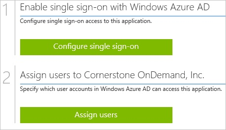
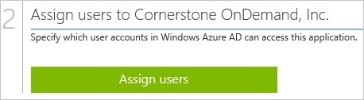

<properties 
    pageTitle="Tutorial: Azure Active Directory integration with Cornerstone OnDemand | Microsoft Azure" 
    description="Learn how to use Cornerstone OnDemand with Azure Active Directory to enable single sign-on, automated provisioning, and more!" 
    services="active-directory" 
    authors="jeevansd"  
    documentationCenter="na" 
    manager="femila"/>
<tags 
    ms.service="active-directory" 
    ms.devlang="na" 
    ms.topic="article" 
    ms.tgt_pltfrm="na" 
    ms.workload="identity" 
    ms.date="07/11/2016" 
    ms.author="jeedes" />

#Tutorial: Azure Active Directory integration with Cornerstone OnDemand

The objective of this tutorial is to show the integration of Azure and Cornerstone OnDemand.  
The scenario outlined in this tutorial assumes that you already have the following items:

-   A valid Azure subscription
-   A Cornerstone OnDemand tenant

After completing this tutorial, the Azure AD users you have assigned to Cornerstone OnDemand will be able to single sign into the application at your Cornerstone OnDemand company site (service provider initiated sign on), or using the [Introduction to the Access Panel](active-directory-saas-access-panel-introduction.md).

The scenario outlined in this tutorial consists of the following building blocks:

1.  Enabling the application integration for Cornerstone OnDemand
2.  Configuring single sign-on
3.  Configuring user provisioning
4.  Assigning users

##Enabling the application integration for Cornerstone OnDemand

The objective of this section is to outline how to enable the application integration for Cornerstone OnDemand.

###To enable the application integration for Cornerstone OnDemand, perform the following steps:

1.  In the Azure classic portal, on the left navigation pane, click **Active Directory**.

    

2.  From the **Directory** list, select the directory for which you want to enable directory integration.

3.  To open the applications view, in the directory view, click **Applications** in the top menu.

    

4.  Click **Add** at the bottom of the page.

    

5.  On the **What do you want to do** dialog, click **Add an application from the gallery**.

    

6.  In the **search box**, type **cornerstone ondemand**.

    

7.  In the results pane, select **Cornerstone OnDemand**, and then click **Complete** to add the application.

    
##Configuring single sign-on

The objective of this section is to outline how to enable users to authenticate to Cornerstone OnDemand with their account in Azure AD using federation based on the SAML protocol.

###To configure single sign-on, perform the following steps:

1.  In the Azure classic portal, on the **Cornerstone OnDemand** application integration page, click **Configure single sign-on** to open the **Configure Single Sign On ** dialog.

    

2.  On the **How would you like users to sign on to Cornerstone OnDemand** page, select **Microsoft Azure AD Single Sign-On**, and then click **Next**.

    

3.  On the **Configure App URL** page, in the **Cornerstone OnDemand Sign In URL** textbox, type your URL using the following pattern "*http://company.csod.com*", and then click **Next**.

    

4.  On the **Configure single sign-on at Cornerstone OnDemand** page, to download your certificate, click **Download certificate**, and then save the certificate file locally on your computer.

    

5.  Send the following items to the Cornerstone OnDemand support team:

    1.  The downloaded certificate
    2.  The **Remote Login URL** value
    3.  The **Remote Logout URL** value.

    >[AZURE.NOTE] Single Sign-On needs to be configured by the Cornerstone OnDemand support team.
    You will get a notification from the support team when the configuration has been completed.

6.  Select the single sign-on configuration confirmation, and then click **Complete** to close the **Configure Single Sign On** dialog.

    
##Configuring user provisioning

In order to enable Azure AD users to log into Cornerstone OnDemand, they must be provisioned into Cornerstone OnDemand.  
In the case of Cornerstone OnDemand, provisioning is a manual task.

###To configure user provisioning, perform the following steps:

1.  Send the information (e.g.: Name, Emial) about the Azure AD user you want to provision to the Cornerstone OnDemand support team.

>[AZURE.NOTE] You can use any other Cornerstone OnDemand user account creation tools or APIs provided by Cornerstone OnDemand to provision AAD user accounts.

##Assigning users

To test your configuration, you need to grant the Azure AD users you want to allow using your application access to it by assigning them.

###To assign users to Cornerstone OnDemand, perform the following steps:

1.  In the Azure classic portal, create a test account.

2.  On the **Cornerstone OnDemand **application integration page, click **Assign users**.

    

3.  Select your test user, click **Assign**, and then click **Yes** to confirm your assignment.

    

If you want to test your single sign-on settings, open the Access Panel. For more details about the Access Panel, see [Introduction to the Access Panel](active-directory-saas-access-panel-introduction.md).
