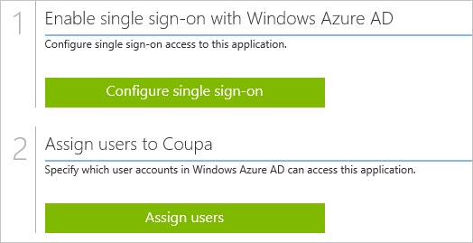
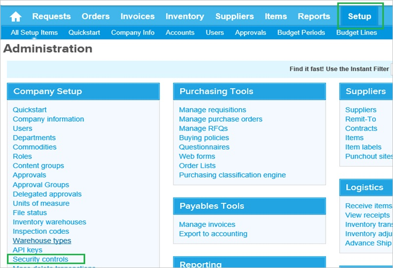
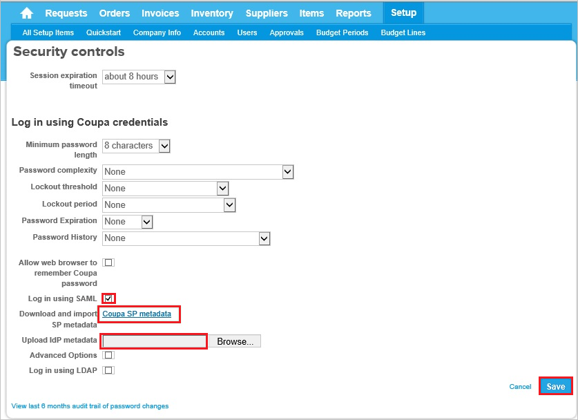
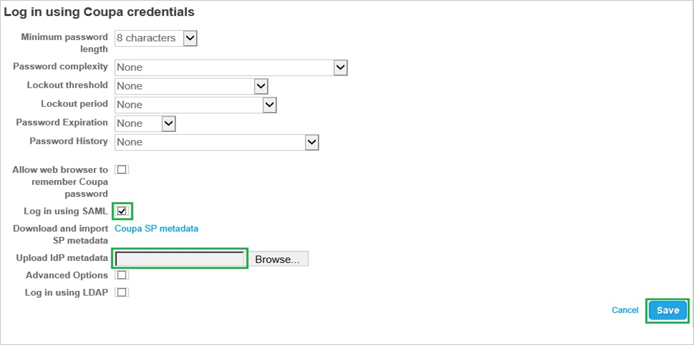
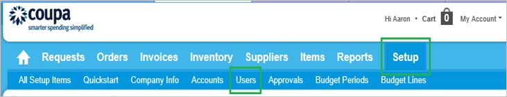
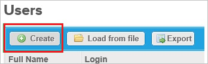
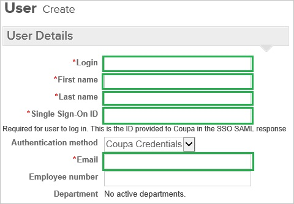
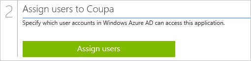

<properties 
    pageTitle="Tutorial: Azure Active Directory integration with Coupa | Microsoft Azure" 
    description="Learn how to use Coupa with Azure Active Directory to enable single sign-on, automated provisioning, and more!" 
    services="active-directory" 
    authors="jeevansd"  
    documentationCenter="na" 
    manager="femila"/>
<tags 
    ms.service="active-directory" 
    ms.devlang="na" 
    ms.topic="article" 
    ms.tgt_pltfrm="na" 
    ms.workload="identity" 
    ms.date="07/11/2016" 
    ms.author="jeedes" />

#Tutorial: Azure Active Directory integration with Coupa

The objective of this tutorial is to show the integration of Azure and Coupa.  
The scenario outlined in this tutorial assumes that you already have the following items:

-   A valid Azure subscription
-   A Coupa single sign-on enabled subscription

After completing this tutorial, the Azure AD users you have assigned to Coupa will be able to single sign into the application using the [Introduction to the Access Panel](active-directory-saas-access-panel-introduction.md).

The scenario outlined in this tutorial consists of the following building blocks:

1.  Enabling the application integration for Coupa
2.  Configuring single sign-on
3.  Configuring user provisioning
4.  Assigning users

##Enabling the application integration for Coupa

The objective of this section is to outline how to enable the application integration for Coupa.

###To enable the application integration for Coupa, perform the following steps:

1.  In the Azure classic portal, on the left navigation pane, click **Active Directory**.

    

2.  From the **Directory** list, select the directory for which you want to enable directory integration.

3.  To open the applications view, in the directory view, click **Applications** in the top menu.

    

4.  Click **Add** at the bottom of the page.

    

5.  On the **What do you want to do** dialog, click **Add an application from the gallery**.

    

6.  In the **search box**, type **Coupa**.

    

7.  In the results pane, select **Coupa**, and then click **Complete** to add the application.

    
##Configuring single sign-on

The objective of this section is to outline how to enable users to authenticate to Coupa with their account in Azure AD using federation based on the SAML protocol.  
Configuring single sign-on for Coupa requires you to retrieve a thumbprint value from a certificate.  
If you are not familiar with this procedure, see [How to retrieve a certificate's thumbprint value](http://youtu.be/YKQF266SAxI).

###To configure single sign-on, perform the following steps:

1.  Sign on to your Coupa company site as an administrator.

2.  Go to **Setup \> Security Control**.

    

3.  To download the Coupa metadata file to your computer, click **Download and import SP metadata**.

    

4.  In a different browser window, sign on to the Azure classic portal.

5.  On the **Coupa** application integration page, click **Configure single sign-on** to open the **Configure Single Sign On ** dialog.

    

6.  On the **How would you like users to sign on to Coupa** page, select **Microsoft Azure AD Single Sign-On**, and then click **Next**.

    

7.  On the **Configure App URL** page, perform the following steps:

    

    1.  In the **Sign On URL** textbox, type URL used by your users to sign on to your Coupa application (e.g.: “*http://company.Coupa.com*”).
    2.  Open your downloaded Coupa metadata file, and then copy the **AssertionConsumerService index/URL**.
    3.  In the **Coupa Reply URL** textbox, paste the **AssertionConsumerService index/URL** value.
    4.  Click **Next**.

8.  On the **Configure single sign-on at Coupa** page, to download your metadata file, click **Download metadata**, and then save the file locally on your computer.

    

9.  On the Coupa company site, go to **Setup \> Security Control**.

    

10. In the **Log in using Coupa credentials** section, perform the following steps:

    

    1.  Select **Log in using SAML**.
    2.  Click **Browse** to upload your downloaded Azure Active metadata file.
    3.  Click **Save**.

11. On the Azure classic portal, select the single sign-on configuration confirmation, and then click **Complete** to close the **Configure Single Sign On** dialog.

    
##Configuring user provisioning

In order to enable Azure AD users to log into Coupa, they must be provisioned into Coupa.  
In the case of Coupa, provisioning is a manual task.

###To configure user provisioning, perform the following steps:

1.  Log in to your **Coupa** company site as administrator.

2.  In the menu on the top, click **Setup**, and then click **Users**.

    

3.  Click **Create**.

    

4.  In the **User Create** section, perform the following steps:

    

    1.  Type the **Login**, **First name**, **Last Name**, **Single Sign-On ID**, **Email** attributes of a valid Azure Active Directory account you want to provision into the related textboxes.
    2.  Click **Create**.

    >[AZURE.NOTE] The Azure Active Directory account holder will get an email with a link to confirm the account before it becomes active.

>[AZURE.NOTE] You can use any other Coupa user account creation tools or APIs provided by Coupa to provision AAD user accounts.

##Assigning users

To test your configuration, you need to grant the Azure AD users you want to allow using your application access to it by assigning them.

###To assign users to Coupa, perform the following steps:

1.  In the Azure classic portal, create a test account.

2.  On the **Coupa **application integration page, click **Assign users**.

    

3.  Select your test user, click **Assign**, and then click **Yes** to confirm your assignment.

    

If you want to test your single sign-on settings, open the Access Panel. For more details about the Access Panel, see [Introduction to the Access Panel](active-directory-saas-access-panel-introduction.md).
