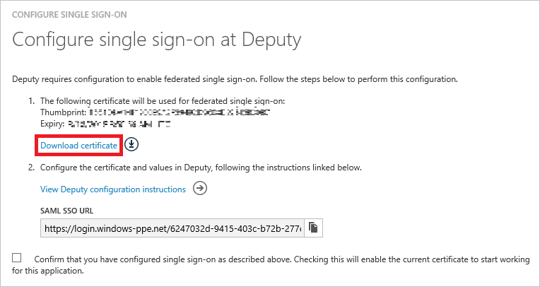

# Tutorial: Azure Active Directory integration with Deputy
The objective of this tutorial is to show you how to integrate Deputy with Azure Active Directory (Azure AD).

Integrating Deputy with Azure AD provides you with the following benefits:

* You can control in Azure AD who has access to Deputy
* You can enable your users to automatically get signed-on to Deputy  single sign-on (*SSO) with their Azure AD accounts
* You can manage your accounts in one central location - the Azure classic portal

If you want to know more details about SaaS app integration with Azure AD, see [What is application access and single sign-on with Azure Active Directory](active-directory-appssoaccess-whatis.md).

## Prerequisites
To configure Azure AD integration with Deputy, you need the following items:

* An Azure AD subscription
* A Deputy single sign-on (SSO) enabled subscription

>[!NOTE]
>To test the steps in this tutorial, we do not recommend using a production environment.
> 
> 

To test the steps in this tutorial, you should follow these recommendations:

* You should not use your production environment, unless this is necessary.
* If you don't have an Azure AD trial environment, you can get a [one-month trial](https://azure.microsoft.com/pricing/free-trial/).

## Scenario description
The objective of this tutorial is to enable you to test Azure AD SSO in a test environment.

The scenario outlined in this tutorial consists of two main building blocks:

1. Adding Deputy from the gallery
2. Configuring and testing Azure AD SSO

## Adding Deputy from the gallery
To configure the integration of Deputy into Azure AD, you need to add Deputy from the gallery to your list of managed SaaS apps.

**To add Deputy from the gallery, perform the following steps:**

1. In the **Azure classic Portal**, on the left navigation pane, click **Active Directory**. 
   
    ![Active Directory][1]
2. From the **Directory** list, select the directory for which you want to enable directory integration.
3. To open the applications view, in the directory view, click **Applications** in the top menu.
   
    ![Applications][2]
4. Click **Add** at the bottom of the page.
   
    ![Applications][3]
5. On the **What do you want to do** dialog, click **Add an application from the gallery**.
   
    ![Applications][4]
6. In the search box, type **Deputy**.
   
    
7. In the results panel, select **Deputy**, and then click **Complete** to add the application.
   
    

## Configure and test Azure AD single sign-on
The objective of this section is to show you how to configure and test Azure AD SSO with Deputy based on a test user called "Britta Simon".

For SSO to work, Azure AD needs to know what the counterpart user in Deputy to an user in Azure AD is. In other words, a link relationship between an Azure AD user and the related user in Deputy needs to be established.

This link relationship is established by assigning the value of the **user name** in Azure AD as the value of the **Username** in Deputy.

To configure and test Azure AD SSO with Deputy, you need to complete the following building blocks:

1. **[Configuring Azure AD single sign-on](#configuring-azure-ad-single-single-sign-on)** - to enable your users to use this feature.
2. **[Creating an Azure AD test user](#creating-an-azure-ad-test-user)** - to test Azure AD single sign-on with Britta Simon.
3. **[Creating a Deputy test user](#creating-a-deputy-test-user)** - to have a counterpart of Britta Simon in Deputy that is linked to the Azure AD representation of her.
4. **[Assigning the Azure AD test user](#assigning-the-azure-ad-test-user)** - to enable Britta Simon to use Azure AD single sign-on.
5. **[Testing single sign-on](#testing-single-sign-on)** - to verify whether the configuration works.

### Configure Azure AD single sign-on
In this section, you enable Azure AD single sign-on in the classic portal and configure SSO in your Deputy application.

**To configure Azure AD single sign-on with Deputy, perform the following steps:**

1. In the classic portal, on the **Deputy** application integration page, click **Configure single sign-on** to open the **Configure Single Sign-On** dialog.
   
    ![Configure Single Sign-On][6] 
2. On the **How would you like users to sign on to Deputy** page, select **Azure AD Single Sign-On**, and then click **Next**.
   
    
3. On the **Configure App Settings** dialog page, If you wish to configure the application in **IDP initiated mode**, perform the following steps and click **Next**:
   
    
  1. In the **Identifier** textbox, type a URL using the following pattern: `https://<your-subdomain>.<region>.deputy.com`.
  2. In the **Reply URL** textbox, type a URL using the following pattern: `https://<your-subdomain>.<region>.deputy.com/exec/devapp/samlacs`.
  3. Click **Next**.
4. If you wish to configure the application in **SP initiated mode** on the **Configure App Settings** dialog page, then click on the **“Show advanced settings (optional)”** and then enter the **Sign On URL** and click **Next**.
   
    
   1. In the **Sign On URL** textbox, type a URL using the following pattern: `https://<your-subdomain>.<region>.deputy.com`.
   2. Click **Next**.
   
     >[!NOTE]
     > Deputy region suffix is opitional, or it should use one of these: 
     > au | na | eu |as |la |af |an |ent-au |ent-na |ent-eu |ent-as | ent-la | ent-af | ent-an
     > 

5. On the **Configure single sign-on at Deputy** page, perform the following steps and click **Next**:
   
    
   *  Click **Download certificate**, and then save the file on your computer.
6. Navigate to the following URL: https://(your-subdomain).deputy.com/exec/config/system_config. Go to **Security Settings** and click **Edit**.
   
    
7. In the Azure classic portal, on the Configure single sign-on at Deputy page, copy the SAML SSO URL. 
8. On this **Security Settings** page, perform below steps.
   

   1. Enable **Social Login**.
   2. Open your Base64 encoded certificate in notepad, copy the content of it nto your clipboard, and then paste it to the **OpenSSL Certificate** textbox.
   3. In the SAM SSO URL textbox, type `https://<your subdomain>.deputy.com/exec/devapp/samlacs?dpLoginTo=<saml sso url>`
   4. In the SAM SSO URL textbox, replace `<your subdomain>` with your subdomain.
   5. In the SAM SSO URL textbox, replace `<saml sso url>` with the SAML SSO URL you have copied from the Azure classic portal.
   6. Click **Save Settings**.
9. In the classic portal, select the single sign-on configuration confirmation, and then click **Next**.
   
    ![Azure AD Single Sign-On][10]
10. On the **Single sign-on confirmation** page, click **Complete**.  
    
    ![Azure AD Single Sign-On][11]

### Create an Azure AD test user
The objective of this section is to create a test user in the classic portal called Britta Simon.

![Create Azure AD User][20]

**To create a test user in Azure AD, perform the following steps:**

1. In the **Azure classic Portal**, on the left navigation pane, click **Active Directory**.
   
    
2. From the **Directory** list, select the directory for which you want to enable directory integration.
3. To display the list of users, in the menu on the top, click **Users**.
       
4. To open the **Add User** dialog, in the toolbar on the bottom, click **Add User**.
   
    
5. On the **Tell us about this user** dialog page, perform the following steps:
   
    

   1. As Type Of User, select New user in your organization.
   2. In the User Name **textbox**, type **BrittaSimon**.
   3. Click **Next**.6. On the **User Profile** dialog page, perform the following steps:
   
   
   
   1. In the **First Name** textbox, type **Britta**.  
   2. In the **Last Name** textbox, type, **Simon**.
   3. In the **Display Name** textbox, type **Britta Simon**.
   4. In the **Role** list, select **User**.
   5. Click **Next**.
   
7. On the **Get temporary password** dialog page, click **create**.
   
    
8. On the **Get temporary password** dialog page, perform the following steps:
   
    
   
   1. Write down the value of the **New Password**.
   2. Click **Complete**.   

### Create a Deputy test user
In order to enable Azure AD users to log into Deputy, they must be provisioned into Deputy. In the case of Deputy, provisioning is a manual task.

#### To provision a user account, perform the following steps:
1. Log into your Deputy company site as an administrator.
2. On the top navigation pane, click **People**.
   
   
3. Click the **Add People** button and click **Add a single person**.
   
   
4. Perform the following steps and click **Save & Invite**.
   
   
   
  1. In the **Name** textbox, type **Britta** and **Simon**.  
  2. In the **Email** textbox, type the email address of an Azure AD account you want to provision.
  3. In the **Work at** textbox, type the bussniess name.
  4. Click **Save & Invite** button.

5. The AAD account holder will receive an email and follow a link to confirm their account before it becomes active. You can use any other Deputy user account creation tools or APIs provided by Deputy to provision AAD user accounts.
    
### Assign the Azure AD test user
The objective of this section is to enabling Britta Simon to use Azure SSO by granting her access to Deputy.

![Assign User][200]

**To assign Britta Simon to Deputy, perform the following steps:**

1. On the classic portal, to open the applications view, in the directory view, click **Applications** in the top menu.
   
    ![Assign User][201]
2. In the applications list, select **Deputy**.
   
    
3. In the menu on the top, click **Users**.
   
    ![Assign User][203]
4. In the Users list, select **Britta Simon**.
5. In the toolbar on the bottom, click **Assign**.
   
    ![Assign User][205]

### Test single sign-on
The objective of this section is to test your Azure AD SSO configuration using the Access Panel.

When you click the Deputy tile in the Access Panel, you should get automatically signed-on to your Deputy application.

## Additional resources
* [List of Tutorials on How to Integrate SaaS Apps with Azure Active Directory](active-directory-saas-tutorial-list.md)
* [What is application access and single sign-on with Azure Active Directory?](active-directory-appssoaccess-whatis.md)

<!--Image references-->

[1]: ./media/active-directory-saas-deputy-tutorial/tutorial_general_01.png
[2]: ./media/active-directory-saas-deputy-tutorial/tutorial_general_02.png
[3]: ./media/active-directory-saas-deputy-tutorial/tutorial_general_03.png
[4]: ./media/active-directory-saas-deputy-tutorial/tutorial_general_04.png

[6]: ./media/active-directory-saas-deputy-tutorial/tutorial_general_05.png
[10]: ./media/active-directory-saas-deputy-tutorial/tutorial_general_06.png
[11]: ./media/active-directory-saas-deputy-tutorial/tutorial_general_07.png
[20]: ./media/active-directory-saas-deputy-tutorial/tutorial_general_100.png

[200]: ./media/active-directory-saas-deputy-tutorial/tutorial_general_200.png
[201]: ./media/active-directory-saas-deputy-tutorial/tutorial_general_201.png
[203]: ./media/active-directory-saas-deputy-tutorial/tutorial_general_203.png
[204]: ./media/active-directory-saas-deputy-tutorial/tutorial_general_204.png
[205]: ./media/active-directory-saas-deputy-tutorial/tutorial_general_205.png
