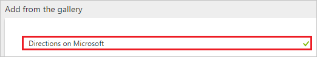
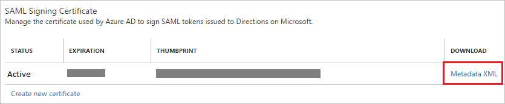
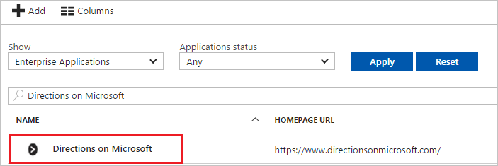

# Tutorial: Azure Active Directory integration with Directions on Microsoft

In this tutorial, you learn how to integrate Directions on Microsoft with Azure Active Directory (Azure AD).

Integrating Directions on Microsoft with Azure AD provides you with the following benefits:

- You can control in Azure AD who has access to Directions on Microsoft
- You can enable your users to automatically get signed-on to Directions on Microsoft (Single Sign-On) with their Azure AD accounts
- You can manage your accounts in one central location - the Azure portal

If you want to know more details about SaaS app integration with Azure AD, see [what is application access and single sign-on with Azure Active Directory](active-directory-appssoaccess-whatis.md).

## Prerequisites

To configure Azure AD integration with Directions on Microsoft, you need the following items:

- An Azure AD subscription
- A Directions on Microsoft single sign-on enabled subscription

> [!NOTE]
> To test the steps in this tutorial, we do not recommend using a production environment.

To test the steps in this tutorial, you should follow these recommendations:

- Do not use your production environment, unless it is necessary.
- If you don't have an Azure AD trial environment, you can get a one-month trial [here](https://azure.microsoft.com/pricing/free-trial/).

## Scenario description
In this tutorial, you test Azure AD single sign-on in a test environment. 
The scenario outlined in this tutorial consists of two main building blocks:

1. Adding Directions on Microsoft from the gallery
2. Configuring and testing Azure AD single sign-on

## Adding Directions on Microsoft from the gallery
To configure the integration of Directions on Microsoft into Azure AD, you need to add Directions on Microsoft from the gallery to your list of managed SaaS apps.

**To add Directions on Microsoft from the gallery, perform the following steps:**

1. In the **[Azure portal](https://portal.azure.com)**, on the left navigation panel, click **Azure Active Directory** icon. 

	![Active Directory][1]

2. Navigate to **Enterprise applications**. Then go to **All applications**.

	![Applications][2]
	
3. To add new application, click **New application** button on the top of dialog.

	![Applications][3]

4. In the search box, type **Directions on Microsoft**.

	

5. In the results panel, select **Directions on Microsoft**, and then click **Add** button to add the application.

	

##  Configuring and testing Azure AD single sign-on
In this section, you configure and test Azure AD single sign-on with Directions on Microsoft based on a test user called "Britta Simon."

For single sign-on to work, Azure AD needs to know what the counterpart user in Directions on Microsoft is to a user in Azure AD. In other words, a link relationship between an Azure AD user and the related user in Directions on Microsoft needs to be established.

In Directions on Microsoft, assign the value of the **user name** in Azure AD as the value of the **Username** to establish the link relationship.

To configure and test Azure AD single sign-on with Directions on Microsoft, you need to complete the following building blocks:

1. **[Configuring Azure AD Single Sign-On](#configuring-azure-ad-single-sign-on)** - to enable your users to use this feature.
2. **[Creating an Azure AD test user](#creating-an-azure-ad-test-user)** - to test Azure AD single sign-on with Britta Simon.
3. **[Creating a Directions on Microsoft test user](#creating-a-directions-on-microsoft-test-user)** - to have a counterpart of Britta Simon in Directions on Microsoft that is linked to the Azure AD representation of user.
4. **[Assigning the Azure AD test user](#assigning-the-azure-ad-test-user)** - to enable Britta Simon to use Azure AD single sign-on.
5. **[Testing Single Sign-On](#testing-single-sign-on)** - to verify whether the configuration works.

### Configuring Azure AD single sign-on

In this section, you enable Azure AD single sign-on in the Azure portal and configure single sign-on in your Directions on Microsoft application.

**To configure Azure AD single sign-on with Directions on Microsoft, perform the following steps:**

1. In the Azure portal, on the **Directions on Microsoft** application integration page, click **Single sign-on**.

	![Configure Single Sign-On][4]

2. On the **Single sign-on** dialog, select **Mode** as	**SAML-based Sign-on** to enable single sign-on.
 
	

3. On the **Directions on Microsoft Domain and URLs** section, perform the following steps:

	

    a. In the **Sign-on URL** textbox, type a URL using the following pattern:
	|  |
	| --- |
	| `https://www.directionsonmicrosoft.com/user/login` |
	| `https://<subdomain>.devcloud.acquia-sites.com/<companyname>` |

	b. In the **Identifier** textbox, type a URL using the following pattern:
	|  |
	| --- |
	| `https://rhelmdirectionsonmicrosoftcomtest.devcloud.acquia-sites.com/simplesaml/<companyname>` |
	| `https://www.directionsonmicrosoft.com/simplesaml/<companyname>` |

	> [!NOTE] 
	> These values are not real. Update these values with the actual Sign-On URL and Identifier. Contact [Directions on Microsoft Client support team](mailto:service@DirectionsOnMicrosoft.com) to get these values. 
 
4. On the **SAML Signing Certificate** section, click **Metadata XML** and then save the metadata file on your computer.

	 

5. Click **Save** button.

	

6. To configure single sign-on on **Directions on Microsoft** side, you need to send the downloaded **Metadata XML** to [Directions on Microsoft support team](mailto:service@DirectionsOnMicrosoft.com). Include your company information in your email.
	
	>[!NOTE]
	>Single sign-on for Directions on Microsoft needs to be enabled by the [Directions on Microsoft Client support team](mailto:service@DirectionsOnMicrosoft.com). You will receive a notification when single sign-on has been enabled.

> [!TIP]
> You can now read a concise version of these instructions inside the [Azure portal](https://portal.azure.com), while you are setting up the app!  After adding this app from the **Active Directory > Enterprise Applications** section, simply click the **Single Sign-On** tab and access the embedded documentation through the **Configuration** section at the bottom. You can read more about the embedded documentation feature here: [Azure AD embedded documentation]( https://go.microsoft.com/fwlink/?linkid=845985)
> 

### Creating an Azure AD test user
The objective of this section is to create a test user in the Azure portal called Britta Simon.

![Create Azure AD User][100]

**To create a test user in Azure AD, perform the following steps:**

1. In the **Azure portal**, on the left navigation pane, click **Azure Active Directory** icon.

	 

2. To display the list of users, go to **Users and groups** and click **All users**.
	
	 

3. To open the **User** dialog, click **Add** on the top of the dialog.
 
	 

4. On the **User** dialog page, perform the following steps:
 
	 

    a. In the **Name** textbox, type **BrittaSimon**.

    b. In the **User name** textbox, type the **email address** of BrittaSimon.

	c. Select **Show Password** and write down the value of the **Password**.

    d. Click **Create**.
 
### Creating a Directions on Microsoft test user

There is no action item for you to configure user provisioning to Directions on Microsoft.  

When an assigned user tries to log in to Directions on Microsoft using the access panel, Directions on Microsoft checks whether the user exists. If there is no user account available yet, it is automatically created by Directions on Microsoft.

### Assigning the Azure AD test user

In this section, you enable Britta Simon to use Azure single sign-on by granting access to Directions on Microsoft.

![Assign User][200] 

**To assign Britta Simon to Directions on Microsoft, perform the following steps:**

1. In the Azure portal, open the applications view, and then navigate to the directory view and go to **Enterprise applications** then click **All applications**.

	![Assign User][201] 

2. In the applications list, select **Directions on Microsoft**.

	 

3. In the menu on the left, click **Users and groups**.

	![Assign User][202] 

4. Click **Add** button. Then select **Users and groups** on **Add Assignment** dialog.

	![Assign User][203]

5. On **Users and groups** dialog, select **Britta Simon** in the Users list.

6. Click **Select** button on **Users and groups** dialog.

7. Click **Assign** button on **Add Assignment** dialog.
	
### Testing single sign-on

In this section, you test your Azure AD single sign-on configuration using the Access Panel.
 
When you click the Directions on Microsoft tile in the Access Panel, you should get automatically signed-on to your Directions on Microsoft application.

For more information about the Access Panel, see [Introduction to the Access Panel](active-directory-saas-access-panel-introduction.md). 

## Additional resources

* [List of Tutorials on How to Integrate SaaS Apps with Azure Active Directory](active-directory-saas-tutorial-list.md)
* [What is application access and single sign-on with Azure Active Directory?](active-directory-appssoaccess-whatis.md)

<!--Image references-->

[1]: ./media/active-directory-saas-directions-microsoft-tutorial/tutorial_general_01.png
[2]: ./media/active-directory-saas-directions-microsoft-tutorial/tutorial_general_02.png
[3]: ./media/active-directory-saas-directions-microsoft-tutorial/tutorial_general_03.png
[4]: ./media/active-directory-saas-directions-microsoft-tutorial/tutorial_general_04.png

[100]: ./media/active-directory-saas-directions-microsoft-tutorial/tutorial_general_100.png

[200]: ./media/active-directory-saas-directions-microsoft-tutorial/tutorial_general_200.png
[201]: ./media/active-directory-saas-directions-microsoft-tutorial/tutorial_general_201.png
[202]: ./media/active-directory-saas-directions-microsoft-tutorial/tutorial_general_202.png
[203]: ./media/active-directory-saas-directions-microsoft-tutorial/tutorial_general_203.png

