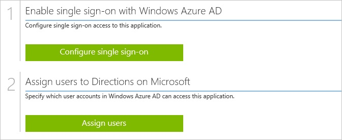
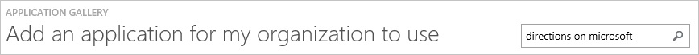
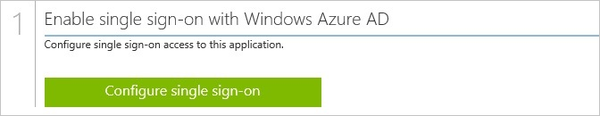

<properties 
    pageTitle="Tutorial: Azure Active Directory integration with Directions on Microsoft | Microsoft Azure" 
    description="Learn how to use Directions on Microsoft with Azure Active Directory to enable single sign-on, automated provisioning, and more!" 
    services="active-directory" 
    authors="jeevansd"  
    documentationCenter="na" 
    manager="femila"/>
<tags 
    ms.service="active-directory" 
    ms.devlang="na" 
    ms.topic="article" 
    ms.tgt_pltfrm="na" 
    ms.workload="identity" 
    ms.date="07/11/2016" 
    ms.author="jeedes" />

#Tutorial: Azure Active Directory integration with Directions on Microsoft

The objective of this tutorial is to show the integration of Azure Active Directory and Directions on Microsoft.  
The scenario outlined in this tutorial assumes that you already have the following items:

-   A valid Azure subscription
-   A Directions on Microsoft subscription

If you don’t have a federated Directions on Microsoft subscription yet, email a request to “*service@DirectionsOnMicrosoft.com*”.

After completing this tutorial, the Azure Active Directory users you have assigned to Directions on Microsoft will be able to single sign into the application using single sign-on.

The scenario outlined in this tutorial consists of the following building blocks:

1.  Enabling the application integration for Directions on Microsoft
2.  Configuring single sign-on
3.  Configuring user provisioning
4.  Assigning users

##Enabling the application integration for Directions on Microsoft

The objective of this section is to outline how to enable the application integration for Directions on Microsoft.

###To enable the application integration for Directions on Microsoft, perform the following steps:

1.  In the Azure classic portal, on the left navigation pane, click **Active Directory**.

    

2.  From the **Directory** list, select the directory for which you want to enable directory integration.

3.  To open the applications view, in the directory view, click **Applications** in the top menu.

    

4.  Click **Add** at the bottom of the page.

    

5.  On the **What do you want to do** dialog, click **Add an application from the gallery**.

    

6.  In the **search box**, type **Directions on Microsoft**.

    

7.  In the results pane, select **Directions on Microsoft**, and then click **Complete** to add the application.

    
##Configuring single sign-on

The objective of this section is to outline how to enable users to authenticate to Directions on Microsoft with their account in Azure AD using federation based on the SAML protocol.

###To configure single sign-on, perform the following steps:

1.  In the Azure classic portal, on the **Directions on Microsoft** application integration page, click **Configure single sign-on** to open the **Configure Single Sign On ** dialog.

    

2.  On the **How would you like users to sign on to Directions on Microsoft** page, select **Microsoft Azure AD Single Sign-On**, and then click **Next**.

    

3.  On the **Configure App URL** page, in the Sign On URL textbox, type **https://www.directionsonmicrosoft.com/user/login**, and then click **Next**.

    

4.  On the **Configure single sign-on at Directions on Microsoft** page, click **Download metadata**, and then save the metadata file locally on your computer.

    

5.  Send the metadata file to the Directions on Microsoft support team (*service@DirectionsOnMicrosoft.com*). To enable the Directions on Microsoft support team to locate your federated site membership, include your company information in your email.

    >[AZURE.NOTE] Single sign-on for Directions on Microsoft needs to be enabled by the Directions on Microsoft support team.
    You will receive a notification when single sign-on has been enabled.

6.  On the Azure classic portal, select the single sign-on configuration confirmation, and then click **Complete** to close the **Configure Single Sign On** dialog.

    
##Configuring user provisioning

There is no action item for you to configure user provisioning to Directions on Microsoft.  
When an assigned user tries to log into Directions on Microsoft using the access panel, Directions on Microsoft checks whether the user exists. If there is no user account available yet, it is automatically created by Directions on Microsoft.
##Assigning users

To test your configuration, you need to grant the Azure AD users you want to allow using your application access to it by assigning them.

###To assign users to Directions on Microsoft, perform the following steps:

1.  In the Azure classic portal, create a test account.

2.  On the **Directions on Microsoft **application integration page, click **Assign users**.

    

3.  Select your test user, click **Assign**, and then click **Yes** to confirm your assignment.

    
