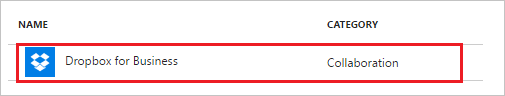
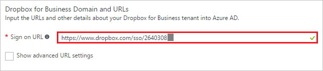
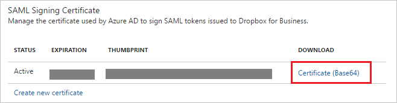
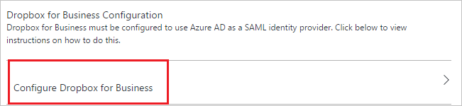

# Tutorial: Azure Active Directory integration with Dropbox for Business

In this tutorial, you learn how to integrate Dropbox for Business with Azure Active Directory (Azure AD).

Integrating Dropbox for Business with Azure AD provides you with the following benefits:

- You can control in Azure AD who has access to Dropbox for Business
- You can enable your users to automatically get signed-on to Dropbox for Business (Single Sign-On) with their Azure AD accounts
- You can manage your accounts in one central location - the Azure portal

If you want to know more details about SaaS app integration with Azure AD, see [what is application access and single sign-on with Azure Active Directory](active-directory-appssoaccess-whatis.md).

## Prerequisites

To configure Azure AD integration with Dropbox for Business, you need the following items:

- An Azure AD subscription
- A Dropbox for Business single sign-on enabled subscription

> [!NOTE]
> To test the steps in this tutorial, we do not recommend using a production environment.

To test the steps in this tutorial, you should follow these recommendations:

- Do not use your production environment, unless it is necessary.
- If you don't have an Azure AD trial environment, you can get a one-month trial [here](https://azure.microsoft.com/pricing/free-trial/).

## Scenario description
In this tutorial, you test Azure AD single sign-on in a test environment. 
The scenario outlined in this tutorial consists of two main building blocks:

1. Adding Dropbox for Business from the gallery
2. Configuring and testing Azure AD single sign-on

## Adding Dropbox for Business from the gallery
To configure the integration of Dropbox for Business into Azure AD, you need to add Dropbox for Business from the gallery to your list of managed SaaS apps.

**To add Dropbox for Business from the gallery, perform the following steps:**

1. In the **[Azure portal](https://portal.azure.com)**, on the left navigation panel, click **Azure Active Directory** icon. 

	![Active Directory][1]

2. Navigate to **Enterprise applications**. Then go to **All applications**.

	![Applications][2]
	
3. Click **New application** button on the top of the dialog.

	![Applications][3]

4. In the search box, type **Dropbox for Business**.

	

5. In the results panel, select **Dropbox for Business**, and then click **Add** button to add the application.

	

##  Configuring and testing Azure AD single sign-on
In this section, you configure and test Azure AD single sign-on with Dropbox for Business based on a test user called "Britta Simon."

For single sign-on to work, Azure AD needs to know what the counterpart user in Dropbox for Business is to a user in Azure AD. In other words, a link relationship between an Azure AD user and the related user in Dropbox for Business needs to be established.

This link relationship is established by assigning the value of the **user name** in Azure AD as the value of the **Username** in Dropbox for Business.

To configure and test Azure AD single sign-on with Dropbox for Business, you need to complete the following building blocks:

1. **[Configuring Azure AD Single Sign-On](#configuring-azure-ad-single-sign-on)** - to enable your users to use this feature.
2. **[Creating an Azure AD test user](#creating-an-azure-ad-test-user)** - to test Azure AD single sign-on with Britta Simon.
3. **[Creating a Dropbox for Business test user](#creating-a-dropbox-for-business-test-user)** - to have a counterpart of Britta Simon in Dropbox for Business that is linked to the Azure AD representation of user.
4. **[Assigning the Azure AD test user](#assigning-the-azure-ad-test-user)** - to enable Britta Simon to use Azure AD single sign-on.
5. **[Testing Single Sign-On](#testing-single-sign-on)** - to verify whether the configuration works.

### Configuring Azure AD single sign-on

In this section, you enable Azure AD single sign-on in the Azure portal and configure single sign-on in your Dropbox for Business application.

**To configure Azure AD single sign-on with Dropbox for Business, perform the following steps:**

1. In the Azure portal, on the **Dropbox for Business** application integration page, click **Single sign-on**.

	![Configure Single Sign-On][4]

2. On the **Single sign-on** dialog, select **Mode** as	**SAML-based Sign-on** to enable single sign-on.
 
	

3. On the **Dropbox for Business Domain and URLs** section, perform the following steps:

	a. Sign on to your Dropbox for business tenant. 
   
	
   
	b. In the navigation pane on the left side, click **Admin Console**. 
   
	
   
	c. On the **Admin Console**, click **Authentication** in the left navigation pane. 
   
	
   
	d. In the **Single sign-on** section, select **Enable single sign-on**, and then click **More** to expand this section.  
   
	
   
	e. Copy the URL next to **Users can sign in by entering their email address or they can go directly to**. 
	
	
	
	f. On the Azure portal, in the **Sign-on URL** textbox, paste the URL.

	

     In the **Sign-on URL** textbox, type a URL using the following pattern: `https://www.dropbox.com/sso/<id>`

	> [!NOTE] 
	> This value is not real value. Update the value with the actual Sign-on URL you get from their Single sign-on section. Contact [Dropbox for Business Client support team](https://www.dropbox.com/business/contact) to get this value. 
 
4. On the **SAML Signing Certificate** section, click **Certificate (Base64)** and then save the certificate file on your computer.

	 

5. Click **Save** button.

	

6. On the **Dropbox for Business Configuration** section, click **Configure Dropbox for Business** to open **Configure sign-on** window. Copy the **SAML Single Sign-On Service URL** from the **Quick Reference section.**

	 

7. To configure single sign-on on **Dropbox for Business** side, Go on your Dropbox for Business tenant, in the **Single sign-on** section of the **Authentication** page, perform the following steps: 
   
    
   
    a. Click **Required**.
   
    b. In the Azure portal, on the **Configure sign-on** window, copy the **SAML Single Sign-On Service URL** value, and then paste it into the **Sign-in URL** textbox.

    c. Click **Choose certificate**, and then browse to your **Base64 encoded certificate file**.

    d. Click **Save changes** to complete the configuration on your DropBox for Business tenant.

> [!TIP]
> You can now read a concise version of these instructions inside the [Azure portal](https://portal.azure.com), while you are setting up the app!  After adding this app from the **Active Directory > Enterprise Applications** section, simply click the **Single Sign-On** tab and access the embedded documentation through the **Configuration** section at the bottom. You can read more about the embedded documentation feature here: [Azure AD embedded documentation]( https://go.microsoft.com/fwlink/?linkid=845985)

### Creating an Azure AD test user
The objective of this section is to create a test user in the Azure portal called Britta Simon.

![Create Azure AD User][100]

**To create a test user in Azure AD, perform the following steps:**

1. In the **Azure portal**, on the left navigation pane, click **Azure Active Directory** icon.

	 

2.  To display the list of users, go to **Users and groups** and click **All users**.
	
	 

3. At the top of the dialog, click **Add** to open the **User** dialog.
 
	 

4. On the **User** dialog page, perform the following steps:
 
	 

    a. In the **Name** textbox, type **BrittaSimon**.

    b. In the **User name** textbox, type the **email address** of BrittaSimon.

	c. Select **Show Password** and write down the value of the **Password**.

    d. Click **Create**.
 
### Creating a Dropbox for Business test user

In this section, a user called Britta Simon is created in Dropbox for Business. Dropbox for Business supports just-in-time provisioning, which is enabled by default.

There is no action item for you in this section. If a user doesn't already exist in Dropbox for Business, a new one is created when you attempt to access Dropbox for Business.

>[!Note]
>If you need to create a user manually, Contact [Dropbox for Business Client support team](https://www.dropbox.com/business/contact) 

### Assigning the Azure AD test user

In this section, you enable Britta Simon to use Azure single sign-on by granting access to Dropbox for Business.

![Assign User][200] 

**To assign Britta Simon to Dropbox for Business, perform the following steps:**

1. In the Azure portal, open the applications view, and then navigate to the directory view and go to **Enterprise applications** then click **All applications**.

	![Assign User][201] 

2. In the applications list, select **Dropbox for Business**.

	 

3. In the menu on the left, click **Users and groups**.

	![Assign User][202] 

4. Click **Add** button. Then select **Users and groups** on **Add Assignment** dialog.

	![Assign User][203]

5. On **Users and groups** dialog, select **Britta Simon** in the Users list.

6. Click **Select** button on **Users and groups** dialog.

7. Click **Assign** button on **Add Assignment** dialog.
	
### Testing single sign-on

In this section, you test your Azure AD single sign-on configuration using the Access Panel.

When you click the Dropbox for Business tile in the Access Panel, you should get login page of your Dropbox for Business application.

## Additional resources

* [List of Tutorials on How to Integrate SaaS Apps with Azure Active Directory](active-directory-saas-tutorial-list.md)
* [What is application access and single sign-on with Azure Active Directory?](active-directory-appssoaccess-whatis.md)
* [Configure User Provisioning](active-directory-saas-dropboxforbusiness-provisioning-tutorial.md)

<!--Image references-->

[1]: ./media/active-directory-saas-dropboxforbusiness-tutorial/tutorial_general_01.png
[2]: ./media/active-directory-saas-dropboxforbusiness-tutorial/tutorial_general_02.png
[3]: ./media/active-directory-saas-dropboxforbusiness-tutorial/tutorial_general_03.png
[4]: ./media/active-directory-saas-dropboxforbusiness-tutorial/tutorial_general_04.png

[100]: ./media/active-directory-saas-dropboxforbusiness-tutorial/tutorial_general_100.png

[200]: ./media/active-directory-saas-dropboxforbusiness-tutorial/tutorial_general_200.png
[201]: ./media/active-directory-saas-dropboxforbusiness-tutorial/tutorial_general_201.png
[202]: ./media/active-directory-saas-dropboxforbusiness-tutorial/tutorial_general_202.png
[203]: ./media/active-directory-saas-dropboxforbusiness-tutorial/tutorial_general_203.png

