<properties 
    pageTitle="Tutorial: Azure Active Directory integration with Dropbox for Business | Microsoft Azure" 
    description="Learn how to use Dropbox for Business with Azure Active Directory to enable single sign-on, automated provisioning, and more!" 
    services="active-directory" 
    authors="jeevansd"  
    documentationCenter="na" 
    manager="femila"/>
<tags 
    ms.service="active-directory" 
    ms.devlang="na" 
    ms.topic="article" 
    ms.tgt_pltfrm="na" 
    ms.workload="identity" 
    ms.date="05/26/2016" 
    ms.author="jeedes" />

#Tutorial: Azure Active Directory integration with Dropbox for Business
  
The objective of this tutorial is to show the integration of Azure and Dropbox for Business.  
The scenario outlined in this tutorial assumes that you already have the following items:

-   A valid Azure subscription
-   A test tenant in Dropbox for Business
  
After completing this tutorial, the Azure AD users you have assigned to Dropbox for Business will be able to single sign into the application at your Dropbox for Business company site (service provider initiated sign on), or using the [Introduction to the Access Panel](active-directory-saas-access-panel-introduction.md).
  
The scenario outlined in this tutorial consists of the following building blocks:

1.  Enabling the application integration for Dropbox for Business
2.  Configuring single sign-on
3.  Configuring user provisioning
4.  Assigning users

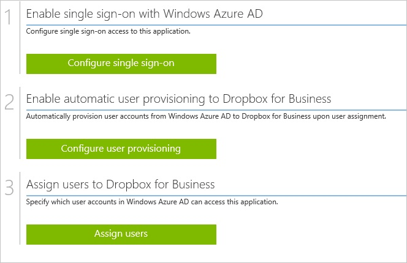

##Enabling the application integration for Dropbox for Business
  
The objective of this section is to outline how to enable the application integration for Dropbox for Business.

###To enable the application integration for Dropbox for Business, perform the following steps:

1.  In the Azure classic portal, on the left navigation pane, click **Active Directory**.

    

2.  From the **Directory** list, select the directory for which you want to enable directory integration.

3.  To open the applications view, in the directory view, click **Applications** in the top menu.

    

4.  Click **Add** at the bottom of the page.

    

5.  On the **What do you want to do** dialog, click **Add an application from the gallery**.

    

6.  In the **search box**, type **Dropbox for Business**.

    

7.  In the results pane, select **Dropbox for Business**, and then click **Complete** to add the application.

    

##Configuring single sign-on
  
The objective of this section is to outline how to enable users to authenticate to Dropbox for Business with their account in Azure AD using federation based on the SAML protocol.

As part of this procedure, you are required to upload a base-64 encoded certificate to your Dropbox for Business tenant. If you are not familiar with this procedure, see [How to convert a binary certificate into a text file](http://youtu.be/PlgrzUZ-Y1o).

###To configure single sign-on, perform the following steps:

1.  In the Azure classic portal, on the **Dropbox for Business** application integration page, click **Configure single sign-on** to open the **Configure Single Sign On ** dialog.

    

2.  On the **How would you like users to sign on to Dropbox for Business** page, select **Microsoft Azure AD Single Sign-On**, and then click **Next**.

    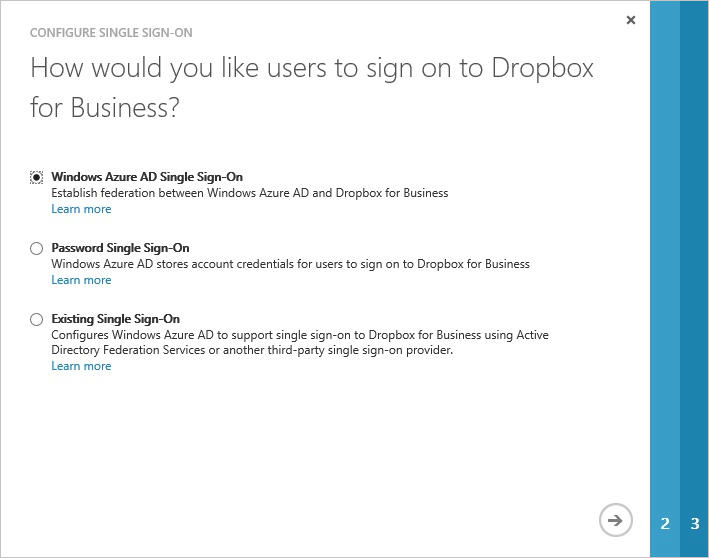

3.  On the **Configure App URL** page, perform the following steps:

	a. Sign-on to your Dropbox for business tenant. 

	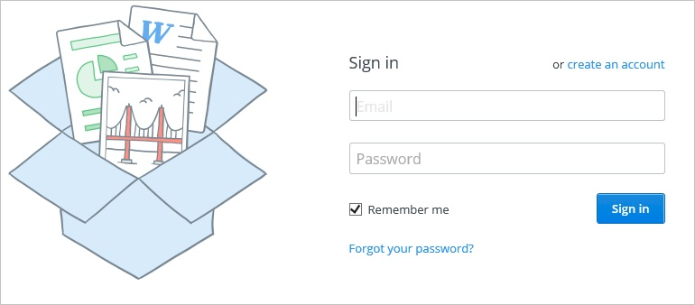

	b. In the navigation pane on the left side, click **Admin Console**. 

	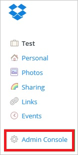

	c. On the **Admin Console**, click **Authentication** in the left navigation pane. 

	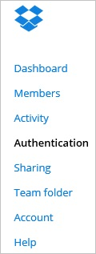

	d. In the **Single sign-on** section, select **Enable single sign-on**, and then click **More** to expand this section.  

	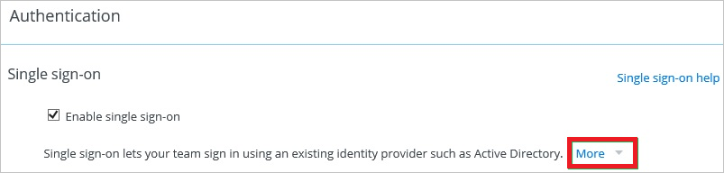

	e. Copy the URL next to **Users can sign in by entering their email address or they can go directly to**. 

	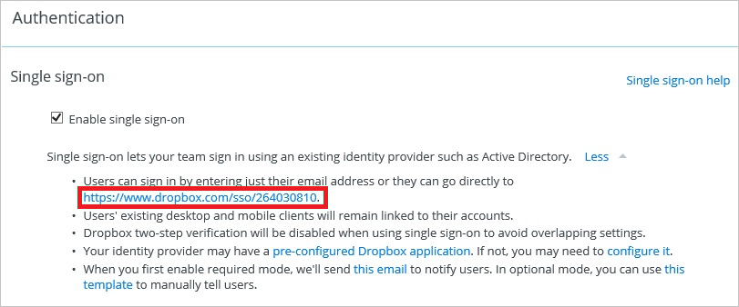

	f. On the Azure classic portal, in the **DropBox for business sign in** URL textbox, paste the URL. 

	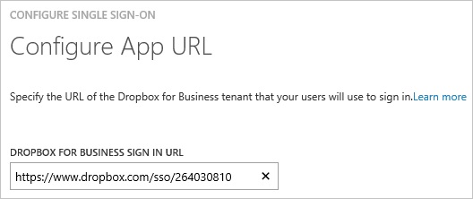  

4. On the **Configure single sign-on at Dropbox for Business** page, click **Download certificate**, and then save the certificate file on your computer.  

	

5. On your Dropbox for Business tenant, in the **Single sign-on** section of the **Authentication** page, perform the following steps: 

	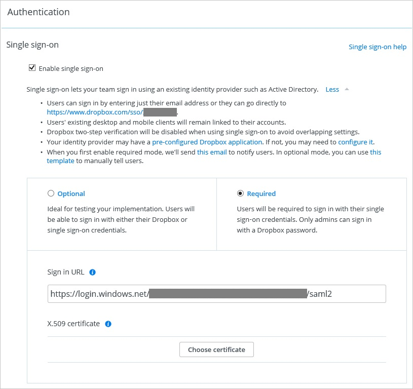

	a. Click **Required**.

	b. In the Azure classic portal, on the **Configure single sign-on at Dropbox for Business** dialog page, copy the **Sign-in page URL** value, and then paste it into the **Sign in URL** textbox.

	c. Create a **Base-64 encoded** file from your downloaded certificate. 

	> [AZURE.TIP] For more details, see [How to convert a binary certificate into a text file](http://youtu.be/PlgrzUZ-Y1o).

	d. Click **"Choose certificate"** button, and then browse to your **base-64 encoded certificate file**.

	e. Click **"Save changes"** button to complete the configuration on your DropBox for Business tenant.

6. On the Azure classic portal, select the single sign-on configuration confirmation, and then click **Complete** to close the **Configure Single Sign On** dialog. 

	

##Configuring user provisioning
  
The objective of this section is to outline how to enable user provisioning of Active Directory user accounts to Dropbox for Business.

### To configure user provisioning, perform the following steps:

1. In the Azure classic Portal, on the **Dropbox for Business** application integration page, click **Configure user provisioning** to open the **Configure User Provisioning** dialog.

2. On the Enable user provisioning to DropBox for Business page, click Enable user provisioning to open the Sign in to Dropbox to link with Azure AD dialog.  

	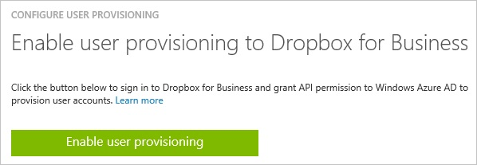

3. On the **Sign in to Dropbox to link with Azure AD** dialog, sign in to your Dropbox for Business tenant. 

	

4. Click **Allow** to grant Azure AD to access to Dropbox. 

	

5. To finish the configuration, click the **Complete** button.  

	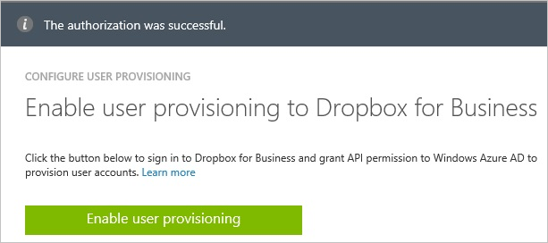

##Assigning users
  
To test your configuration, you need to grant the Azure AD users you want to allow using your application access to it by assigning them.

###To assign users to Dropbox for Business, perform the following steps:

1.  In the Azure classic portal, create a test account.

2.  On the **Dropbox for Business **application integration page, click **Assign users**.

    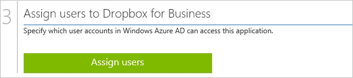

3.  Select your test user, click **Assign**, and then click **Yes** to confirm your assignment.

    
  

You should now wait for 10 minutes and verify that the account has been synchronized to Dropbox for Business.

As a first verification step, you can check the provisioning status, by clicking **Dashboard** in the **Dropbox for Business** application integration page on the Azure classic Portal.

A successfully completed user provisioning cycle is indicated by a related status.

If you want to test your single sign-on settings, open the Access Panel.
For more details about the Access Panel, see [Introduction to the Access Panel](active-directory-saas-access-panel-introduction.md).

## Additional Resources

* [List of Tutorials on How to Integrate SaaS Apps with Azure Active Directory](active-directory-saas-tutorial-list.md)
* [What is application access and single sign-on with Azure Active Directory?](active-directory-appssoaccess-whatis.md)