<properties 
    pageTitle="Tutorial: Azure Active Directory integration integration with Druva | Microsoft Azure" 
    description="Learn how to use Druva with Azure Active Directory to enable single sign-on, automated provisioning, and more!" 
    services="active-directory" 
    authors="jeevansd"  
    documentationCenter="na" 
    manager="femila"/>
<tags 
    ms.service="active-directory" 
    ms.devlang="na" 
    ms.topic="article" 
    ms.tgt_pltfrm="na" 
    ms.workload="identity" 
    ms.date="07/11/2016" 
    ms.author="jeedes" />

#Tutorial: Azure Active Directory integration integration with Druva

The objective of this tutorial is to show the integration of Azure and Druva.  
The scenario outlined in this tutorial assumes that you already have the following items:

-   A valid Azure subscription
-   A Druva single sign-on enabled subscription

After completing this tutorial, the Azure AD users you have assigned to Druva will be able to single sign into the application at your Druva company site (service provider initiated sign on), or using the [Introduction to the Access Panel](active-directory-saas-access-panel-introduction.md).

The scenario outlined in this tutorial consists of the following building blocks:

1.  Enabling the application integration for Druva
2.  Configuring single sign-on
3.  Configuring user provisioning
4.  Assigning users

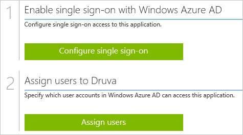
##Enabling the application integration for Druva

The objective of this section is to outline how to enable the application integration for Druva.

###To enable the application integration for Druva, perform the following steps:

1.  In the Azure classic portal, on the left navigation pane, click **Active Directory**.

    

2.  From the **Directory** list, select the directory for which you want to enable directory integration.

3.  To open the applications view, in the directory view, click **Applications** in the top menu.

    

4.  Click **Add** at the bottom of the page.

    

5.  On the **What do you want to do** dialog, click **Add an application from the gallery**.

    

6.  In the **search box**, type **Druva**.

    

7.  In the results pane, select **Druva**, and then click **Complete** to add the application.

    
##Configuring single sign-on

The objective of this section is to outline how to enable users to authenticate to Druva with their account in Azure AD using federation based on the SAML protocol.  
As part of this procedure, you are required to create a base-64 encoded certificate file.  
If you are not familiar with this procedure, see [How to convert a binary certificate into a text file](http://youtu.be/PlgrzUZ-Y1o).

Your Druva application expects the SAML assertions in a specific format, which requires you to add custom attribute mappings to your **saml token attributes** configuration.  
The following screenshot shows an example for this.

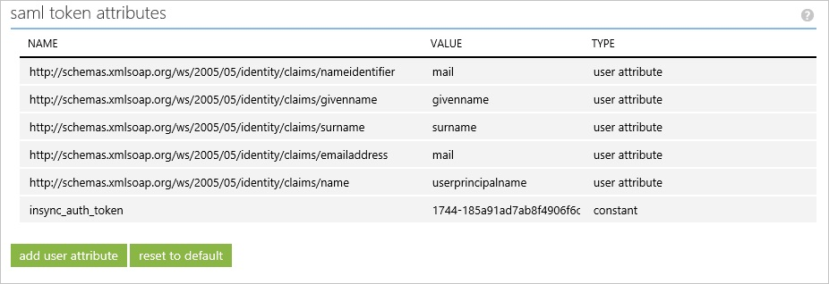

###To configure single sign-on, perform the following steps:

1.  In the Azure classic portal, on the **Druva** application integration page, click **Configure single sign-on** to open the **Configure Single Sign On ** dialog.

    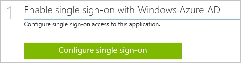

2.  On the **How would you like users to sign on to Druva** page, select **Microsoft Azure AD Single Sign-On**, and then click **Next**.

    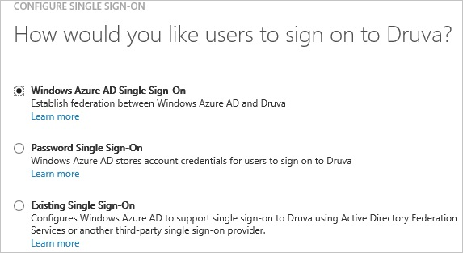

3.  On the **Configure App URL** page, in the **Druva Sign On URL** textbox, type the URL used by your users to sign on to your Druva application (e.g.: "*https://cloud.druva.com/home/*”), and then click **Next**.

    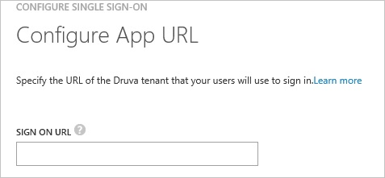

4.  On the **Configure single sign-on at Druva** page, to download your certificate, click **Download certificate**, and then save the certificate file locally on your computer.

    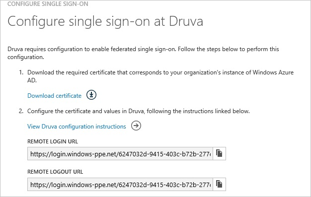

5.  In a different web browser window, log into your Druva company site as an administrator.

6.  Go to **Manage \> Settings**.

    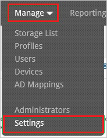

7.  On the Single Sign-On Settings dialog, perform the following steps:

    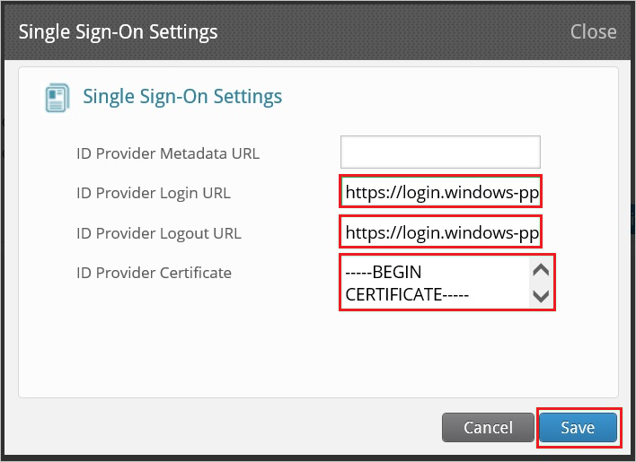

    1.  In the Azure classic portal, on the **Configure single sign-on at Druva** dialog page, copy the **Remote Login URL** value, and then paste it into the **ID Provider Login URL** textbox.
    2.  In the Azure classic portal, on the **Configure single sign-on at Druva** dialog page, copy the **Remote Logout URL** value, and then paste it into the **ID Provider Logout URL** textbox.
    3.  Create a **base-64 encoded** file from your downloaded certificate.  

        >[AZURE.TIP] For more details, see [How to convert a binary certificate into a text file](http://youtu.be/PlgrzUZ-Y1o)

    4.  Open your base-64 encoded certificate in notepad, copy the content of it into your clipboard, and then paste it to the **ID Provider Certificate** textbox
    5.  To open the **Settings** page, click **Save**.

8.  On the **Settings** page, click **Generate SSO Token**.

    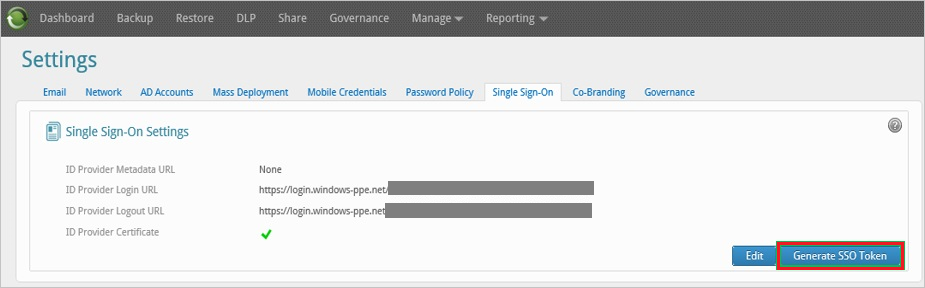

9.  On the **Single Sign-on Authentication Token** dialog, perform the following steps:

    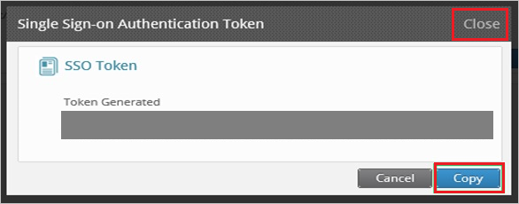

    1.  Click **Copy**.
    2.  Click **Close**.

10. On the Azure classic portal, select the single sign-on configuration confirmation, and then click **Complete** to close the **Configure Single Sign On** dialog.

    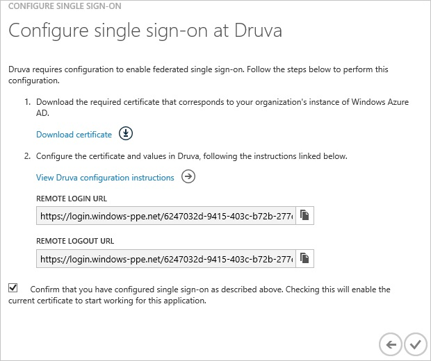

11. In the menu on the top, click **Attributes** to open the **SAML Token Attributes** dialog.

    

12. To add the required attribute mappings, perform the following steps:

	|Attribute Name|Attribute Value|
    |---|---|
    |insync\_auth\_token|<*clipboard value*>|

    1.  For each data row in the table above, click **add user attribute**.
    2.  In the **Attribute Name** textbox, type the attribute name shown for that row.
    3.  In the **Attribute Value** textbox, type the attribute value shown for that row.
    4.  Click **Complete**.

13. Click **Apply Changes**.
##Configuring user provisioning

In order to enable Azure AD users to log into Druva, they must be provisioned into Druva.  
In the case of Druva, provisioning is a manual task.

###To configure user provisioning, perform the following steps:

1.  Log in to your **Druva** company site as administrator.

2.  Go to **Manage \> Users**.

    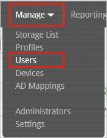

3.  Click **Create New**.

    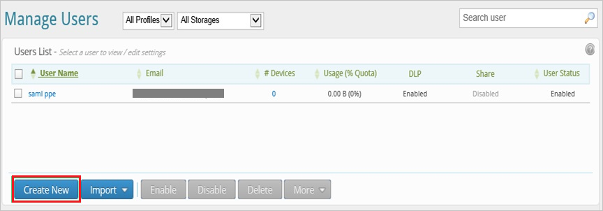

4.  On the Create New User dialog, perform the following steps:

    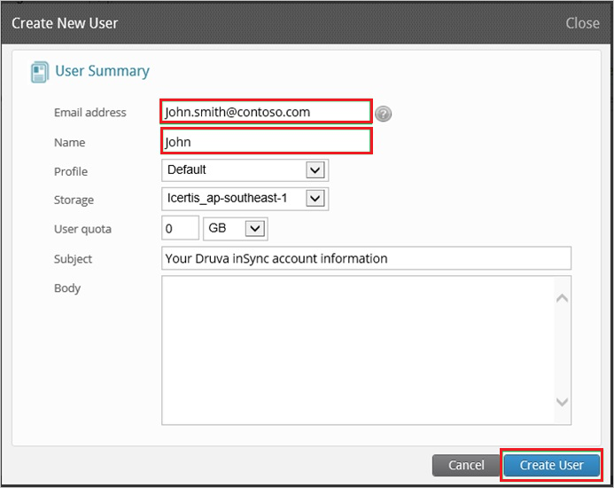

    1.  Type the email address and the name of a valid Azure Active Directory user account you want to provision into the related textboxes.
    2.  Click **Create User**.

>[AZURE.NOTE] You can use any other Druva user account creation tools or APIs provided by Druva to provision AAD user accounts.

##Assigning users

To test your configuration, you need to grant the Azure AD users you want to allow using your application access to it by assigning them.

###To assign users to Druva, perform the following steps:

1.  In the Azure classic portal, create a test account.

2.  On the **Druva **application integration page, click **Assign users**.

    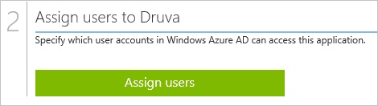

3.  Select your test user, click **Assign**, and then click **Yes** to confirm your assignment.

    

If you want to test your single sign-on settings, open the Access Panel. For more details about the Access Panel, see [Introduction to the Access Panel](active-directory-saas-access-panel-introduction.md).
