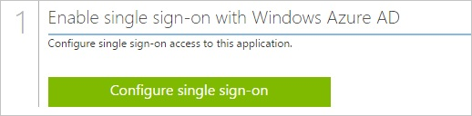
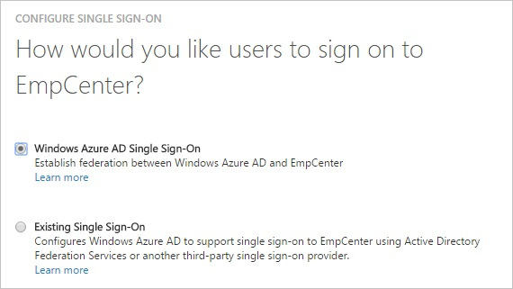

<properties 
    pageTitle="Tutorial: Azure Active Directory integration with EmpCenter | Microsoft Azure" 
    description="Learn how to use EmpCenter with Azure Active Directory to enable single sign-on, automated provisioning, and more!" 
    services="active-directory" 
    authors="jeevansd"  
    documentationCenter="na" 
    manager="femila"/>
<tags 
    ms.service="active-directory" 
    ms.devlang="na" 
    ms.topic="article" 
    ms.tgt_pltfrm="na" 
    ms.workload="identity" 
    ms.date="05/25/2016" 
    ms.author="jeedes" />

#Tutorial: Azure Active Directory integration with EmpCenter
  
The objective of this tutorial is to show the integration of Azure and EmpCenter.  
The scenario outlined in this tutorial assumes that you already have the following items:

-   A valid Azure subscription
-   An EmpCenter single sign-on enabled subscription
  
After completing this tutorial, the Azure AD users you have assigned to EmpCenter will be able to single sign into the application at your EmpCenter company site (service provider initiated sign on), or using the [Introduction to the Access Panel](active-directory-saas-access-panel-introduction.md).
  
The scenario outlined in this tutorial consists of the following building blocks:

1.  Enabling the application integration for EmpCenter
2.  Configuring single sign-on
3.  Configuring user provisioning
4.  Assigning users

##Enabling the application integration for EmpCenter
  
The objective of this section is to outline how to enable the application integration for EmpCenter.

###To enable the application integration for EmpCenter, perform the following steps:

1.  In the Azure classic portal, on the left navigation pane, click **Active Directory**.

    

2.  From the **Directory** list, select the directory for which you want to enable directory integration.

3.  To open the applications view, in the directory view, click **Applications** in the top menu.

    

4.  Click **Add** at the bottom of the page.

    

5.  On the **What do you want to do** dialog, click **Add an application from the gallery**.

    

6.  In the **search box**, type **EmpCenter**.

    

7.  In the results pane, select **EmpCenter**, and then click **Complete** to add the application.

    
##Configuring single sign-on
  
The objective of this section is to outline how to enable users to authenticate to EmpCenter with their account in Azure AD using federation based on the SAML protocol.

###To configure single sign-on, perform the following steps:

1.  In the Azure classic portal, on the **EmpCenter** application integration page, click **Configure single sign-on** to open the **Configure Single Sign On ** dialog.

    

2.  On the **How would you like users to sign on to EmpCenter** page, select **Microsoft Azure AD Single Sign-On**, and then click **Next**.

    

3.  On the **Configure App Settings** page, perform the following steps:

    

    1.  In the **Sign On URL** textbox, type the URL used by your users to sign-on to your EmpCenter application (e.g.: *https://partner-authenticati.empcenter.com/workforce/SSO.do*).
    2.  Click **Next**

4.  On the **Configure single sign-on at EmpCenter** page, to download your metadata, click **Download metadata**, and then save the metadata file on your computer.

    

5.  Send the downloaded metadata file to your EmpCenter support team.

    >[AZURE.NOTE] Your EmpCenter support team has to do the actual SSO configuration.
    You will get a notification when SSO has been enabled for your subscription.

6.  On the Azure classic portal, select the single sign-on configuration confirmation, and then click **Complete** to close the **Configure Single Sign On** dialog.

    
##Configuring user provisioning
  
In order to enable Azure AD users to log into EmpCenter, they must be provisioned into EmpCenter.  
In the case of EmpCenter, the user accounts need to be created by your EmpCenter support team.

>[AZURE.NOTE] You can use any other EmpCenter user account creation tools or APIs provided by EmpCenter to provision Azure Active Directory user accounts.

##Assigning users
  
To test your configuration, you need to grant the Azure AD users you want to allow using your application access to it by assigning them.

###To assign users to EmpCenter, perform the following steps:

1.  In the Azure classic portal, create a test account.

2.  On the **EmpCenter **application integration page, click **Assign users**.

    

3.  Select your test user, click **Assign**, and then click **Yes** to confirm your assignment.

    
  
If you want to test your single sign-on settings, open the Access Panel. For more details about the Access Panel, see [Introduction to the Access Panel](active-directory-saas-access-panel-introduction.md).