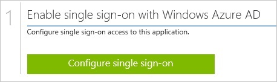
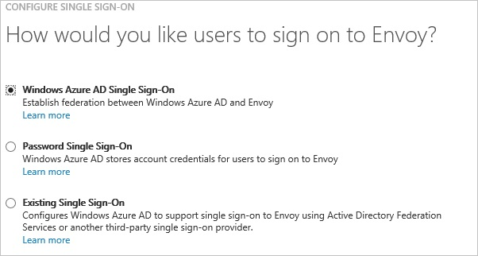
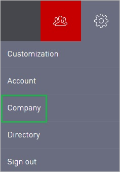
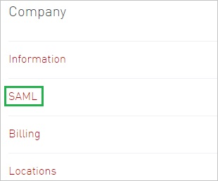
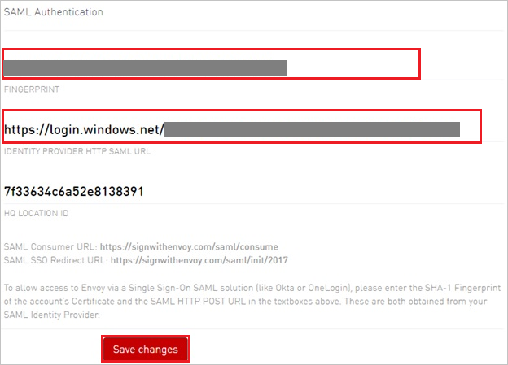

<properties 
    pageTitle="Tutorial: Azure Active Directory integration with Envoy | Microsoft Azure" 
    description="Learn how to use Envoy with Azure Active Directory to enable single sign-on, automated provisioning, and more!" 
    services="active-directory" 
    authors="jeevansd"  
    documentationCenter="na" 
    manager="femila"/>
<tags 
    ms.service="active-directory" 
    ms.devlang="na" 
    ms.topic="article" 
    ms.tgt_pltfrm="na" 
    ms.workload="identity" 
    ms.date="07/09/2016" 
    ms.author="jeedes" />

#Tutorial: Azure Active Directory integration with Envoy
  
The objective of this tutorial is to show the integration of Azure and Envoy.  
The scenario outlined in this tutorial assumes that you already have the following items:

-   A valid Azure subscription
-   A Envoy tenant
  
After completing this tutorial, the Azure AD users you have assigned to Envoy will be able to single sign into the application at your Envoy company site (service provider initiated sign on), or using the [Introduction to the Access Panel](active-directory-saas-access-panel-introduction.md).
  
The scenario outlined in this tutorial consists of the following building blocks:

1.  Enabling the application integration for Envoy
2.  Configuring single sign-on
3.  Configuring user provisioning
4.  Assigning users

##Enabling the application integration for Envoy
  
The objective of this section is to outline how to enable the application integration for Envoy.

###To enable the application integration for Envoy, perform the following steps:

1.  In the Azure classic portal, on the left navigation pane, click **Active Directory**.

    

2.  From the **Directory** list, select the directory for which you want to enable directory integration.

3.  To open the applications view, in the directory view, click **Applications** in the top menu.

    

4.  Click **Add** at the bottom of the page.

    

5.  On the **What do you want to do** dialog, click **Add an application from the gallery**.

    

6.  In the **search box**, type **Envoy**.

    

7.  In the results pane, select **Envoy**, and then click **Complete** to add the application.

    
##Configuring single sign-on
  
The objective of this section is to outline how to enable users to authenticate to Envoy with their account in Azure AD using federation based on the SAML protocol.  
Configuring single sign-on for Envoy requires you to retrieve a thumbprint value from a certificate.  
If you are not familiar with this procedure, see [How to retrieve a certificate's thumbprint value](http://youtu.be/YKQF266SAxI)

###To configure single sign-on, perform the following steps:

1.  In the Azure classic portal, on the **Envoy** application integration page, click **Configure single sign-on** to open the **Configure Single Sign On ** dialog.

    

2.  On the **How would you like users to sign on to Envoy** page, select **Microsoft Azure AD Single Sign-On**, and then click **Next**.

    

3.  On the **Configure App URL** page, in the **Envoy Sign In URL** textbox, type your URL using the following pattern "*https://\<tenant-name\>.Envoy.com*", and then click **Next**.

    

4.  On the **Configure single sign-on at Envoy** page, to download your certificate, click **Download certificate**, and then save the certificate file locally as **c:\\Envoy.cer**.

    

5.  In a different web browser window, log into your Envoy company site as an administrator.

6.  In the toolbar on the top, click **Settings**.

    

7.  Click **Company**.

    

8.  Click **SAML**.

    

9.  In the **SAML Authentication** configuration section, perform the following steps:

    

    >[AZURE.NOTE] The value for the HQ location ID is auto generated by the application.

    1.  Copy the **Thumbprint** value from the exported certificate, and then paste it into the **Fingerprint** textbox.  

        >[AZURE.TIP] For more details, see [How to retrieve a certificate's thumbprint value](http://youtu.be/YKQF266SAxI)

    2.  In the Azure classic portal, on the **Configure single sign-on at Envoy** dialog page, copy the **SAML SSO URL** value, and then paste it into the **Identity Provider HTTP SAML URL** textbox.
    3.  Click **Save changes**.

10. On the Azure classic portal, select the single sign-on configuration confirmation, and then click **Complete** to close the **Configure Single Sign On** dialog.

    
##Configuring user provisioning
  
There is no action item for you to configure user provisioning to Envoy.  
When an assigned user tries to log into Envoy using the access panel, Envoy checks whether the user exists.  
If there is no user account available yet, it is automatically created by Envoy.
##Assigning users
  
To test your configuration, you need to grant the Azure AD users you want to allow using your application access to it by assigning them.

###To assign users to Envoy, perform the following steps:

1.  In the Azure classic portal, create a test account.

2.  On the **Envoy **application integration page, click **Assign users**.

    

3.  Select your test user, click **Assign**, and then click **Yes** to confirm your assignment.

    
  
If you want to test your single sign-on settings, open the Access Panel. For more details about the Access Panel, see [Introduction to the Access Panel](active-directory-saas-access-panel-introduction.md).