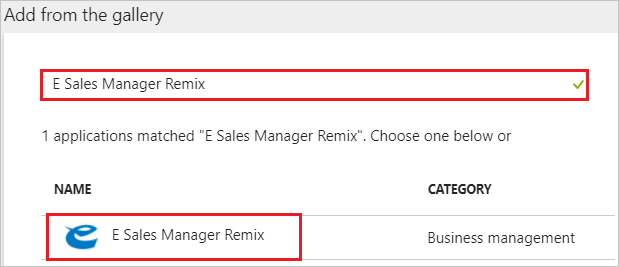
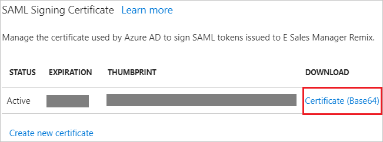
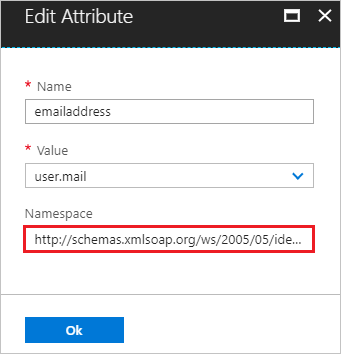
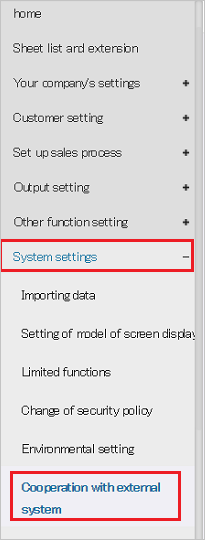
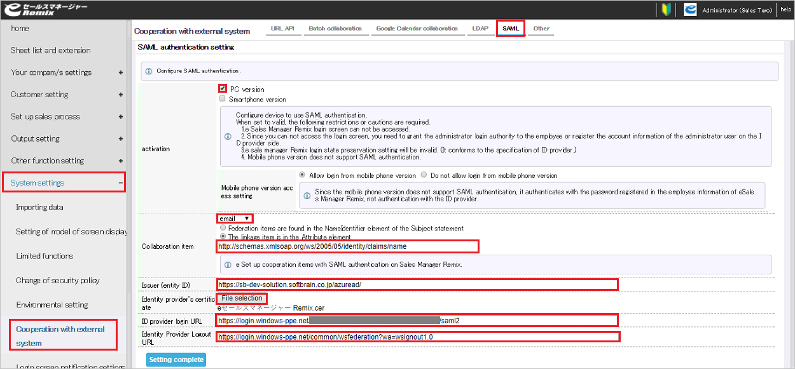
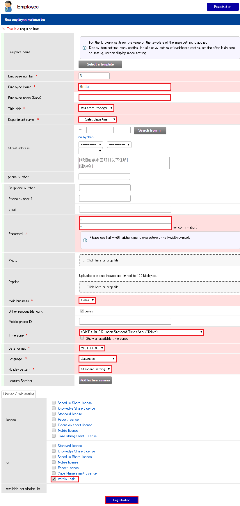

# Tutorial: Azure Active Directory integration with E Sales Manager Remix

In this tutorial, you learn how to integrate E Sales Manager Remix with Azure Active Directory (Azure AD).

Integrating E Sales Manager Remix with Azure AD provides you with the following benefits:

- You can control in Azure AD who has access to E Sales Manager Remix.
- You can enable your users to automatically get signed-on to E Sales Manager Remix (Single Sign-On) with their Azure AD accounts.
- You can manage your accounts in one central location - the Azure portal.

If you want to know more details about SaaS app integration with Azure AD, see [what is application access and single sign-on with Azure Active Directory](active-directory-appssoaccess-whatis.md).

## Prerequisites

To configure Azure AD integration with E Sales Manager Remix, you need the following items:

- An Azure AD subscription
- An E Sales Manager Remix single sign-on enabled subscription

> [!NOTE]
> To test the steps in this tutorial, we do not recommend using a production environment.

To test the steps in this tutorial, you should follow these recommendations:

- Do not use your production environment, unless it is necessary.
- If you don't have an Azure AD trial environment, you can [get a one-month trial](https://azure.microsoft.com/pricing/free-trial/).

## Scenario description
In this tutorial, you test Azure AD single sign-on in a test environment. 
The scenario outlined in this tutorial consists of two main building blocks:

1. Adding E Sales Manager Remix from the gallery
2. Configuring and testing Azure AD single sign-on

## Adding E Sales Manager Remix from the gallery
To configure the integration of E Sales Manager Remix into Azure AD, you need to add E Sales Manager Remix from the gallery to your list of managed SaaS apps.

**To add E Sales Manager Remix from the gallery, perform the following steps:**

1. In the **[Azure portal](https://portal.azure.com)**, on the left navigation panel, click **Azure Active Directory** icon. 

	![The Azure Active Directory button][1]

2. Navigate to **Enterprise applications**. Then go to **All applications**.

	![The Enterprise applications blade][2]
	
3. To add new application, click **New application** button on the top of dialog.

	![The New application button][3]

4. In the search box, type **E Sales Manager Remix**, select **E Sales Manager Remix** from result panel then click **Add** button to add the application.

	

## Configure and test Azure AD single sign-on

In this section, you configure and test Azure AD single sign-on with E Sales Manager Remix based on a test user called "Britta Simon".

For single sign-on to work, Azure AD needs to know what the counterpart user in E Sales Manager Remix is to a user in Azure AD. In other words, a link relationship between an Azure AD user and the related user in E Sales Manager Remix needs to be established.

To configure and test Azure AD single sign-on with E Sales Manager Remix, you need to complete the following building blocks:

1. **[Configure Azure AD Single Sign-On](#configure-azure-ad-single-sign-on)** - to enable your users to use this feature.
2. **[Create an Azure AD test user](#create-an-azure-ad-test-user)** - to test Azure AD single sign-on with Britta Simon.
3. **[Create an E Sales Manager Remix test user](#create-an-e-sales-manager-remix-test-user)** - to have a counterpart of Britta Simon in E Sales Manager Remix that is linked to the Azure AD representation of user.
4. **[Assign the Azure AD test user](#assign-the-azure-ad-test-user)** - to enable Britta Simon to use Azure AD single sign-on.
5. **[Test single sign-on](#test-single-sign-on)** - to verify whether the configuration works.

### Configure Azure AD single sign-on

In this section, you enable Azure AD single sign-on in the Azure portal and configure single sign-on in your E Sales Manager Remix application.

**To configure Azure AD single sign-on with E Sales Manager Remix, perform the following steps:**

1. In the Azure portal, on the **E Sales Manager Remix** application integration page, click **Single sign-on**.

	![Configure single sign-on link][4]

2. On the **Single sign-on** dialog, select **Mode** as	**SAML-based Sign-on** to enable single sign-on.
 
	

3. On the **E Sales Manager Remix Domain and URLs** section, perform the following steps:

	

    a. In the **Sign-on URL** textbox, type a URL using the following pattern: `https://<Server-Based-URL>/<sub-domain>/esales-pc`

	b. In the **Identifier** textbox, type a URL using the following pattern: `https://<Server-Based-URL>/<sub-domain>/`

	c. Copy the **Identifier** value in notepad. You will use Identifier value later in this tutorial.
	
	> [!NOTE] 
	> These values are not real. Update these values with the actual Sign-On URL and Identifier. Contact [E Sales Manager Remix Client support team](mailto:esupport@softbrain.co.jp) to get these values.

4. On the **SAML Signing Certificate** section, click **Certificate(Base64)** and then save the certificate file on your computer.

	 

5. Select **View and edit all other user attributes** and click on **emailaddress** attribute.
	
	

6. Copy the **Namespace** and **Name** value of the claim from the textbox. Generate the value in the following pattern - `<Namespace>/<Name>`. You will use this value later in this tutorial.

	

7. On the **E Sales Manager Remix Configuration** section, click **Configure E Sales Manager Remix** to open **Configure sign-on** window. Copy the **Sign-Out URL and SAML Single Sign-On Service URL** from the **Quick Reference section.**

	 

8. Click **Save** button.

	

9. Sign on to your E Sales Manager Remix application as an administrator.

10. Select **To Administrator Menu** from the menu at the top right.

	

11. Select **System settings**>**Cooperation with external system**

	
	
12. Select **SAML**

	

13. In the **SAML authentication setting** section, perform the following steps:

	
	
	a. Select **PC version**
	
	b. Select **email** from the dropdown in the Collaboration item section.

	c. In the Collaboration item textbox, paste the **claim value** that you have copied from the Azure portal i.e `http://schemas.xmlsoap.org/ws/2005/05/identity/claims/emailaddress`

	d. In the **Issuer (entity ID)** textbox, paste the **Identifier** value that you have copied from the Azure portal of **E Sales Manager Remix Domain and URLs** section.

	e. To upload your downloaded **certificate** from the Azure portal, select **File selection**.

	f. In **ID provider login URL** textbox, paste **SAML Single Sign-On Service URL** that you have copied from Azure portal.

	g. In **Identity Provider Logout URL** textbox, paste **Sign-Out URL** value that you have copied from Azure portal.

	h. Click **Setting complete**

> [!TIP]
> You can now read a concise version of these instructions inside the [Azure portal](https://portal.azure.com), while you are setting up the app!  After adding this app from the **Active Directory > Enterprise Applications** section, simply click the **Single Sign-On** tab and access the embedded documentation through the **Configuration** section at the bottom. You can read more about the embedded documentation feature here: [Azure AD embedded documentation]( https://go.microsoft.com/fwlink/?linkid=845985)
> 

### Create an Azure AD test user

The objective of this section is to create a test user in the Azure portal called Britta Simon.

   ![Create an Azure AD test user][100]

**To create a test user in Azure AD, perform the following steps:**

1. In the Azure portal, in the left pane, click the **Azure Active Directory** button.

    

2. To display the list of users, go to **Users and groups**, and then click **All users**.

    

3. To open the **User** dialog box, click **Add** at the top of the **All Users** dialog box.

    

4. In the **User** dialog box, perform the following steps:

    

    a. In the **Name** box, type **BrittaSimon**.

    b. In the **User name** box, type the email address of user Britta Simon.

    c. Select the **Show Password** check box, and then write down the value that's displayed in the **Password** box.

    d. Click **Create**.
 
### Create an E Sales Manager Remix test user

1. Sign on to your E Sales Manager Remix application as an administrator.

2. Select **To Administrator Menu** from the menu at the top right.

	

3. Select **Your company settings**>**Maintenance of departments and employees** and select **Employees registered**.

	

4. In the **New employee registration** section, perform the following steps:
	
	

	a. In the **Employee Name** textbox, type the name of user like Britta.

	b. Fill all the respective mandatory fields with the user information.
	
	c. If you enable SAML, the administrator will not be able to log in from the login screen, so grant administrator login privileges to the user by selecting the **Admin Login**

	d. Click **Registration**

5. In the future, if you want to log in as an administrator, log in with the user who was granted the administrator permission, and click **To Administrator Menu** from the menu at the top right.

	

### Assign the Azure AD test user

In this section, you enable Britta Simon to use Azure single sign-on by granting access to E Sales Manager Remix.

![Assign the user role][200] 

**To assign Britta Simon to E Sales Manager Remix, perform the following steps:**

1. In the Azure portal, open the applications view, and then navigate to the directory view and go to **Enterprise applications** then click **All applications**.

	![Assign User][201] 

2. In the applications list, select **E Sales Manager Remix**.

	  

3. In the menu on the left, click **Users and groups**.

	![The "Users and groups" link][202]

4. Click **Add** button. Then select **Users and groups** on **Add Assignment** dialog.

	![The Add Assignment pane][203]

5. On **Users and groups** dialog, select **Britta Simon** in the Users list.

6. Click **Select** button on **Users and groups** dialog.

7. Click **Assign** button on **Add Assignment** dialog.
	
### Test single sign-on

In this section, you test your Azure AD single sign-on configuration using the Access Panel.

When you click the E Sales Manager Remix tile in the Access Panel, you should get automatically signed-on to your E Sales Manager Remix application.
For more information about the Access Panel, see [Introduction to the Access Panel](active-directory-saas-access-panel-introduction.md). 

## Additional resources

* [List of Tutorials on How to Integrate SaaS Apps with Azure Active Directory](active-directory-saas-tutorial-list.md)
* [What is application access and single sign-on with Azure Active Directory?](active-directory-appssoaccess-whatis.md)

<!--Image references-->

[1]: ./media/active-directory-saas-esalesmanagerremix-tutorial/tutorial_general_01.png
[2]: ./media/active-directory-saas-esalesmanagerremix-tutorial/tutorial_general_02.png
[3]: ./media/active-directory-saas-esalesmanagerremix-tutorial/tutorial_general_03.png
[4]: ./media/active-directory-saas-esalesmanagerremix-tutorial/tutorial_general_04.png

[100]: ./media/active-directory-saas-esalesmanagerremix-tutorial/tutorial_general_100.png

[200]: ./media/active-directory-saas-esalesmanagerremix-tutorial/tutorial_general_200.png
[201]: ./media/active-directory-saas-esalesmanagerremix-tutorial/tutorial_general_201.png
[202]: ./media/active-directory-saas-esalesmanagerremix-tutorial/tutorial_general_202.png
[203]: ./media/active-directory-saas-esalesmanagerremix-tutorial/tutorial_general_203.png

