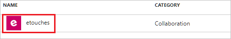
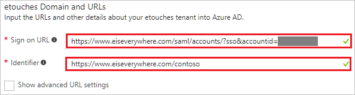
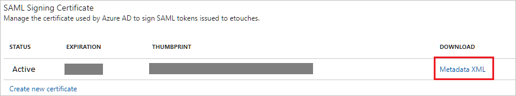
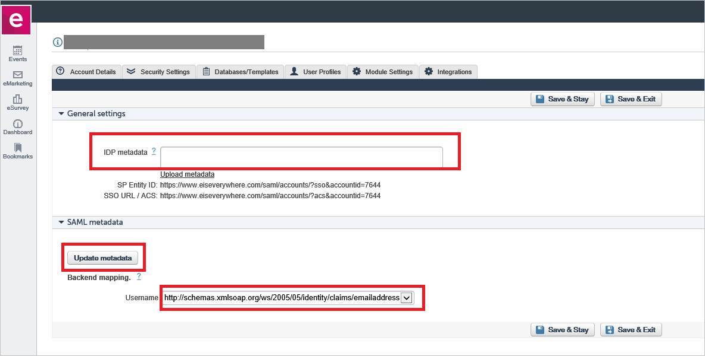

# Tutorial: Azure Active Directory integration with etouches

In this tutorial, you learn how to integrate etouches with Azure Active Directory (Azure AD).

Integrating etouches with Azure AD provides you with the following benefits:

- You can control in Azure AD who has access to etouches
- You can enable your users to automatically get signed-on to etouches (Single Sign-On) with their Azure AD accounts
- You can manage your accounts in one central location - the Azure portal

If you want to know more details about SaaS app integration with Azure AD, see [what is application access and single sign-on with Azure Active Directory](active-directory-appssoaccess-whatis.md).

## Prerequisites

To configure Azure AD integration with etouches, you need the following items:

- An Azure AD subscription
- An etouches single sign-on enabled subscription

> [!NOTE]
> To test the steps in this tutorial, we do not recommend using a production environment.

To test the steps in this tutorial, you should follow these recommendations:

- Do not use your production environment, unless it is necessary.
- If you don't have an Azure AD trial environment, you can [get a one-month trial](https://azure.microsoft.com/pricing/free-trial/).

## Scenario description
In this tutorial, you test Azure AD single sign-on in a test environment. 
The scenario outlined in this tutorial consists of two main building blocks:

1. Adding etouches from the gallery
2. Configuring and testing Azure AD single sign-on

## Adding etouches from the gallery
To configure the integration of etouches into Azure AD, you need to add etouches from the gallery to your list of managed SaaS apps.

**To add etouches from the gallery, perform the following steps:**

1. In the **[Azure portal](https://portal.azure.com)**, on the left navigation panel, click **Azure Active Directory** icon. 

	![The Azure Active Directory button][1]

2. Navigate to **Enterprise applications**. Then go to **All applications**.

	![The Enterprise applications blade][2]
	
3. To add new application, click **New application** button on the top of dialog.

	![The New application button][3]

4. In the search box, type **etouches**, select **etouches** from result panel then click **Add** button to add the application.

	

##  Configure and test Azure AD single sign-on
In this section, you configure and test Azure AD single sign-on with etouches based on a test user called "Britta Simon".

For single sign-on to work, Azure AD needs to know what the counterpart user in etouches is to a user in Azure AD. In other words, a link relationship between an Azure AD user and the related user in etouches needs to be established.

In etouches, assign the value of the **user name** in Azure AD as the value of the **Username** to establish the link relationship.

To configure and test Azure AD single sign-on with etouches, you need to complete the following building blocks:

1. **[Configure Azure AD Single Sign-On](#configure-azure-ad-single-sign-on)** - to enable your users to use this feature.
2. **[Create an Azure AD test user](#create-an-azure-ad-test-user)** - to test Azure AD single sign-on with Britta Simon.
3. **[Create an etouches test user](#create-an-etouches-test-user)** - to have a counterpart of Britta Simon in etouches that is linked to the Azure AD representation of user.
4. **[Assign the Azure AD test user](#assign-the-azure-ad-test-user)** - to enable Britta Simon to use Azure AD single sign-on.
5. **[Test Single Sign-On](#test-single-sign-on)** - to verify whether the configuration works.

### Configure Azure AD single sign-on

In this section, you enable Azure AD single sign-on in the Azure portal and configure single sign-on in your etouches application.

**To configure Azure AD single sign-on with etouches, perform the following steps:**

1. In the Azure portal, on the **etouches** application integration page, click **Single sign-on**.

	![Configure Single Sign-On][4]

2. On the **Single sign-on** dialog, select **Mode** as	**SAML-based Sign-on** to enable single sign-on.
 
	

3. On the **etouches Domain and URLs** section, perform the following steps:

	

    a. In the **Sign-on URL** textbox, type a URL using the following pattern: `https://www.eiseverywhere.com/saml/accounts/?sso&accountid=<ACCOUNTID>`

	b. In the **Identifier** textbox, type a URL using the following pattern: `https://www.eiseverywhere.com/<instance name>`

	> [!NOTE] 
	> These values are not real. You update the value with the actual Sign on URL and Identifier, which is explained later in the tutorial.
	> 

4. etouches application expects the SAML assertions in a specific format. Configure the following claims for this application. You can manage the values of these attributes from the **User Attribute** of the application. The following screenshot shows an example for this. 

     

5. In the **User Attributes** section on the **Single sign-on** dialog, configure SAML token attribute as shown in the image and perform the following steps:
	
	| Attribute Name | Attribute Value |
	| ------------------- | -------------------- |
	| Email | user.mail |    
	
	a. Click **Add attribute** to open the **Add Attribute** dialog.

	

	

	b. In the **Name** textbox, type the attribute name shown for that row.

	c. From the **Value** list, type the attribute value shown for that row.
	
	d. Click **Ok**. 

6. On the **SAML Signing Certificate** section, click **Metadata XML** and then save the metadata file on your computer.

	 

7. Click **Save** button.

	

8. To get SSO configured for your application, perform the following steps in the etouches application: 

     

    a. Login to **etouches** application using the Admin rights.
   
    b. Go to the **SAML** Configuration.

    c. In the **General Settings** section, open your downloaded certificate from Azure portal in notepad, copy the content, and then paste it into the IDP metadata textbox. 

    d. Click on the **Save & Stay** button.
  
    e. Click on the **Update Metadata** button in the SAML Metadata section. 

    f. This opens the page and perform SSO. Once the SSO is working then you can set up the username.

    g. In the Username field, select the **emailaddress** as shown in the image below. 

    h. Copy the **SP entity ID** value and paste it into the **Identifier**  textbox, which is in **etouches Domain and URLs** section on Azure portal.

	i. Copy the **SSO URL / ACS** value and paste it into the **Sign on URL** textbox, which is in **etouches Domain and URLs** section on Azure portal.
   
> [!TIP]
> You can now read a concise version of these instructions inside the [Azure portal](https://portal.azure.com), while you are setting up the app!  After adding this app from the **Active Directory > Enterprise Applications** section, simply click the **Single Sign-On** tab and access the embedded documentation through the **Configuration** section at the bottom. You can read more about the embedded documentation feature here: [Azure AD embedded documentation]( https://go.microsoft.com/fwlink/?linkid=845985)
> 

### Create an Azure AD test user
The objective of this section is to create a test user in the Azure portal called Britta Simon.

![Create an Azure AD test user][100]

**To create a test user in Azure AD, perform the following steps:**

1. In the **Azure portal**, on the left navigation pane, click **Azure Active Directory** icon.

	 

2. To display the list of users, go to **Users and groups** and click **All users**.
	
	 

3. To open the **User** dialog, click **Add** on the top of the dialog.
 
	 

4. On the **User** dialog page, perform the following steps:
 
	 

    a. In the **Name** textbox, type **BrittaSimon**.

    b. In the **User name** textbox, type the **email address** of BrittaSimon.

	c. Select **Show Password** and write down the value of the **Password**.

    d. Click **Create**.
 
### Create an etouches test user

In this section, you create a user called Britta Simon in etouches. Work with [etouches Client support team](https://www.etouches.com/event-software/support/customer-support/) to add the users in the etouches platform.

### Assign the Azure AD test user

In this section, you enable Britta Simon to use Azure single sign-on by granting access to etouches.

![Assign the user role][200] 

**To assign Britta Simon to etouches, perform the following steps:**

1. In the Azure portal, open the applications view, and then navigate to the directory view and go to **Enterprise applications** then click **All applications**.

	![Assign User][201] 

2. In the applications list, select **etouches**.

	 

3. In the menu on the left, click **Users and groups**.

	![The "Users and groups" link][202] 

4. Click **Add** button. Then select **Users and groups** on **Add Assignment** dialog.

	![The Add Assignment pane][203]

5. On **Users and groups** dialog, select **Britta Simon** in the Users list.

6. Click **Select** button on **Users and groups** dialog.

7. Click **Assign** button on **Add Assignment** dialog.
	
### Test single sign-on

The objective of this section is to test your Azure AD single sign-on configuration using the Access Panel.

When you click the etouches tile in the Access Panel, you should get automatically signed-on to your etouches application.

## Additional resources

* [List of Tutorials on How to Integrate SaaS Apps with Azure Active Directory](active-directory-saas-tutorial-list.md)
* [What is application access and single sign-on with Azure Active Directory?](active-directory-appssoaccess-whatis.md)

<!--Image references-->

[1]: ./media/active-directory-saas-etouches-tutorial/tutorial_general_01.png
[2]: ./media/active-directory-saas-etouches-tutorial/tutorial_general_02.png
[3]: ./media/active-directory-saas-etouches-tutorial/tutorial_general_03.png
[4]: ./media/active-directory-saas-etouches-tutorial/tutorial_general_04.png

[100]: ./media/active-directory-saas-etouches-tutorial/tutorial_general_100.png

[200]: ./media/active-directory-saas-etouches-tutorial/tutorial_general_200.png
[201]: ./media/active-directory-saas-etouches-tutorial/tutorial_general_201.png
[202]: ./media/active-directory-saas-etouches-tutorial/tutorial_general_202.png
[203]: ./media/active-directory-saas-etouches-tutorial/tutorial_general_203.png

