# Tutorial: Azure Active Directory integration with Evernote

In this tutorial, you learn how to integrate Evernote with Azure Active Directory (Azure AD).

Integrating Evernote with Azure AD provides you with the following benefits:

- You can control in Azure AD who has access to Evernote
- You can enable your users to automatically get signed-on to Evernote (Single Sign-On) with their Azure AD accounts
- You can manage your accounts in one central location - the Azure Management portal

If you want to know more details about SaaS app integration with Azure AD, see [What is application access and single sign-on with Azure Active Directory](active-directory-appssoaccess-whatis.md).

## Prerequisites

To configure Azure AD integration with Evernote, you need the following items:

- An Azure AD subscription
- A Evernote single-sign on enabled subscription

> [!NOTE]
> To test the steps in this tutorial, we do not recommend using a production environment.

To test the steps in this tutorial, you should follow these recommendations:

- You should not use your production environment, unless this is necessary.
- If you don't have an Azure AD trial environment, you can get an one-month trial [here](https://azure.microsoft.com/pricing/free-trial/).

## Scenario description
In this tutorial, you test Azure AD single sign-on in a test environment. 
The scenario outlined in this tutorial consists of two main building blocks:

1. Adding Evernote from the gallery
2. Configuring and testing Azure AD single sign-on

## Adding Evernote from the gallery
To configure the integration of Evernote into Azure AD, you need to add Evernote from the gallery to your list of managed SaaS apps.

**To add Evernote from the gallery, perform the following steps:**

1. In the **[Azure Management Portal](https://portal.azure.com)**, on the left navigation panel, click **Azure Active Directory** icon. 

	![Active Directory][1]

2. Navigate to **Enterprise applications**. Then go to **All applications**.

	![Applications][2]
	
3. Click **Add** button on the top of the dialog.

	![Applications][3]

4. In the search box, type **Evernote**.

	

5. In the results panel, select **Evernote**, and then click **Add** button to add the application.

	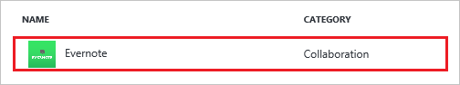

##  Configuring and testing Azure AD single sign-on
In this section, you configure and test Azure AD single sign-on with Evernote based on a test user called "Britta Simon".

For single sign-on to work, Azure AD needs to know what the counterpart user in Evernote is to a user in Azure AD. In other words, a link relationship between an Azure AD user and the related user in Evernote needs to be established.

This link relationship is established by assigning the value of the **user name** in Azure AD as the value of the **Username** in Evernote.

To configure and test Azure AD single sign-on with Evernote, you need to complete the following building blocks:

1. **[Configuring Azure AD Single Sign-On](#configuring-azure-ad-single-sign-on)** - to enable your users to use this feature.
2. **[Creating an Azure AD test user](#creating-an-azure-ad-test-user)** - to test Azure AD single sign-on with Britta Simon.
3. **[Assigning the Azure AD test user](#assigning-the-azure-ad-test-user)** - to enable Britta Simon to use Azure AD single sign-on.
4. **[Testing Single Sign-On](#testing-single-sign-on)** - to verify whether the configuration works.

### Configuring Azure AD single sign-on

In this section, you enable Azure AD single sign-on in the Azure Management portal and configure single sign-on in your Evernote application.

**To configure Azure AD single sign-on with Evernote, perform the following steps:**

1. In the Azure Management portal, on the **Evernote** application integration page, click **Single sign-on**.

	![Configure Single Sign-On][4]

2. On the **Single sign-on** dialog, as **Mode** select **SAML-based Sign-on** to enable single sign on.
 
	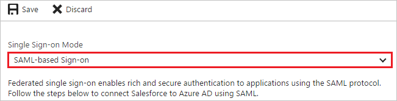

3. On the **Evernote Domain and URLs** section, If you wish to configure the application in **IDP initiated mode**, no need to perform any steps.

	
	
4. On the **Evernote Domain and URLs** section, If you wish to configure the application in **SP initiated mode**, perform the following steps:

	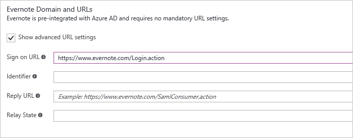
	
	a. Click on the **Show advanced URL settings** option

	b. In the **Sign On URL** textbox, type the Sign-On URL : `https://www.evernote.com/Login.action`

5. On the **SAML Signing Certificate** section, click **Create new certificate**.

	 	

6. On the **Create New Certificate** dialog, click the calendar icon and select an **expiry date**. Then click **Save** button.

	

7. On the **SAML Signing Certificate** section, select **Make new certificate active** and click **Save** button.

	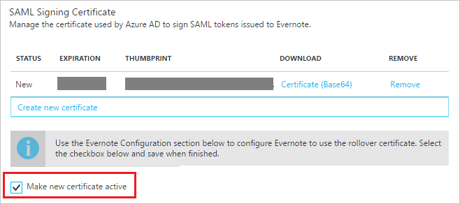

8. On the pop-up **Rollover certificate** window, click **OK**.

	

9. On the **SAML Signing Certificate** section, click **Certificate (Base64)** and then save the certificate file on your computer.

	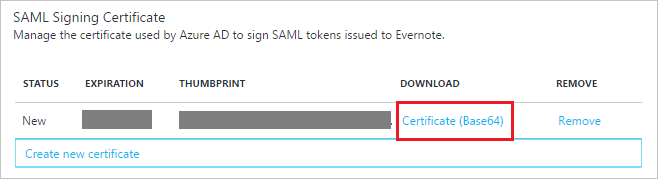 

10. On the **Evernote Configuration** section, click **Configure Evernote** to open **Configure sign-on** window.

	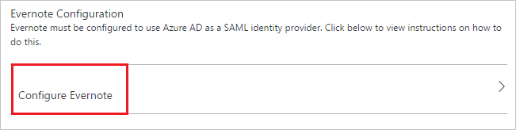 

	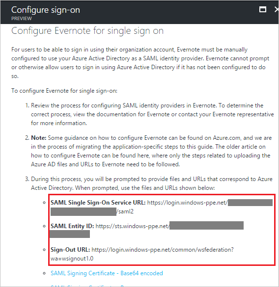

11. In a different web browser window, log into your Evernote company site as an administrator.

12. Go to **'Admin Console'**

	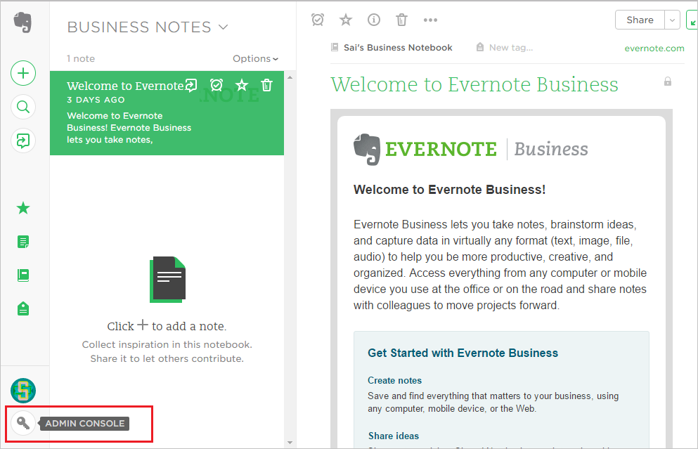

13. From the **'Admin Console'**, go to **‘Security’** and select **‘Single Sign-On’**

	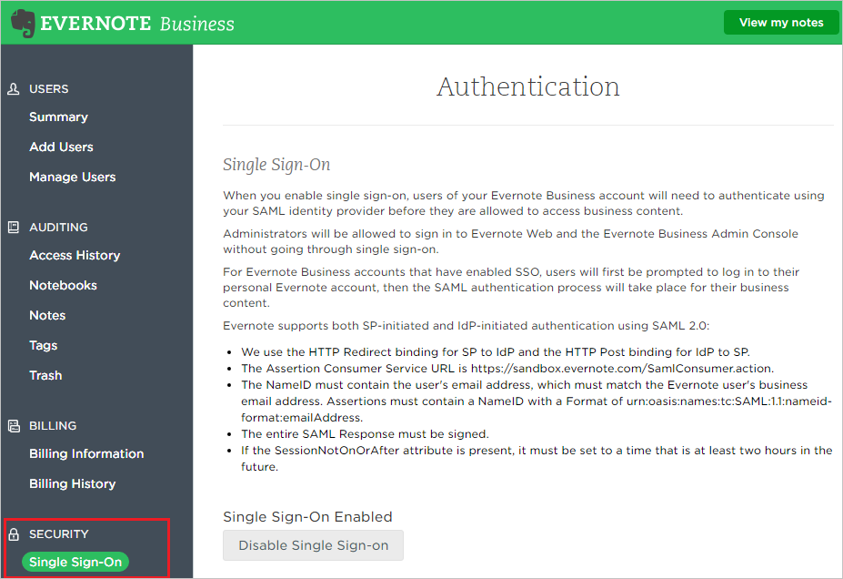

14. Configure the following values:

	a.  **Enable SSO:** SSO is enabled by default (Click **Disable Single Sign-on** to remove the SSO requirement)

	b. **SAML HTTP Request URL** - Enter **SAML Single sign-on Service URL** from the **Configure Evernote** section on Azure AD

	c. **X.509 Certificate** - Open the downloaded certificate from Azure AD in a notepad and copy the content including "BEGIN CERTIFICATE" and "END CERTIFICATE"

	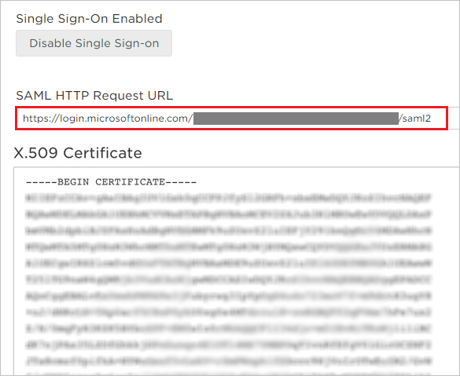

	d.Click **Save Changes** 

### Creating an Azure AD test user
The objective of this section is to create a test user in the Azure Management portal called Britta Simon.

![Create Azure AD User][100]

**To create a test user in Azure AD, perform the following steps:**

1. In the **Azure Management portal**, on the left navigation pane, click **Azure Active Directory** icon.

	 

2. Go to **Users and groups** and click **All users** to display the list of users.
	
	 

3. At the top of the dialog click **Add** to open the **User** dialog.
 
	 

4. On the **User** dialog page, perform the following steps:
 
	 

    a. In the **Name** textbox, type **BrittaSimon**.

    b. In the **User name** textbox, type the **email address** of BrittaSimon.

	c. Select **Show Password** and write down the value of the **Password**.

    d. Click **Create**. 

### Creating an Evernote test user

In order to enable Azure AD users to log into Evernote, they must be provisioned into Evernote.  
In the case of Evernote, provisioning is a manual task.

**To provision a user accounts, perform the following steps:**

1. Log in to your Evernote company site as an administrator.

2. Click the **'Admin Console'**.

	

3. From the **'Admin Console'**, go to **‘Add users’**.

	

4. **Add team members** in the **Email** textbox, type the email address of user account and click **Invite.**

	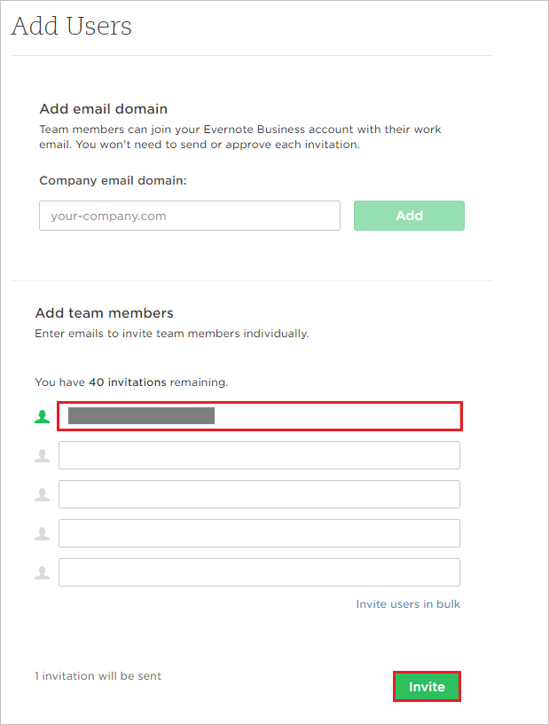
	
5. After invitation is sent, the Azure Active Directory account holder will receive an email to accept the invitation.   

### Assigning the Azure AD test user

In this section, you enable Britta Simon to use Azure single sign-on by granting her access to Evernote.

![Assign User][200] 

**To assign Britta Simon to Evernote, perform the following steps:**

1. In the Azure Management portal, open the applications view, and then navigate to the directory view and go to **Enterprise applications** then click **All applications**.

	![Assign User][201] 

2. In the applications list, select **Evernote**.

	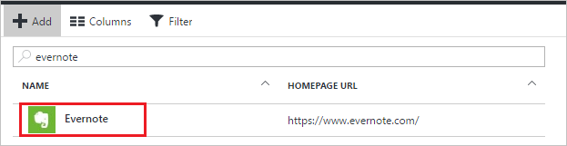 

3. In the menu on the left, click **Users and groups**.

	![Assign User][202] 

4. Click **Add** button. Then select **Users and groups** on **Add Assignment** dialog.

	![Assign User][203]

5. On **Users and groups** dialog, select **Britta Simon** in the Users list.

6. Click **Select** button on **Users and groups** dialog.

7. Click **Assign** button on **Add Assignment** dialog.
	

### Testing single sign-on

In this section, you test your Azure AD single sign-on configuration using the Access Panel.

When you click the Evernote tile in the Access Panel, you should get signed-on to your Evernote application. You'll be logging in as an Organization account but then need to log in with your personal account.

## Additional resources

* [List of Tutorials on How to Integrate SaaS Apps with Azure Active Directory](active-directory-saas-tutorial-list.md)
* [What is application access and single sign-on with Azure Active Directory?](active-directory-appssoaccess-whatis.md)

<!--Image references-->

[1]: ./media/active-directory-saas-evernote-tutorial/tutorial_general_01.png
[2]: ./media/active-directory-saas-evernote-tutorial/tutorial_general_02.png
[3]: ./media/active-directory-saas-evernote-tutorial/tutorial_general_03.png
[4]: ./media/active-directory-saas-evernote-tutorial/tutorial_general_04.png

[100]: ./media/active-directory-saas-evernote-tutorial/tutorial_general_100.png

[200]: ./media/active-directory-saas-evernote-tutorial/tutorial_general_200.png
[201]: ./media/active-directory-saas-evernote-tutorial/tutorial_general_201.png
[202]: ./media/active-directory-saas-evernote-tutorial/tutorial_general_202.png
[203]: ./media/active-directory-saas-evernote-tutorial/tutorial_general_203.png
