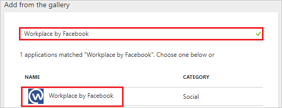
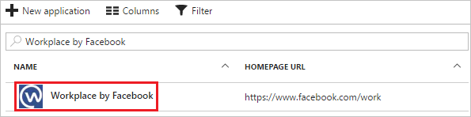

# Tutorial: Azure Active Directory integration with Workplace by Facebook

In this tutorial, you learn how to integrate Workplace by Facebook with Azure Active Directory (Azure AD).

Integrating Workplace by Facebook with Azure AD provides you with the following benefits:

- You can control in Azure AD who has access to Workplace by Facebook.
- You can enable your users to automatically get signed on to Workplace by Facebook (single sign-on) with their Azure AD accounts.
- You can manage your accounts in one central location: the Azure portal.

For more details about software as a service (SaaS) app integration with Azure AD, see [What is application access and single sign-on with Azure Active Directory?](active-directory-appssoaccess-whatis.md).

## Prerequisites

To configure Azure AD integration with Workplace by Facebook, you need the following items:

- An Azure AD subscription
- A Workplace by Facebook single sign-on (SSO) enabled subscription

To test the steps in this tutorial, follow these recommendations:

- Do not use your production environment, unless it is necessary.
- If you don't have an Azure AD trial environment, you can [get a one-month trial](https://azure.microsoft.com/pricing/free-trial/).

## Scenario description
In this tutorial, you test Azure AD SSO in a test environment. 
The scenario outlined in this tutorial consists of two main building blocks:

1. Add Workplace by Facebook from the gallery.
2. Configure and test Azure AD single sign-on.

## Add Workplace by Facebook from the gallery
To configure the integration of Workplace by Facebook into Azure AD, add Workplace by Facebook from the gallery to your list of managed SaaS apps.

1. In the [Azure portal](https://portal.azure.com), in the left pane, select **Azure Active Directory**. 

	![The Azure Active Directory button][1]

2. Browse to **Enterprise applications** > **All applications**.

	![The Enterprise applications blade][2]
	
3. To add the new application, select **New application** on the top of the dialog box.

	![The New application button][3]

4. In the search box, type **Workplace by Facebook**, and select **Workplace by Facebook** from results. Then select **Add**, to add the application.

	

##  Configure and test Azure AD single sign-on
In this section, you configure and test Azure AD SSO with Workplace by Facebook, based on a test user called "Britta Simon."

For SSO to work, Azure AD needs to know what the counterpart user in Workplace by Facebook is to a user in Azure AD. In other words, a linked relationship between an Azure AD user and the related user in Workplace by Facebook should be established.

Establish this relationship by assigning the value of the **user name** in Azure AD as the value of the **Username** in Workplace by Facebook.

### Configure Azure AD single sign-on

In this section, you enable Azure AD SSO in the Azure portal, and you configure SSO in your Workplace by Facebook application.

1. In the Azure portal, on the **Workplace by Facebook** application integration page, select **Single sign-on**.

	![Configure Single sign-on link][4]

2. In the **Single sign-on** dialog box, select **Mode** as **SAML-based Sign-on** to enable SSO.
 
	

3. In the **Workplace by Facebook Domain and URLs** section, do the following:

    a. In the **Sign-on URL** text box, type a URL that uses the following pattern: `https://<company subdomain>.facebook.com`

    b. In the **Identifier** text box, type a URL that uses the following pattern: `https://www.facebook.com/company/<scim company id>`

	> [!NOTE]
	> These values are an example only. Update these values with the actual sign-on URL and identifier. Contact the [Workplace by Facebook Client support team](https://workplace.fb.com/faq/) to get these values. 

4. In the **SAML Signing Certificate** section, select **Certificate (Base64)**, and then save the certificate file on your computer.

	 

5. Select **Save**.

	

6. In the **Workplace by Facebook Configuration** section, select **Configure Workplace by Facebook** to open the **Configure sign-on** window. Copy the **Sign-Out URL, SAML Entity ID, and SAML Single Sign-On Service URL** from the **Quick Reference** section.

	 

7. In a different web browser window, sign in to your Workplace by Facebook company site as an administrator.
  
   > [!NOTE] 
   > As part of the SAML authentication process, Workplace can use query strings of up to 2.5 kilobytes in size in order to pass parameters to Azure AD.

8. In the **Company Dashboard**, go to the **Authentication** tab.

9. Under **SAML Authentication**, select **SSO Only** from the drop-down list.

10. Enter the values copied from the **Workplace by Facebook Configuration** section of the Azure portal into the corresponding fields:

	*	In the **SAML URL** text box, paste the value of **Single Sign-On Service URL**, which you have copied from the Azure portal.
	*	In the **SAML Issuer URL** text box, paste the value of **SAML Entity ID**, which you have copied from the Azure portal.
	*	In **SAML Logout Redirect (optional)**, paste the value of **Sign-Out URL**, which you have copied from the Azure portal.
	*	Open your **base-64 encoded certificate** in Notepad, downloaded from the Azure portal. Copy the content of it into your clipboard, and then paste it to the **SAML Certificate** text box.

11. You might need to enter the audience URL, recipient URL, and ACS (Assertion Consumer Service) URL, listed under the **SAML Configuration** section.

12. Scroll to the bottom of the section, and select **Test SSO**. A pop-up window appears, with the Azure AD sign-in page. To authenticate, enter your credentials as normal. Ensure the email address returned back from Azure AD is the same as the Workplace account you are logged in with.

13. If the test has finished successfully, scroll to the bottom of the page and select **Save**.

14. Anyone using Workplace is now presented with Azure AD sign-in page for authentication.

You can choose to configure a SAML sign out URL, which can be used to point at the Azure AD sign-out page. When this setting is enabled and configured, the user is no longer directed to the Workplace sign-out page. Instead, the user is redirected to the URL that was added in the SAML sign-out redirect setting.

> [!TIP]
> You can now read a concise version of these instructions inside the [Azure portal](https://portal.azure.com), while you are setting up the app. After adding this app from the **Active Directory** > **Enterprise Applications** section, simply select the **Single Sign-On** tab, and access the embedded documentation through the **Configuration** section at the bottom. You can read more about the embedded documentation feature in the [Azure AD embedded documentation]( https://go.microsoft.com/fwlink/?linkid=845985).

### Configure reauthentication frequency

You can configure Workplace to prompt for a SAML check every day, three days, one week, two weeks, one month, or never.

> [!NOTE] 
>The minimum value for the SAML check on mobile applications is set to one week.

You can also force a SAML reset for all users. To do this, use the **Require SAML authentication for all users now** button.

### Create an Azure AD test user
The objective of this section is to create a test user in the Azure portal called Britta Simon.

![Create Azure AD User][100]

1. In the **Azure portal**, in the left pane, select **Azure Active Directory**.

	 

2. To display the list of users, go to **Users and groups**, and select **All users**.
	
	 

3. To open the **User** dialog box, select **Add**.
 
	 

4. In the **User** dialog box, do the following:
 
	 

    a. In the **Name** text box, type **BrittaSimon**.

    b. In the **User name** text box, type the **email address** of BrittaSimon.

	c. Select **Show Password**, and write it down.

    d. Select **Create**.
 
### Create a Workplace by Facebook test user

In this section, a user called Britta Simon is created in Workplace by Facebook. Workplace by Facebook supports just-in-time provisioning, which is enabled by default.

There is no action for you in this section. If a user doesn't exist in Workplace by Facebook, a new one is created when you attempt to access Workplace by Facebook.

>[!Note]
>If you need to create a user manually, contact the [Workplace by Facebook Client support team](https://workplace.fb.com/faq/).

### Assign the Azure AD test user

In this section, you enable Britta Simon to use Azure SSO by granting access to Workplace by Facebook.

![Assign user][200] 

1. In the Azure portal, open the applications view. Go to the directory view, go to **Enterprise applications**, and then select **All applications**.

	![Assign user][201] 

2. In the applications list, select **Workplace by Facebook**.

	 

3. In the menu on the left, select **Users and groups**.

	![The "Users and groups" link][202] 

4. Select **Add**. Then, in the **Add Assignment** pane, select **Users and groups**.

	![The Add Assignment pane][203]

5. In the **Users and groups** dialog box, select **Britta Simon** in the users list.

6. In the **Users and groups** dialog box, select **Select**.

7. In the **Add Assignment** dialog box, select **Assign**.
	
### Test single sign-on

If you want to test your SSO settings, open the Access Panel.
For more information, see [Introduction to the Access Panel](active-directory-saas-access-panel-introduction.md).

## Next steps

* See the [list of tutorials on how to integrate SaaS Apps with Azure Active Directory](active-directory-saas-tutorial-list.md).
* Read [What is application access and single sign-on with Azure Active Directory?](active-directory-appssoaccess-whatis.md).
* Learn more about how to [configure user provisioning](active-directory-saas-facebook-at-work-provisioning-tutorial.md).

<!--Image references-->

[1]: ./media/active-directory-saas-facebook-at-work-tutorial/tutorial_general_01.png
[2]: ./media/active-directory-saas-facebook-at-work-tutorial/tutorial_general_02.png
[3]: ./media/active-directory-saas-facebook-at-work-tutorial/tutorial_general_03.png
[4]: ./media/active-directory-saas-facebook-at-work-tutorial/tutorial_general_04.png

[100]: ./media/active-directory-saas-facebook-at-work-tutorial/tutorial_general_100.png

[200]: ./media/active-directory-saas-facebook-at-work-tutorial/tutorial_general_200.png
[201]: ./media/active-directory-saas-facebook-at-work-tutorial/tutorial_general_201.png
[202]: ./media/active-directory-saas-facebook-at-work-tutorial/tutorial_general_202.png
[203]: ./media/active-directory-saas-facebook-at-work-tutorial/tutorial_general_203.png

