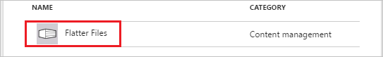

# Tutorial: Azure Active Directory integration with Flatter Files

In this tutorial, you learn how to integrate Flatter Files with Azure Active Directory (Azure AD).

Integrating Flatter Files with Azure AD provides you with the following benefits:

- You can control in Azure AD who has access to Flatter Files
- You can enable your users to automatically get signed-on to Flatter Files (Single Sign-On) with their Azure AD accounts
- You can manage your accounts in one central location - the Azure portal

If you want to know more details about SaaS app integration with Azure AD, see [what is application access and single sign-on with Azure Active Directory](active-directory-appssoaccess-whatis.md).

## Prerequisites

To configure Azure AD integration with Flatter Files, you need the following items:

- An Azure AD subscription
- A Flatter Files single sign-on enabled subscription

> [!NOTE]
> To test the steps in this tutorial, we do not recommend using a production environment.

To test the steps in this tutorial, you should follow these recommendations:

- Do not use your production environment, unless it is necessary.
- If you don't have an Azure AD trial environment, you can get a one-month trial [here](https://azure.microsoft.com/pricing/free-trial/).

## Scenario description
In this tutorial, you test Azure AD single sign-on in a test environment. 
The scenario outlined in this tutorial consists of two main building blocks:

1. Adding Flatter Files from the gallery
2. Configuring and testing Azure AD single sign-on

## Adding Flatter Files from the gallery
To configure the integration of Flatter Files into Azure AD, you need to add Flatter Files from the gallery to your list of managed SaaS apps.

**To add Flatter Files from the gallery, perform the following steps:**

1. In the **[Azure portal](https://portal.azure.com)**, on the left navigation panel, click **Azure Active Directory** icon. 

	![Active Directory][1]

2. Navigate to **Enterprise applications**. Then go to **All applications**.

	![Applications][2]
	
3. To add new application, click **New application** button on the top of dialog.

	![Applications][3]

4. In the search box, type **Flatter Files**.

	

5. In the results panel, select **Flatter Files**, and then click **Add** button to add the application.

	

##  Configuring and testing Azure AD single sign-on
In this section, you configure and test Azure AD single sign-on with Flatter Files based on a test user called "Britta Simon".

For single sign-on to work, Azure AD needs to know what the counterpart user in Flatter Files is to a user in Azure AD. In other words, a link relationship between an Azure AD user and the related user in Flatter Files needs to be established.

In Flatter Files, assign the value of the **user name** in Azure AD as the value of the **Username** to establish the link relationship.

To configure and test Azure AD single sign-on with Flatter Files, you need to complete the following building blocks:

1. **[Configuring Azure AD Single Sign-On](#configuring-azure-ad-single-sign-on)** - to enable your users to use this feature.
2. **[Creating an Azure AD test user](#creating-an-azure-ad-test-user)** - to test Azure AD single sign-on with Britta Simon.
3. **[Creating a Flatter Files test user](#creating-a-flatter-files-test-user)** - to have a counterpart of Britta Simon in Flatter Files that is linked to the Azure AD representation of user.
4. **[Assigning the Azure AD test user](#assigning-the-azure-ad-test-user)** - to enable Britta Simon to use Azure AD single sign-on.
5. **[Testing Single Sign-On](#testing-single-sign-on)** - to verify whether the configuration works.

### Configuring Azure AD single sign-on

In this section, you enable Azure AD single sign-on in the Azure portal and configure single sign-on in your Flatter Files application.

**To configure Azure AD single sign-on with Flatter Files, perform the following steps:**

1. In the Azure portal, on the **Flatter Files** application integration page, click **Single sign-on**.

	![Configure Single Sign-On][4]

2. On the **Single sign-on** dialog, select **Mode** as	**SAML-based Sign-on** to enable single sign-on.
 
	

3. On the **Flatter Files Domain and URLs** section, the user does not have to perform any steps as the app is already pre-integrated with Azure.

	
 
4. On the **SAML Signing Certificate** section, click **Certificate(Base64)** and then save the certificate file on your computer.

	 

5. Click **Save** button.

	

6. On the **Flatter Files Configuration** section, click **Configure Flatter Files** to open **Configure sign-on** window. Copy the **SAML Single Sign-On Service URL** from the **Quick Reference section.**

	 

7. Sign-on to your Flatter Files application as an administrator.

8. Click **DASHBOARD**. 
   
      

9. Click **Settings**, and then perform the following steps on the **Company** tab: 
   
      
    
	a. Select **Use SAML 2.0 for Authentication**.
    
	b. Click **Configure SAML**.

8. On the **SAML Configuration** dialog, perform the following steps: 
   
      
   
    a. In the **Domain** textbox, type your registered domain.
   
    >[!NOTE]
    >If you don't have a registered domain yet, contact your Flatter Files support team via [support@flatterfiles.com](mailto:support@flatterfiles.com). 
    
    b. In **Identity Provider URL** textbox, paste the value of **SAML Single Sign-On Service URL** which you have copied form Azure portal.
   
    c.  Open your base-64 encoded certificate in notepad, copy the content of it into your clipboard, and then paste it to the **Identity Provider Certificate** textbox.

    d. Click **Update**.

> [!TIP]
> You can now read a concise version of these instructions inside the [Azure portal](https://portal.azure.com), while you are setting up the app!  After adding this app from the **Active Directory > Enterprise Applications** section, simply click the **Single Sign-On** tab and access the embedded documentation through the **Configuration** section at the bottom. You can read more about the embedded documentation feature here: [Azure AD embedded documentation]( https://go.microsoft.com/fwlink/?linkid=845985)

### Creating an Azure AD test user
The objective of this section is to create a test user in the Azure portal called Britta Simon.

![Create Azure AD User][100]

**To create a test user in Azure AD, perform the following steps:**

1. In the **Azure portal**, on the left navigation pane, click **Azure Active Directory** icon.

	 

2. To display the list of users, go to **Users and groups** and click **All users**.
	
	 

3. To open the **User** dialog, click **Add** on the top of the dialog.
 
	 

4. On the **User** dialog page, perform the following steps:
 
	 

    a. In the **Name** textbox, type **BrittaSimon**.

    b. In the **User name** textbox, type the **email address** of BrittaSimon.

	c. Select **Show Password** and write down the value of the **Password**.

    d. Click **Create**.
 
### Creating a Flatter Files test user

The objective of this section is to create a user called Britta Simon in Flatter Files.

**To create a user called Britta Simon in Flatter Files, perform the following steps:**

1. Sign on to your **Flatter Files** company site as administrator.

2. In the navigation pane on the left, click **Settings**, and then click the **Users** tab.
   
    

3. Click **Add User**. 

4. On the **Add User** dialog, perform the following steps:
   
    

    a. In the **First Name** textbox, type **Britta**.
   
    b. In the **Last Name** textbox, type **Simon**. 
   
    c. In the **Email Address** textbox, type Britta's email address in the Azure portal.
   
    d. Click **Submit**.   

### Assigning the Azure AD test user

In this section, you enable Britta Simon to use Azure single sign-on by granting access to Flatter Files.

![Assign User][200] 

**To assign Britta Simon to Flatter Files, perform the following steps:**

1. In the Azure portal, open the applications view, and then navigate to the directory view and go to **Enterprise applications** then click **All applications**.

	![Assign User][201] 

2. In the applications list, select **Flatter Files**.

	 

3. In the menu on the left, click **Users and groups**.

	![Assign User][202] 

4. Click **Add** button. Then select **Users and groups** on **Add Assignment** dialog.

	![Assign User][203]

5. On **Users and groups** dialog, select **Britta Simon** in the Users list.

6. Click **Select** button on **Users and groups** dialog.

7. Click **Assign** button on **Add Assignment** dialog.
	
### Testing single sign-on

In this section, you test your Azure AD single sign-on configuration using the Access Panel.

When you click the Flatter Files tile in the Access Panel, you should get automatically signed-on to your Flatter Files application.
For more information about the Access Panel, see [Introduction to the Access Panel](active-directory-saas-access-panel-introduction.md).

## Additional resources

* [List of Tutorials on How to Integrate SaaS Apps with Azure Active Directory](active-directory-saas-tutorial-list.md)
* [What is application access and single sign-on with Azure Active Directory?](active-directory-appssoaccess-whatis.md)

<!--Image references-->

[1]: ./media/active-directory-saas-flatter-files-tutorial/tutorial_general_01.png
[2]: ./media/active-directory-saas-flatter-files-tutorial/tutorial_general_02.png
[3]: ./media/active-directory-saas-flatter-files-tutorial/tutorial_general_03.png
[4]: ./media/active-directory-saas-flatter-files-tutorial/tutorial_general_04.png

[100]: ./media/active-directory-saas-flatter-files-tutorial/tutorial_general_100.png

[200]: ./media/active-directory-saas-flatter-files-tutorial/tutorial_general_200.png
[201]: ./media/active-directory-saas-flatter-files-tutorial/tutorial_general_201.png
[202]: ./media/active-directory-saas-flatter-files-tutorial/tutorial_general_202.png
[203]: ./media/active-directory-saas-flatter-files-tutorial/tutorial_general_203.png

