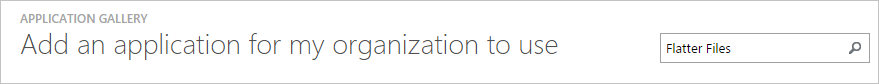
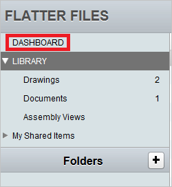
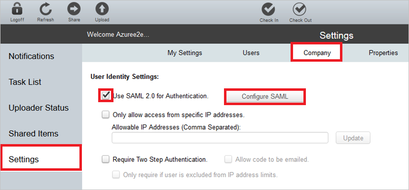
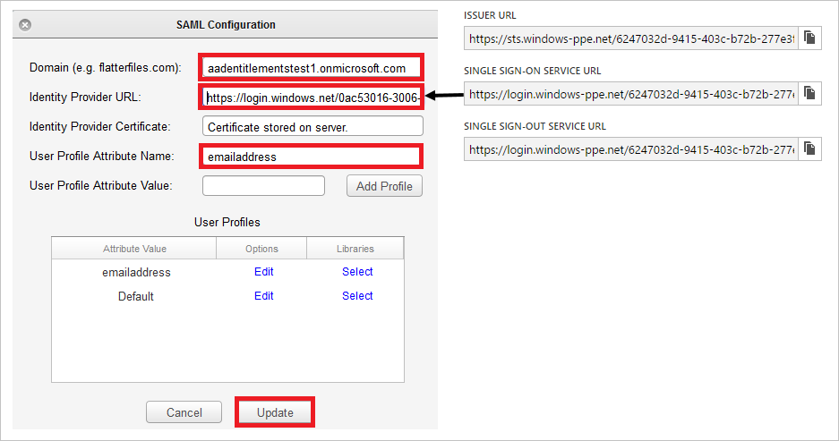
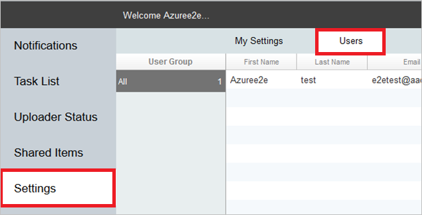
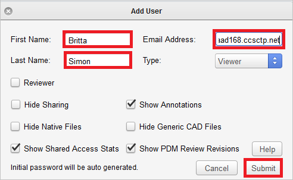
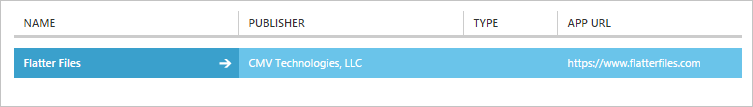

<properties
	pageTitle="Tutorial: Azure Active Directory integration with Flatter Files | Microsoft Azure"
	description="Learn how to configure single sign-on between Azure Active Directory and Flatter Files."
	services="active-directory"
	documentationCenter=""
	authors="jeevansd"
	manager="femila"
	editor=""/>

<tags
	ms.service="active-directory"
	ms.workload="identity"
	ms.tgt_pltfrm="na"
	ms.devlang="na"
	ms.topic="article"
	ms.date="07/11/2016"
	ms.author="jeedes"/>

# Tutorial: Azure Active Directory integration with Flatter Files

The objective of this tutorial is to show you how to integrate Flatter Files with Azure Active Directory (Azure AD).  
Integrating Flatter Files with Azure AD provides you with the following benefits: 

- You can control in Azure AD who has access to Flatter Files 
- You can enable your users to automatically get signed-on to Flatter Files (Single Sign-On) with their Azure AD accounts
- You can manage your accounts in one central location - the Azure Active Directory classic portal

If you want to know more details about SaaS app integration with Azure AD, see [What is application access and single sign-on with Azure Active Directory](active-directory-appssoaccess-whatis.md).

## Prerequisites 

To configure Azure AD integration with Flatter Files, you need the following items:

- An Azure AD subscription
- A Flatter Files single-sign on enabled subscription

> [AZURE.NOTE] To test the steps in this tutorial, we do not recommend using a production environment.

To test the steps in this tutorial, you should follow these recommendations:

- You should not use your production environment, unless this is necessary.
- If you don't have an Azure AD trial environment, you can get a one-month trial [here](https://azure.microsoft.com/pricing/free-trial/). 

 
## Scenario description
The objective of this tutorial is to enable you to test Azure AD single sign-on in a test environment.  
The scenario outlined in this tutorial consists of two main building blocks:

1. Adding Flatter Files from the gallery 
2. Configuring and testing Azure AD single sign-on

## Adding Flatter Files from the gallery
To configure the integration of Flatter Files into Azure AD, you need to add Flatter Files from the gallery to your list of managed SaaS apps.

**To add Flatter Files from the gallery, perform the following steps:**

1. In the **Azure classic portal**, on the left navigation pane, click **Active Directory**. 

	![Active Directory][1]

2. From the **Directory** list, select the directory for which you want to enable directory integration.

3. To open the applications view, in the directory view, click **Applications** in the top menu.

	![Applications][2]

4. Click **Add** at the bottom of the page.

	![Applications][3]

5. On the **What do you want to do** dialog, click **Add an application from the gallery**.

	![Applications][4]

6. In the search box, type **Flatter Files**.

	

7. In the results pane, select **Flatter Files**, and then click **Complete** to add the application.

	

##  Configuring and testing Azure AD single sign-on
The objective of this section is to show you how to configure and test Azure AD single sign-on with Flatter Files based on a test user called "Britta Simon".

For single sign-on to work, Azure AD needs to know what the counterpart user in Flatter Files to an user in Azure AD is. In other words, a link relationship between an Azure AD user and the related user in Flatter Files needs to be established.  
This link relationship is established by assigning the value of the **user name** in Azure AD as the value of the **Username** in Flatter Files.
 
To configure and test Azure AD single sign-on with Flatter Files, you need to complete the following building blocks:

1. **[Configuring Azure AD Single Sign-On](#configuring-azure-ad-single-single-sign-on)** - to enable your users to use this feature.
2. **[Creating an Azure AD test user](#creating-an-azure-ad-test-user)** - to test Azure AD single sign-on with Britta Simon.
4. **[Creating a Flatter Files test user](#creating-a-halogen-software-test-user)** - to have a counterpart of Britta Simon in Flatter Files that is linked to the Azure AD representation of her.
5. **[Assigning the Azure AD test user](#assigning-the-azure-ad-test-user)** - to enable Britta Simon to use Azure AD single sign-on.
5. **[Testing Single Sign-On](#testing-single-sign-on)** - to verify whether the configuration works.

### Configuring Azure AD single sign-on

The objective of this section is to enable Azure AD single sign-on in the Azure AD classic portal and to configure single sign-on in your Flatter Files application. As part of this procedure, you are required to create a base-64 encoded certificate file. If you are not familiar with this procedure, see [How to convert a binary certificate into a text file](http://youtu.be/PlgrzUZ-Y1o).

To configure single sign-on for Flatter Files, you need a registered domain. If you don't have a registered domain yet, contact your Flatter Files support team via [support@flatterfiles.com](mailto:support@flatterfiles.com).  

**To configure Azure AD single sign-on with Flatter Files, perform the following steps:**

1. In the Azure AD classic portal, on the **Flatter Files** application integration page, click **Configure single sign-on** to open the **Configure Single Sign-On**  dialog.

	![Configure Single Sign-On][6] 

2. On the **How would you like users to sign on to Flatter Files** page, select **Azure AD Single Sign-On**, and then click **Next**.
 
	 

3. On the **Configure App Settings** dialog page, click **Next**.

	 

    > [AZURE.NOTE] Flatter Files uses the same SSO login URL for all the customers: [https://www.flatterfiles.com/site/login/sso/](https://www.flatterfiles.com/site/login/sso/).
.
 
 
4. On the **Configure single sign-on at Flatter Files** page, perform the following steps:

	  

    a. Click **Download certificate**, and then save the file on your computer.

    b. Click **Next**.

1. Sign-on to your Flatter Files application as an administrator.

2. Click Dashboard. 

	  

2. Click **Settings**, and then perform the following steps on the **Company** tab: 

	  

    a. Select **Use SAML 2.0 for Authentication**.

    b. Click **Configure SAML**.

2. On the **SAML Configuration** dialog, perform the following steps: 

	  

    a. In the Domain textbox, type your registered domain.

    > [AZURE.NOTE] If you don't have a registered domain yet, contact your Flatter Files support team via [support@flatterfiles.com](mailto:support@flatterfiles.com).
    
    b. In the Azure classic portal, on the Configure single sign-on at Flatter Files dialog, copt the Single Sign-On Service URL, and then paste it into the Identity Provider URL textbox.

    c.  Create a **base-64 encoded** file from your downloaded certificate.  

    >[AZURE.TIP] For more details, see [How to convert a binary certificate into a text file](http://youtu.be/PlgrzUZ-Y1o)

    d.  Open your base-64 encoded certificate in notepad, copy the content of it into your clipboard, and then paste it to the **FlatterFiles Identity Provider Certificate** textbox.

    e. Click **Update**.

6. In the Azure AD classic portal, select the single sign-on configuration confirmation, and then click **Next**. 

	![Azure AD Single Sign-On][10]

7. On the **Single sign-on confirmation** page, click **Complete**.  

	![Azure AD Single Sign-On][11]

### Creating an Azure AD test user
The objective of this section is to create a test user in the Azure classic portal called Britta Simon.

![Create Azure AD User][20]

**To create a test user in Azure AD, perform the following steps:**

1. In the **Azure classic portal**, on the left navigation pane, click **Active Directory**.

	 

2. From the **Directory** list, select the directory for which you want to enable directory integration.

3. To display the list of users, in the menu on the top, click **Users**.

	 
 
4. To open the **Add User** dialog, in the toolbar on the bottom, click **Add User**. 

	 

5. On the **Tell us about this user** dialog page, perform the following steps: 

	  

    a. As Type Of User, select New user in your organization.

    b. In the User Name **textbox**, type **BrittaSimon**.

    c. Click **Next**.

6.  On the **User Profile** dialog page, perform the following steps: 

	 
 
    a. In the **First Name** textbox, type **Britta**.  

    b. In the **Last Name** textbox, type, **Simon**.

    c. In the **Display Name** textbox, type **Britta Simon**.

    d. In the **Role** list, select **User**.
    e. Click **Next**.

7. On the **Get temporary password** dialog page, click **create**.

	 
 
8. On the **Get temporary password** dialog page, perform the following steps:

	 
  
    a. Write down the value of the **New Password**.

    b. Click **Complete**.   

  
 
### Creating a Flatter Files test user

The objective of this section is to create a user called Britta Simon in Flatter Files.

**To create a user called Britta Simon in Flatter Files, perform the following steps:**

1. Sign on to your **Flatter Files** company site as administrator.

2. In the navigation pane on the left, click **Settings**, and then click the Users **tab**.

	

3. Click **Add User**. 

4. On the **Add User** dialog, perform the following steps:

	

    a. In the **First Name** textbox, type **Britta**.

    b. In the **Last Name** textbox, type **Simon**. 

    c. In the **Email Address** textbox, type Britta's email address in the Azure classic portal.

    d. Click **Submit**.   

### Assigning the Azure AD test user

The objective of this section is to enabling Britta Simon to use Azure single sign-on by granting her access to Flatter Files.

![Assign User][200] 

**To assign Britta Simon to Flatter Files, perform the following steps:**

1. On the Azure classic portal, to open the applications view, in the directory view, click **Applications** in the top menu.

	![Assign User][201] 

2. In the applications list, select **Flatter Files**.

	 

1. In the menu on the top, click **Users**.

	![Assign User][203] 

1. In the Users list, select **Britta Simon**.

2. In the toolbar on the bottom, click **Assign**.

	![Assign User][205]

### Testing single sign-on

The objective of this section is to test your Azure AD single sign-on configuration using the Access Panel.  
When you click the Flatter Files tile in the Access Panel, you should get automatically signed-on to your Flatter Files application.

## Additional resources

* [List of Tutorials on How to Integrate SaaS Apps with Azure Active Directory](active-directory-saas-tutorial-list.md)
* [What is application access and single sign-on with Azure Active Directory?](active-directory-appssoaccess-whatis.md)

<!--Image references-->

[1]: ./media/active-directory-saas-flatter-files-tutorial/tutorial_general_01.png
[2]: ./media/active-directory-saas-flatter-files-tutorial/tutorial_general_02.png
[3]: ./media/active-directory-saas-flatter-files-tutorial/tutorial_general_03.png
[4]: ./media/active-directory-saas-flatter-files-tutorial/tutorial_general_04.png

[6]: ./media/active-directory-saas-flatter-files-tutorial/tutorial_general_05.png
[10]: ./media/active-directory-saas-flatter-files-tutorial/tutorial_general_06.png
[11]: ./media/active-directory-saas-flatter-files-tutorial/tutorial_general_07.png
[20]: ./media/active-directory-saas-flatter-files-tutorial/tutorial_general_100.png

[200]: ./media/active-directory-saas-flatter-files-tutorial/tutorial_general_200.png
[201]: ./media/active-directory-saas-flatter-files-tutorial/tutorial_general_201.png
[203]: ./media/active-directory-saas-flatter-files-tutorial/tutorial_general_203.png
[204]: ./media/active-directory-saas-flatter-files-tutorial/tutorial_general_204.png
[205]: ./media/active-directory-saas-flatter-files-tutorial/tutorial_general_205.png

