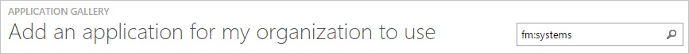
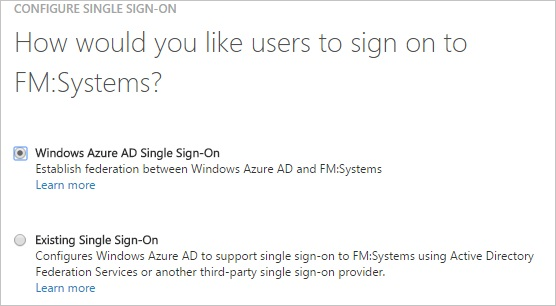
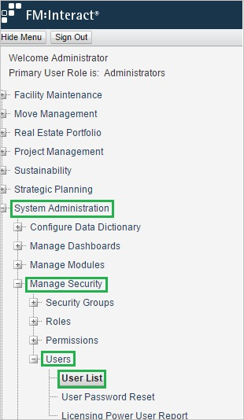
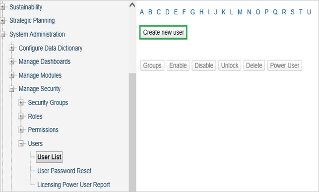
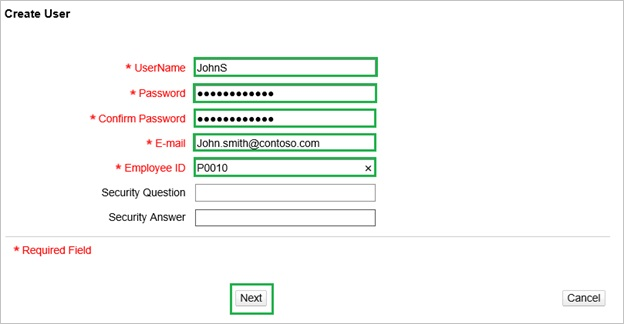

<properties 
    pageTitle="Tutorial: Azure Active Directory integration with FM: Systems | Microsoft Azure" 
    description="Learn how to use FM: Systems with Azure Active Directory to enable single sign-on, automated provisioning, and more!" 
    services="active-directory" 
    authors="jeevansd"  
    documentationCenter="na" 
    manager="femila"/>
<tags 
    ms.service="active-directory" 
    ms.devlang="na" 
    ms.topic="article" 
    ms.tgt_pltfrm="na" 
    ms.workload="identity" 
    ms.date="07/09/2016" 
    ms.author="jeedes" />

#Tutorial: Azure Active Directory integration with FM: Systems
  
The objective of this tutorial is to show the integration of Azure and FM:Systems.  
The scenario outlined in this tutorial assumes that you already have the following items:

-   A valid Azure subscription
-   A FM:Systems single sign-on enabled subscription
  
After completing this tutorial, the Azure AD users you have assigned to FM:Systems will be able to single sign into the application at your FM:Systems company site (service provider initiated sign on), or using the [Introduction to the Access Panel](active-directory-saas-access-panel-introduction.md).
  
The scenario outlined in this tutorial consists of the following building blocks:

1.  Enabling the application integration for FM:Systems
2.  Configuring single sign-on
3.  Configuring user provisioning
4.  Assigning users

##Enabling the application integration for FM:Systems
  
The objective of this section is to outline how to enable the application integration for FM:Systems.

###To enable the application integration for FM:Systems, perform the following steps:

1.  In the Azure classic portal, on the left navigation pane, click **Active Directory**.

    

2.  From the **Directory** list, select the directory for which you want to enable directory integration.

3.  To open the applications view, in the directory view, click **Applications** in the top menu.

    

4.  Click **Add** at the bottom of the page.

    

5.  On the **What do you want to do** dialog, click **Add an application from the gallery**.

    

6.  In the **search box**, type **FM:Systems**.

    

7.  In the results pane, select **FM:Systems**, and then click **Complete** to add the application.

    
##Configuring single sign-on
  
The objective of this section is to outline how to enable users to authenticate to FM:Systems with their account in Azure AD using federation based on the SAML protocol.

###To configure single sign-on, perform the following steps:

1.  In the Azure classic portal, on the **FM:Systems** application integration page, click **Configure single sign-on** to open the **Configure Single Sign On ** dialog.

    

2.  On the **How would you like users to sign on to FM:Systems** page, select **Microsoft Azure AD Single Sign-On**, and then click **Next**.

    

3.  On the **Configure App URL** page, perform the following steps:

    

    1.  In the **FM:Systems Sign On URL** textbox, type your FM:Systems **Reply URL** (e.g.: *https://dpr.fmshosted.com/fminteract/ConsumerService2.aspx*).  

        >[AZURE.WARNING] You can get this value from your FM: Systems support team.

    2.  Click **Next**

4.  On the **Configure single sign-on at FM:Systems** page, to download your metadata, click **Download metadata**, and then save the metadata on your computer.

    

5.  Submit the downloaded metadata file to your FM: Systems support team.

    >[AZURE.NOTE] Your FM: Systems support team has to do the actual SSO configuration.
    You will get a notification when SSO has been enabled for your subscription.

6.  On the Azure classic portal, select the single sign-on configuration confirmation, and then click **Complete** to close the **Configure Single Sign On** dialog.

    
##Configuring user provisioning
  
In order to enable Azure AD users to log into FM:Systems, they must be provisioned into FM:Systems.  
In the case of FM:Systems, provisioning is a manual task.

###To configure user provisioning, perform the following steps:

1.  In a web browser window, log into your FM:Systems company site as an administrator.

2.  Go to **System Administration \> Manage Security \> Users \> User list**.

    

3.  Click **Create new user**.

    

4.  In the **Create User** section, perform the following steps:

    

    1.  Type the user name, the password and its confirmation, the email address and the employee ID of a valid Azure Active Directory account you want to provision into the related textboxes.
    2.  Click **Next**.

>[AZURE.NOTE] You can use any other FM:Systems user account creation tools or APIs provided by FM:Systems to provision AAD user accounts.

##Assigning users
  
To test your configuration, you need to grant the Azure AD users you want to allow using your application access to it by assigning them.

###To assign users to FM:Systems, perform the following steps:

1.  In the Azure classic portal, create a test account.

2.  On the **FM:Systems **application integration page, click **Assign users**.

    

3.  Select your test user, click **Assign**, and then click **Yes** to confirm your assignment.

    
  
If you want to test your single sign-on settings, open the Access Panel. For more details about the Access Panel, see [Introduction to the Access Panel](active-directory-saas-access-panel-introduction.md).