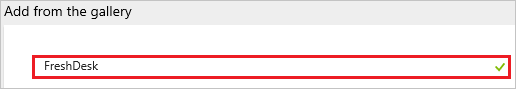
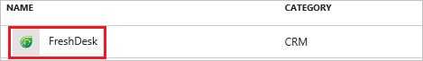
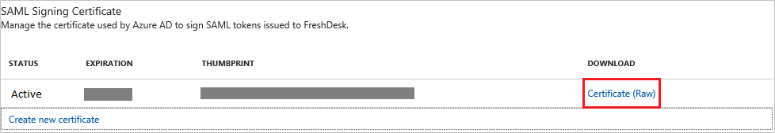
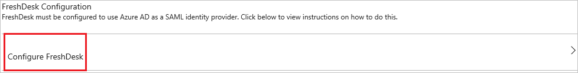
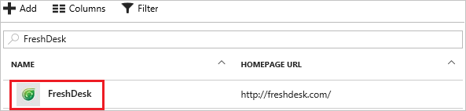

# Tutorial: Azure Active Directory integration with FreshDesk

In this tutorial, you learn how to integrate FreshDesk with Azure Active Directory (Azure AD).

Integrating FreshDesk with Azure AD provides you with the following benefits:

- You can control in Azure AD who has access to FreshDesk
- You can enable your users to automatically get signed-on to FreshDesk (Single Sign-On) with their Azure AD accounts
- You can manage your accounts in one central location - the Azure Management portal

If you want to know more details about SaaS app integration with Azure AD, see [What is application access and single sign-on with Azure Active Directory](active-directory-appssoaccess-whatis.md).

## Prerequisites

To configure Azure AD integration with FreshDesk, you need the following items:

- An Azure AD subscription
- A FreshDesk single-sign on enabled subscription

> [!NOTE]
> To test the steps in this tutorial, we do not recommend using a production environment.

To test the steps in this tutorial, you should follow these recommendations:

- You should not use your production environment, unless this is necessary.
- If you don't have an Azure AD trial environment, you can get an one-month trial [here](https://azure.microsoft.com/pricing/free-trial/).

## Scenario description
In this tutorial, you test Azure AD single sign-on in a test environment. 
The scenario outlined in this tutorial consists of two main building blocks:

1. Adding FreshDesk from the gallery
2. Configuring and testing Azure AD single sign-on

## Adding FreshDesk from the gallery
To configure the integration of FreshDesk into Azure AD, you need to add FreshDesk from the gallery to your list of managed SaaS apps.

**To add FreshDesk from the gallery, perform the following steps:**

1. In the **[Azure Management Portal](https://portal.azure.com)**, on the left navigation panel, click **Azure Active Directory** icon. 

	![Active Directory][1]

2. Navigate to **Enterprise applications**. Then go to **All applications**.

	![Applications][2]
	
3. Click **Add** button on the top of the dialog.

	![Applications][3]

4. In the search box, type **FreshDesk**.

	

5. In the results panel, select **FreshDesk**, and then click **Add** button to add the application.

	

##  Configuring and testing Azure AD single sign-on
In this section, you configure and test Azure AD single sign-on with FreshDesk based on a test user called "Britta Simon".

For single sign-on to work, Azure AD needs to know what the counterpart user in FreshDesk is to a user in Azure AD. In other words, a link relationship between an Azure AD user and the related user in FreshDesk needs to be established.

This link relationship is established by assigning the value of the **user name** in Azure AD as the value of the **Username** in FreshDesk.

To configure and test Azure AD single sign-on with FreshDesk, you need to complete the following building blocks:

1. **[Configuring Azure AD Single Sign-On](#configuring-azure-ad-single-sign-on)** - to enable your users to use this feature.
2. **[Creating an Azure AD test user](#creating-an-azure-ad-test-user)** - to test Azure AD single sign-on with Britta Simon.
3. **[Creating a FreshDesk test user](#creating-a-freshdesk-test-user)** - to have a counterpart of Britta Simon in FreshDesk that is linked to the Azure AD representation of her.
4. **[Assigning the Azure AD test user](#assigning-the-azure-ad-test-user)** - to enable Britta Simon to use Azure AD single sign-on.
5. **[Testing Single Sign-On](#testing-single-sign-on)** - to verify whether the configuration works.

### Configuring Azure AD single sign-on

In this section, you enable Azure AD single sign-on in the Azure Management portal and configure single sign-on in your FreshDesk application.

**To configure Azure AD single sign-on with FreshDesk, perform the following steps:**

1. In the Azure Management portal, on the **FreshDesk** application integration page, click **Single sign-on**.

	![Configure Single Sign-On][4]

2. On the **Single sign-on** dialog, as **Mode** select **SAML-based Sign-on** to enable single sign on.
 
	

3. On the **FreshDesk Domain and URLs** section, please enter the **Sign-on URL** as: `https://<tenant-name>.freshdesk.com` or any other value Freshdesk has suggested.

	

	> [!NOTE] 
    > Please note that this is not the real value. You have to update the value with the actual Sign-on URL. Contact [FreshDesk Client support team](https://freshdesk.com/helpdesk-software?utm_source=Google-AdWords&utm_medium=Search-IND-Brand&utm_campaign=Search-IND-Brand&utm_term=freshdesk&device=c&gclid=COSH2_LH7NICFVUDvAodBPgBZg) to get this value.  

4. On the **SAML Signing Certificate** section, click **Certificate** and then save the certificate on your computer.

	 

5. Click **Save** button.

	

6. On the **FreshDesk Configuration** section, click **Configure FreshDesk** to open Configure sign-on window. Copy the SAML Single Sign-On Service URL and Sign-Out URL from the **Quick Reference** section.

	

7. In a different web browser window, log into your Freshdesk company site as an administrator.

8. In the menu on the top, click **Admin**.
   
   

9. In the **General Settings** tab, click **Security**.
   
   

10. In the **Security** section, perform the following steps:
   
	
   
	a. For **Single Sign On (SSO)**, select **On**.

	b. Select **SAML SSO**.

    c. Type the **SAML Single Sign-On Service URL** you copied from Azure portal into the **SAML Login URL** textbox.

    d. Type the **Sign-Out URL**  you copied from Azure portal into the **Logout URL** textbox.

    e. Copy the **Thumbprint** value from the downloaded certificate from Azure portal and paste it into the **Security Certificate Fingerprint** textbox.  
 
    >[!TIP]
    >For more details, see [How to retrieve a certificate's thumbprint value](http://youtu.be/YKQF266SAxI). 
    
	f. Click **Save**.

### Creating an Azure AD test user
The objective of this section is to create a test user in the Azure Management portal called Britta Simon.

![Create Azure AD User][100]

**To create a test user in Azure AD, perform the following steps:**

1. In the **Azure Management portal**, on the left navigation pane, click **Azure Active Directory** icon.

	 

2. Go to **Users and groups** and click **All users** to display the list of users.
	
	 

3. At the top of the dialog click **Add** to open the **User** dialog.
 
	 

4. On the **User** dialog page, perform the following steps:
 
	 

    a. In the **Name** textbox, type **BrittaSimon**.

    b. In the **User name** textbox, type the **email address** of BrittaSimon.

	c. Select **Show Password** and write down the value of the **Password**.

    d. Click **Create**.
 
### Creating a FreshDesk test user

In order to enable Azure AD users to log into FreshDesk, they must be provisioned into FreshDesk.  
In the case of FreshDesk, provisioning is a manual task.

**To provision a user accounts, perform the following steps:**

1. Log in to your **Freshdesk** tenant.
2. In the menu on the top, click **Admin**.
   
   

3. In the **General Settings** tab, click **Agents**.
   
   

4. Click **New Agent**.
   
    

5. On the Agent Information dialog, perform the following steps:
   
   
   
   a. In the **Full Name** textbox, type the name of the Azure AD account you want to provision.

   b. In the **Email** textbox, type the Azure AD email address of the Azure AD account you want to provision.

   c. In the **Title** textbox, type the title of the Azure AD account you want to provision.

   d. Select **Agents role**, and then click **Assign**.
	   
   e. Click **Save**.     
   
	>[!NOTE]
	>The Azure AD account holder will get an email that includes a link to confirm the account before it is activated. 
	> 
	
	>[!NOTE]
	>You can use any other Freshdesk user account creation tools or APIs provided by Freshdesk to provision AAD user accounts. 
	to FreshDesk.

### Assigning the Azure AD test user

In this section, you enable Britta Simon to use Azure single sign-on by granting her access to Box.

![Assign User][200] 

**To assign Britta Simon to FreshDesk, perform the following steps:**

1. In the Azure Management portal, open the applications view, and then navigate to the directory view and go to **Enterprise applications** then click **All applications**.

	![Assign User][201] 

2. In the applications list, select **FreshDesk**.

	 

3. In the menu on the left, click **Users and groups**.

	![Assign User][202] 

4. Click **Add** button. Then select **Users and groups** on **Add Assignment** dialog.

	![Assign User][203]

5. On **Users and groups** dialog, select **Britta Simon** in the Users list.

6. Click **Select** button on **Users and groups** dialog.

7. Click **Assign** button on **Add Assignment** dialog.
	
### Testing single sign-on

In this section, you test your Azure AD single sign-on configuration using the Access Panel.

When you click the FreshDesk tile in the Access Panel, you should get login page to get signed-on to your FreshDesk application.

## Additional resources

* [List of Tutorials on How to Integrate SaaS Apps with Azure Active Directory](active-directory-saas-tutorial-list.md)
* [What is application access and single sign-on with Azure Active Directory?](active-directory-appssoaccess-whatis.md)

<!--Image references-->

[1]: ./media/active-directory-saas-freshdesk-tutorial/tutorial_general_01.png
[2]: ./media/active-directory-saas-freshdesk-tutorial/tutorial_general_02.png
[3]: ./media/active-directory-saas-freshdesk-tutorial/tutorial_general_03.png
[4]: ./media/active-directory-saas-freshdesk-tutorial/tutorial_general_04.png

[100]: ./media/active-directory-saas-freshdesk-tutorial/tutorial_general_100.png

[200]: ./media/active-directory-saas-freshdesk-tutorial/tutorial_general_200.png
[201]: ./media/active-directory-saas-freshdesk-tutorial/tutorial_general_201.png
[202]: ./media/active-directory-saas-freshdesk-tutorial/tutorial_general_202.png
[203]: ./media/active-directory-saas-freshdesk-tutorial/tutorial_general_203.png

