<properties 
    pageTitle="Tutorial: Azure Active Directory Integration with Freshdesk | Microsoft Azure" 
    description="Learn how to use Freshdesk with Azure Active Directory to enable single sign-on, automated provisioning, and more!" 
    services="active-directory" 
    authors="jeevansd"  
    documentationCenter="na" 
    manager="femila"/>
<tags 
    ms.service="active-directory" 
    ms.devlang="na" 
    ms.topic="article" 
    ms.tgt_pltfrm="na" 
    ms.workload="identity" 
    ms.date="07/09/2016" 
    ms.author="jeedes" />

#Tutorial: Azure Active Directory Integration with Freshdesk
  
The objective of this tutorial is to show the integration of Azure and Freshdesk.  
The scenario outlined in this tutorial assumes that you already have the following items:

-   A valid Azure subscription
-   A Freshdesk tenant
  
After completing this tutorial, the Azure AD users you have assigned to Freshdesk will be able to single sign into the application at your Freshdesk company site (service provider initiated sign on), or using the [Introduction to the Access Panel](active-directory-saas-access-panel-introduction.md).
  
The scenario outlined in this tutorial consists of the following building blocks:

1.  Enabling the application integration for Freshdesk
2.  Configuring single sign-on
3.  Configuring user provisioning
4.  Assigning users

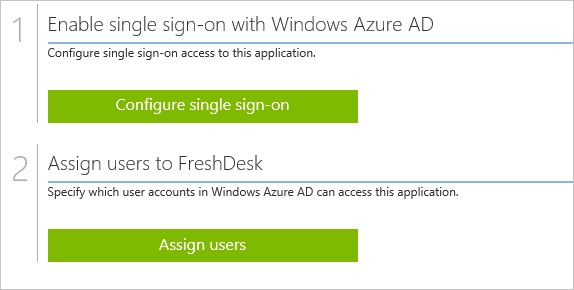
##Enabling the application integration for Freshdesk
  
The objective of this section is to outline how to enable the application integration for Freshdesk.

###To enable the application integration for Freshdesk, perform the following steps:

1.  In the Azure classic portal, on the left navigation pane, click **Active Directory**.

    

2.  From the **Directory** list, select the directory for which you want to enable directory integration.

3.  To open the applications view, in the directory view, click **Applications** in the top menu.

    

4.  Click **Add** at the bottom of the page.

    

5.  On the **What do you want to do** dialog, click **Add an application from the gallery**.

    

6.  In the **search box**, type **Freshdesk**.

    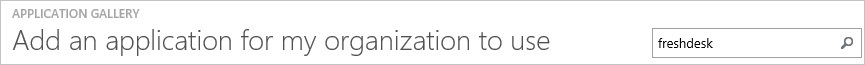

7.  In the results pane, select **Freshdesk**, and then click **Complete** to add the application.

    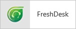
##Configuring single sign-on
  
The objective of this section is to outline how to enable users to authenticate to Freshdesk with their account in Azure AD using federation based on the SAML protocol.  
Configuring single sign-on for Freshdesk requires you to retrieve a thumbprint value from a certificate.  
If you are not familiar with this procedure, see [How to retrieve a certificate's thumbprint value](http://youtu.be/YKQF266SAxI).

###To configure single sign-on, perform the following steps:

1.  In the Azure classic portal, on the **Freshdesk** application integration page, click **Configure single sign-on** to open the **Configure Single Sign On ** dialog.

    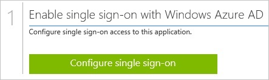

2.  On the **How would you like users to sign on to Freshdesk** page, select **Microsoft Azure AD Single Sign-On**, and then click **Next**.

    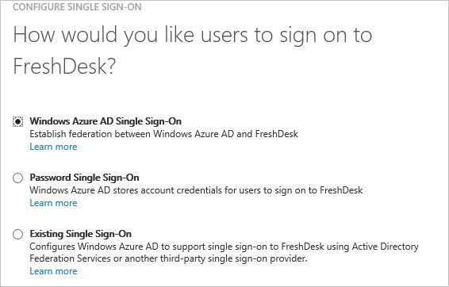

3.  On the **Configure App URL** page, in the **Freshdesk Sign In URL** textbox, type your URL using the following pattern "*https://\<tenant-name\>.Freshdesk.com*", and then click **Next**.

    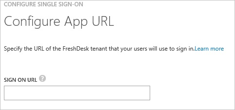

4.  On the **Configure single sign-on at Freshdesk** page, to download your certificate, click **Download certificate**, and then save the certificate file locally as **c:\\Freshdesk.cer**.

    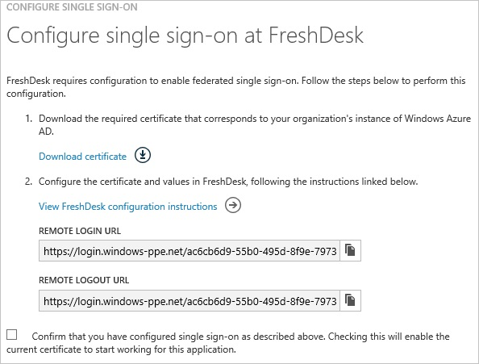

5.  In a different web browser window, log into your Freshdesk company site as an administrator.

6.  In the menu on the top, click **Admin**.

    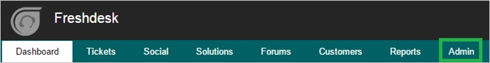

7.  In the **General Settings** tab, click **Security**.

    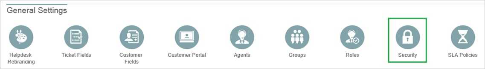

8.  In the **Security** section, perform the following steps:

    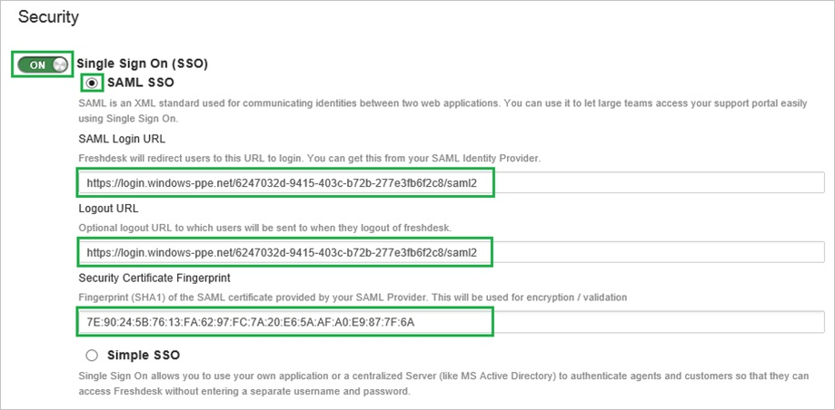

    1.  For **Single Sign On (SSO)**, select **On**.
    2.  Select **SAML SSO**.
    3.  In the Azure classic portal, on the **Configure single sign-on at Freshdesk** dialog page, copy the **Remote Login URL** value, and then paste it into the **SAML Login URL** textbox.
    4.  In the Azure classic portal, on the **Configure single sign-on at Freshdesk** dialog page, copy the **Remote Logout URL** value, and then paste it into the **Logout URL** textbox.
    5.  Copy the **Thumbprint** value from the exported certificate, and then paste it into the **Security Certificate Fingerprint** textbox.  

        >[AZURE.TIP]For more details, see [How to retrieve a certificate's thumbprint value](http://youtu.be/YKQF266SAxI)

    6.  Click **Save**.

9.  On the Azure classic portal, select the single sign-on configuration confirmation, and then click **Complete** to close the **Configure Single Sign On** dialog.

    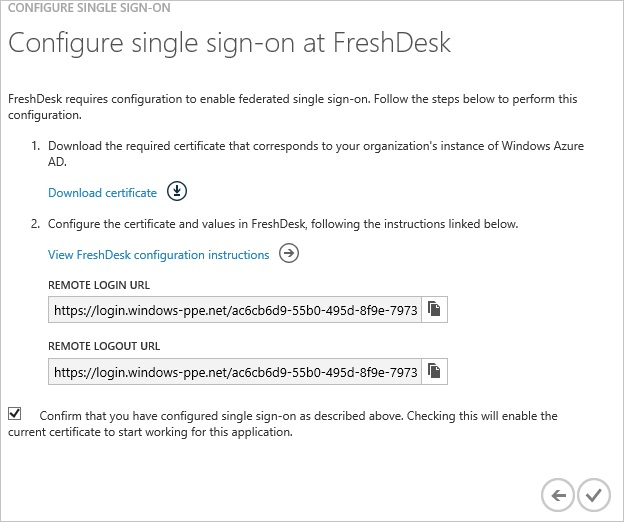
##Configuring user provisioning
  
In order to enable Azure AD users to log into Freshdesk, they must be provisioned into Freshdesk.  
In the case of Freshdesk, provisioning is a manual task.

###To provision a user accounts, perform the following steps:

1.  Log in to your **Freshdesk** tenant.

2.  In the menu on the top, click **Admin**.

    

3.  In the **General Settings** tab, click **Agents**.

    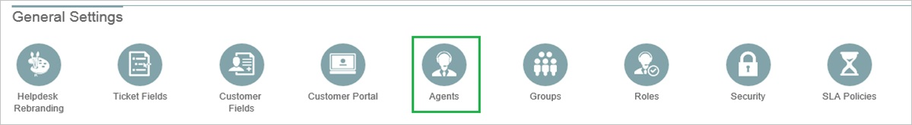

4.  Click **New Agent**.

    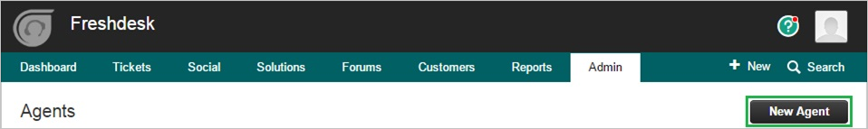

5.  On the Agent Information dialog, perform the following steps:

    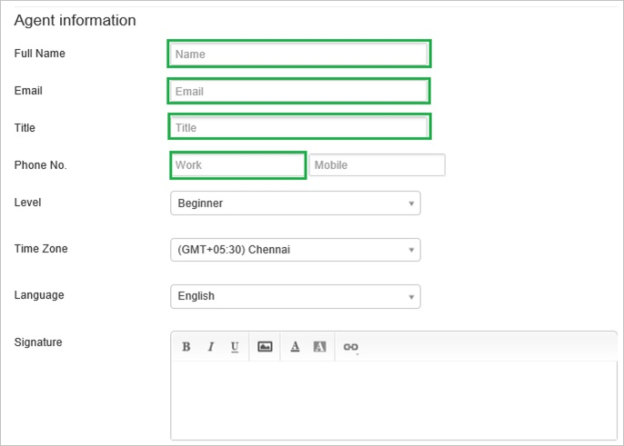

    1.  In the **Full Name** textbox, type the name of the Azure AD account you want to provision.
    2.  In the **Email** textbox, type the Azure AD email address of the Azure AD account you want to provision.
    3.  In the **Title** textbox, type the title of the Azure AD account you want to provision.
    4.  Select **Agents role**, and then click **Assign**.
    5.  Click **Save**.
    
        >[AZURE.NOTE] The Azure AD account holder will get an email that includes a link to confirm the account before it is activated.

>[AZURE.NOTE] You can use any other Freshdesk user account creation tools or APIs provided by Freshdesk to provision AAD user accounts.

##Assigning users
  
To test your configuration, you need to grant the Azure AD users you want to allow using your application access to it by assigning them.

###To assign users to Freshdesk, perform the following steps:

1.  In the Azure classic portal, create a test account.

2.  On the **Freshdesk **application integration page, click **Assign users**.

    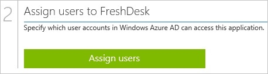

3.  Select your test user, click **Assign**, and then click **Yes** to confirm your assignment.

    
  
If you want to test your single sign-on settings, open the Access Panel. For more details about the Access Panel, see [Introduction to the Access Panel](active-directory-saas-access-panel-introduction.md).